# Renderer Architecture

Paplico の WebGPU レンダリングパイプラインのアーキテクチャドキュメント。

## キャッシュ・プール一覧

レンダラー内部で使用されるキャッシュとバッファプールの一覧。

### テクスチャキャッシュ

| 名前 | 所在 | キー | 説明 | 無効化タイミング |
|---|---|---|---|---|
| ドキュメントキャッシュ | CanvasLayer | なし (単一) | ドキュメント全体をオーバーサイズ (canvas の 2 倍) テクスチャに描画した結果。pan 時にドキュメント再描画をスキップし、blit だけで済ませるために使う | strategy が "full" / zoom・rotation 変更 / viewport がマージン外に到達 |
| 画像テクスチャキャッシュ | CanvasLayer | 画像ファイル ID | 埋め込み画像 (EmbeddedFile) をデコードして GPU テクスチャに変換した結果 | 未使用の画像が削除されたとき |
| ブラシテクスチャキャッシュ | BrushTextureManager | ブラシ種別 | ブラシスタンプのソース画像テクスチャ。ブラシ種別ごとに 1 つ | 明示的な destroy 時 |
| グラデーションテクスチャキャッシュ | GradientTextureGenerator | グラデーション定義ハッシュ | CPU で生成したグラデーション画像。同じ定義なら再利用する。LRU で最大数を制限し、2 フレーム未使用で evict | グラデーション定義 (CP 位置含む) の変更 / フレーム開始時の evict |
| テキストパスキャッシュ | CanvasLayer | テキスト要素のハッシュ | テキスト要素からグリフパスへの変換結果。フォント読み込み完了後にキャッシュされ、再変換を避ける | テキスト内容・スタイル・フォントの変更 |
| textureCache (未使用) | CanvasLayer | — | 現在どこからも参照されていないデッドコード。destroy 時にクリーンアップされるのみ | — |

### バッファプール

| 名前 | 所在 | 説明 | ライフサイクル |
|---|---|---|---|
| グラデーションバッファプール | CanvasLayer | グラデーションフィル描画用の uniform / stops / vertex バッファ。フレームごとにインデックスをリセットし、既存バッファを再利用する | フレーム開始でインデックスリセット。不足時に追加確保 (grow-only) |
| スタンプバッファプール | BrushStrokeRenderer | ブラシスタンプの instance storage バッファ。パスごとに 1 つ使用し、サイズ不足時のみ再確保 | フレーム開始でインデックスリセット。不足時に grow |
| グラデーション uniform プール | BrushStrokeRenderer | ストロークグラデーションの uniform バッファ | 同上 |
| カラーストッププール | BrushStrokeRenderer | グラデーションカラーストップの storage バッファ | 同上 |

---

## ファイル構成

| コンポーネント | ファイル |
|---|---|
| メインレンダラー | `renderer/WebGPURenderer2.ts` |
| レンダースケジューラー | `renderer/RenderScheduler.ts` |
| キャンバスレイヤー | `renderer/CanvasLayer.ts` |
| UI レイヤー | `renderer/UILayer.ts` |
| ブラシストローク | `renderer/BrushStrokeRenderer.ts` |
| スタンプ生成 | `renderer/StampGenerator.ts` |
| テクスチャ管理 | `renderer/BrushTextureManager.ts` |
| プリフィルター | `renderer/PreFilterRenderer.ts` |
| ポストフィルター | `renderer/FilterRenderer.ts` |
| ブラーフィルター | `renderer/filters/BlurFilterProcessor.ts` |
| FrostGlass フィルター | `renderer/filters/FrostGlassFilterProcessor.ts` |
| Backdrop キャプチャ | `renderer/BackdropCaptureManager.ts` |
| グラデーション生成 | `renderer/GradientTextureGenerator.ts` |

---

## RenderStrategy 決定フロー

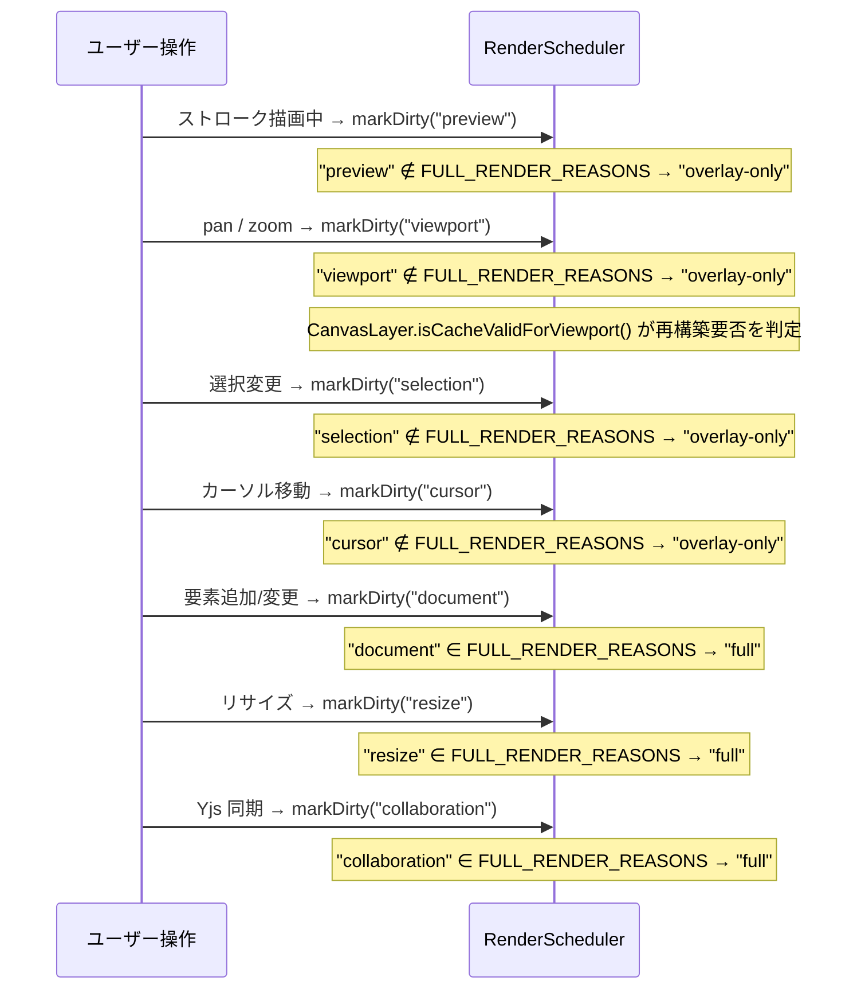

1フレーム内で複数の `markDirty()` が呼ばれた場合、`requestAnimationFrame` で合体される。1つでも FULL_RENDER_REASONS に含まれる reason があれば `"full"`、なければ `"overlay-only"` になる。

---

## フレームレンダリング全体

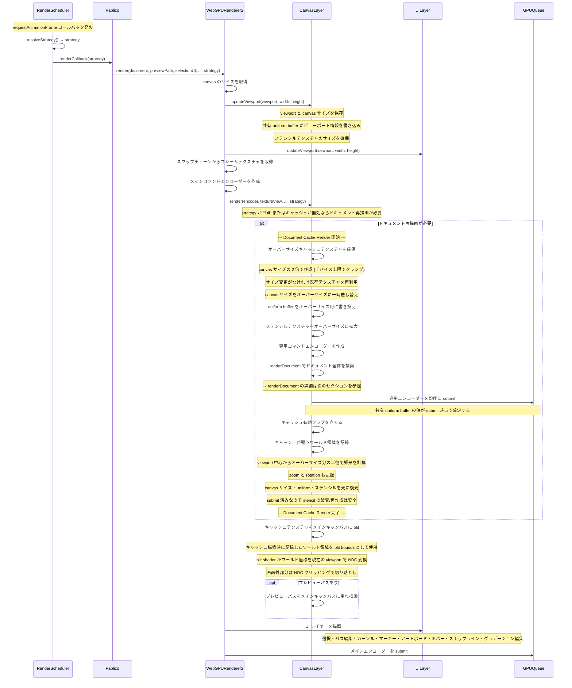

---

## ドキュメントキャッシュの有効性判定 (isCacheValidForViewport)

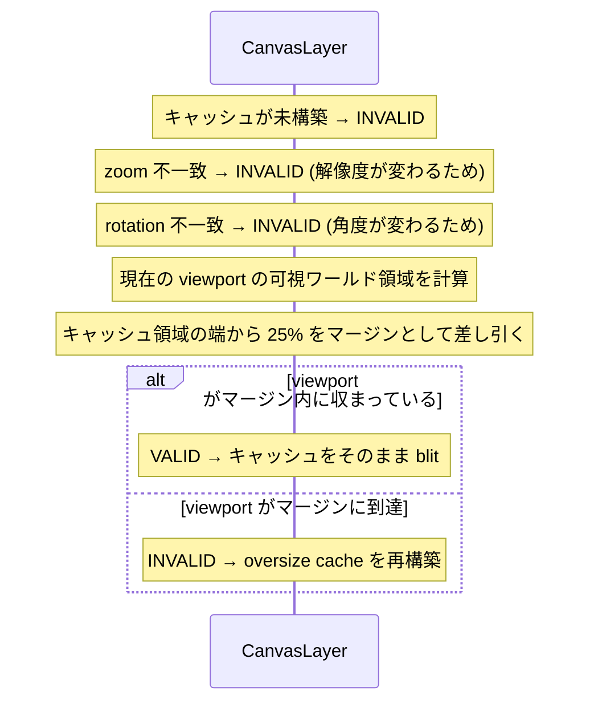

---

## renderDocument 内部フロー

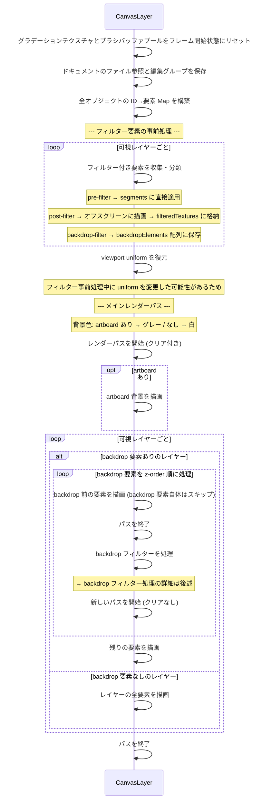

---

## 全体フロー (flowchart)

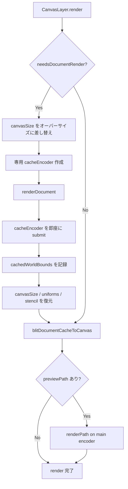

### renderDocument 内部フロー (flowchart)

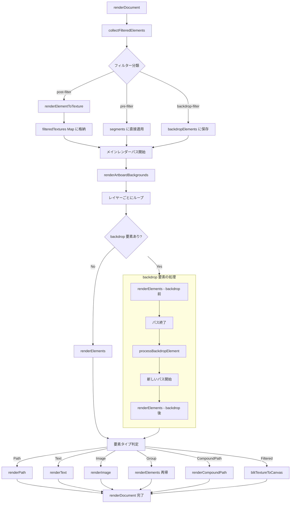

---

## パスレンダリング - renderPath

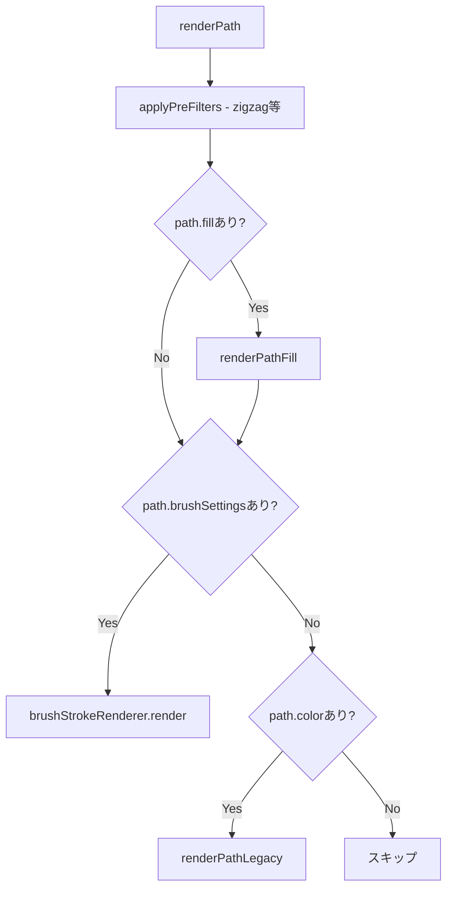

---

## フィルレンダリング - renderPathFill

CPU 側で earcut による三角形分割を行い、頂点バッファに書き込んでから GPU に描画させる。

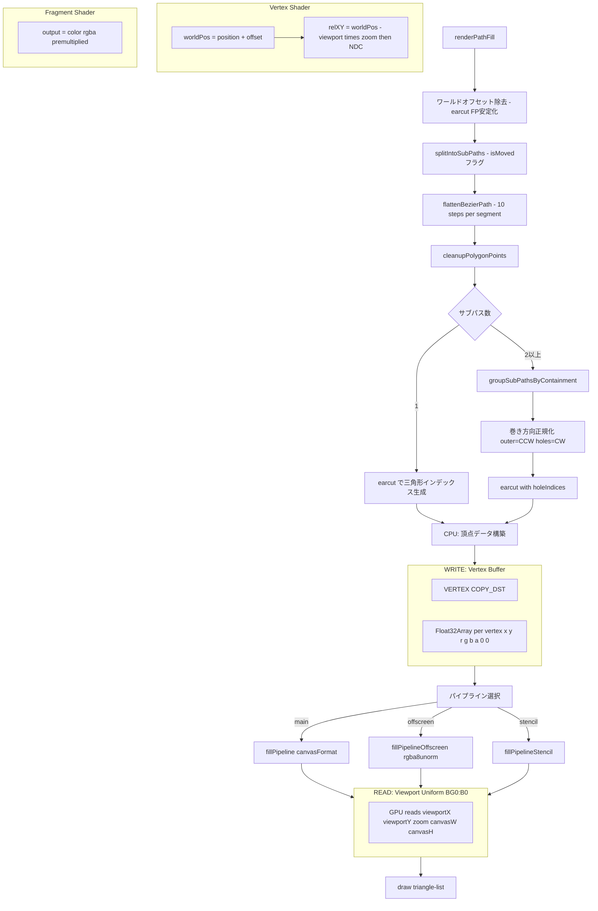

`offset` は fill の場合 `(0, 0)` なので `position` がそのまま使われる。

---

## レガシーストローク - renderPathLegacy

ベジエ曲線を CPU 側で分割し、法線方向のオフセットで太さを表現する triangle-strip。

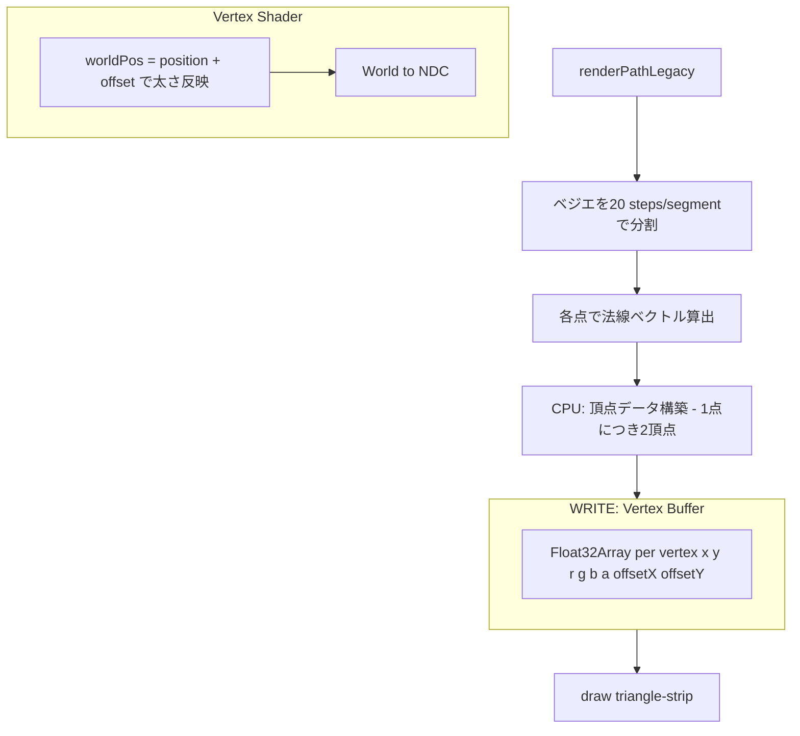

`offset` に法線方向のベクトルが入り、`position + offset` と `position - offset` の2頂点がストロークの両端を形成する。

---

## ブラシストローク - BrushStrokeRenderer

CPU 側でスタンプ位置を算出し、Storage buffer 経由で GPU にインスタンス描画させる。

バッファプールにより、フレームごとの GPU バッファ再作成を回避する。`beginFrame()` でプールインデックスをリセットし、各 `render()` 呼び出しでプールから取得 or 拡張する。

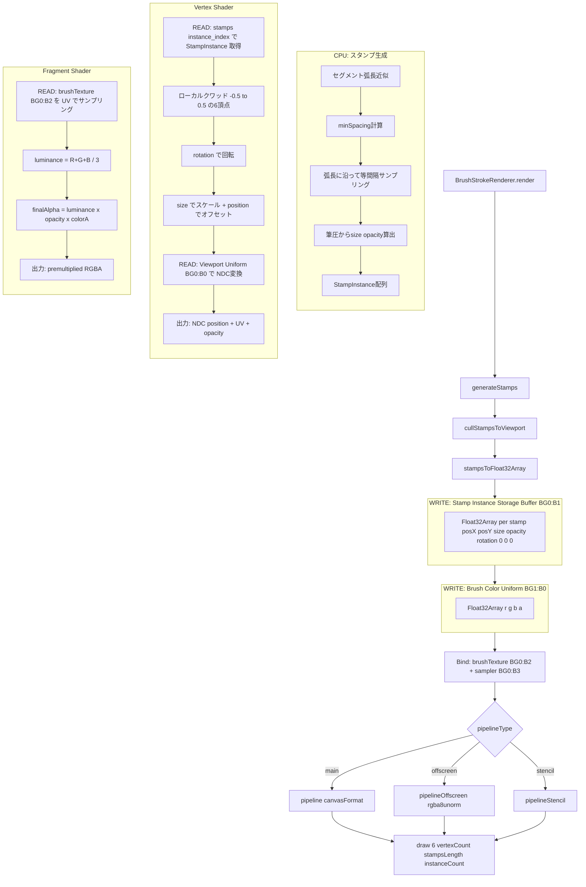

---

## テキストレンダリング - renderText

グリフをパスに変換し、renderPath に委譲する。バッファ操作は renderPath 側で行われる。

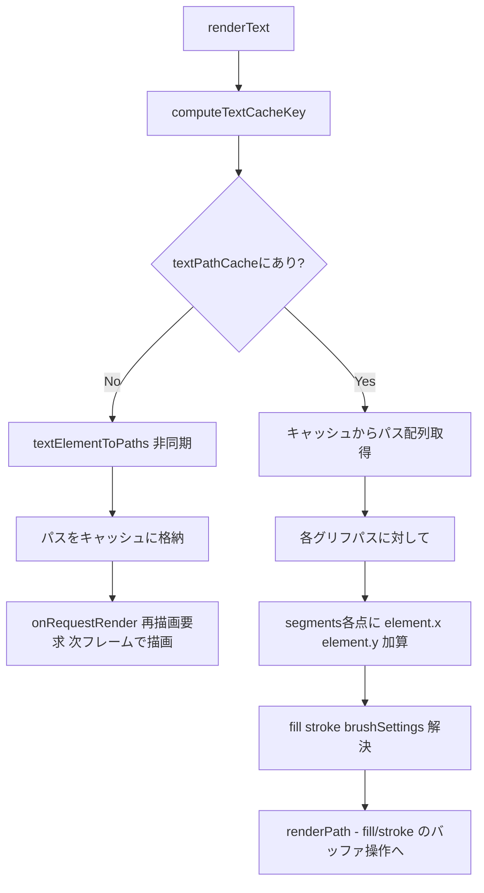

---

## テクスチャ合成 - blitTextureToCanvas

フィルター済みテクスチャやキャッシュテクスチャをキャンバスの指定領域に描画する。

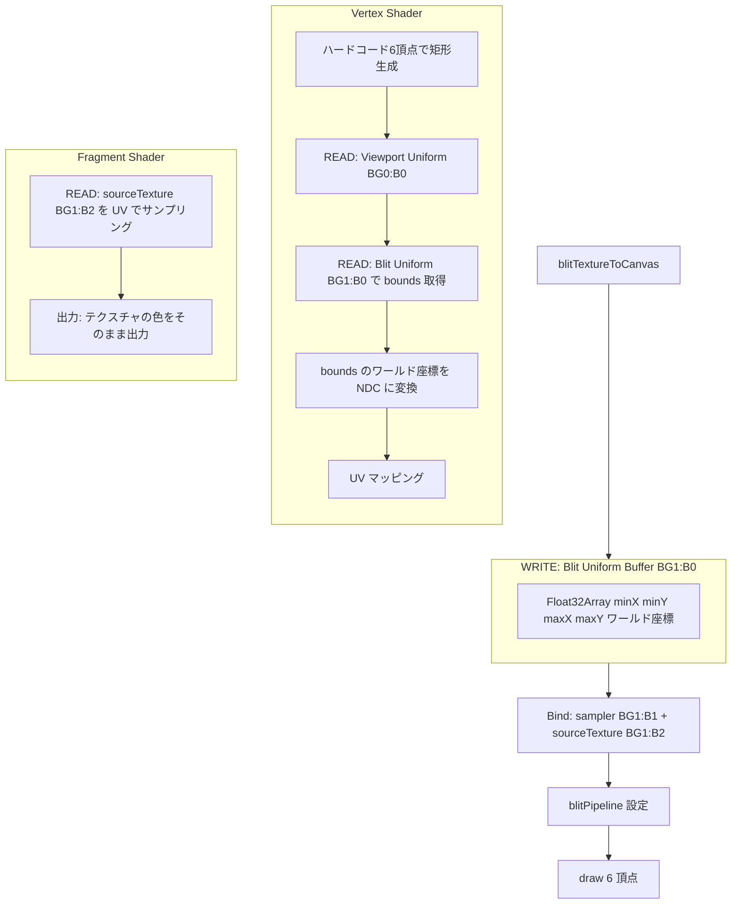

---

## Backdrop フィルター - FrostGlass

ステンシルバッファで要素形状をマスクし、キャンバス内容をキャプチャしてブラーをかける。

```mermaid
flowchart TD
    PBD[processBackdropElement]

    PBD --> StPass

    subgraph StPass [Pass 1: ステンシル書き込み]
        direction TB
        StClear[ステンシルバッファクリア value=0]
        StClear --> StPipe[stencilWritePipeline 設定]
        StPipe --> StWriteUni[WRITE: Viewport Uniform に要素 bounds]
        StWriteUni --> StRender[renderElementToStencil]
        StRender --> StResult[ステンシルバッファ: 要素形状の領域が value=1]
    end

    StPass --> Capture

    subgraph Capture [BackdropCaptureManager.captureRegion]
        direction TB
        CapBlit[現在の canvasTexture bgra8unorm の要素領域を]
        CapBlit --> CapTex[captureTexture rgba8unorm にコピー]
    end

    Capture --> FilterApply

    subgraph FilterApply [FrostGlassFilterProcessor 2パス]
        direction TB

        WriteH[WRITE: FrostGlass Uniform BG0:B0 Pass1]
        WriteH --> HData[resolution direction=1,0 radius saturation tint applyEffects=0]
        HData --> BindH[Bind: captureTexture BG0:B1 + maskTexture BG0:B3]
        BindH --> DrawH[水平ブラー描画 READ uniform+texture]
        DrawH --> TempTex[中間テクスチャ]

        TempTex --> WriteV[WRITE: FrostGlass Uniform BG0:B0 Pass2]
        WriteV --> VData[direction=0,1 applyEffects=1]
        VData --> BindV[Bind: 中間テクスチャ BG0:B1]
        BindV --> DrawV[垂直ブラー+彩度+ティント+マスク適用]
        DrawV --> FilteredTex[フィルター済みテクスチャ]
    end

    FilterApply --> BlitPass

    subgraph BlitPass [Pass 2: ステンシル付きブリット]
        direction TB
        WriteBlit[WRITE: Blit Uniform BG1:B0 bounds]
        WriteBlit --> BindBlit[Bind: filteredTexture BG1:B2]
        BindBlit --> DrawBlit[blitWithStencilPipeline で描画]
        DrawBlit --> StTest[ステンシルテスト: value==1 のピクセルのみ出力]
    end

    BlitPass --> NewPass[新しいレンダーパス開始]
```

---

## ポストフィルター - Blur

要素をオフスクリーンテクスチャにレンダリングしてから、2パスの分離ガウシアンブラーを適用する。

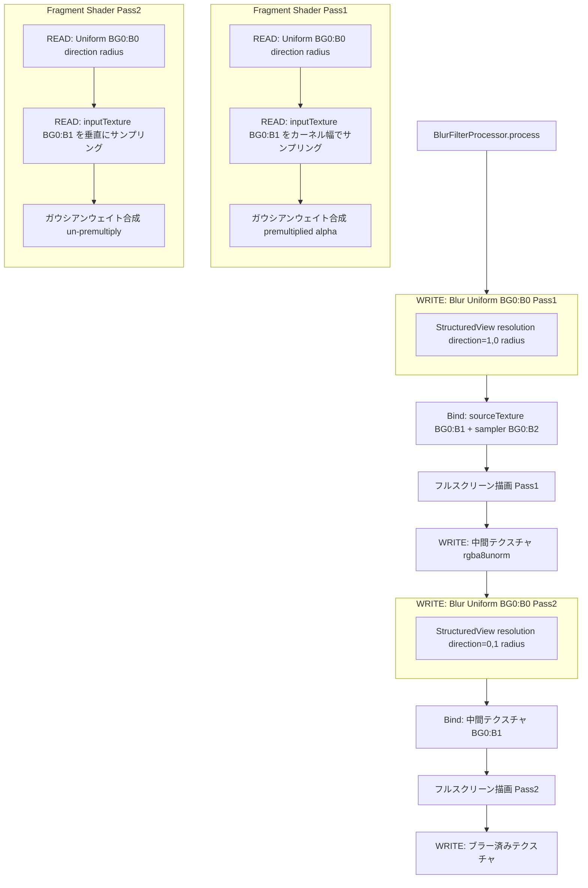

---

## エクスポートフロー - renderForExport

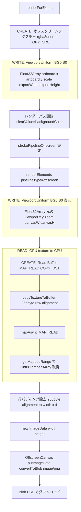

---

## パイプライン一覧

| パイプライン | フォーマット | トポロジー | 用途 |
|---|---|---|---|
| `strokePipeline` | canvasFormat (bgra8unorm) | triangle-strip | レガシーストローク・アートボード背景 |
| `strokePipelineOffscreen` | rgba8unorm | triangle-strip | オフスクリーン描画 |
| `fillPipeline` | canvasFormat | triangle-list | earcut フィル |
| `fillPipelineOffscreen` | rgba8unorm | triangle-list | オフスクリーンフィル |
| `fillPipelineStencil` | canvasFormat + depth-stencil | triangle-list | ステンシル書き込み用フィル |
| `blitPipeline` | canvasFormat | triangle-list (6頂点) | テクスチャ合成 |
| `blitWithStencilPipeline` | canvasFormat + depth-stencil | triangle-list (6頂点) | ステンシル付きテクスチャ合成 |
| `stencilWritePipeline` | canvasFormat + depth-stencil | triangle-strip | ステンシルマスク書き込み |
| Brush `pipeline` | canvasFormat | triangle-list | ブラシスタンプ (メイン) |
| Brush `pipelineOffscreen` | rgba8unorm | triangle-list | ブラシスタンプ (オフスクリーン) |
| Brush `pipelineStencil` | canvasFormat + depth-stencil | triangle-list | ブラシスタンプ (ステンシル) |

---

## GPUバッファ一覧

| バッファ | サイズ | Usage | Bind Group | Binding | CPU型 | 書き込みデータ |
|---|---|---|---|---|---|---|
| Viewport Uniform | 20 B | UNIFORM | 0 | 0 | Float32Array x5 | viewportX viewportY zoom canvasW canvasH |
| Path Vertex | 可変 | VERTEX | - | - | Float32Array x8n | x y r g b a offsetX offsetY per vertex |
| Stamp Instance | 可変 | STORAGE | 0 | 1 | Float32Array x8n | posX posY size opacity rotation 0 0 0 per stamp |
| Brush Color | 16 B | UNIFORM | 1 | 0 | Float32Array x4 | r g b a |
| Blit Uniform | 16 B | UNIFORM | 1 | 0 | Float32Array x4 | minX minY maxX maxY world coords |
| Blur Uniform | 32 B | UNIFORM | 0 | 0 | StructuredView | resolution direction radius + padding |
| FrostGlass Uniform | 64 B | UNIFORM | 0 | 0 | StructuredView | resolution direction radius saturation tintRGB tintOpacity applyEffects useMask + padding |
| Export Read | 可変 | MAP_READ COPY_DST | - | - | Uint8ClampedArray | RGBA pixels 256byte row aligned |

---

## GPUテクスチャ一覧

| テクスチャ | サイズ | Format | Usage | 用途 |
|---|---|---|---|---|
| Document Cache | canvasSize × 2.0 | canvasFormat | RENDER_ATTACHMENT + TEXTURE_BINDING + COPY_SRC | オーバーサイズドキュメントキャッシュ |
| Stencil | canvasSize (描画時はキャッシュサイズ) | depth24plus-stencil8 | RENDER_ATTACHMENT | backdrop フィルターのステンシルマスク |
| Filtered Element | 要素 bounds | rgba8unorm | RENDER_ATTACHMENT + TEXTURE_BINDING | post-filter 済み要素 |
| Backdrop Capture | 要素 bounds | rgba8unorm | COPY_DST + TEXTURE_BINDING | backdrop キャプチャ領域 |
| Brush Texture | ブラシごと | rgba8unorm | TEXTURE_BINDING + COPY_DST | ブラシスタンプテクスチャ |
| Image Texture | 画像ごと | rgba8unorm | TEXTURE_BINDING + COPY_DST | 画像オブジェクト |

---

## GPU Struct 定義

```
stroke.wgsl - Viewport Uniform (BG0:B0):
  struct Uniforms { viewportX: f32, viewportY: f32, zoom: f32, canvasWidth: f32, canvasHeight: f32 }

stroke.wgsl - Vertex Input:
  struct VertexInput { position: vec2f, color: vec4f, offset: vec2f }
  position + offset = world座標  ->  Uniforms で NDC 変換

brushStamp.wgsl - Stamp Instance (BG0:B1 storage read):
  struct StampInstance { positionX: f32, positionY: f32, size: f32, opacity: f32, rotation: f32, pad x3 }
  instance_index で配列アクセス  ->  ローカルクワッド回転スケール  ->  Uniforms で NDC 変換

brushStamp.wgsl - Brush Color (BG1:B0):
  struct BrushUniforms { colorR: f32, colorG: f32, colorB: f32, colorA: f32 }
  FS: finalAlpha = texLuminance * stampOpacity * colorA  ->  premultiplied RGBA 出力

blit.wgsl - Blit Bounds (BG1:B0):
  struct BlitUniforms { boundsMinX: f32, boundsMinY: f32, boundsMaxX: f32, boundsMaxY: f32 }
  VS: bounds world coords  ->  Viewport Uniform で NDC 変換  ->  UV マッピング

blur.wgsl - Blur Uniform (BG0:B0):
  struct Uniforms { resolution: vec2f, direction: vec2f, radius: f32 }
  FS: direction方向にカーネル幅サンプリング  ->  ガウシアンウェイト合成

frostGlass.wgsl - FrostGlass Uniform (BG0:B0):
  struct Uniforms { resolution: vec2f, direction: vec2f, radius: f32, saturation: f32,
                    tintR: f32, tintG: f32, tintB: f32, tintOpacity: f32, applyEffects: f32, useMask: f32 }
  FS Pass1: ブラーのみ (applyEffects=0)
  FS Pass2: ブラー + 彩度 + ティント + マスク (applyEffects=1)
```
