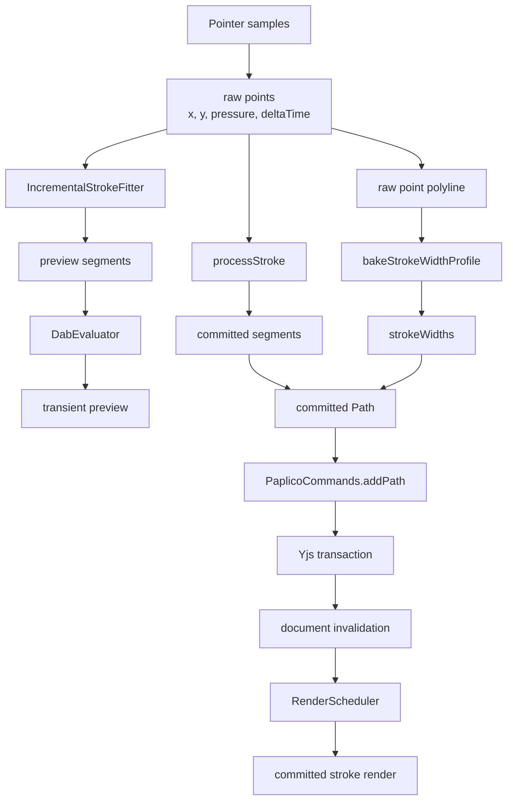
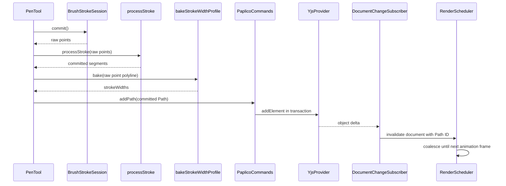

# ブラシ動特性と確定処理

> [!NOTE]
> **前提ページ:** [ストローク入力と曲線フィッティング](/devdocs/brush-system/input-and-fitting)

ブラシの太さや濃さは、ペンが通った座標だけでは決まらない。各入力点の時刻から速度を求め、ブラシ設定のcurveを評価して、各Dabのサイズ、flow、spacingを変化させる。

入力中のストロークは毎frame変化する。確定後のストロークはYjsドキュメントに残り、同じ幅を後から再現できる必要がある。この違いを吸収するのが、raw pointの `deltaTime`、2本の速度EMA、property curve、`bakeStrokeWidthProfile` である。

raw pointはデバイスから受け取った入力点である。座標、筆圧、傾き、ストローク開始からの経過時間を持つ。segmentはraw pointsをfitしたcubic Bézier曲線である。Dabはsegmentに沿って置くブラシ先端の描画単位である。

## 入力から再描画まで



プレビューと確定Pathは別のsegment列を使う。共通の入力は `BrushStrokeSession` が保持するraw pointsである。

## 時刻をraw pointへ残す

`PenTool.onPointerDown` は `performance.now()` をストローク開始時刻として保持する。最初のraw pointの `deltaTime` は0ミリ秒である。

`getCoalescedEvents()` から受け取ったsampleは次の式を使う。結果が負になる場合は0へclampする。

```text
deltaTime = max(sample.timeStamp - strokeStartTime, 0)
```

coalesced eventがない `pointermove` は次の式を使う。

```text
deltaTime = performance.now() - strokeStartTime
```

`deltaTime` の単位はミリ秒である。時計originを変換する別の正規化関数はない。`PointerEvent.timeStamp` と `performance.now()` が持つ時計をそのまま使う。

timed Dab対応ブラシは、ペンが動かない間も25ミリ秒周期で最後のraw pointを複製する。座標と入力属性は変えない。`deltaTime` だけを現在の経過時間へ進める。

参照先:

- `pkgs/web/src/core/ui/PaplicoUI.ts`
- `pkgs/web/src/core/tools/PenTool.ts`
- `pkgs/web/src/core/renderer/canvas/pipeline/stroke/BrushStrokeSession.ts`

## DabEvaluatorが速度を求める

raw pointを追加する段階では速度を計算しない。ダブエンジンの `DabEvaluator.evaluateDabs` がsegment上を歩き、前sampleからの距離と時間差を求める。

```text
stepDist = hypot(x - previousX, y - previousY)
stepTime = max(deltaTime - previousDeltaTime, 0)
stepVelocity = stepDist / stepTime
```

距離の単位はworld unitである。速度の単位はworld unit per millisecondである。`stepTime` が0.001ミリ秒より大きい場合だけ、速度EMAを更新する。

入力間隔の揺れをそのままブラシへ伝えると、同じ手の動きでもDabが安定しない。`DabEvaluator` は短期変化を追うfast EMAと、長期傾向を残すslow EMAを並行して更新する。

```text
alpha = 1 - exp(-stepTime / tau)
velocity += (stepVelocity - velocity) * alpha
```

| 系列 | 内部状態 | 既定時定数 | 正規化出力 |
|---|---|---:|---|
| fast | `velFast` | 25 ms | `speedFine` |
| slow | `velSlow` | 110 ms | `speedGross` |

ストローク先頭では、最初のsegmentの長さを所要時間で割った速度でfast EMAをseedする。ストローク途中のfragmentから評価を再開する場合は、slow EMAも同じ値でseedする。通常のストローク開始ではslow EMAを0から始める。

### speedRef

2本のEMAは `speedRef` で割って0から1のcurve入力へ変換する。

```text
speedFine = min(velFast / speedRef, 1)
speedGross = min(velSlow / speedRef, 1)
```

`inputDynamics.speedRef` が設定されていればその正数値を使う。未設定なら、ブラシのbase sizeから自動値を求める。

```text
speedRef = clamp(sizeBase * 0.06, 0.5, 2.0)
```

速度が `speedRef` 以上になると `speedFine` と `speedGross` は1へ飽和する。`inputDynamics.speedFineTau` と `inputDynamics.speedGrossTau` はそれぞれの時定数を上書きする。正数だけが有効な設定として残る。

### accelと静止時の減衰

`accel` はfastとslowの差に方向転換量を加えた値である。

```text
turnAmount = clamp((1 - dot(previousDirection, direction)) * 0.5, 0, 1)
accel = min(abs(velFast - velSlow) / speedRef * 0.8 + turnAmount, 1)
```

segment長が0.001 world unit未満な場合は静止segmentとして扱う。fastとslowの目標速度を0にし、segmentの経過時間に応じてEMAを減衰させる。

参照先:

- `pkgs/web/src/core/renderer/canvas/pipeline/brush/DabEvaluator.ts`
- `pkgs/web/src/core/schema.ts`
- `pkgs/web/src/core/brush/migrate.ts`

## 速度をproperty curveへ渡す

`speedFine`、`speedGross`、`accel` は0から1のbrush inputである。`DabEvaluator` は各Dabをemitする直前に、現在の速度入力でsize、flow、spacingなどのpropertyを評価する。

`bakeBrushProperties` はストロークごとにcurveをlookup tableへ変換する。`evalBrushProperty` は同じpropertyに接続されたcurve出力を合計する。size、flow、spacingはscale domainである。

```text
factor = clamp(1 + curveOutputSum, 0, 8)
value = clamp(base * factor, propertyMin, propertyMax)
```

各Dabの `speedFine` と `accel` は `motionSpeed` と `motionAccel` としてinstance bufferにも入る。wet brush shaderはこれらの値をmoisture fieldへ渡す。

速度入力を計算するのはdab engineである。ribbon engineのcurve評価はpressure、`strokeT`、fadeを設定する。`speedFine` と `speedGross` はneutral値の0に残る。geometric engineは専用のpressure幅式を使う。

参照先:

- `pkgs/web/src/core/brush/inputs.ts`
- `pkgs/web/src/core/brush/evaluateProperties.ts`
- `pkgs/web/src/core/brush/properties.ts`
- `pkgs/web/src/core/renderer/canvas/pipeline/brush/DabEvaluator.ts`
- `pkgs/web/src/core/renderer/canvas/pipeline/brush/RibbonGenerator.ts`

## sizeBySpeedとpoolingの互換変換

dab engineに `sizeBySpeed` と `pooling` の専用分岐はない。brush v2以前のドキュメントを開くとき、migrationがこれらの値を `speedFine` 入力のproperty curveへ変換する。

### sizeBySpeed

`sizeBySpeed` を `k` とする。変換後のsize curveは次の2点である。

```text
[[0, 0], [1, -k]]
```

正規化速度 `s` に対するcurve寄与は `-k * s` になる。他のsize curveがなければ、実効値は次のようになる。

```text
size = baseSize * clamp(1 - k * s, 0, 8)
```

速度0でbase sizeを使う。速度が `speedRef` 以上になると `baseSize * (1 - k)` まで小さくなる。

### pooling

`pooling` を `p` とする。`poolingSizeRatio` を `r` とする。変換後は3本のcurveに分かれる。

| property | curve | 正規化速度 `s` に対する寄与 |
|---|---|---|
| spacing | `[[0, -0.6p], [1, 0]]` | `-0.6p(1-s)` |
| size | `[[0, 0.3pr], [1, 0]]` | `0.3pr(1-s)` |
| flow | `[[0, 0.5p(1-r)], [1, 0]]` | `0.5p(1-r)(1-s)` |

低速域ではDab間隔が狭くなる。サイズとflowは増える。速度が `speedRef` へ達するとpooling寄与は0になる。最終値は各propertyのregistry範囲へclampする。flowの上限は1である。

参照先:

- `pkgs/web/src/core/io/migrations/brushV2/v1.ts`
- `pkgs/web/src/core/io/migrations/brushV2/convert.ts`

## ライブプレビューの速度

`IncrementalStrokeFitter` はraw pointsからプレビュー用segmentを作る。smooth方式は座標と同じGaussian kernelで `deltaTime` も平滑化する。先頭と末尾の時刻はraw値を保つ。

曲線fitが複数の入力点を1本のsegmentへまとめると、端点時刻の線形補間だけでは途中の速度変化が消える。ライブtailは、線形時刻から8ミリ秒を超えて外れる入力点にtime knotを追加する。最大16個である。de Casteljau subdivisionはgeometryを変えない。segment端の時刻密度だけを増やす。

ダブエンジンのプレビューは、このsegment列を `evaluateDabs` へ渡す。buildupプレビューは `LiveDabAccumulator` で確定済みprefixの評価結果を再利用できる。washプレビューは毎frame評価し、frame poolのGPU bufferへ送る。

参照先:

- `pkgs/web/src/core/utils/geometry/strokeFitting.ts`
- `pkgs/web/src/core/renderer/canvas/pipeline/brush/LiveDabAccumulator.ts`
- `pkgs/web/src/core/renderer/canvas/pipeline/stroke/StrokeBatchContext.ts`

## 確定幅をPathへ焼き込む

pointerup後、`PenTool` はraw pointsを `processStroke` へ渡して確定用segmentを作る。プレビューsegmentは再利用しない。

確定segmentはfitした曲線の端点に入力時刻を持つ。そのsegmentだけを幅評価へ使うと、1本のsegment内の速度変化は線形化する。`bakeStrokeWidthProfile` はraw pointsを直線segment列へ変換し、入力時のpressureと `deltaTime` を保ったまま幅を評価する。

dab routeは実際の `evaluateDabs` を実行する。各Dabの `sizeX / 2` をpath上のhalf widthとして補間する。taperはベイク対象に含めない。

path上の0から1を256分割する。端点を含む257点で次の幅比を評価する。

```text
widthRatio = halfWidth / (size.base / 2)
```

全比率が先頭値から0.001以内なら幅は一定である。この場合はprofileを保存しない。変化がある場合は、線形補間誤差が0.01以内になるまでprofileを簡略化する。出力は左右が同値の `StrokeWidthPoint[]` である。

確定Pathは `strokeWidths` にprofileを持つ。profileを作った場合は `strokeWidthsBaked` がtrueになる。確定PathのDabを再生成するときはsize curveをneutralizeし、保存した幅比で `sizeX` と `sizeY` をscaleする。size curveによる幅変化は二重適用しない。

size以外のspeed curveはprofileへ焼き込まない。確定用segmentの時刻を使って描画時に再評価する。

参照先:

- `pkgs/web/src/core/tools/PenTool.ts`
- `pkgs/web/src/core/renderer/canvas/pipeline/brush/strokeHalfWidth.ts`
- `pkgs/web/src/core/renderer/canvas/pipeline/brush/DabEvaluator.ts`

## Yjsへ保存する

確定Pathには中心線の `segments`、描画設定の `filters`、ベイクした `strokeWidths`、`strokeWidthsBaked` が入る。`PenTool` はこのPathを `context.strokeComplete` へ渡す。

Paplicoの `strokeComplete` は一時overrideを消し、`commands.addPath` を呼ぶ。`PaplicoCommands.addPath` はreadonly状態、現在のlayer、lock状態を確認する。書き込み可能な場合はYjsトランザクション内で `YjsProvider.addElement` を呼ぶ。

`YjsProvider.addElement` はPath本体を `yObjects` へ保存する。対象layerの `elementIds` にPath IDを追加する。Pathとlayer参照は同じYjs transactionで更新する。

`strokeComplete` が戻った後、`PenTool` は描画状態をidleへ戻す。`previewUpdate(null)` はtransient previewを削除する。



参照先:

- `pkgs/web/src/core/Paplico.ts`
- `pkgs/web/src/core/PaplicoCommands.ts`
- `pkgs/web/src/core/collaboration/YjsProvider.ts`

## 確定後の再描画

Yjsのobject deltaを受けた `DocumentChangeSubscriber.syncObjectsDelta` は空間インデックスを更新する。追加したPath IDを `ChangedElements.upserted` に入れ、document invalidationへ渡す。

`RenderScheduler.markDirty` は同じframe内のdirty reasonとelement IDをまとめる。document変更はfull render strategyである。次の `requestAnimationFrame` でrender callbackを呼ぶ。

確定したdab strokeは `evaluateDabs` の結果をStampCacheへ保存する。後続のpanとzoomはGPU bufferを再uploadすることがある。Dabのproperty評価は繰り返さない。

描画モードとGPU処理の詳細は[ブラシレンダリング](/devdocs/renderer/brush)を参照。

参照先:

- `pkgs/web/src/core/renderer/DocumentChangeSubscriber.ts`
- `pkgs/web/src/core/renderer/RenderScheduler.ts`
- `pkgs/web/src/core/renderer/canvas/pipeline/stroke/StrokeBatchContext.ts`

> [!TIP]
> **戻る:** [ブラシシステム](/devdocs/brush-system)
