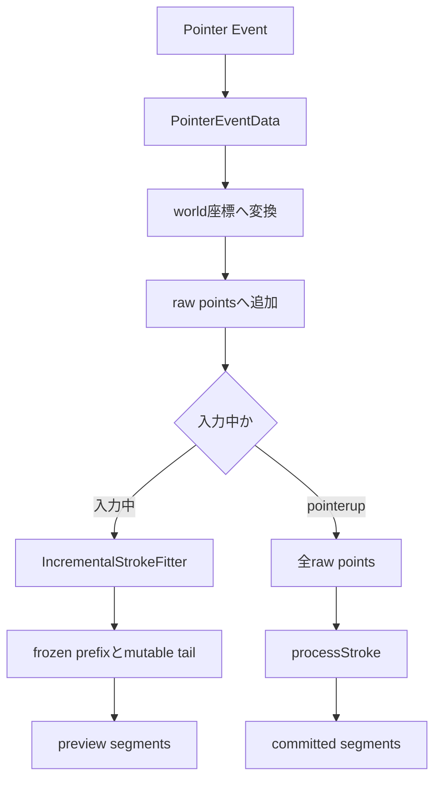
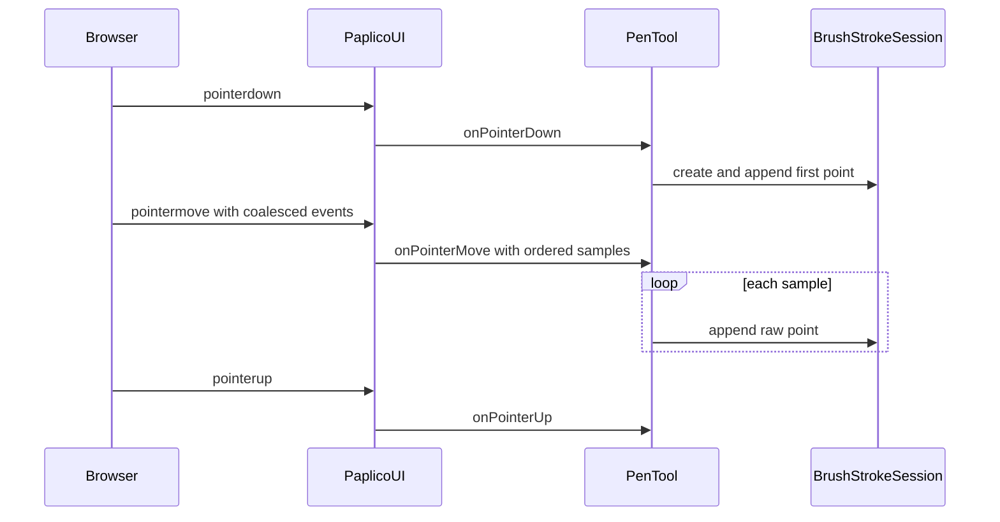
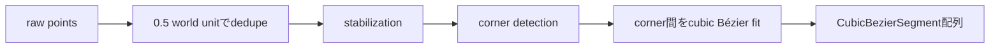
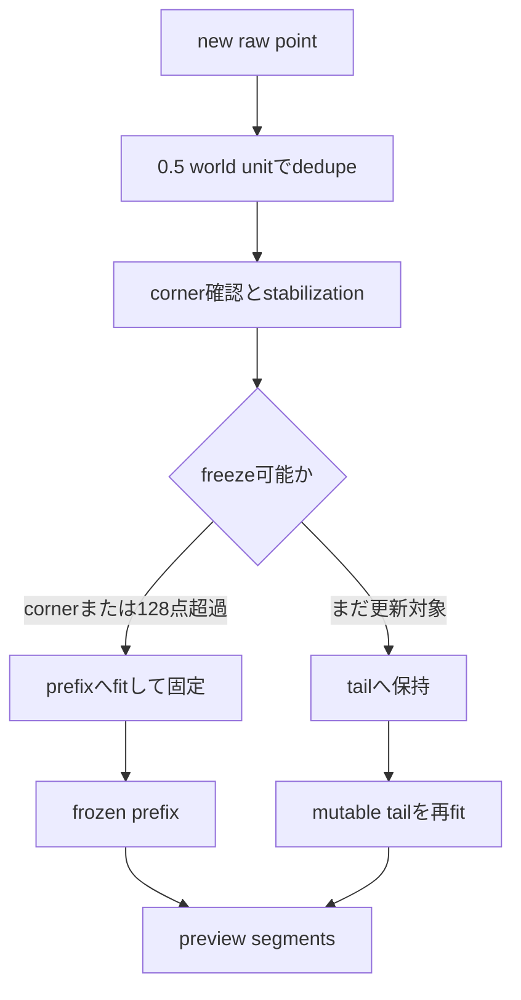
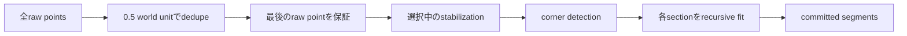

# ストローク入力と曲線フィッティング

> [!NOTE]
> **親ページ:** [ブラシシステム](/devdocs/brush-system)

このページは、ブラウザのPointer Eventが `CubicBezierSegment[]` へ変換されるまでの処理を説明する。対象はブラシツールの中心線である。Dabの生成、幅の焼き込み、Yjsへの保存は扱わない。

ブラシツールは入力中とpointerup後で異なるフィッティング経路を使う。入力中は末尾だけを更新しやすい増分処理を使う。pointerup後は保存していた全raw pointsを処理し直す。両方の経路をつなぐデータはpreview segmentsではなくraw pointsである。



## Pointer入力をツールへ渡す

`CanvasPane` はDOM canvasを `Paplico.addCanvasTarget` へ渡す。`PaplicoUI.attach` はcanvasへ `pointerdown`、`pointermove`、`pointerup`、`pointercancel` を登録する。

`PaplicoUI.createPointerEventData` はブラウザの `PointerEvent` を `PointerEventData` へ変換する。変換後のデータには、canvas左上を基準にした画面座標、pressure、tilt、twist、接触領域、修飾キーが入る。

ブラウザが `getCoalescedEvents()` を提供する場合は、1回の `pointermove` に複数の入力サンプルが含まれる。`PaplicoUI` はサンプルを古い順に保持する。`PenTool.onPointerMove` は全サンプルを順番に処理する。



参照先:

- `pkgs/web/src/organisms/CanvasPane.tsx`
- `pkgs/web/src/core/ui/PaplicoUI.ts`
- `pkgs/web/src/core/tools/Tool.ts`

## raw pointsを作る

`PenTool.onPointerDown` は画面座標を `screenToWorld` でワールド座標へ変換する。viewportの移動、回転、拡大率はこの段階で反映される。

透視スナップが有効な場合はワールド座標のXとYを射影する。pressure、tilt、twistは入力値を維持する。

`PenTool` は `BrushStrokeSession` を作る。最初のraw pointは `deltaTime: 0` で追加する。ストロークの開始時刻は `performance.now()` で保持する。

各raw pointはワールド座標、pressure、tiltX、tiltY、twist、ストローク開始からの `deltaTime` を持つ。coalesced sampleの時刻には `sample.timeStamp - startTime` を使う。coalesced sampleがない場合は `performance.now() - startTime` を使う。

`BrushStrokeSession.append` はraw pointをストローク全体の配列へ保存する。同じ点を `IncrementalStrokeFitter.push` にも渡す。増分フィッター内のdedupeは作業用点列だけを削減する。sessionが持つraw pointsは削除しない。

一部のDabブラシは、ペンが動いていない間も時間経過でDabを生成する。timed dabが有効な場合は25ミリ秒周期で最後の座標を追加する。座標と入力属性は維持する。`deltaTime` だけを進める。

参照先:

- `pkgs/web/src/core/tools/PenTool.ts`
- `pkgs/web/src/core/brush/BrushStrokeSession.ts`

## fit用点列をdedupeする

ブラシ入力にはRamer-Douglas-Peucker法のような独立したpolyline simplify段階がない。近接点のdedupeと、複数点を1本のcubic Bézierへまとめるfitが点列削減を担う。



dedupeは直前に採用した点との距離で判定する。距離が0.5 world unit未満なら、その点を独立したfit対象にしない。二乗距離では0.25未満が除外条件になる。

ライブプレビューは除外した最新点を `floatingLast` として保持する。`floatingLast` はtailの終点へ戻す。これにより、細かな点を増やさずに現在のペン位置を表示へ反映する。

`processStroke` も0.5 world unitを閾値に使う。先頭点は常に残す。最後のraw pointも必ず残す。最後の点を残すことで、確定した中心線がpen-up位置へ到達する。

## 点列を安定化する

`smoothingMethod` には `smooth`、`pulled-string`、`inertia` の3方式がある。`stabilization` は0から1の範囲を取る。初期値は0.5である。

| 方式 | 処理 | 出力の特徴 |
|---|---|---|
| `smooth` | Gaussian kernelで点列を平均する | 手ぶれを抑える。stroke端とcornerは固定する |
| `pulled-string` | 固定長の糸でcursorがanchorを引く | 方向転換を比較的鋭く保つ |
| `inertia` | critical dampingのspringで位置を追従させる | 速度の慣性を残す |

### smooth

Gaussianの標準偏差は `stabilization * 4` である。kernel radiusは `ceil(3 * sigma)` である。`stabilization` が1の場合は前後12点までが平均へ参加する。

weightはindex距離 `d` から求める。

```text
weight = exp(-d² / (2 * sigma²))
```

X、Y、pressure、tilt、`deltaTime` を同じkernelで平均する。twistは角度の不連続を避けるため、sinとcosを平均する。strokeの先頭と末尾はraw値を維持する。

cornerをまたいで平均すると意図した角まで丸くなる。このため、平滑化前のraw pointsでcornerを先に検出する。各corner間を独立して平滑化する。cornerは各sectionの端点になる。Gaussian kernelはsection境界を越えない。

### pulled-string

糸の長さは `stabilization * 20` world unitsである。cursorとanchorの距離が糸の長さを超えた場合だけ、超過分だけanchorをcursor方向へ進める。

出力点は入力点より少なくなる場合がある。採用した点のpressure、tilt、twist、`deltaTime` は対応する入力点から引き継ぐ。最後のraw endpointが出力に含まれない場合は追加する。

### inertia

springのstiffnessは `4 * (1 - stabilization * 0.8)` である。dampingは `2 * sqrt(stiffness)` である。UI範囲ではstiffnessが4.0から0.8まで変化する。

入力点間の `deltaTime` は秒へ変換する。1stepの時間は最大0.1秒へclampする。時間差が0以下の場合は現在位置と入力位置を0.5で補間する。

spring forceからvelocityとpositionを順に更新する。pressure、tilt、twist、`deltaTime` は入力点から引き継ぐ。最後の出力点はraw endpointへ置き換える。

参照先:

- `pkgs/web/src/core/utils/geometry/strokeFitting.ts`
- `pkgs/web/src/organisms/ActionsPanel/PenToolControls.tsx`
- `pkgs/web/src/core/tools/toolSettings.ts`

## cornerを検出する

cornerはBézier fittingの区切りになる。鋭い角の前後を別々にfitするために使う。

### smoothのcorner detection

`smooth` は平滑化前のdeduped raw pointsからcornerを探す。候補点の前後へ3.0 world unitsのchord distanceを確保する。片側の探索上限は24 indicesである。chord distanceを使うため、同じ場所に留まった入力の累積移動距離はspanを満たさない。

turn angleが45度を超える点だけが候補になる。候補windowのchordからの最大apex deviationも判定する。必要な距離は `0.75 * (1 + stabilization)` world unitsである。

3 world units以内に候補が複数ある場合はclusterへまとめる。cluster内ではturn angleが最大の点だけをcornerとして残す。

### pulled-stringとinertiaのcorner detection

`pulled-string` と `inertia` は平滑化後の隣接3点を使う。前後vectorの角度が45度を超えた点をcornerにする。長さがほぼ0のvectorは判定しない。

どちらの方式も先頭indexと末尾indexをsection境界として含める。

## cubic Bézierへfitする

corner indicesの隣り合う組ごとに点列を取り出す。各点列を1本以上のcubic Bézierへ変換する。

section端のtangentは、端から2.0 world units以上離れる最初の点を使って求める。密な入力の1点だけでhandle方向が決まることを避ける。

許容誤差はzoomとstabilizationから決まる。

```text
stabilization = 0: tolerance = 0.5 / zoom
stabilization > 0: tolerance = (1 + stabilization * 3) / zoom
```

2点だけのsectionは1本のcubicになる。handle lengthには端点間距離の3分の1を使う。

3点以上のsectionはchord-length parameterizationを作る。Schneider法のleast-squaresで始点側と終点側のhandle lengthを解く。行列が退化した場合はchord lengthの3分の1へfallbackする。handle lengthが負またはほぼ0の場合も同じfallbackを使う。

生成した曲線と入力点の最大誤差がtolerance以内なら、その曲線を採用する。誤差がtoleranceの2倍未満なら、Newton-Raphson法でparameterを最大4回更新する。許容誤差へ収まらない場合は、最大誤差点でsectionを分割して左右を再帰的にfitする。

absolute control pointsは `CubicBezierSegment[]` へ変換する。`cp1` と `cp2` は各anchorからのrelative offsetとして格納する。pressure、tilt、twist、`deltaTime` は近い平滑化点からsegment端へ付与する。最後のsegmentは最後の入力点のmetadataを使う。

## 入力中のIncrementalStrokeFitter

raw pointsが増えるたびに、`IncrementalStrokeFitter` はプレビュー用segmentを更新する。過去の確定部分をfrozen prefixとして保持する。末尾の更新部分をmutable tailとして保持する。



`smooth` の末尾には、Gaussian kernelとcorner判定に必要な未来の点がまだ存在しない。増分フィッターはこの範囲を未確定tailとして残す。Gaussian radiusと24点のcorner lookaheadを過ぎた点だけをstableとして扱う。

`pulled-string` と `inertia` はcausalな処理である。追加済みの平滑化点は確定値として扱う。

stableなtailが128点を超えた場合は、末尾16点を残して前方をprefixへ移す。cornerが確定した場合も、そのcornerまでをprefixへ移す。prefixへ移したsegmentは後続入力で再fitしない。

tailのfitでは、現在の平滑化点へ隣接3点の45度corner detectionを実行する。frozen prefixとfitし直したtailを連結した結果がpreview segmentsになる。

ライブsegmentは入力時刻の変化も保持する。端点間を線形補間した時刻から8ミリ秒を超えて外れるraw pointがある場合は、de Casteljau subdivisionでsegmentを分割する。最大16個のtime knotを追加する。geometryは変更しない。segment端の時間密度だけを増やす。

`PenTool.updatePreview` はpreview segmentsから一時的な `Path` を作る。このPathはtransient elementとして描画する。Yjsには保存しない。次の入力で置き換える。ストロークを確定または中断すると削除する。

参照先:

- `pkgs/web/src/core/utils/geometry/strokeFitting.ts`
- `pkgs/web/src/core/Paplico.ts`
- `pkgs/web/src/core/renderer/RenderScheduler.ts`

## pointerup時に全体をprocessStrokeする

`PaplicoUI.handlePointerUp` はpointer captureを解放した後に `PenTool.onPointerUp` を呼ぶ。

`BrushStrokeSession.commit` は保存していた全raw pointsを返す。raw pointsが2点未満の場合はPathを作らない。

2点以上の場合は `processStroke` が全raw pointsを処理する。入力中に作ったpreview segmentsは再利用しない。



`processStroke` はストローク全体を次の順で処理する。

1. 連続する近接点を0.5 world unitでdedupeする。
2. 最後のraw pointを必ず残す。
3. 選択中のsmoothing methodで点列を安定化する。
4. corner detectionでsection境界を決める。
5. 各sectionをcubic Bézierへ再帰的にfitする。
6. absolute cubicを `CubicBezierSegment[]` へ変換する。

確定処理には、プレビューのfrozen prefix、128点の強制freeze、time knot subdivisionがない。全raw pointsを使ってストローク全体を構成する。

## プレビューと確定処理の違い

| 観点 | ライブプレビュー | pointerup後 |
|---|---|---|
| 入力 | 現在までのraw points | 全raw points |
| fit | `IncrementalStrokeFitter` | `processStroke` |
| 更新範囲 | frozen prefix以外のtail | ストローク全体 |
| 人工的なsection境界 | stable tailが128点を超えた位置 | なし |
| time knot | 最大16個を追加する | 追加しない |
| 出力 | 一時Pathのsegments | 確定Pathへ渡すsegments |

入力中の形と保存後の形をつなぐデータは `BrushStrokeSession` が保持するraw pointsである。

## ソースコード案内

| 読みたい処理 | ファイル |
|---|---|
| Pointer Eventの正規化 | `pkgs/web/src/core/ui/PaplicoUI.ts` |
| ツール入力型 | `pkgs/web/src/core/tools/Tool.ts` |
| 入力開始、継続、pointerup | `pkgs/web/src/core/tools/PenTool.ts` |
| raw pointsと増分fitの状態 | `pkgs/web/src/core/brush/BrushStrokeSession.ts` |
| dedupe、stabilization、corner、fit | `pkgs/web/src/core/utils/geometry/strokeFitting.ts` |
| stabilizationのUI設定 | `pkgs/web/src/organisms/ActionsPanel/PenToolControls.tsx` |
| stabilizationの初期値 | `pkgs/web/src/core/tools/toolSettings.ts` |

> [!TIP]
> **次に読むページ:** [ブラシ動特性と確定処理](/devdocs/brush-system/dynamics-and-commit)
