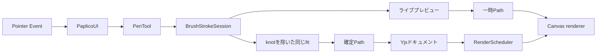

# ブラシシステム

ブラシツールの線は、Pointer Eventの座標列をそのまま保存したものではない。入力中は増分fitでプレビューを更新する。ペンを離した時点では再fitしない。増分fitからinput knotを除いたsegment列を、永続化する `Path` にする。

プレビューと確定Pathは同じfitを共有する。表示していた中心線と保存する中心線は同じ形になる。

## 処理の全体像

入力中の線は一時データである。確定した線だけがYjsドキュメントへ保存される。

## 読むページ

### [ストローク入力と曲線フィッティング](/devdocs/brush-system/input-and-fitting)

Pointer Eventからライブプレビューと確定segmentを作るまでを扱う。

- coalesced eventsと座標変換
- raw pointsと `deltaTime`
- 近接点のdedupe
- `smooth`、`pulled-string`、`inertia`
- corner detection
- cubic Bézier fitting
- 増分fitと、確定時に保存するknotなしsegment

### [ブラシ動特性と確定処理](/devdocs/brush-system/dynamics-and-commit)

segmentからDabを生成し、Pathを保存して再描画するまでを扱う。

- 瞬間速度とfast、slow EMA
- `speedFine`、`speedGross`、`accel`
- brush property curve
- `sizeBySpeed` と `pooling`
- `strokeWidths` のbake
- Yjsへの保存
- document invalidationと再描画

## 用語

| 用語 | 意味 |
|---|---|
| raw point | デバイスから受け取った生の入力点。座標、筆圧、傾き、時刻を持つ |
| segment | raw pointsから生成したcubic Bézier曲線の一区間 |
| live preview | 入力中だけ表示する一時的なストローク |
| transient element | ドキュメントへ保存せず、rendererへ一時的に渡す要素 |
| committed Path | ペンを離した後に生成し、ドキュメントへ保存する正式なPath |
| Dab | Bézier曲線に沿って配置するブラシ先端の描画単位 |
| stroke appearance | ブラシサイズ、色、テクスチャ、筆圧反映などの描画設定 |

## コンポーネントの責務

| コンポーネント | 責務 |
|---|---|
| `CanvasPane` | DOM canvasをPaplicoへ接続する |
| `PaplicoUI` | Pointer Eventをツール用の入力形式へ変換する |
| `PenTool` | ブラシ操作の開始、継続、確定を制御する |
| `BrushStrokeSession` | 1本のストロークに属するraw pointsと増分fitの状態を保持する。接触直後の筆圧の突出を補正する |
| `IncrementalStrokeFitter` | raw pointsを増分fitする。プレビュー用segmentと、input knotを除いた確定用segmentを返す |
| `StrokeWidthProfileBuilder` | raw pointsから幅プロファイルを作る。プレビューと確定Pathが同じ値を使う |
| `DabEvaluator` | segmentを歩き、速度とproperty curveからDabを生成する |
| `PaplicoCommands` | 確定PathをYjsトランザクションへ渡す |
| `YjsProvider` | Path本体とレイヤー内の参照を保存する |
| `DocumentChangeSubscriber` | ドキュメント変更をrendererへ通知する |
| `RenderScheduler` | 描画要求をanimation frame単位にまとめる |

## プレビューと確定Path

| 観点 | ライブプレビュー | 確定Path |
|---|---|---|
| 目的 | 入力へすぐ追従する | 保存する形状を作る |
| 入力 | 現在までのraw points | pointerupまでのraw points |
| fit | `IncrementalStrokeFitter.getSegments` | `IncrementalStrokeFitter.getPlainSegments` |
| input knot | 含む | 含まない |
| 更新範囲 | 主に末尾のtail | 再fitしない |
| データの寿命 | 入力中だけ | ドキュメント内で永続化 |
| 保存先 | transient element | Yjs document |
| 描画要求 | pointermoveとhold timerの後 | document invalidation後 |

一本のストロークには、入力中のPathと保存後のPathがある。両者は `BrushStrokeSession` が持つ同じ増分fitから作る。幅プロファイルはraw pointsから作る。これもプレビューと確定Pathで同じ値を使う。

確定PathをDabとしてGPU描画する処理は[ブラシレンダリング](/devdocs/renderer/brush)を参照。
