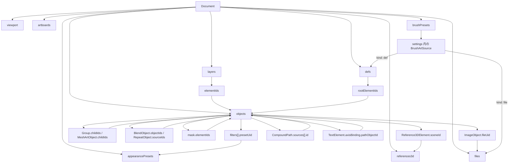

# Document Schema

> [!TIP]
> **前提ページ:** [Data Flow](/devdocs/data-flow)

Paplico のドキュメント構造は `core/schema.ts` の `Document` を基準に定義されている。Yjs 上の永続データも、Valtio に同期されたミラーも、意味的にはこの shape を共有する。このページではトップレベルのフィールド、正規化された `objects` ストア、要素同士の参照ルールを整理する。

## トップレベル構造

| フィールド | 型 | 役割 |
|---|---|---|
| `id` | `string` | ドキュメント ID |
| `objects` | `Record<string, AnyArtObject>` | 全要素の正規化ストア。要素本体はここに 1 回だけ入る |
| `layers` | `Layer[]` | トップレベル描画順と表示状態 |
| `viewport` | `Viewport` | 保存対象のメインビューポート状態 |
| `files` | `EmbeddedFile[]` | 画像・埋め込みフォント・ブラシテクスチャ・3Dモデルのバイナリ |
| `artboards` | `Artboard[]` | ワールド空間上のアートボード定義 |
| `brushPresets` | `BrushPreset[]` | ブラシプリセット定義 |
| `appearancePresets` | `AppearancePreset[]?` | アピアランスプリセット。要素の `filters` 内の `AppearancePresetRef` が参照する |
| `timelapse` | `TimelapseData?` | タイムラプス記録。未使用時は省略 |
| `schemaVersion` | `number?` | スキーマバージョン。`YYYYMMDD` 形式の日付番号 |
| `hdr` | `HdrSettings?` | HDR レンダリングの有効状態と露出 |
| `colorProfile` | `ColorProfileSettings?` | 作業色空間とプルーフ設定 |
| `rasterizationDpi` | `number?` | フィルターのラスタライズ解像度。未設定は 72 として扱う |
| `units` | `LengthUnit` | 表示と入力に使う長さの単位。座標はワールド単位のまま持つ |
| `defs` | `Record<string, DefEntry>?` | パターンとベクターブラシが参照するキャンバス外の定義 |
| `references3d` | `Record<string, Reference3DDef>?` | `Reference3DElement.sceneId` が参照する 3D シーン定義 |

## 正規化の基本ルール

`Document` は入れ子のツリーではなく、「要素本体」と「並び順・参照」を分離した正規化スキーマになっている。

この分割により、要素を 1 箇所だけ更新すれば、レイヤー順・グループ構造・派生インデックスが同じ ID を共有して追従できる。

## 参照フィールドの見方

| 参照元 | 参照先 | 意味 |
|---|---|---|
| `layers[].elementIds[]` | `document.objects[id]` | レイヤー直下の表示順 |
| `Group.childIds[]` | `document.objects[id]` | グループ子要素の所有関係 |
| `Group.clipPathId` | `childIds` 内の要素 ID | グループ内クリップマスク |
| `MeshArtObject.childIds[]` | `document.objects[id]` | メッシュ変形コンテナの子要素 |
| `BlendObject.objectIds[]` / `spineSourceId` | `document.objects[id]` | ブレンドが取り込んだキー要素と軸パス |
| `RepeatObject.sourceIds[]` | `document.objects[id]` | リピートが取り込んだ元要素 |
| `ArtObject.mask.elementIds[]` | `document.objects[id]` | 要素にかけるマスクの内容 |
| `filters[].presetUid` | `appearancePresets[].uid` | アピアランスプリセットの参照 |
| `CompoundPath.sources[].id` | `document.objects[id]` | ブーリアン演算の元パス |
| `TextElement.axisBinding.pathObjectId` | `document.objects[id]` | テキストの軸となる対象パス |
| `TextElement.flow.nextTextElementId` | `document.objects[id]` | 溢れたテキストの流し込み先リージョン |
| `TextElement.clipPathId` | `document.objects[id]` | テキストのクリッピングパス |
| `Reference3DElement.sceneId` | `references3d` のキー | 要素が描画する 3D シーン |
| `defs[id].rootElementIds[]` | `document.objects[id]` | 定義の中身になる要素 |
| `PatternFill.defId` | `defs` のキー | パターン塗りのタイル定義 |
| `ImageObject.fileUid` | `files[].uid` | 埋め込み画像データ |
| `TextStyle.fontSource.fileUid` | `files[].uid` | 埋め込みフォントデータ |
| `BrushSettings` 内の `BrushArtSource`（`kind: "file"` の `fileUid`） | `files[].uid` | ブラシ先端・リボン・紙目のテクスチャ |
| `BrushSettings` 内の `BrushArtSource`（`kind: "def"` の `defId`） | `defs` のキー | ベクター先端の定義 |
| `Reference3DNode.fileUid` | `files[].uid` | 3D シーンの VRM / glTF バイナリ |

## 要素の共通部分

すべての描画要素は `ArtObject` を継承し、最低限次のフィールドを持つ。

| フィールド | 意味 |
|---|---|
| `id` | 要素 ID。`document.objects` のキーにも使う |
| `name` | 任意の表示名 |
| `opacity` | 不透明度 |
| `blendMode` / `compositionMode` | 合成方法 |
| `visible` / `locked` | 表示・編集可否 |
| `filters` | 要素単位のフィルター列 |
| `transform` | レンダリング時に適用する移動・回転・スケール |
| `mask` | 要素の描画結果にかけるグレースケールマスク。`elementIds` がマスクの内容を指す |

`transform` は要素の外側に共通で付く。`Path` のセグメントや `TextElement` の内容そのものを書き換えず、見た目の位置・回転・スケールを後段で適用できるようにしている。

## `AnyArtObject` の種別

`document.objects` に入る要素は `AnyArtObject` として次の union で表される。

| 種別 | 主なフィールド | 用途 |
|---|---|---|
| `Path` | `segments`, `pathStart`, `pathEnd`, `strokeWidths`, `strokeWidthsBaked`, `isGuide` | ストローク / フィルの基本図形 |
| `Group` | `childIds`, `clipPathId`, `collapsed` | 子要素のまとまり、クリップ |
| `CompoundPath` | `sources[]` | 非破壊ブーリアン演算 |
| `ImageObject` | `fileUid`, `x`, `y`, `width`, `height`, `corners` | 埋め込み画像の配置 |
| `TextElement` | `x`, `y`, `content`, `defaultStyle`, `layout`, `axisBinding`, `flow`, `clipPathId` | テキストボックス / パス沿い文字 / 流し込みリージョン |
| `MeshArtObject` | `childIds`, `vertices`, `faces` | 子要素を Coons パッチのケージで非破壊に変形するコンテナ |
| `BlendObject` | `objectIds`, `spacing`, `spineSourceId` | 複数パス間の非破壊ブレンド |
| `RepeatObject` | `sourceIds`, `mode`, `grid`, `radial`, `mirror` | 元要素のグリッド / 放射 / ミラー配置 |
| `Reference3DElement` | `sceneId`, `camera`, `x`, `y`, `width`, `height`, `displayMode` | 3D シーンの参照表示 |

## `Layer` と `Viewport`

トップレベルで別々の責務を持つのが `Layer` と `Viewport` である。`Layer` は描画順と表示状態を保持し、`Viewport` は表示中心・ズーム率・回転を保持する。

| 型 | 主要フィールド | 説明 |
|---|---|---|
| `Layer` | `id`, `name`, `visible`, `locked`, `opacity`, `blendMode`, `elementIds`, `transientKind`, `ownerClientId` | レイヤー直下の要素順序と表示状態を保持する。`transientKind` は編集セッションの作業レイヤーに付く。このレイヤーは保存と画像書き出しの対象にならない |
| `Viewport` | `x`, `y`, `zoom`, `rotation` | ワールド空間での表示中心とズーム率。`x/y` は画面中心が見ているワールド座標 |

`Viewport` はドキュメントに保存されるため、再読み込み時に最後の表示位置へ戻せる。

## `schemaVersion` と後方互換

`schemaVersion` は `YYYYMMDD` 形式の数値で保存される。`undefined` は旧スキーマのドキュメントを意味し、import/migration 時の分岐に使う。新しいフィールドを追加するときは、既存ドキュメントが欠損値を持つ前提で扱う必要がある。

## 関連ファイル

| ファイル | 役割 |
|---|---|
| `core/schema.ts` | `Document` / `Layer` / `AnyArtObject` などの型定義 |
| `core/collaboration/YjsProvider.ts` | `Document` を Yjs に流し込み、更新を同期する |
| `core/collaboration/extractDocumentFromYDoc.ts` | Y.Doc から `Document` shape を再構築する |
