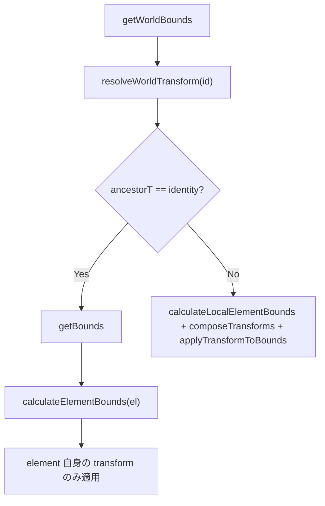

# SpatialIndex とドキュメント更新フロー

> [!TIP]
> **前提ページ:** [レンダラーアーキテクチャ](/devdocs/renderer)

`SpatialIndex` は要素のヒットテスト・スナップ・選択 BBox 計算を担う派生データ構造で、`core/document/SpatialIndex.ts` に実装されている。ドキュメントへの変更が発生するたびに Yjs → Valtio のパイプラインを経由して自動更新される。このページでは更新フロー全体と、グループ内要素における座標系の扱いを解説する。

## SpatialIndex の役割

| 機能 | メソッド | 用途 |
|---|---|---|
| AABB キャッシュ | `getBounds(id)` / `getWorldBounds(id)` | BBox 計算・選択 UI |
| Quadtree | `layerQuadtrees` | ヒットテスト・マーキー選択 |
| 親コンテナ逆引き | `parentGroupMap` | 祖先 transform の解決。グループ・複合パス・ブレンド・リピート・メッシュの子を引ける |
| アートボード index | `artboardQuadtree` | アートボードへのスナップ |

## ドキュメント更新 → SpatialIndex 更新フロー

既存要素の更新がどのように SpatialIndex に反映されるかを示す。layer の `elementIds` も変わる追加と削除は、後述の full sync を通る。

```
ユーザー操作 (SelectTool 等)
  └─ PaplicoCommands.batchUpdateElements()
       └─ YjsProvider.batchUpdateElements()
            └─ ydoc.transact()  ← Yjs トランザクション
                 └─ "update" イベント（同期）
                      └─ syncYjsToValtio()
                           └─ onObjectsChange(delta)  ← Paplico.ts
                                ├─ Phase 1: Valtio store に objects を反映
                                ├─ Phase 2: spatialIndex.applyObjectsDelta(delta)
                                │            └─ elementsMap キャッシュを差分更新
                                ├─ defIndex / textDepIndex へ delta を通知
                                ├─ Phase 3: renderChangeSubscriber.syncObjectsDelta(delta)
                                │            ├─ spatialIndex.clearBoundsCacheWithAncestors(updatedId)
                                │            │   └─ 要素と、その上にある全コンテナの boundsCache を落とす
                                │            ├─ resolveTopLevelOwner(updatedId)
                                │            │   └─ parentGroupMap を辿りレイヤー直下の親を特定
                                │            ├─ spatialIndex.updateElement(layerId, topLevelOwner)
                                │            │   └─ Quadtree entry 更新 + boundsCache 再計算
                                │            ├─ コンテナが変わった場合: refreshContainerMappings / clearContainerMappings
                                │            │   └─ parentGroupMap を更新
                                │            └─ hooks.refreshToolUI()
                                │                 └─ spatialIndex.invalidateBounds(selectedId)
                                │                      └─ boundsCache を強制再計算
                                └─ Phase 4: document.objects を再代入し React へ通知
```

### delta に含まれる要素とトップレベルオーナー

グループ内の子要素が更新されると、delta には子要素 ID のみが含まれる。
`syncObjectsDelta` は `parentGroupMap` を辿ってそのレイヤー直下の「トップレベルオーナー」（グループ）を特定し、グループ全体の Quadtree entry を再計算する。これにより、グループの bounds が子要素の新位置を反映した値に更新される。

コンテナの bounds は子要素のキャッシュ済み bounds から求める。入れ子のグループでは、間にあるコンテナのキャッシュも落とさないと古い範囲が残る。このため `clearBoundsCacheWithAncestors` は、更新された要素からレイヤー直下までの全コンテナのキャッシュを落とす。

```
delta.updated: [childId]
  → resolveTopLevelOwner(childId) → { topLevelId: groupId, layerId }
  → spatialIndex.updateElement(layerId, group)
       └─ calculateElementBounds(group, elementsMap)
            └─ 全子要素の bounds を union して group bounds を算出
```

### layer も変わる追加と削除は full sync を通る

`YjsProvider.syncYjsToValtio` は、1 回の更新で object と layer の両方が変わった場合に full sync を選ぶ。`addElement` は `yObjects` と layer の `elementIds` を同じトランザクションで変えるため、これに当たる。レイヤー直下の要素の削除も同じである。

```
ydoc "update" イベント
  └─ syncYjsToValtio()  ← needsLayerSync かつ object の変更あり
       └─ extractDocumentFromYDoc(ydoc)
            └─ onDocumentUpdate(document)  ← Paplico.ts
                 ├─ store.document を差し替え
                 │   └─ SpatialIndex の購読が rebuildAllIndices() を同期実行
                 └─ renderChangeSubscriber.syncFullDocument()
                      └─ hooks.refreshToolUI()
```

delta 経路の `syncObjectsDelta` も追加と削除を扱える。layer が変わらない追加と削除がこの経路に来る。追加された要素がレイヤー直下なら `insertElement` を呼ぶ。コンテナの子ならそのトップレベルオーナーを更新する。削除された要素は全レイヤーの Quadtree から `removeElement` で外す。

## ヒットテストの走査順

`findElementAtPoint` と `findPathAtPoint` は描画順で最前面の要素を返す。コンテナの中を探す `findPathInChildren` は `childIds` を末尾から走査する。`childIds[0]` が最背面に描かれるためである。

## getBounds と getWorldBounds の違い

SpatialIndex には bounds を取得するメソッドが 2 種類ある。

| メソッド | 説明 | 用途 |
|---|---|---|
| `getBounds(id)` | 要素自身の transform のみ適用した bounds。祖先 transform は無視 | Quadtree 格納値・内部計算 |
| `getWorldBounds(id)` | 祖先グループの transform を合成した真のワールド空間 bounds | 選択 BBox 表示・ヒットテスト |

### なぜ 2 種類が必要か

要素がグループ内にある場合、その `transform.x/y` はグループローカル座標で記述される。グループ自体が移動・スケールしている場合、ワールド空間での bounds を得るには祖先の transform を合成する必要がある。

```
getWorldBounds(childId):
  1. resolveWorldTransform(childId)
       └─ parentGroupMap を辿り祖先 transform を composeTransforms で合成
       └─ 直接の親がブレンドの場合は、ブレンドの transform を要素中心まわりの transform へ変換
  2. ancestorT が identity でない場合:
       localBounds = calculateLocalElementBounds(element)
       composedT   = composeTransforms(ancestorT, element.transform)
       return applyTransformToBounds(localBounds, composedT)
  3. identity の場合: getBounds(childId) を返す (boundsCache を利用)
```



### editing group mode での選択 BBox

editing group mode ではグループ内の子要素を直接操作する。選択 BBox を正しく表示するには、子要素の `selectionBounds` の算出に必ず `getWorldBounds` を使わなければならない。

`getBounds` を使った場合のバグ例：

- グループが world (200, 200) に配置されている
- 子要素のローカル座標が (10, 10)
- `getBounds(child)` → bounds at (10, 10) ← **祖先 offset を無視した誤り**
- `getWorldBounds(child)` → bounds at (210, 210) ← **正しいワールド座標**

`PaplicoSelection.updateSelectionBounds` および `selectMultiple` では `getWorldBounds` を使用することで、グループ内要素の選択 BBox が正しいワールド座標に表示される。

## 関連ファイル

| ファイル | 役割 |
|---|---|
| `core/document/SpatialIndex.ts` | bounds キャッシュ・Quadtree・parentGroupMap の管理 |
| `core/PaplicoSelection.ts` | 選択 BBox の計算（`updateSelectionBounds` / `selectMultiple`） |
| `core/renderer/DocumentChangeSubscriber.ts` | Yjs delta → SpatialIndex 更新の橋渡し |
| `core/collaboration/YjsProvider.ts` | Yjs トランザクションと `onObjectsChange` コールバック |
| `core/utils/geometry/bounds.ts` | `calculateElementBounds` / `calculateLocalElementBounds` |
| `core/utils/geometry/geometry.ts` | `composeTransforms` / `applyTransformToBounds` |
