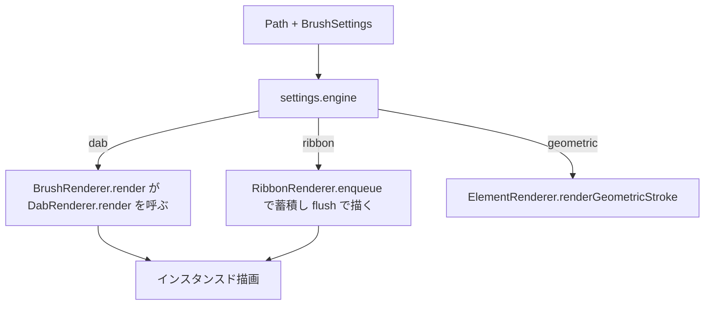
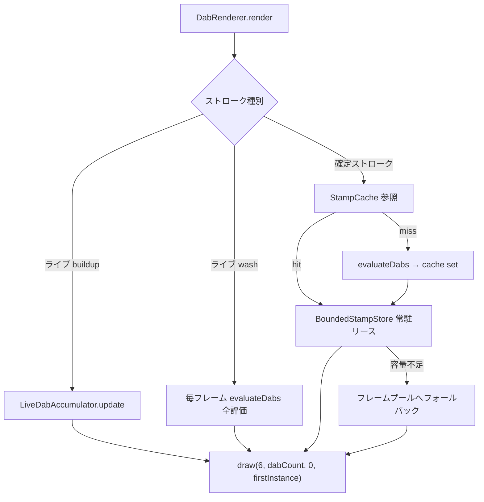
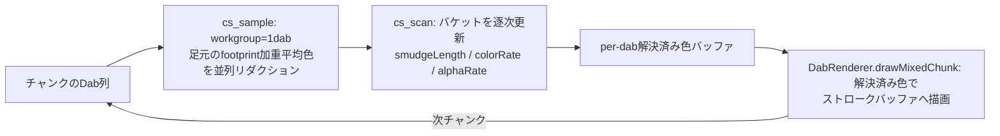

# ブラシレンダリング

> [!NOTE]
> **前提ページ:** [ブラシシステム](/devdocs/brush-system) — Pointer入力からベジェfit・Path確定までの入力側パイプラインを先に把握しておくこと。本ページはその後段、確定・プレビュー両方のストロークをGPUで描画する部分を扱う。[エレメントレンダリング](/devdocs/renderer/elements)の`ElementRenderer`からの呼び出し関係も参照。

Paplicoのブラシストロークは**Dabベースのインスタンスドレンダリング**で描画される。Dabはブラシ先端画像を1つ置く単位である。ベジェ曲線に沿って配置されたDab列をstorage bufferへ格納し、1回のインスタンスド描画で発行する。ストロークをメッシュにテッセレーションする方式と比較して頂点処理の負荷が桁違いに小さい。

ブラシ設定は`BrushSettings`（`core/schema.ts`）である。`engine`フィールドが描画エンジンを決め、`properties`のカーブ行列（入力×プロパティのカーブ変調）がDabごとのサイズ・不透明度・回転などを決める。カーブ評価の仕組み自体は`core/brush/`（`properties.ts` / `inputs.ts` / `curves.ts` / `evaluateProperties.ts`）にあり、本ページではレンダラがそれをどう消費するかに絞る。

## エンジンルーティング

`BrushSettings.engine`が3経路を決める。



- **dab**: 既定。`BrushRenderer.render()`が`DabRenderer.render()`へ振り分けて描く。**バッチ蓄積には乗らない**
- **ribbon**: テクスチャをパスに沿ってUVマッピングする。バッチ経路を使う唯一のエンジンで、入口は`RibbonRenderer.enqueue` / `flush`である。即時経路では`BrushRenderer.render()`が`RibbonRenderer.render()`へ振り分ける
- **geometric**: SVG風のジオメトリックストローク。`ElementRenderer.renderGeometricStroke`へ戻す

ルートを決めるのは呼び出し側である。バッチ経路のCanvasLayerと即時経路の`PathElementRenderer`が`engine`を読む。どちらもstroke appearanceから取り出した`strokeColor`と設定を`StrokeDrawInput`に詰めて渡す。描画側が`Path`から読むのは幾何だけである。幾何とは`strokeWidths` / `pathStart` / `pathEnd`と、within グラデーションの境界を指す。

### 呼び出し経路と描画先

描画側は呼び出しごとに`BrushDrawBindings`で描画先を受け取る。

```ts
interface BrushDrawBindings {
	uniformBuffer: GPUBuffer; // 今エンコード中のパスのviewport uniform
	transformsBindGroup: GPUBindGroup | undefined;
	maskBindGroup: GPUBindGroup;
}
```

| 呼び出し元 | 入口 | bindingsの出所 |
|---|---|---|
| CanvasLayerのバッチ経路 `renderElements` | `RibbonRenderer.enqueue(pass, input, bindings)` | `CanvasLayer.brushDrawBindings()`。viewport stackの現在のbufferと、現在要素のtransforms / maskを返す。override中のbufferはUniformScopeのもので、通常はメインbufferである |
| `PathElementRenderer`の即時経路 | `BrushRenderer.render(pass, input, bindings)` | 同上を`getBrushDrawBindings`経由で取得 |
| `WetStrokeRenderer`のwet層seed | `DabRenderer.renderWetSeeds(pass, input, bindings, mixed?)` | タイルごとに`UniformScope`から取得したbuffer |
| `MixStrokeRenderer`の混色 | `DabRenderer.prepareMixed(input, mixed, bindings)`で準備し`drawMixedChunk`で描く | ストロークバッファ用に`UniformScope`から取得したbuffer。chunk描画は準備時のbind groupを使う |

オフスクリーンパスがviewport uniformを差し替えると、CanvasLayerのviewport stackがその現在のbufferを持つ。`brushDrawBindings()`はそれを引数に載せる。

## モジュール概観

| モジュール | 役割 |
|---|---|
| `BrushRenderer` | キャンバス1つ分のブラシ描画の所有者。`DabRenderer` / `RibbonRenderer` / `WetStrokeRenderer` / `BrushFrameBuffers`と共通のPathMeta用bind group layoutを持ち、`engine`で振り分ける。`beginFrame` / `endFrame` / `destroy`を一括で行う。CanvasLayerが生成する |
| `DabRenderer` | dab描画パイプライン一式。常駐ストア・ライブdabバッファ・falloff LUT・紙目・texture array・wet seed・混色チャンク描画 |
| `RibbonRenderer` | ribbon描画パイプライン。バッチ蓄積と互換性判定。互換性はpass / uniform / bind group / 解決済みtextureで決まる |
| `BrushFrameBuffers` | フレーム単位で巻き戻すGPUバッファプール。instance / PathMeta / ColorStopsの3種でdab・ribbon共用 |
| `strokeMeta` | PathMeta / ColorStopsの書き込み。`writeSinglePathMeta` / `uploadSingleStrokeMeta`が全経路の唯一の書き手 |
| `WetStrokeRenderer` | wet層の駆動。通常水彩の`renderAppearance`と混色後の`renderMixed`の二入口が同じタイル処理へ入る。`WetLayerPass`を1つ所有 |
| `DabEvaluator` | セグメント列 + `BrushSettings` → Dabインスタンス列。速度EMA・カーブ評価・timed dab |
| `DabInstanceLayout` | 24 float/dabレイアウトのSSoT。WGSL構造体宣言を自動生成 |
| `LiveDabAccumulator` | ライブ描画の増分評価。確定プレフィックスの差分アップロード |
| `TipMaskBuilder` | 手続き先端のfalloff LUT生成 |
| `BrushTextureManager` | 先端テクスチャの読み込み・ミップ生成・defテクスチャ登録 |
| `BrushTextureArrayBuilder` | 散布用に複数テクスチャを`texture_2d_array`へ構築 |
| `MixPass` / `MixStrokeRenderer` | 混色（smudge）のチャンクcomputeとインライン合成 |
| `WetLayerPass` | wet層の拡散シミュレーション本体。seed / diffuse / finishのcompute・render |
| `WashCompositor` | washストロークの水彩ウェットエッジ後処理 |
| `RibbonGenerator` | リボンのセグメントインスタンス生成 |
| `StampCache` / `BoundedStampStore` | 確定ストロークのCPU/GPU 2層キャッシュ |
| `strokeHalfWidth` | UI向けの実効半幅サンプラ（描画経路ではない） |

上記のうち`WashCompositor`は`core/renderer/canvas/pipeline/`、`StampCache`は`core/renderer/canvas/caches/`にあり、それ以外は`core/renderer/canvas/pipeline/brush/`にある。ブラシ専用シェーダは`pipeline/brush/shaders/`にある。対象は`brushDab.wgsl.ts`・`dabColor.wgsl.ts`・`brushMix.wgsl.ts`・`colorMix.wgsl.ts`・`strokeWidthCommon.wgsl.ts`・`wetEdge.wgsl.ts`・`wetLayer*.wgsl.ts`・`ribbonStroke.wgsl.ts`である。入力側の`BrushStrokeSession`は`core/brush/`にある。

## Dabインスタンスレイアウト

`DabInstanceLayout.ts`がCPU/GPU双方のレイアウトのSSoTである。`DAB_INSTANCE_FLOATS = 24`（96バイト、16バイトアライン）。`generateDabInstanceWgsl()`がこのテーブルからWGSL構造体宣言を生成するため、CPUとシェーダのドリフトは構造的に起きない。

| Offset | フィールド | 説明 |
|---|---|---|
| 0 | `positionX` | Dab中心X（ワールド座標） |
| 1 | `positionY` | Dab中心Y |
| 2 | `sizeX` | 横方向サイズ（アスペクト込み） |
| 3 | `alpha` | Dabアルファ。flow由来。buildupではlinearize補正済み |
| 4 | `rotation` | 回転角。tangent時は接線角を加算済み |
| 5 | `pathT` | 弧長比 0..1。グラデーション用 |
| 6 | `packedMeta` | u32: 下位21bit = pathIndex、上位11bit = テクスチャレイヤ |
| 7 | `sizeY` | 縦方向サイズ |
| 8 | `side1Width` | 可変線幅 側1 |
| 9 | `side2Width` | 可変線幅 側2 |
| 10 | `normalX` | パス法線X |
| 11 | `normalY` | パス法線Y |
| 12 | `strokeDirX` | 進行方向X |
| 13 | `strokeDirY` | 進行方向Y |
| 14 | `motionSpeed` | `speedFine`入力値 |
| 15 | `motionAccel` | `accel`入力値 |
| 16 | `packedColorShift0` | `pack2x16snorm(hueShift, satShift)` |
| 17 | `packedColorShift1` | `pack2x16snorm(valShift, 0)` |
| 18 | `hardnessLutIndex` | falloff LUTレイヤ。`round(hardness * 31)`で0..31 |
| 19 | `grainStrength` | 紙目強度 |
| 20 | `wetness` | wet無効時は0 |
| 21 | `directionality` | wet無効時は0 |
| 22 | `grainAmount` | wet紙目量 |
| 23 | `packedWetCoefficients` | wet場発展係数5種を6bitずつパック |

pathIndex/テクスチャレイヤのビット詰めは`StampPacking.ts`の純関数（`packStampPathIndex` / `replaceStampPathIndex`）が担う。この24 float ABIはフェーズ1で凍結されており、以後変更しない。wet無効のブラシもwet系3フィールド分を0で運ぶが、これは固定ABIの意図的な代償である。

## DabEvaluator

`evaluateDabs(segments, settings, options)`がDab生成の本体である。`settings.engine !== "dab"`なら空バッファを返す。

- **入力**: `CubicBezierSegment[]`、`BrushSettings`、`DabEvaluateOptions`（`pathIndex` / `pathStart` / `pathEnd` / `strokeWidths` / `textureAspectRatio` / 散布レイヤ情報 / `resume` / `totalLength`）
- **出力**: `DabBuffer` = `{ data: Float32Array, count, mixParams, state, totalLength }`。`mixParams`はDabごとの混色パラメータ（colorRate / alphaRate / smudgeLength）で、`mixing.enabled`が明示trueのときのみ充填される

1関数の中で責務が分かれている。

1. **弧長積分**: `approximateCubicLength`でセグメント長を近似し、spacing間隔でDab位置を積分する
2. **入力サンプラ**: 速度EMA 2本（fast 25ms / slow 110ms既定）、`accel`、`fade`（32ブラシサイズで飽和）、`distance`（1024pxで飽和）などのカーブ入力を更新する
3. **カーブ評価**: `bakeBrushProperties()`でカーブを256bin LUTへ焼き、Dabごとに`evalBrushProperty()`でLUT参照する
4. **書き込み**: `DAB_FIELD_OFFSETS`へ直書きする。`u32AsFloat` / `pack2x16snorm` / `pack5x6unorm`でビット詰めする

### timed dab

距離アキュムレータと時間アキュムレータを両方回し、**先に閾値へ達した側でDabを発火**する。`dabsPerSecond`プロパティが0より大きいと時間側が有効になり、ペンを止めても滞留噴射が積もる。エアブラシの本質的挙動である。

### opaque_linearize

buildup経路ではDabアルファに補正を掛ける。

```text
overlap = sizeX / max(aspect, 1) / spacingWorld
dabsPerPixel = max(1 + 0.9 * (overlap - 1), 1)
alpha = 1 - (1 - clamp01(flow * strokeOpacity)) ^ (1 / dabsPerPixel)
```

over合成では最終濃度が「1画素を覆うDab数」に依存するため、無補正だとspacingを変えるだけで線の濃さが変わってしまう。この式は合成後の濃度が指定値へ収束するようDab単体のアルファを逆算する。libmypaintの`opaque_linearize`と同じ発想である。wash経路ではこの補正を掛けず`alpha = flow`とし、`strokeOpacity`は合成時に1回だけ適用する。

### チャンク分割と決定論

`DabEvalState`（速度EMA・累積距離・乱数状態など22フィールド）を`resume`オプションで受け渡すと、ストロークを分割評価しても一括評価とビット一致する。`LiveDabAccumulator`の増分評価と混色のチャンク処理はこの性質に依存している。乱数はmulberry32のシード付きで、同一シードから同一Dab列が再現される。

## Dab供給の3系統とキャッシュ

`DabRenderer.render()`はDabデータの供給元を3系統に分ける。



- **ライブbuildup**: `LiveDabAccumulator`がプレビューフィッタの確定プレフィックスを`resume` stateで1回だけ評価し、committedバッファへ追記する。毎フレーム再評価するのは変化するテールのみ
- **ライブwash**: 毎フレーム全評価してフレームプールのバッファへアップロードする
- **確定ストローク**: settingsのフィンガープリント + `hashStampInput(path, segments)`の幾何ハッシュをキーに`StampCache`（CPU側、LRU）を引く。ヒットしたDab列は`BoundedStampStore`で常駐化を試みる

`BoundedStampStore`は単一GPUBufferの常駐アロケータである。配置は`pipeline/brush/BoundedStampStore.ts`である。所有者は`DabRenderer`で、常駐化とライブdabの増分状態は`DabRenderer`だけが持つ。上限は`min(maxStorageBufferBindingSize, maxBufferSize, 128MiB)`。リースの`firstStamp`オフセットは成長後も不変で、描画は`draw`の`firstInstance`にこの値を渡すだけでよい。解放はフレーム境界へ遅延され、描画中のバッファを壊さない。常駐化されたDab列は`StampCache`のCPUミラーとバッファを共有するため、キャッシュ済みデータの書き換えは禁止である。

## 先端システム

### 手続き先端（falloff LUT）

`tip.kind: "procedural"`の先端はテクスチャを持たない。フラグメントシェーダが正規化二乗距離を計算し、1D falloff LUTを引く。

- LUTは`TipMaskBuilder.ts`が生成する。`FALLOFF_LUT_SIZE = 256`、hardness量子化`FALLOFF_LUT_LAYERS = 32`
- falloff式はMyPaintの2セグメント式。`rr < h`なら`1 + rr(h-1)/h`、それ以外は`h/(1-h)·(1-rr)`
- `softnessCurve`指定時はKritaのcurve circle規約（線形距離のカーブを二乗距離インデックスへ再マップ）でLUTを作る
- GPU側は`DabRenderer`がr8unorm 256×1×32の`texture_2d_array`を1枚だけ作り、Dabの`hardnessLutIndex`でレイヤを選ぶ。`MixPass`には`getFalloffLutTexture()`で同じテクスチャを渡す

hardnessは実行時パラメータであり、任意サイズでシャープな縁が出る。

### 画像先端

`tip.kind: "image"`は`BrushTextureManager`が管理するテクスチャを使う。

- ビルトインは`BUILTIN_BRUSH_IDS`の6種: `svg` / `hardCircle` / `softCircle` / `pencil` / `airbrush` / `calligraphy`。pencil / airbrushはbase64 PNGから、円形2種はプログラム生成（`BUILTIN_TEXTURE_SIZE = 128`）
- 紙目用に`BUILTIN_PAPER_IDS`（`finePaper` / `coarsePaper`）が別枠である
- アップロード時に**ミップマップを生成**する。縮小サンプル時のシマリングを防ぐ
- ユーザー定義テクスチャはドキュメントの`EmbeddedFile`から`BrushArtSource`（`{kind:"file", fileUid}`）参照で読み込む

### defテクスチャ（ベクター先端）

キャンバス上の要素をブラシ先端に使う機能は`pipeline/defs/DefRasterizer.ts`が担う。要素をラスタライズし、`BrushTextureManager.registerDefTexture()`で`def:`プレフィックスのUIDとして登録する。ソース要素の変更で無効化される。

### 散布（マルチテクスチャ）

`tip.sources`が複数ある場合は`BrushTextureArrayBuilder`が全バリアントを1つの`texture_2d_array`へまとめる。最大寸法に揃えて透明パディングで中央配置し、ソート済みUIDハッシュでキャッシュする。レイヤ選択はCPU側で行う。`DabEvaluator`がシード付き乱数からレイヤを選び、先頭Dabは`startSource`、末尾Dabは`endSource`のレイヤで上書きして`packedMeta`の上位11bitへ詰める。defテクスチャはフォーマット互換がないため配列化されず、ビルトインへフォールバックする。

## シェーダとパイプライン

Dab描画のシェーダは`brushDab.wgsl.ts`の`buildBrushDabShader({tipMode, wetSeed?, mixedColors?})`が単一テンプレートから生成する。`tipMode`は`procedural` / `image` / `imageArray`の3種で、差分はテクスチャ宣言のみ。エントリポイントは`vs_main` / `fs_main`と、wet seed用の`fs_wet`である。

頂点バッファは持たない。`vs_main`が`vertex_index`から2三角形のクアッドを構成し、`draw(6, dabCount, 0, firstInstance)`でインスタンスごとに`dabs[instanceIndex]`を読んで配置・スケーリング・回転する。

### Bind Group

| Group | Binding | リソース |
|---|---|---|
| 0 | 0 | Viewport uniform buffer |
| 0 | 1 | `dabs` storage buffer |
| 0 | 2 | falloff LUT（procedural）/ 先端テクスチャ（image / imageArray） |
| 0 | 3 | 先端サンプラ |
| 0 | 4 | 紙目テクスチャ |
| 0 | 5 | 紙目サンプラ |
| 1 | 0 | PathMeta storage buffer |
| 1 | 1 | ColorStops storage buffer |
| 1 | 2 | `mixedColors` storage buffer（混色バリアントのみ） |
| 2 | 0 | Element transforms storage buffer |
| 3 | 0 | マスクアトラス |
| 3 | 1 | マスクサンプラ |

### カラーとグラデーション

色解決は`dabColor.wgsl.ts`に集約されている（`PATH_META_FLOATS = 24`）。

- **colorMode**: `tinting`（テクスチャ輝度をアルファとし、PathMetaの色で着色）と`color`（テクスチャRGBを直接使用）の2種。PathMetaの`gradientMode`の上位bitに詰まっている。手続き先端は常にtinting固定である
- **グラデーション**: `within`（BBoxベースUV）/ `along`（`pathT`）/ `across`（幅方向）の3種。ストップ補間はOKLab色空間で行う
- Dabごとの色揺らぎは`packedColorShift0/1`のHSVシフトで運ぶ
- 混色経路の制約: 1Dab = 1色のため、Dab内部にグラデーションを持てない。`across`は幅中心で評価する

## washモード

`paintMode`は不透明度の意味論を切り替える。

| | buildup | wash |
|---|---|---|
| Dabアルファ | `flow * strokeOpacity`にlinearize補正 | `flow`のみ |
| strokeOpacity | Dabアルファへ焼き込み | 合成時に1回だけ適用 |
| 自己交差 | 重なるほど濃くなる | ストローク内で`strokeOpacity`を超えない |
| 描画先 | メインパスへ直接 | オフスクリーンのストロークバッファ |

washストロークは`RenderPlanner`がwashプランとして分離し、CanvasLayerの`renderIsolatedWashAppearances()`がオフスクリーンで描いてから合成する。ドメインは1辺4096pxでキャップされる。合成結果はwashResultCacheで再利用される。

### 水彩ウェットエッジ（WashCompositor）

`pipeline/WashCompositor.ts`の`applyWetEdge()`がwashストロークの後処理として縁効果を作る。

1. カバレッジアルファに分離可能minフィルタ（erosion）を掛けて内部マスクを得る（半径上限48px）
2. `rim = alpha - eroded`が縁帯。ぼかし幅指定時はBlurPyramidで平滑化する
3. rimに応じて暗くする・アルファを上げることで、水彩の縁溜まりを表現する

`wetEdge`設定とwet層は排他である。`resolveBrushRenderRequirements`は保存済みの`wet.enabled`がtrueのとき`wetEdge`をundefinedにし、`RenderPlanner`はその値を読む。縁の表現はwet層側の`edgeDarkening` / `edgeRoughness`が担う。

## 混色（MixPass / MixStrokeRenderer）

`mixing.enabled`のブラシは下地の色を拾って引きずる。下地を読むため通常のバッチには乗らず、`MixStrokeRenderer`が`BackdropEffectDriver`としてz順のインライン合成を行う。ガラス系フィルタと同じ扱いである。

処理はDab列を64個のチャンク（`MIX_CHUNK_SIZE`）に分割し、チャンクごとにcompute 2段と描画を交互に実行する。



- サンプル重みはfalloff LUTを使い、先端形状と一致させる
- `sampleTrail`はサンプル位置を進行方向前後にずらす。`blendStyle`はOkLCH（鮮やか）とOkLAB（落ち着き）の混色スタイル補間である
- ライブ描画では`LiveMixSession`が確定Dab数の境界でテクスチャとバケットを凍結し、ストロークが伸びても再生しない
- 確定ストロークの結果はLRUキャッシュ（上限384MB、テクスチャ1辺上限4096px）に載る

wet層と併用した場合、ここで解決したDab色がwetシミュレーションのpigmentシードへ渡る。下地色の取得は混色の専任責務で、wet層は色を拾わない。

## wet層（WetLayerPass）

`wet.enabled`のブラシはにじみ・拡散のシミュレーションを通る。4フィールドの拡散シミュレーションで、係数はDab属性と場テクスチャから供給する。実装は`pipeline/brush/WetLayerPass.ts`である。

処理は3段のシェーダで構成される。

1. **seed**（`fs_wet`、6枚MRT）: Dab列からpigment / fluidVelocity / moistureの3場（rgba16float、加算ブレンド）と、場発展係数（rg8unorm×2 + r8unorm、カバレッジブレンド）をシードする
2. **diffuse**（`wetLayerDiffuse.wgsl.ts`）: pigment / moistureをping-pongで拡散する。既定32反復。係数テクスチャは全反復でread-onlyの固定バインドである
3. **finish**（`wetLayerFinish.wgsl.ts`）: 拡散結果を可視色へ変換して合成する

拡散の到達距離は格子間隔と反復数の組で決まる（`resolveWetBleedReach` / `resolveWetIterations`）。ステンシル幅を広げると格子が独立サブラティスに割れてブロブ状になるため、必ずこの組み合わせで距離を稼ぐ設計である。

駆動は`WetStrokeRenderer`が行う。入口は2つで、どちらも同じ非公開のタイル処理へ入る。タイル処理の順序は次のとおりである。

1. seed textureを確保する
2. 係数のclear valueを作る
3. タイル用uniformを取得する
4. `DabRenderer.renderWetSeeds()`を呼ぶ
5. `WetLayerPass.apply()`を呼ぶ
6. seedを解放待ちへ移す

- `renderAppearance`: 通常水彩。CanvasLayerの`renderIsolatedAppearances`から呼ばれ、パスの合成済みtransformを効果領域へ適用し、isolation boundsに合わせた出力テクスチャを確保して`RasterizedRenderSurface`を返す
- `renderMixed`: 混色後。`MixStrokeRenderer`から呼ばれ、混色済みdab bufferと解決色を`mixed`として渡す。出力先は`MixStrokeRenderer`が確保したwashテクスチャで、解像度上限後の原点計算はこの入口が持つ

`WetStrokeRenderer`は`BrushRenderer`が1つ生成し、`brushRenderer.wet`として公開する。CanvasLayerと`MixStrokeRenderer`は同じインスタンスを使う。`WetLayerPass`はこの1つだけが所有する。

## リボン

`engine: "ribbon"`はテクスチャをパス曲線に沿ってUVマッピングする。1ベジェセグメント = 1インスタンス（`RIBBON_FLOATS_PER_INSTANCE = 28`）で、CPUはメッシュを作らない。頂点シェーダがベジェ曲線を直接評価し、法線方向に押し出す（32分割×6頂点 = 192頂点/セグメント）。

- `RibbonGenerator.generateRibbonInstances()`が弧長プレフィックス和込みのインスタンス列を作る
- `uvMode: "repeat"`はパターンブラシ（`U = arcPos / tileWidth`）、`"stretch"`はアートブラシ（`U = arcPos / totalArc`）
- `RibbonOptions.curved`に`BrushSettings`を渡すと、sizeとflowのカーブがリボンにも効く。評価はセグメント端点で行い、間は線形補間する
- リボンはバッチ経路を使う唯一のエンジンである。`RibbonRenderer.enqueue()`は保留中のバッチと「pass encoder・uniform buffer・transforms / mask bind group・解決済みtexture」を比較し、どれかが違えば先に`flush()`してから蓄積する。CanvasLayerは塗り・バッチ対象外要素・グループ進入・offscreen合成・ループ終了の前に`flush()`を呼ぶ
- バッチのPathMetaは`strokeMeta.writeSinglePathMeta`が書き、`RibbonRenderer`はColorStopsの共有アリーナへの追記だけを担う。wet層のMRTには対応しない

## GPUテクスチャの消費のしかた

ブラシ描画が消費するGPUテクスチャの全体像。「誰が作り、どこで読まれ、いつまで生きるか」の一覧である。

| テクスチャ | 生成元 | フォーマット | 消費先 | 寿命 |
|---|---|---|---|---|
| ブラシ先端画像 | `BrushTextureManager` | rgba8unorm + ミップ | dabパイプライン group(0) binding(2) | Manager内キャッシュ。UID単位 |
| 散布用texture array | `BrushTextureArrayBuilder` | rgba8unorm array + ミップ | 同上（imageArrayバリアント） | UIDハッシュでキャッシュ |
| falloff LUT | `DabRenderer` | r8unorm 256×1×32 array | 手続き先端のgroup(0) binding(2)。`MixPass`のフットプリント重みにも渡る | 生成後は常駐 |
| 紙目（grain） | `BrushTextureManager` | rgba8unorm | dabパイプライン group(0) binding(4) | Manager内キャッシュ |
| defテクスチャ | `DefRasterizer` → `registerDefTexture()` | canvas形式 | 先端として単体消費。array化不可 | ソース要素の変更で無効化 |
| マスクアトラス | ClipMaskAtlas | — | dabパイプライン group(3) binding(0) | 既存のアトラス管理に従う |
| washストロークバッファ | TexturePoolから取得 | canvasFormat | dab描画のレンダーターゲット → `WashCompositor` → 合成blit | フレーム内。結果キャッシュへ昇格あり |
| wet seed MRT 6枚 | `WetStrokeRenderer`が確保し`DabRenderer.renderWetSeeds()`が描く | rgba16float×3 + rg8unorm×2 + r8unorm | `WetLayerPass`の拡散入力。反復中はread-only固定バインド | ストローク処理内 |
| wet拡散ping-pong | `WetLayerPass` | rgba16float | diffuse反復の読み書き交互 | ストローク処理内 |
| 混色below snapshot | 背景キャプチャ | canvasFormat | `MixPass.cs_sample`のサンプル元 | チャンク処理中 |
| 混色stroke現況 | ストロークバッファ | canvasFormat | `MixPass.cs_sample`のサンプル元 | チャンク処理中 |

サンプラは2本を使い分ける。

- `BrushTextureManager.getMipSampler()`: dab経路用。`mipmapFilter: "linear"`でミップを効かせる
- `RibbonRenderer`が持つ`Ribbon Repeat Sampler`: リボン経路用。`lodMaxClamp: 0`でレベル0固定とし、U方向repeatでタイルをつなぐ

## フレーム内の解放手順

| タイミング | 呼び出し | 内容 |
|---|---|---|
| フレーム開始 | `BrushRenderer.beginFrame()` | `BrushFrameBuffers`の3プールを巻き戻す。続いて`DabRenderer.beginFrame()`が、evictされた`StampCache`エントリの常駐領域を`BoundedStampStore`へ返し、成長で退役したライブdabバッファを破棄する。どちらも前フレームのsubmitが済んだこの地点まで遅延される |
| 要素ループ終了 | `RibbonRenderer.flush()` | 保留中のribbonバッチを描き切る |
| フレーム終了 | `CanvasLayer.releaseFrameResources()`が`BrushRenderer.endFrame()`を呼び、それが`WetStrokeRenderer.releaseFrame()`を呼ぶ | `WetLayerPass`が今フレーム参照したuniform / 場テクスチャを1フレーム遅れで破棄する。seedテクスチャは`OffscreenPresenter.deferDestroy`経由で返る |
| キャンバス破棄 | `CanvasLayer.destroy()`が`BrushRenderer.destroy()`を呼ぶ | wet / dab / ribbon / buffersの順に破棄する。`DabRenderer`はfalloff LUT・blank grain・texture array builderも破棄する。`BrushTextureManager`はデバイス単位で、キャンバスより長く生きる |

## パフォーマンスと設計判断

**Dab単位のビューポートカリングは行わない**: カリングは`RenderPlanner`の要素単位CPUカリングのみで、画面外のDabはGPUのクリップに任せる。常駐ストアのDab列をそのまま`firstInstance`で描く現構成では、フレームごとのカリングコピーの方が高くつくためである。

**常駐ストアとフレームプールの使い分け**: 確定ストロークは`BoundedStampStore`に常駐し、フレームをまたいでアップロードが発生しない。ライブストロークと容量あふれ分だけがフレームプール`BrushFrameBuffers`を使う。プールのバッファは要求量に足りなければ拡張し、要求量より2段以上大きければ小さく作り直す。

**決定論の維持**: シード付き乱数・`DabEvalState`のresume・コラボ断片の`pathStart` / `pathEnd`により、同一入力から同一Dab列が常に再現される。キャッシュ・コラボ・VRTの前提である。

**線幅のUI表示**: 選択ツールなどが必要とする「実効的な線の半幅」は`strokeHalfWidth.ts`の`createStrokeHalfWidthSampler()`が返す。dabエンジンでは実際に`evaluateDabs()`を1回走らせてサイズを補間するため、速度・乱数由来の幅変化が描画と一致する。

> [!TIP]
> **次に読むページ:** [UILayer](/devdocs/renderer/ui)
