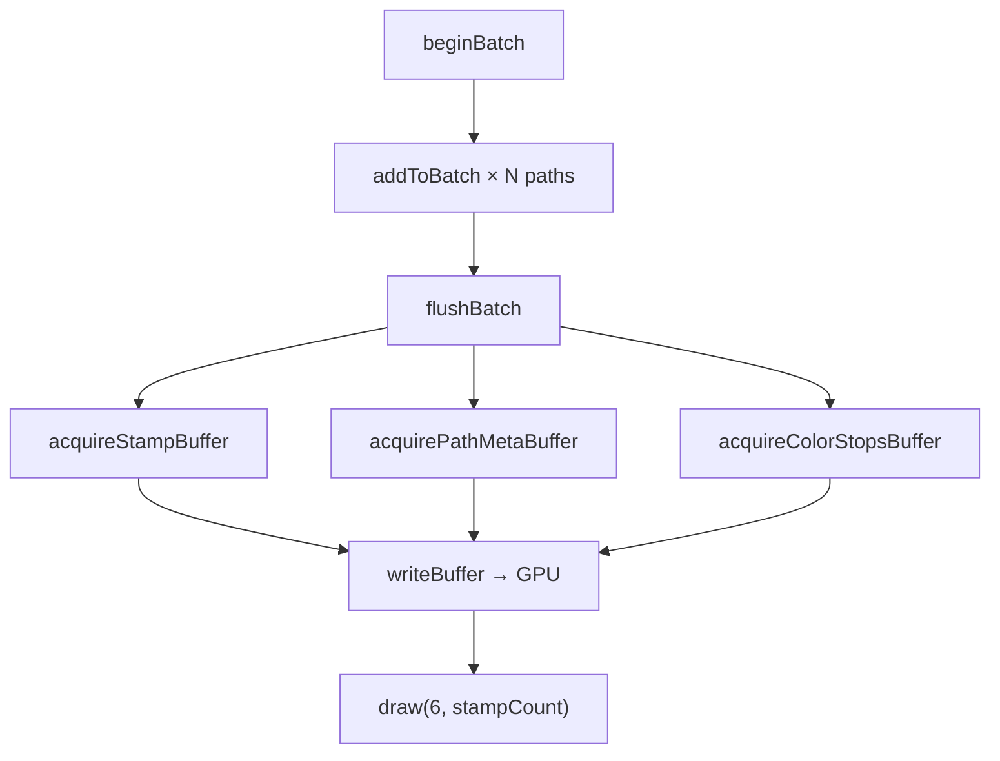

# ブラシレンダリング

> [!NOTE]
> **前提ページ:** [エレメントレンダリング](/devdocs/renderer/elements) — ブラシストロークが `ElementRenderer` のパス描画フローからどのように呼び出されるかを先に把握しておくと理解しやすい。

Paplicoのブラシストロークは**スタンプベースのインスタンスドレンダリング**で描画される。ベジェ曲線に沿って等間隔に配置されたスタンプ（ブラシの形状画像）を、WebGPUのインスタンシングで一括描画する方式である。ストロークのテッセレーション（曲線を三角形メッシュに変換する処理）と比較して、頂点処理の負荷が桁違いに小さい。5000パスをテッセレーションすると約50万三角形の頂点処理が必要になるが、インスタンシングでは1つの unit quad（6頂点の矩形）をスタンプ数分のインスタンスで複製するだけで済む。

筆圧・回転・チルト・速度・不透明度といった入力デバイスパラメータは、インスタンスデータとして storage buffer に格納され、頂点シェーダーが各スタンプを独立に配置・スケーリング・回転する。フラグメントシェーダーはブラシテクスチャの輝度からアルファを算出し、ストロークグラデーション（within / along / across）にも対応する。

このページでは `core/renderer/brush/` 配下のモジュールを中心に、スタンプの生成・カリング・バッチ描画・テクスチャ管理・パフォーマンス上の制約を解説する。

## モジュール概観

| モジュール | 役割 |
|---|---|
| `BrushStrokeRenderer` | スタンプ/散布/リボンの3パイプライン管理、バッチ蓄積、GPUバッファ書き込み、テクスチャ別 draw call 発行 |
| `StampGenerator` | ベジェ曲線に沿ったスタンプ位置・サイズ・不透明度の計算。`StampBuffer` の生成 |
| `BrushTextureManager` | ブラシテクスチャの読み込み（Base64 PNG / プログラム生成 / ユーザー定義）、寸法追跡、キャッシュ |
| `BrushTextureArrayBuilder` | 複数テクスチャバリアントを `texture_2d_array` にまとめて散布パイプライン用に構築 |
| `RibbonGenerator` | ベジェセグメントメタデータ（弧長プレフィックスサム等）をリボンパイプライン用に前処理 |
| `VectorBrushRasterizer` | キャンバス上の要素をオンデマンドでGPUテクスチャにラスタライズし、ブラシ先端として使用 |
| `StampCache` | 要素単位のスタンプ生成結果をキャッシュし、未変更ストロークの再計算を回避 |

## BrushStrokeRenderer

`BrushStrokeRenderer` はブラシストロークの描画パイプライン全体を管理するクラスである。WebGPUのレンダーパイプラインを初期化し、バッチ蓄積 API とフォールバック用の個別描画 API を提供する。3つの描画パイプライン（スタンプ、散布、リボン）を持ち、`BrushSettings.renderMode` と散布テクスチャの有無に応じて使い分ける。

### パイプライン構成

3種のパイプラインを管理する。スタンプパイプラインはコンストラクタで即座に生成され、散布・リボンパイプラインは初回使用時に遅延初期化される:

**スタンプパイプライン（既定）:**
- **シェーダー**: `BRUSH_STAMP_SHADER`（`brushStamp.wgsl.ts`）
- **テクスチャ**: 単一の `texture_2d<f32>`
- **用途**: 単一テクスチャによる通常のスタンプ描画

**散布パイプライン:**
- **シェーダー**: `BRUSH_STAMP_ARRAY_SHADER`（`brushStamp.wgsl.ts`）
- **テクスチャ**: `texture_2d_array<f32>`（複数バリアントを1つの配列テクスチャに格納）
- **用途**: 複数テクスチャバリアントからランダム選択 + 始端/終端テクスチャ

**リボンパイプライン:**
- **シェーダー**: `RIBBON_STROKE_SHADER`（`ribbonStroke.wgsl.ts`）
- **頂点バッファ**: 静的ユニットベジェ分割バッファ（32分割×2辺=192頂点/セグメント）
- **インスタンスデータ**: セグメントメタデータ（制御点、弧長、幅）をstorage bufferに格納
- **用途**: テクスチャをパスに沿ってUVマッピングし、シームレスにタイリング

共通設定:
- **プリミティブトポロジー**: `triangle-list`、カリングなし
- **ブレンドステート**: premultiplied alpha（`srcFactor: "one"`, `dstFactor: "one-minus-src-alpha"`）
- **マルチサンプル**: `RENDER_SAMPLE_COUNT` に従う
- **深度ステンシル**: 深度書き込み無効、ステンシル無効（`stencilWriteMask: 0x00`）

### Bind Group レイアウト

| BindGroup | Binding | リソース | ステージ |
|---|---|---|---|
| 0 | 0 | Viewport uniform buffer | Vertex |
| 0 | 1 | Stamp storage buffer（全パス結合） | Vertex |
| 0 | 2 | Brush texture | Fragment |
| 0 | 3 | Brush sampler | Fragment |
| 1 | 0 | PathMeta storage buffer | Vertex + Fragment |
| 1 | 1 | ColorStops storage buffer | Fragment |
| 2 | 0 | Element transforms storage buffer | Vertex |
| 3 | 0 | Mask atlas texture | Fragment |
| 3 | 1 | Mask sampler | Fragment |

BindGroup 0 はテクスチャを含むため、テクスチャが変わるたびに再バインドが必要である。BindGroup 1 の PathMeta と ColorStops は全テクスチャで共通であり、フレーム内で1回だけバインドすればよい。

### バッチ描画 API

通常のレンダリングでは以下の3メソッドをフレームごとに順に呼び出す:

1. **`beginBatch()`**: バッチ蓄積バッファをリセットする。前フレームのピーク使用量（`peakStampFloats`, `peakPathMetaFloats`, `peakColorStopFloats`）に基づいて `Float32Array` をプリアロケートし、フレーム中の再アロケーションを回避する
2. **`addToBatch(path, segments, viewportBounds, alphaMultiplier, transformIndex)`**: パスごとに呼び出され、スタンプデータをバッチバッファに蓄積する。内部では `StampCache` からキャッシュ済みスタンプを取得し（ミス時は `generateStampsDirect` で生成）、`cullStampBufferToViewport` でビューポート外のスタンプを除外した後、`batchStamps` / `batchPathMetas` / `batchColorStops` に追加する
3. **`flushBatch(passEncoder, pipelineType, transformsBindGroup)`**: 蓄積されたスタンプデータをGPUバッファにアップロードし、`passEncoder.draw(6, batchStampCount, 0, 0)` でインスタンスド描画を発行する

### pathIndex のリライト

`StampCache` はスタンプデータを `pathIndex=0` で生成・キャッシュする。`addToBatch` でバッチに追加する際に、各スタンプの `pathIndex` フィールド（オフセット+6）を現在の `batchPathCount` で上書きする。u32 → f32 のビット再解釈には `_u32Scratch` / `_f32Scratch` の共有 `ArrayBuffer` を使用する。

### 個別描画 API（フォールバック）

`render()` メソッドはオフスクリーンパスやステンシルパスなど、バッチ対象外の描画に使用される。スタンプ生成からGPUバッファ書き込み・draw call 発行まで1メソッドで完結する。`StampCache` を使用せず毎回スタンプを生成するため、バッチ API より低効率である。

### Uniform Buffer のオーバーライド

`setActiveUniformBuffer(buffer)` で BindGroup 0 の viewport uniform buffer を一時的に差し替えられる。オフスクリーンパスでは `UniformScope` が発行する専用 uniform buffer を設定し、オフスクリーンテクスチャの寸法に合わせたビューポートパラメータでスタンプを描画する。

### GPUバッファプール

stamp / pathMeta / colorStops の3種のGPUバッファはそれぞれ **grow-only プール** で管理される。`acquireStampBuffer` はプール内のバッファが要求サイズに満たない場合のみ新規作成し、十分なサイズのバッファが存在すればそのまま再利用する。フレーム開始時に `beginFrame()` でプールインデックスをリセットする。

### BindGroup キャッシュ

`flushBatch` 内の `createBindGroup` 呼び出しを最小化するため、BindGroup 0 と BindGroup 1 のキャッシュを保持する。バッファやテクスチャビューが前回と同一であればキャッシュ済み BindGroup をそのまま再利用する。`cachedBG0UniformBuf`, `cachedBG0StampBuf`, `cachedBG0TextureView`, `cachedBG0Sampler` の全4フィールドが一致した場合のみキャッシュヒットとなる。

## StampGenerator

`generateStampsDirect` はベジェ曲線セグメント配列と `BrushSettings` を入力とし、`StampBuffer`（`Float32Array` + 有効スタンプ数 `count`）を出力する純粋関数である。中間オブジェクトの生成を徹底的に回避した高速なホットパス実装である。

### スタンプデータ構造

1スタンプは `FLOATS_PER_STAMP = 12` floats（48 bytes）で構成される:

| Offset | フィールド | 説明 |
|---|---|---|
| 0 | `x` | ローカル座標X |
| 1 | `y` | ローカル座標Y |
| 2 | `sizeX` | 横方向サイズ（筆圧・速度・プーリング反映済み） |
| 3 | `opacity` | 不透明度（`flow * opacity * 筆圧係数 * プーリング係数`） |
| 4 | `rotation` | 回転角（tangent / random / none） |
| 5 | `pathT` | パス上の正規化位置（0.0 ~ 1.0）。ストロークグラデーション用 |
| 6 | `pathIndex` | パスインデックス（u32をf32にビット再解釈。`u32AsFloat` で変換） |
| 7 | `sizeY` | 縦方向サイズ（チルトによる楕円化反映） |
| 8 | `side1Width` | 可変幅ストロークの side1（パス法線方向） |
| 9 | `side2Width` | 可変幅ストロークの side2（パス法線逆方向） |
| 10 | `normalX` | パス法線X成分 |
| 11 | `normalY` | パス法線Y成分 |

### 生成アルゴリズム

1. **セグメント長計算**: 全セグメントを10サンプルで近似し、`segLengths` と `totalPathLength` を1パスで算出する。`resolveSegmentInline` でセグメントの絶対座標を8つの number 変数に直接展開し、中間オブジェクトの生成を回避する
2. **スタンプ配置**: `spacing = size * spacingRatio` の間隔で累積距離を追跡しながらスタンプを配置する。ベジエ評価（3次ベジエ `t1³·s + 3t1²t·c1 + 3t1t²·c2 + t³·e`）はループ内にインライン展開されている
3. **筆圧反映**: `sizeByPressure` は `pressureFactor = 1 - sizeByPressure + sizeByPressure * pressure` で線形補間する。`opacityByPressure` も同様
4. **回転モード**: `tangent` は `atan2(dy, dx) - PI/2` でパス接線方向に整列する。`random` はシード付き擬似乱数生成器（mulberry32、`createSeededRng`）で決定論的な乱数列を生成する。同じシードからは常に同じ回転列が再現される
5. **チルト**: `rotationByTilt` はペン傾斜角の大きさ（`tiltMag = sqrt(tiltX² + tiltY²) / 90`）に比例してスタンプを回転する。`aspectRatioByTilt` は傾斜に応じて `sizeY` を縮小し（最大30%まで）、楕円形のスタンプを生成する
6. **速度依存効果**: 速度は `stepDist / deltaTime` で算出し、`velocityThreshold = brushSize * 0.5` で正規化する
   - **`sizeBySpeed`**: 高速時にサイズを縮小する（最大70%縮小）
   - **`pooling`**: 低速時にインク溜まり効果を発生させる。`poolingSizeRatio` でサイズ増加と不透明度増加のバランスを制御し、スペーシングも最大60%縮小してスタンプ密度を上げる
7. **可変幅ストローク**: `strokeWidths` 配列が指定された場合、`interpolateStrokeWidths` で `pathT` に応じた `side1`, `side2` を補間し、スタンプごとに格納する
8. **サブパス処理**: `segment.isMoved` が true のセグメント（moveTo に相当）では `accumulatedDistance` をリセットし、サブパスの先頭に新しいスタンプを配置する

### pathStart / pathEnd による部分描画

`pathStart` / `pathEnd`（0.0 ~ 1.0）でストロークの描画範囲を制限できる。`pathStart > 0` の場合、先頭セグメントの筆圧を `endPressure` で代用して不自然な太さの変化を抑制する。`pathEnd < 1` の場合、最終セグメントの `endPressure` を `startPressure` で上書きして同様に対処する。

## BrushTextureManager

`BrushTextureManager` はブラシテクスチャの読み込みとGPUテクスチャキャッシュを管理するクラスである。`textureCache`（`Map<string, GPUTexture>`）にテクスチャを格納し、UID で取得する。

### ビルトインブラシテクスチャ

`loadDefaultTextures()` で以下の4種を初期化時にロードする:

| ブラシID | 生成方法 | 特徴 |
|---|---|---|
| `builtin-brush-pencil` | Base64 PNG → `createImageBitmap` → `copyExternalImageToTexture` | アセット画像からロード |
| `builtin-brush-airbrush` | 同上 | アセット画像からロード |
| `builtin-brush-hard-circle` | `createHardCircleTexture`（128x128 プログラム生成） | ハードエッジの円形。半径内は完全不透明 |
| `builtin-brush-soft-circle` | `createSoftCircleTexture`（128x128 プログラム生成） | ガウシアン風フォールオフ（sigma=0.4）の円形グラデーション |

テクスチャの色処理は `colorMode` に依存する:

- **`"tinting"`（既定）**: RGB輝度ベースでアルファを表現する。A チャンネルは常に255固定で、フラグメントシェーダーが `(R+G+B)/3` で輝度を算出してアルファ値として使用する。ブラシカラー（PathMetaのRGBA）で着色される。単色のグレースケール画像をそのままブラシテクスチャとして利用できる。
- **`"color"`**: テクスチャのRGBをそのまま出力色として使用する。テクスチャのアルファチャンネルで透明度を制御する。カラーイラストや写真をブラシテクスチャとして使う場合に適する。

### テクスチャ寸法の追跡

`textureSizes: Map<string, {width: number, height: number}>` でテクスチャの元寸法を追跡する。`getTextureSize(uid)` で寸法を取得し、`getTextureAspectRatio(uid)` でアスペクト比（width/height、未登録時1.0）を返す。非正方形テクスチャのスタンプサイズ計算（短辺=ブラシサイズ）に使用される。

### ユーザー定義テクスチャ

`loadFromEmbeddedFile(uid, bin, mimeType)` でドキュメントの `EmbeddedFile` からユーザー定義ブラシテクスチャを追加できる。読み込み時に `normalizeBrushTextureMaskInPlace` でテクスチャマスクの正規化が適用される。`OffscreenCanvas` + `getContext("2d")` でピクセルデータを取得・変換した後、`copyExternalImageToTexture` でGPUにアップロードする。

### テクスチャフォールバック

`BrushStrokeRenderer.resolveTextureUid` は、指定されたテクスチャ UID が `BrushTextureManager` に存在しない場合、`BUILTIN_BRUSH_IDS.softCircle` へフォールバックする。ドキュメントにカスタムブラシが含まれているがテクスチャファイルが未ロードの場合でも、ストロークが完全に消失せず既定のソフトサークルで描画される。

## ブラシパラメータ

`BrushSettings` インターフェース（`core/types/brush.ts`）がブラシの全パラメータを定義する。`createDefaultBrushSettings()` が既定値を返す。

| パラメータ | 型 | 既定値 | 説明 |
|---|---|---|---|
| `textureFileUid` | `string` | `softCircle` | ブラシテクスチャの EmbeddedFile UID |
| `size` | `number` | 10 | ワールド単位のベースサイズ |
| `sizeByPressure` | `number` | 0.5 | 筆圧→サイズ感度（0-1）。1.0で筆圧ゼロ時にサイズもゼロ |
| `opacity` | `number` | 1.0 | ベース不透明度（0-1） |
| `opacityByPressure` | `number` | 0.3 | 筆圧→不透明度感度（0-1） |
| `spacing` | `number` | 0.15 | スタンプ間隔（`size` に対する比率）。0.15 = サイズの15% |
| `flow` | `number` | 1.0 | フロー/蓄積（0-1）。低い値で薄いレイヤリング |
| `stampRotation` | `StampRotation` | `"none"` | 回転モード: `"none"` / `"tangent"` / `"random"` |
| `randomSeed` | `number` | ランダム | 乱数シード（`stampRotation="random"` 時） |
| `rotationByTilt` | `number` | 0 | チルト→回転影響（0-1） |
| `aspectRatioByTilt` | `number` | 0 | チルト→アスペクト比影響（0-1）。1で最大傾斜時にsizeYが30%に |
| `sizeBySpeed` | `number` | 0 | 速度→サイズ影響（0-1）。高速時にサイズ縮小 |
| `pooling` | `number` | 0 | インク溜まり強度（0-1）。低速時のインク蓄積効果 |
| `poolingSizeRatio` | `number` | 0.5 | プーリングのサイズ/不透明度バランス（0=不透明度重視、1=サイズ重視） |
| `colorMode` | `BrushColorMode` | `"tinting"` | テクスチャの色処理モード。`"tinting"`: ルミナンス→アルファ変換+ブラシカラーで着色。`"color"`: テクスチャRGBをそのまま使用 |
| `renderMode` | `"stamp" \| "ribbon"` | `"stamp"` | 描画モード。`"stamp"`: スタンプ配置。`"ribbon"`: パスに沿ったUVマッピング |
| `scatterTextureUids` | `string[]` | — | 散布用の追加テクスチャバリアント。スタンプごとにランダム選択 |
| `startTextureUid` | `string` | — | 始端テクスチャ（ストロークの最初のスタンプ用） |
| `endTextureUid` | `string` | — | 終端テクスチャ（ストロークの最後のスタンプ用） |
| `scatterOffset` | `number` | 0 | パスからの垂直方向ジッター量（0-1、ブラシサイズに対する比率） |
| `scatterSizeVariation` | `number` | 0 | サイズジッター範囲（0-1、基本サイズに対するランダム変動比率） |
| `ribbonStretch` | `number` | 0 | リボン: 伸長率（負=圧縮/密ループ、0=テクスチャアスペクト比保持、正=引き伸ばし） |
| `ribbonOffset` | `number` | 0 | リボン: UV.xオフセット（位置合わせ用） |
| `vectorBrushSourceId` | `string` | — | ベクターブラシとして使う要素のID。設定時は`textureFileUid`より優先 |

`BUILTIN_BRUSH_IDS.svg` が指定された場合はスタンプベースではなくジオメトリックストローク（`isGeometricBrush` が true を返す）として `ElementRenderer.renderGeometricStroke` で描画される。SVGブラシは `BrushStroking` インターフェースで `lineCap`, `lineJoin`, `dashArray` などを制御する。

## インスタンスドレンダリング

### なぜスタンプをインスタンスで描画するか

ブラシストロークを三角形メッシュにテッセレーションする方式では、パスの曲率・筆圧変化に応じた複雑な頂点生成が必要であり、5000パスで約50万三角形の頂点処理が発生する。インスタンシングでは、6頂点の unit quad を `draw(6, instanceCount)` で `instanceCount` 回複製するだけで済む。頂点シェーダーは `stamps[instanceIndex]` からスタンプデータを読み取り、quad の各頂点を配置・スケーリング・回転する。

### シェーダーの処理フロー

**頂点シェーダー（`vs_main`）:**

1. `quadVertices[vertexIndex]` で unit quad の頂点を取得
2. `stamp.size` / `stamp.sizeY` でスケーリング（最小サイズ保証: `1.0 / uniforms.zoom`）
3. `stamp.rotation` で回転
4. `stamp.positionX/Y` でスタンプ位置に配置
5. `pathMetas[stamp.pathIndex].transformIndex` で要素トランスフォームを適用（`applyElementTransform`）
6. ビューポート変換 → NDC変換

**フラグメントシェーダー（`fs_main`）:**

1. ブラシテクスチャを UV でサンプリング
2. `PathMeta.colorMode` に基づいてテクスチャ色を処理:
   - `tinting`: `(R+G+B)/3` で輝度ベースのアルファを算出し、PathMetaのカラーで着色
   - `color`: テクスチャRGBをそのまま使用し、テクスチャのアルファチャンネルで透明度制御
3. `PathMeta.gradientMode` に基づいてカラーを決定（`tinting` モード時のみ）:
   - `0` (solid): `PathMeta` の RGBA を直接使用
   - `1` (within): BBox ベースの UV で `sampleGradientStops` を呼び出し
   - `2` (along): `pathT` をパラメータとして `sampleGradientStops` を呼び出し
   - `3` (across): `uv.x`（ストローク幅方向）で `sampleGradientStops` を呼び出し
4. 可変幅プロファイル: `side1Width` / `side2Width` が1未満の場合、パス法線方向の signed distance に基づいて `widthFade` を算出
5. `luminance * opacity * colorA * widthFade` で最終アルファを算出し、premultiplied alpha で出力
6. `applyClipMask` でクリップマスクを適用

グラデーションストップの補間は **OKLab 知覚色空間** で行われる（`srgbToOklab` / `oklabToSrgb`）。sRGB での線形補間よりも知覚的に均一な色遷移を実現する。

## ビューポートカリング

### cullStampBufferToViewport

`cullStampBufferToViewport(buf, viewportBounds, margin)` はスタンプバッファ内のビューポート外スタンプを除去するカリング関数である。長いパス（数千スタンプ）でビューポートに表示されるのが一部だけの場合、描画するインスタンス数を大幅に削減できる。

カリングロジックは単純な AABB テスト（`x >= minX && x <= maxX && y >= minY && y <= maxY`）で、マージンとしてブラシサイズの半分 + 10px を加算する。

**座標系の注意**: スタンプ座標はローカル空間、ビューポート境界はワールド空間のため、`addToBatch` 内でビューポート境界をローカル空間に変換してからカリングを実行する。変換は `viewportBounds.minX - transform.x` のような平行移動のみで済む。ただし、`rotation !== 0` または `scaleX/Y !== 1` の場合は逆変換が複雑になるため、カリングをスキップして全スタンプを描画する。

### 共有出力バッファ

カリング結果は**モジュールレベルの共有バッファ** `cullView`（grow-only の `Float32Array`）に書き込まれる。返される `StampBuffer.data` はこの共有バッファの参照であり、次の `cullStampBufferToViewport` 呼び出しで上書きされる。呼び出し元（`addToBatch`）は返却後すぐにデータを `batchStamps` にコピーするため、この制約は実用上問題にならない。

> [!CAUTION]
> `cullStampBufferToViewport` の返す `StampBuffer.data` は共有バッファの参照である。次の呼び出しで上書きされるため、呼び出し元はデータを即座にコピーする必要がある。

## StampCache

`StampCache`（`core/renderer/caches/StampCache.ts`）は要素単位のスタンプ生成結果を `Map<string, StampBuffer>` でキャッシュする。キャッシュキーは `${path.id}:${fingerprint}` で、`fingerprint` はスタンプ生成に影響する `BrushSettings` のフィールド（`textureFileUid`, `size`, `sizeByPressure`, `spacing`, `flow`, `stampRotation`, `rotationByTilt`, `aspectRatioByTilt`, `pooling`, `poolingSizeRatio`）から構成される。

`RenderCacheManager` のダーティ追跡で要素が変更された場合、対応するキャッシュエントリは `deleteMany` で除去される。ストロークの形状（セグメント）やブラシ設定が変わらない限りスタンプは再生成されない。

ビューポートカリングはキャッシュの外側で毎フレーム実行される。ビューポートはフレームごとに変わりうるが、カリング前のフルスタンプデータはキャッシュに保持されているため、カリング結果のみが都度計算される。

## パフォーマンス考慮

### GC圧力の回避

`generateStampsDirect` は毎フレーム実行されるホットパスであるため、以下の手法でガベージコレクション圧力を最小化する:

- **`resolveSegmentInline`**: セグメントの絶対座標を8つの number 変数に直接展開し、中間 `Point` オブジェクトの生成を回避する
- **ベジエ評価のインライン展開**: `t1³·s + 3t1²t·c1 + 3t1t²·c2 + t³·e` をループ内にリテラル展開し、関数呼び出しを排除する
- **u32AsFloat**: ビットキャスト用の `Uint32Array(1)` / `Float32Array(同buffer)` をモジュールレベルで共有し、毎回のバッファ生成を回避する
- **grow-only Float32Array**: スタンプデータ配列は容量不足時のみ2倍に拡張し、縮小しない
- **カリング出力の共有バッファ**: `cullView` をモジュールレベルで保持し、呼び出しごとのアロケーションをゼロにする

### バッチバッファのプリアロケーション

`BrushStrokeRenderer` はフレーム間のピーク使用量を `peakStampFloats`, `peakPathMetaFloats`, `peakColorStopFloats` で追跡する。`beginBatch()` で前フレームのピーク値に基づいてバッチバッファをプリアロケートし、フレーム中の `ensureBatchStamps` / `ensureBatchPathMetas` / `ensureBatchColorStops` による再アロケーションを回避する。

### GPUバッファプールの grow-only 戦略

stamp / pathMeta / colorStops の各GPUバッファプールは grow-only で管理される。要求サイズがプール内の既存バッファサイズを超えた場合のみ新規作成（古いバッファは `destroy`）し、十分なサイズのバッファが存在すればそのまま再利用する。フレーム開始時にプールインデックスをリセットする。

> [!TIP]
> `beginFrame()` はフレームの先頭で呼び出し、GPUバッファプールのインデックスをリセットする。`beginBatch()` はレイヤー内のブラシ描画開始時に呼び出し、CPUバッチ蓄積バッファをリセットする。この2つのリセットポイントの区別はバッファ管理の理解に重要である。

## 設計上の判断

**テクスチャ別バッチの簡易実装**: 現在の実装では全スタンプを1つのバッファに結合し、最初のテクスチャで全スタンプを描画する。テクスチャが混在する場合の正確な描画は、CanvasLayer側でテクスチャ変更時に `flushBatch` する設計で対応する。WebGPU にはテクスチャ配列のバインドレスアクセスがないため、テクスチャごとに draw call を分ける必要がある。

**キャッシュキーのフィンガープリント**: `createStampCacheFingerprint` はスタンプ生成に影響するフィールドのみをキーに含める。ストロークカラーやグラデーション設定はスタンプの位置・サイズに影響しないため、キーから除外されている。これにより、色のみの変更ではスタンプの再生成が発生しない。

**カリングのスキップ条件**: rotation や scale が 1 でない場合、ビューポート境界のローカル空間への逆変換は回転行列の逆行列が必要になる。変換コストとカリングの効果のトレードオフから、単純な平行移動のみの場合にカリングを実行する設計としている。

**シード付き乱数**: `stampRotation="random"` で使用する `createSeededRng`（mulberry32）は、同じシードから同じ乱数列を再現する。ストロークの見た目がフレーム間で安定し、`StampCache` によるキャッシュが有効に機能する。

**輝度ベースアルファ**: テクスチャの RGB 輝度でアルファを算出する方式は、グレースケール画像をそのままブラシテクスチャとして利用できる利点がある。A チャンネルを 255 固定にすることで、テクスチャの透明部分が意図せずクリッピングされる問題を回避している。`colorMode: "color"` ではこの変換をバイパスし、テクスチャRGBをそのまま出力する。

## カラーモード

`BrushSettings.colorMode` はフラグメントシェーダーのテクスチャ色処理を切り替える。PathMetaのフラグとしてGPUに渡され、シェーダー内の単一の `if` で分岐する。

- **`"tinting"`（既定）**: テクスチャの `(R+G+B)/3` をアルファとして使い、PathMetaのRGBAで着色する。グレースケールのブラシテクスチャとブラシカラーの組み合わせで描画する従来の方式。
- **`"color"`**: テクスチャのRGBをそのまま出力色として使い、テクスチャのアルファチャンネルで透明度を制御する。カラーイラストや写真をブラシテクスチャとして使う場合に適する。グラデーションモードは無視される。

## マルチテクスチャ散布

`scatterTextureUids` が設定されたブラシは散布パイプラインで描画される。複数のテクスチャバリアント（primary + scatter + start + end）を `texture_2d_array` にまとめ、スタンプごとにランダム選択する。

### BrushTextureArrayBuilder

全ユニークテクスチャUIDを収集し、最大幅・高さを決定して `GPUTexture` を `size: [maxW, maxH, layerCount]` で作成する。各テクスチャをレイヤーにコピー（中央配置、透明パディング）する。ソート済みテクスチャUIDハッシュでキャッシュし、同一構成の再構築を回避する。

### textureLayerのパッキング

FLOATS_PER_STAMP=12を維持するため、textureLayerは `pathIndex`（オフセット+6）の上位16ビットにパックされる。頂点シェーダーが上位16ビットからtextureLayerをアンパックし、フラグメントシェーダーの `textureSample(brushTexture, brushSampler, uv, textureLayer)` に渡す。

### テクスチャ選択ロジック

- シードRNG（mulberry32）でスタンプごとにテクスチャレイヤーを割り当て: `floor(rng() * variantCount)`
- 最初のスタンプ: `startTextureUid` のインデックスを強制
- 最後のスタンプ: `endTextureUid` のインデックスを強制
- 位置ジッター: `(rng() * 2 - 1) * scatterOffset * brushSize` をタンジェント垂直方向に適用
- サイズジッター: `size *= 1 + (rng() * 2 - 1) * scatterSizeVariation`

## リボンタイリング

`renderMode: "ribbon"` はテクスチャをパス曲線に沿ってUVマッピングする描画モードである。ベジェセグメントインスタンシング方式を採用し、GPU頂点シェーダーでベジェ曲線を直接評価して法線方向に押し出す。

| 比較 | スタンプ方式 | リボン方式 |
|---|---|---|
| 1パスあたりインスタンス数 | ~1000 | ~15 |
| 1パスあたりバッファ量 | ~40KB | ~1.3KB |
| UV連続性 | スタンプ境界で不連続 | 完全に連続 |
| CPU処理 | StampGeneratorと同等 | 弧長計算のみ（O(N)） |

### RibbonGenerator

CPU処理はセグメントメタデータの軽量前処理のみ:

1. セグメント列を1回走査し、弧長を計算（10サンプル弦近似 — StampGeneratorと同一手法）
2. プレフィックスサムを計算
3. 22 floats/セグメントを `Float32Array` にパック（制御点、幅、弧長情報、pathIndex）

15セグメントのパスで330 floats（~1.3KB）。メッシュ生成は一切不要。

### リボンシェーダー

**頂点シェーダー**（`bezierPath.wgsl.ts` パターンから転用）:
- パラメータ `t` でベジェ曲線の位置とタンジェントを評価（GPU側）
- タンジェントの法線方向に `side * halfWidth` で押し出し
- UV.x = `(arcLengthOffset + t * segmentArcLength) / textureRepeatLength`
- UV.y = `(side + 1.0) * 0.5`

**フラグメントシェーダー**:
- サンプラー `addressModeU: "repeat"` でシームレスタイリング
- カラーモード分岐はスタンプシェーダーと共通
- `GRADIENT_COMMON_WGSL`, `TRANSFORM_COMMON_WGSL` を再利用
- 可変幅プロファイル（`side1Width` / `side2Width`）対応

## ベクターブラシ

`vectorBrushSourceId` が設定されたブラシは、キャンバス上の要素をオンデマンドでGPUテクスチャにラスタライズしてブラシ先端として使用する。

### VectorBrushRasterizer

`VectorBrushRasterizer` はラスタライズとキャッシュを管理する:

1. `calculateElementBounds()` でソース要素のバウンディングボックスを計算
2. ターゲット解像度: 長辺 = `clamp(brushSize * 2, 64, 1024)` ピクセル
3. 永続的な `GPUTexture` を `device.createTexture()` で作成（TexturePoolは使用しない）
4. `RenderElementToTextureFn` コールバック経由でCanvasLayerに描画を委譲
5. 結果を `BrushTextureManager.registerTexture()` で登録

キャッシュキーは `(sourceElementId, targetLongSide)` の2値。ソース要素変更時に `invalidate(sourceElementId)` で無効化する。

### 循環参照防止

DFS走査で循環参照を検出する。ソース要素（またはその子孫）が `vectorBrushSourceId` で直接・間接的に自身を参照する場合、ラスタライズを拒否して `null` を返す。

### 統合

CanvasLayerの `renderDocument()` 内で、要素描画の前にプリレンダーフェーズを実行する。可視パスの `vectorBrushSourceId` をスキャンし、`VectorBrushRasterizer.ensureRasterized()` でテクスチャの存在を保証する。`BrushStrokeRenderer` は `VectorBrushRasterizer.textureUidFor()` 静的メソッドでテクスチャUIDを解決する。

> [!TIP]
> **次に読むページ:** [UILayer](/devdocs/renderer/ui)
