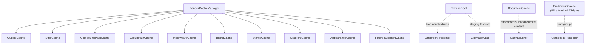

# キャッシュと無効化

> [!TIP]
> **前提ページ:** [レンダラーアーキテクチャ](/devdocs/renderer)

WebGPUレンダラーは毎フレーム、パスの平坦化・被覆率 strip の生成・グラデーションのGPUバッファ生成・ブラシスタンプの計算・複合パスのブーリアン演算など、多数の中間生成物を必要とする。これらを毎フレームゼロから再構築すると、フレーム時間の大部分がCPU側の計算とGPUバッファ転送に消費される。

キャッシュシステムは、要素が変更されない限りこれらの中間生成物をフレーム間で再利用し、変更があった要素だけを再構築することでレンダリング性能を維持する。設計上の中核方針は以下の3点である。

1. **Self-validating（自己検証）**: 各キャッシュエントリがフィンガープリント（geometryHash, JSON fingerprint, 数値fingerprint等）を内部に保持し、ヒット時に現在の要素データと照合する。一致しなければ自動的に再構築される。これにより、要素変更時に全キャッシュへ個別に無効化を通知するコードが不要になる。
2. **GPUリソースの安全な破棄**: `GPUBuffer` や `GPUTexture` を保持するキャッシュは、エントリの上書き・削除時にGPUリソースを `destroy()` する。in-flightのコマンドバッファとの競合を避けるため、テクスチャプール経由のリソースは遅延破棄を利用する。
3. **一元的な刈り込み**: `RenderCacheManager.onDocumentChange()` が全キャッシュを横断的に走査し、ドキュメントから削除された要素のエントリを一括削除する。

## 全体構成

`RenderCacheManager` 配下の10個のキャッシュは要素単位の中間生成物を保持する。`TexturePool`・`DocumentCache`・`ClipMaskAtlas` は用途別のGPUテクスチャの再利用とライフサイクルを管理する。`BindGroupCache` はGPUバインドグループの再生成を抑制する。

> [!NOTE]
> `TexturePool`・`DocumentCache`・`ClipMaskAtlas` の詳細は[パイプライン](/devdocs/renderer/pipeline)でも解説されている。このページではキャッシュ/無効化の観点から掘り下げる。

## RenderCacheManager

`canvas/caches/RenderCacheManager.ts` に実装。RenderOrchestratorがキャンバスターゲットごとに1インスタンスを所有し、CanvasLayer・ElementRenderer・BrushRendererに渡される。

キャッシュ一式はドキュメント ID ごとのスコープに分かれている。`CanvasLayer.render()` は冒頭で `setActiveDocument(document.id)` を呼び、描画するドキュメントのスコープに切り替える。ブラシプレビューやエクスポート用の一時ドキュメントを描いても、メインのドキュメントのエントリは刈り込まれない。スコープは最大4つ（`MAX_SCOPES`）で、超えた分は最後に有効化された時刻が古い順に破棄される。`dropDocument()` は指定したドキュメントのスコープをGPUリソースごと破棄する。

10個のキャッシュを公開プロパティとして保持する。各プロパティはアクセスのたびにアクティブなスコープを解決する。取得したインスタンスをフレームをまたいで保持してはならない。

| プロパティ | クラス | 用途 |
|---|---|---|
| `outline` | `OutlineCache` | ローカル空間のアウトライン（塗りのポリライン、線の三角形） |
| `strip` | `StripCache` | パスのテクセル空間へラスタライズした strip と alpha |
| `compoundPath` | `CompoundPathCache` | 複合パスのブーリアン演算結果 |
| `groupPath` | `GroupPathCache` | fill / stroke アピアランスを持つグループの合成パス |
| `meshWarp` | `MeshWarpCache` | メッシュコンテナのワープ済み一時要素 |
| `stamp` | `StampCache` | ブラシスタンプ生成結果 |
| `gradient` | `GradientCache` | グラデーションGPUリソース一式 |
| `blend` | `BlendCache` | ブレンドの中間オブジェクト |
| `appearance` | `AppearanceCache` | アピアランスのハンドラーが作るGPU中間物（押し出しのバッファなど） |
| `filteredElement` | `FilteredElementCache` | ポストフィルターのベイク結果 |

主要メソッド:

- **`onDocumentChange(liveObjects)`** — アクティブなスコープの全キャッシュのキーを走査し、`liveObjects` に存在しない要素のエントリを一括削除する。キーの形はキャッシュごとに違うので、要素 ID の取り出し方も分かれる。`outline`・`strip`・`gradient`・`stamp` は `"elementId:..."` の複合キーを持ち、最初の `:` より前を要素 ID とみなす。それ以外のキャッシュは、`"elementId::..."` の合成キーなら `::` より前を、そうでなければキー全体を要素 ID とみなす。`RenderStrategy.full` と `RenderStrategy.fullTransformOnly` のフレームで呼び出される。変更要素 ID が追跡できていて削除要素が無いフレームは、呼び出しを省略する。
- **`flushPendingDestroy()`** — `appearance` と `filteredElement` が遅延破棄に回したGPUリソースを、全スコープについて破棄する。フレームの開始時に呼ばれる。
- **`clearAll()`** — 全スコープの全キャッシュを完全クリアする。デバイスロスト時やターゲット破棄時に使用。

## OutlineCache

`canvas/caches/OutlineCache.ts` に実装。要素ローカル空間のアウトラインをキャッシュする。塗りは `flattenBezierPath()` の閉じたポリライン、線は `tessellateStroke()` の三角形リストである。

キーは `(elementId, variantKey)`。プリフィルターの uid やストロークアピアランスごとに variant が分かれ、要素あたり 6 件を古い順に退避する。エントリは以下のフィールドを持つ。

| フィールド | 型 | 用途 |
|---|---|---|
| `kind` | `"fill" \| "stroke"` | ポリラインか三角形か |
| `geometryHash` | `number` | ジオメトリ検証用ハッシュ |
| `scaleBucket` | `number` | 平坦化の許容誤差を決めたスケールバケット |
| `localBounds` | `[number, number, number, number]` | ペイントの UV 基準になるローカル境界 |
| `points` / `subpathOffsets` | `Float32Array` / `Int32Array` | 塗りのポリライン |
| `triangles` / `params` | `Float32Array` / `Float32Array \| null` | 線の三角形と、along/across 用の (t, u) |

`geometryHash` と `scaleBucket` でself-validationを行う。GPUリソースを保持しないため、エントリの削除は単純な `Map.delete()` で完結する。

## StripCache

`canvas/caches/StripCache.ts` に実装。アウトラインを描画先パスのテクセル空間へラスタライズした strip 列と alpha スロットをキャッシュする。

キーは `(elementId, "<variant>:<パス幅>x<パス高さ>:<suffix>")`。variant は通常描画（`normal`）かマスク描画（`mask`）かで、パスのテクセル空間が違うため分けている。パスのピクセルサイズを含めるのは、同じ要素が1フレームの中で複数のパスに描かれるためである。アトラスのセルと単独のマスクテクスチャがその例で、それぞれサブピクセル位相が違う。エントリを共有すると毎フレーム互いを追い出す。`OutlineCache` と同じく、要素あたり 6 件を古い順に退避する。エントリは以下のフィールドを持つ。

| フィールド | 型 | 用途 |
|---|---|---|
| `key` | `StripRasterKey` | `geometryHash`、スケールバケット、変換の線形部分、1/256px に量子化したサブピクセル位相、params の有無 |
| `coverage` | `ClipRect` | strip を生成した範囲。パス矩形の 3 倍で、この中にあるパスは再利用する |
| `batch` | `StripBatch` | strip、alpha スロット、params |

strip はデバイス変換の整数部分をアンカーとした相対座標なので、整数テクセルのパンではアンカーが動くだけで再生成しない。ペイントはインスタンス側に乗り、キーに含まれない。

## StampCache

`canvas/caches/StampCache.ts` に実装。ブラシストローク描画時のスタンプ生成結果（`StampBuffer`）をキャッシュする。キーは `"elementId:..."` の複合キーで、ジオメトリのハッシュとブラシのフィンガープリントを含む。パスを編集するとキーそのものが変わる。同じ要素が新しいキーで `set()` されると、その要素の古いキーのエントリは削除される。

`StampBuffer` は `DabEvaluator` が生成したDab列を `DabRenderer` が格納するデータ構造で、ブラシ設定のカーブ行列から計算されたバッファである。要素のブラシ設定やストロークポイントが変わらない限り、スタンプの再計算を省略できる。

エントリは、常駐 dab ストアのGPUリース（`residentDab`）を持つことがある。エントリの削除時にこのリースを解放する。キャッシュ全体にはバイト予算（既定 96 MiB）があり、超えた分は最後に使われた時刻が古い順に退避する。

## GradientCache

`canvas/caches/GradientCache.ts` に実装。グラデーション描画に必要なGPUリソース一式をキャッシュする。対象は `linear` と `radial` である。`free`・`mesh`・`pattern` はこのキャッシュを通らない。

キーは描画単位ごとの複合キーで、塗りは `"<cacheKey>:fill"`、geometric ストロークは `"<cacheKey>:stroke:grad"` である。`<cacheKey>` はアピアランスの解決時に決まり、要素 ID で始まる。エントリの `GradientCacheEntry` は以下のフィールドを持つ。

| フィールド | 型 | 用途 |
|---|---|---|
| `uniformBuffer` | `GPUBuffer` | グラデーションパラメータ |
| `stopsBuffer` | `GPUBuffer` | カラーストップ配列 |
| `bindGroup` | `GPUBindGroup` | バインドグループ |
| `fingerprint` | `number` | 数値フィンガープリント |

`fingerprint` は `hashGradientDraw()` で算出される数値ハッシュである。`geometryHash`（ストロークのグラデーションモードを混ぜ込んだもの）、トランスフォームのスロット番号、ペイントの種類、座標パラメータ、カラーストップのoffset・midpoint・RGBA値、バウンズを `h = (h * 31 + value) | 0` の連鎖で畳み込む。浮動小数点値は `floatBits()` でビットパターンに変換してから畳み込むことで、丸め誤差による偽キャッシュミスを防いでいる。

キャッシュヒット時、`fingerprint` が一致すれば全ての `writeBuffer` 呼び出しをスキップできる。2つの `GPUBuffer` を保持するため、`set()`・`delete()`・`clear()` 時に全バッファを `destroy()` する。

## CompoundPathCache

`canvas/caches/CompoundPathCache.ts` に実装。複合パス（CompoundPath）のブーリアン演算結果をキャッシュする。

他のキャッシュとは異なり、`resolve()` メソッドがキャッシュの取得と計算を一体化したインターフェースを提供する。`resolve(compoundPath, pathMap)` はフィンガープリントを照合し、ヒットすればキャッシュされた `CubicBezierSegment[]` を返し、ミスすれば `computeBooleanOperation()` を実行して結果をキャッシュする。

フィンガープリントは `createFingerprint()` で生成されるJSON文字列である。各ソースパスの `id`, `op`, `filters`, `transform`, `segments` をJSON.stringifyした結果で、パスの形状やトランスフォームが変わるとフィンガープリントが変化する。数値ハッシュではなくJSON文字列を使用するのは、ソースパスの構造が複雑で衝突リスクを排除する必要があるためと考えられる。

## GroupPathCache / MeshWarpCache / BlendCache

いずれも `canvas/caches/` に実装。`CompoundPathCache` と同じ形で、要素 ID をキーにし、JSON文字列のフィンガープリントで自己検証する。

| クラス | 保持するもの | フィンガープリントの入力 |
|---|---|---|
| `GroupPathCache` | fill / stroke アピアランスを持つグループの合成パス | 子パスのジオメトリとトランスフォーム |
| `MeshWarpCache` | メッシュコンテナのワープ済み一時要素 | ケージのジオメトリと全子孫のデータ。テキストの子孫では、非同期のグリフレイアウトが使えるかどうかも含む |
| `BlendCache` | ブレンドの中間オブジェクト | ブレンドのパラメータと、ソースオブジェクトのジオメトリ・トランスフォーム・フィルター |

## AppearanceCache

`canvas/caches/AppearanceCache.ts` に実装。アピアランスのハンドラーが要素ごとに作る中間物を保持する。押し出しアピアランスが作るGPUバッファがその例である。中身はハンドラーのもので、エンジンはライフサイクル（退避、削除要素の刈り込み、破棄）だけを扱う。キーは `"${elementId}::${appearanceUid}"` である。上書き・削除されたエントリのGPUリソースは遅延破棄に回り、`flushPendingDestroy()` で破棄される。

## FilteredElementCache

`canvas/caches/FilteredElementCache.ts` に実装。要素のポストフィルターのベイク結果をキャッシュする。パンなどビューポートだけが変わるフレームが、フィルターチェーンを再実行せずに済む。キーは要素 ID である。

エントリは、ビューポートに依存しない `textureBounds` の全体を、バケット化した密度でベイクしたテクスチャである。自己検証はキャッシュ自身ではなく呼び出し側が行う。CanvasLayer が毎フレーム、フィルターチェーンのフィンガープリント・ペイントのハッシュ・密度・サイズからなる `hash` を照合する。

無効化は次の経路で行われる。

- **変更要素による追い出し**: `evictChanged()` が、変更要素の描画クロージャに含まれるエントリと、`dependencyIds` に変更要素を含むエントリを削除する。`dependencyIds` は、そのベイクが描いた全要素（自身、グループの子、マスクや複合パスやブレンドのソース）である
- **全消去**: 変更要素 ID が追跡できない `full` / `fullTransformOnly` のフレームと、共有 def のリビジョンが変わったフレームは `clear()` する
- **予算による退避**: バイト予算（既定 256 MiB）を超えると、最後に使われた時刻が古い順に退避する。現在のフレームで使われたエントリは退避しない。予算の 1/4 を超えるエントリは `set()` が拒否する

要素を絞った描画、編集スコープ、要素の孤立表示のフレームはこのキャッシュを使わない。ツールのプレビューで上書きされている要素に関わるベイクは、要素単位でキャッシュを迂回する。テクスチャの破棄は `flushPendingDestroy()` まで遅延される。

## BindGroupCache

`canvas/caches/BindGroupCache.ts` に実装。GPUバインドグループの再生成を抑制するためのプールインデックスベースのキャッシュ群である。3つのクラスを提供する。

| クラス | キー | 用途 |
|---|---|---|
| `BlitBindGroupCache` | pool index + `GPUTexture` 1枚 | 単一テクスチャのblitパス |
| `MaskedBlitBindGroupCache` | pool index + `GPUTexture` 2枚 (source + secondary) | マスク付きblitパス |
| `TripleTextureBindGroupCache` | pool index + `GPUTexture` 3枚 (source + dest + base) | CompositeRendererのブレンドモード合成 |

いずれもスロット配列構造で、`getOrCreate(index, texture(s), create)` がスロットのテクスチャ同一性（`===`）をチェックし、一致すればキャッシュ済みバインドグループを返す。テクスチャが変わった場合のみ `create()` コールバックで新規生成する。`GPUBindGroup` はイミュータブルなオブジェクトであるため、同じテクスチャに対して同一のバインドグループを再利用しても安全である。

## TexturePool

`canvas/pipeline/TexturePool.ts` に実装。オフスクリーンレンダーパスで使用される一時GPUテクスチャをフレーム間で再利用するプールである。

### 量子化

リクエストされたテクスチャサイズは `SIZE_QUANTUM`（128px）の倍数に切り上げられ、`"${qw}x${qh}x${format}x${sampleCount}x${usage}"` をバケットキーとして使用する。ズーム中にサイズが300→301→302pxと微小に変化しても、すべて384pxバケットにマッピングされるため同一テクスチャが再利用される。`acquire()` で確保したテクスチャは量子化済みサイズで割り当てられるため、同一バケット内のリクエストは完全一致する。`acquireExact()` は量子化せず、要求どおりのサイズをキーにする。バックドロップの領域キャプチャとマスクのステージングが使う。

### LRU eviction

予算は `texturePoolBudgetBytes()` が prebuf のサイズから決める。値は prebuf のバイト数の16倍で、下限は `MAX_POOL_BYTES`（384 MiB）、上限は 1 GiB である。CanvasLayer が毎フレーム `setBudgetBytes()` で設定する。available / idle状態のプールテクスチャについて推定した合計メモリがこの予算を超えた場合、`resetFrame()` 時に `evictUntilUnderBudget()` が起動する。Mapのbucket挿入順に走査し、各bucketの先頭から `destroy()` して予算内に収める。全bucket横断の厳密なLRUではない。空になったbucketはMapから削除される。この予算はプールへ返却済みテクスチャの推定値であり、使用中のテクスチャや他のGPUリソースを含む総GPUメモリ上限ではない。

evictionは個々の `release()` ではなく `resetFrame()` に集約される。現行実装は `queue.onSubmittedWorkDone()` によるGPU完了確認を行わず、次フレーム境界でidle textureを破棄する。

### ライフサイクル

1. フレーム開始: `resetFrame()` — 予算超過時にeviction実行
2. フレーム中: `acquire()` — プールから取得 or 新規生成、`release()` — プールに返却
3. ターゲット破棄: `destroy()` — プール内・使用中の全テクスチャを破棄

## DocumentCache

`canvas/pipeline/DocumentCache.ts` に実装。composite・prebuffer・backdrop-mask用テクスチャの遅延生成と再利用を管理する。TexturePoolとは異なり、フレーム間で永続的に保持されるテクスチャが対象である。描画済みドキュメント内容やタイルを保持するキャッシュではない。

2つの `ensure*` メソッドを提供する。

| メソッド | フォーマット | 用途 |
|---|---|---|
| `ensureCompositeTextures(w, h)` | canvasFormat | 合成パスの4枚テクスチャ (capture, layer, prebuf, canvasBase) |
| `ensureBackdropMaskTextures(w, h)` | canvasFormat | バックドロップ要素の形状マスクの描画先 |

いずれも「現在のサイズと一致するなら何もしない」ガード条件を先頭に持つ。サイズが変わった場合にのみ古いテクスチャを `deferDestroy()` で遅延破棄し、新しいテクスチャを生成する。サイズは prebuf のサイズに従う。

`viewportBlit` が転写する合成フレームキャッシュのテクスチャは、DocumentCache ではなく CanvasLayer が持つ。

## ClipMaskAtlas

`canvas/pipeline/ClipMaskAtlas.ts` に実装。クリップグループのクリップパスと、要素のオブジェクトマスク（`ArtObject.mask`）を事前レンダリングし、マスクテクスチャをフレーム間で保持する。マスクの使われ方は[クリッピング方式](/devdocs/renderer/clipping)を参照。

### レンダリングフロー

`preRender(encoder, requests, elementsMap, drawRegion, sourceFilteredTextures)` がメインレンダーパス開始前に呼び出される。

1. `requests` をマスクキーで重複排除し、同一キーを共有する要求のバウンズを和集合にマージする
2. ネストの浅い順に並べる。ネストしたマスクは親マスクをサンプリングしながら描くので、親が先に要る
3. 各マスクについて `computeMaskCoverage()` でテクスチャサイズを決定する。カバレッジはマスクのバウンズとフレームの描画領域（`drawRegion`）の交差で、ビューポートの zoom で解像する。GPU最大テクスチャサイズを超える場合は、収まるところまで解像度を下げる
4. `computeMaskFingerprint()` でフィンガープリント文字列を生成し、`maskCache` と照合する。一致すればレンダリングをスキップしてキャッシュ済みエントリを再利用する
5. ミスの場合、`renderMask()` がマスクを描く。一辺が256px以下のマスクは共有アトラス（4096×4096）の矩形に入り、それより大きいマスクは専用のテクスチャになる
6. 完了後、`releaseStaleEntries()` でアクティブでないマスクのキャッシュを遅延破棄する

### キャッシュ無効化

- **フィンガープリント不一致**: マスクキー、ソース要素、テクスチャサイズ、zoom、カバレッジバウンズ、親マスクのフィンガープリントの変化で自動的に再レンダリングされる。見た目で描くマスク（オブジェクトマスク）では、ソースごとのペイントハッシュもフィンガープリントに入る
- **`invalidateChanged(changedIds)`**: 変更要素 ID が追跡できているフレームで呼ばれる。エントリの `dependencyIds`（ソース要素の描画クロージャと、親マスクの依存）に変更要素を含むマスクだけを破棄する。白シルエットのマスクはソースのジオメトリが変わってもフィンガープリントが変わらないので、この経路が要る。変更の無いマスクはテクスチャも bind group も保つ
- **`invalidateAll()`**: 変更要素 ID が追跡できない `full` / `fullTransformOnly` のフレームで、全マスクキャッシュを破棄する
- **`releaseStaleEntries()`**: フレームのマスク要求に含まれないマスクを遅延破棄する

マスクはフレームの描画領域にクロップされる。ビューポート駆動のフレームでは、描画領域は余白つきの prebuf 全体である。パンの間は、可視範囲が余白の内側にある限りフレームが blit で済み、マスクの再生成も起きない。

エクスポートは `withExportClipMaskAtlas()` で別インスタンスのアトラスに切り替わる。エクスポートの描画が、ライブキャンバス用アトラスのテクスチャを書き換えたり破棄したりしないようにするためである。

## キャッシュ無効化戦略

キャッシュの無効化は3つのレイヤーで行われる。

### 1. Self-validating（ヒット時検証）

各キャッシュエントリが保持するフィンガープリントを、描画時に現在の要素データと照合する。明示的な無効化通知を必要とせず、キャッシュの種類を増やしても結合度が増加しない。

| キャッシュ | フィンガープリントの種類 |
|---|---|
| OutlineCache | `geometryHash` + `scaleBucket`（数値ペア） |
| StripCache | `StripRasterKey`（`geometryHash`、スケールバケット、変換の線形部分、サブピクセル位相、params の有無） |
| CompoundPathCache | JSON文字列（ソースパスのid, op, filters, transform, segments） |
| GroupPathCache / MeshWarpCache / BlendCache | JSON文字列 |
| FilteredElementCache | 文字列の `hash`。呼び出し側の CanvasLayer が照合する |
| GradientCache | `fingerprint`（数値: `hashGradientDraw()` による畳み込みハッシュ） |
| ClipMaskAtlas | 文字列（マスクキー, ソース要素, テクスチャサイズ, zoom, カバレッジバウンズ, 親マスクのフィンガープリント） |

### 2. onDocumentChange（削除要素の刈り込み）

`RenderCacheManager.onDocumentChange(liveObjects)` は `RenderStrategy.full` と `RenderStrategy.fullTransformOnly` のフレームで呼び出される。変更要素 ID が追跡できていて削除要素が無いフレームは、走査を省略する。全キャッシュのキーを走査して `liveObjects` に存在しない要素のエントリを一括削除する。これはself-validatingでは検知できない「要素がドキュメントから削除された」ケースをカバーする。

### 3. 全クリア

`RenderCacheManager.clearAll()` はデバイスロスト・ターゲット破棄時に全キャッシュを消去する。`ClipMaskAtlas.invalidateAll()` と `TexturePool.destroy()` もそれぞれのスコープで全リソースを破棄する。

## 設計上の判断

**なぜ明示的な無効化イベントではなくself-validatingか。**
要素の編集パスは多岐にわたる（ユーザー操作、Yjs同期、アンドゥ/リドゥ、アニメーション等）。これら全てのパスからキャッシュ無効化を正しく配線するのは困難であり、漏れが発生しやすい。self-validating方式では、描画時に最新データとの照合が必ず行われるため、無効化の漏れが原理的に発生しない。代償としてヒット時のハッシュ比較コストが加わるが、数値比較は数ナノ秒程度であり、テッセレーションやGPUバッファ転送のコスト（数百マイクロ秒〜数ミリ秒）に比べて無視できる。

**なぜCompoundPathCacheだけJSON文字列フィンガープリントか。**
CompoundPathのソースは複数パスの `segments`・`filters`・`transform` の組み合わせであり、単一の数値ハッシュでは衝突リスクが無視できない。JSON.stringifyによる完全比較はハッシュ計算よりコストが高いが、複合パスの数は一般的に少ないため実用上問題にならない。

**なぜTexturePoolのevictionはrelease時ではなくresetFrame時か。**
個々の `release()` で予算判定と破棄を行わず、フレーム境界でavailable textureをまとめて刈り込むためである。現行実装は `queue.onSubmittedWorkDone()` によるGPU完了確認を行わないため、前フレームのコマンド完了を保証するfenceとしては扱えない。

**なぜBindGroupCacheはテクスチャの同一性（`===`）で判定するか。**
`GPUTexture` オブジェクトはイミュータブルではないが、TexturePool経由で管理される場合、同一オブジェクトは同一のGPUリソースを指す。`===` による参照比較は最も安価な判定手段であり、テクスチャ内容の比較は不要かつ不可能である（GPUテクスチャの内容はCPUから直接読めない）。

> [!TIP]
> **次に読むページ:** [クリッピング方式](/devdocs/renderer/clipping)
