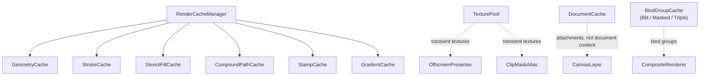

# キャッシュと無効化

> [!TIP]
> **前提ページ:** [レンダラーアーキテクチャ](/devdocs/renderer)

WebGPUレンダラーは毎フレーム、パスのテッセレーション・グラデーションのGPUバッファ生成・ブラシスタンプの計算・ステンシルフィルの頂点生成・複合パスのブーリアン演算など、多数の中間生成物を必要とする。これらを毎フレームゼロから再構築すると、フレーム時間の大部分がCPU側の計算とGPUバッファ転送に消費される。

キャッシュシステムは、要素が変更されない限りこれらの中間生成物をフレーム間で再利用し、変更があった要素だけを再構築することでレンダリング性能を維持する。設計上の中核方針は以下の3点である。

1. **Self-validating（自己検証）**: 各キャッシュエントリがフィンガープリント（geometryHash, JSON fingerprint, 数値fingerprint等）を内部に保持し、ヒット時に現在の要素データと照合する。一致しなければ自動的に再構築される。これにより、要素変更時に全キャッシュへ個別に無効化を通知するコードが不要になる。
2. **GPUリソースの安全な破棄**: `GPUBuffer` や `GPUTexture` を保持するキャッシュは、エントリの上書き・削除時にGPUリソースを `destroy()` する。in-flightのコマンドバッファとの競合を避けるため、テクスチャプール経由のリソースは遅延破棄を利用する。
3. **一元的な刈り込み**: `RenderCacheManager.onDocumentChange()` が全キャッシュを横断的に走査し、ドキュメントから削除された要素のエントリを一括削除する。

## 全体構成

`RenderCacheManager` 配下の6つのキャッシュは要素単位の中間生成物を保持する。`TexturePool`・`DocumentCache`・`ClipMaskAtlas` は用途別のGPUテクスチャの再利用とライフサイクルを管理する。`BindGroupCache` はGPUバインドグループの再生成を抑制する。

> [!NOTE]
> `TexturePool`・`DocumentCache`・`ClipMaskAtlas` の詳細は[パイプライン](/devdocs/renderer/pipeline)でも解説されている。このページではキャッシュ/無効化の観点から掘り下げる。

## RenderCacheManager

`caches/RenderCacheManager.ts` に実装。RenderOrchestratorがキャンバスターゲットごとに1インスタンスを所有し、CanvasLayer・ElementRenderer・BrushRendererに渡される。

6つのキャッシュを公開プロパティとして保持する。

| プロパティ | クラス | 用途 |
|---|---|---|
| `geometry` | `GeometryCache` | パステッセレーション結果 |
| `stroke` | `StrokeCache` | ストローク頂点データ + GPUバッファ |
| `stencilFill` | `StencilFillCache` | ステンシルフィルの頂点データ + GPUバッファ |
| `compoundPath` | `CompoundPathCache` | 複合パスのブーリアン演算結果 |
| `stamp` | `StampCache` | ブラシスタンプ生成結果 |
| `gradient` | `GradientCache` | グラデーションGPUリソース一式 |

主要メソッド:

- **`onDocumentChange(liveObjects)`** — 全キャッシュのキーを集約し、`liveObjects` に存在しない要素のエントリを一括削除する。`geometry`, `stencilFill`, `compoundPath`, `stamp` は `elementId` をキーとするため `deleteMany()` で直接削除する。`stroke` と `gradient` は `"elementId:..."` の複合キーを使用するため、キーの先頭からelement IDを抽出して照合する。`RenderStrategy.full` 時に呼び出される。
- **`clearAll()`** — 全キャッシュを完全クリアする。デバイスロスト時やターゲット破棄時に使用。

## GeometryCache

`caches/GeometryCache.ts` に実装。パスのベジエ曲線をフラットニングした結果（`flattenedSubPaths: number[][]`）をキャッシュする。

キーは `elementId`。エントリの `GeometryCacheEntry` は以下のフィールドを持つ。

| フィールド | 型 | 用途 |
|---|---|---|
| `flattenedSubPaths` | `number[][]` | サブパスごとの座標配列 |
| `worldOffsetX`, `worldOffsetY` | `number` | ワールド空間オフセット |
| `geometryHash` | `number` | セグメント数・エンドポイント・ミッドポイントから算出したハッシュ |

`geometryHash` はself-validationに使用される。呼び出し側がキャッシュ取得後にハッシュを照合し、不一致であればエントリを破棄して再計算する。GPUリソースを保持しないため、エントリの削除は単純な `Map.delete()` で完結する。

## StrokeCache

`caches/StrokeCache.ts` に実装。ストロークのテッセレーション済み頂点データとGPUバッファをキャッシュする。

キーは `"elementId:stroke[:filterUIDs]"` 形式の複合キー。フィルター構成が変わるとストロークの拡張マージンが変わるため、フィルターUIDもキーに含まれる。エントリの `StrokeCacheEntry` は以下のフィールドを持つ。

| フィールド | 型 | 用途 |
|---|---|---|
| `gpuData` | `Float32Array` | テッセレーション済み頂点データ |
| `vertexCount` | `number` | 頂点数 |
| `geometryHash` | `number` | ジオメトリ検証用ハッシュ |
| `gradientBounds` | `[number, number, number, number] \| null` | グラデーションバウンズ |
| `gpuBuffer` | `GPUBuffer \| null` | GPU頂点バッファ |
| `transformIndex` | `number` | トランスフォームインデックス |

`GPUBuffer` を保持するため、`set()` は既存エントリの `gpuBuffer?.destroy()` を呼んでから上書きする。`clear()` も全エントリのGPUバッファを破棄する。

## StampCache

`caches/StampCache.ts` に実装。ブラシストローク描画時のスタンプ生成結果（`StampBuffer`）をキャッシュする。キーは `elementId`。

`StampBuffer` は `DabEvaluator` が生成したDab列を `DabRenderer` が格納するデータ構造で、ブラシ設定のカーブ行列から計算されたバッファである。要素のブラシ設定やストロークポイントが変わらない限り、スタンプの再計算を省略できる。GPUリソースは直接保持しないため、削除時のリソース解放は不要である。

## GradientCache

`caches/GradientCache.ts` に実装。グラデーション描画に必要なGPUリソース一式をキャッシュする。

キーは `"elementId:gradientType"` 等の複合キー。エントリの `GradientCacheEntry` は以下のフィールドを持つ。

| フィールド | 型 | 用途 |
|---|---|---|
| `uniformBuffer` | `GPUBuffer` | グラデーションパラメータ |
| `stopsBuffer` | `GPUBuffer` | カラーストップ配列 |
| `vertexBuffer` | `GPUBuffer` | テッセレーション済み頂点 |
| `vertexBufferSize` | `number` | 頂点バッファサイズ |
| `bindGroup` | `GPUBindGroup` | バインドグループ |
| `vertexCount` | `number` | 頂点数 |
| `fingerprint` | `number` | 数値フィンガープリント |

`fingerprint` は `hashGradientDraw()` で算出される数値ハッシュである。グラデーションの種類（linear/radial/free）、座標パラメータ、カラーストップのoffset・RGBA値、バウンズ、`geometryHash` を `h = (h * 31 + value) | 0` の連鎖で畳み込む。浮動小数点値は `floatBits()` でビットパターンに変換してから畳み込むことで、丸め誤差による偽キャッシュミスを防いでいる。

キャッシュヒット時、`fingerprint` が一致すれば全ての `writeBuffer` 呼び出しをスキップできる。3つの `GPUBuffer` を保持するため、`set()`・`delete()`・`clear()` 時に全バッファを `destroy()` する。

## StencilFillCache

`caches/StencilFillCache.ts` に実装。ステンシルフィルの頂点データ（ファン三角形 + AAフリンジ）をキャッシュする。

キーは `elementId`。エントリの `StencilFillCacheEntry` は以下のフィールドを持つ。

| フィールド | 型 | 用途 |
|---|---|---|
| `fanBuffer` | `GPUBuffer` | ファン三角形頂点 |
| `fanVertexCount` | `number` | ファン頂点数 |
| `fringeBuffer` | `GPUBuffer \| null` | AAフリンジ頂点 |
| `fringeData` | `Float32Array` | フリンジCPUデータ |
| `fringeVertexCount` | `number` | フリンジ頂点数 |
| `bounds` | `[number, number, number, number]` | バウンズ |
| `isSolidFill` | `boolean` | ソリッドフィルフラグ |
| `transformIndex` | `number` | トランスフォームインデックス |
| `geometryHash` | `number` | ジオメトリ検証用ハッシュ |

`transformIndex` と `geometryHash` の組でself-validationを行う。`fanBuffer` と `fringeBuffer` のGPUリソースは `set()`・`delete()`・`clear()` 時に破棄される。

## CompoundPathCache

`caches/CompoundPathCache.ts` に実装。複合パス（CompoundPath）のブーリアン演算結果をキャッシュする。

他のキャッシュとは異なり、`resolve()` メソッドがキャッシュの取得と計算を一体化したインターフェースを提供する。`resolve(compoundPath, pathMap)` はフィンガープリントを照合し、ヒットすればキャッシュされた `CubicBezierSegment[]` を返し、ミスすれば `computeBooleanOperation()` を実行して結果をキャッシュする。

フィンガープリントは `createFingerprint()` で生成されるJSON文字列である。各ソースパスの `id`, `op`, `filters`, `transform`, `segments` をJSON.stringifyした結果で、パスの形状やトランスフォームが変わるとフィンガープリントが変化する。数値ハッシュではなくJSON文字列を使用するのは、ソースパスの構造が複雑で衝突リスクを排除する必要があるためと考えられる。

## BindGroupCache

`caches/BindGroupCache.ts` に実装。GPUバインドグループの再生成を抑制するためのプールインデックスベースのキャッシュ群である。3つのクラスを提供する。

| クラス | キー | 用途 |
|---|---|---|
| `BlitBindGroupCache` | pool index + `GPUTexture` 1枚 | 単一テクスチャのblitパス |
| `MaskedBlitBindGroupCache` | pool index + `GPUTexture` 2枚 (source + secondary) | マスク付きblitパス |
| `TripleTextureBindGroupCache` | pool index + `GPUTexture` 3枚 (source + dest + base) | CompositeRendererのブレンドモード合成 |

いずれもスロット配列構造で、`getOrCreate(index, texture(s), create)` がスロットのテクスチャ同一性（`===`）をチェックし、一致すればキャッシュ済みバインドグループを返す。テクスチャが変わった場合のみ `create()` コールバックで新規生成する。`GPUBindGroup` はイミュータブルなオブジェクトであるため、同じテクスチャに対して同一のバインドグループを再利用しても安全である。

## TexturePool

`pipeline/TexturePool.ts` に実装。オフスクリーンレンダーパスで使用される一時GPUテクスチャをフレーム間で再利用するプールである。

### 量子化

リクエストされたテクスチャサイズは `SIZE_QUANTUM`（128px）の倍数に切り上げられ、`"${qw}x${qh}x${format}x${sampleCount}x${usage}"` をバケットキーとして使用する。ズーム中にサイズが300→301→302pxと微小に変化しても、すべて384pxバケットにマッピングされるため同一テクスチャが再利用される。`acquire()` で確保したテクスチャは量子化済みサイズで割り当てられるため、同一バケット内のリクエストは完全一致する。

### LRU eviction

available / idle状態のプールテクスチャについて推定した合計メモリが `MAX_POOL_BYTES`（384 MiB）を超えた場合、`resetFrame()` 時に `evictUntilUnderBudget()` が起動する。Mapのbucket挿入順に走査し、各bucketの先頭から `destroy()` して予算内に収める。全bucket横断の厳密なLRUではない。空になったbucketはMapから削除される。この予算はプールへ返却済みテクスチャの推定値であり、使用中のテクスチャや他のGPUリソースを含む総GPUメモリ上限ではない。

evictionは個々の `release()` ではなく `resetFrame()` に集約される。現行実装は `queue.onSubmittedWorkDone()` によるGPU完了確認を行わず、次フレーム境界でidle textureを破棄する。

### ライフサイクル

1. フレーム開始: `resetFrame()` — 予算超過時にeviction実行
2. フレーム中: `acquire()` — プールから取得 or 新規生成、`release()` — プールに返却
3. ターゲット破棄: `destroy()` — プール内・使用中の全テクスチャを破棄

## DocumentCache

`pipeline/DocumentCache.ts` に実装。ステンシル・composite・prebuffer・final-blit・backdrop-mask用テクスチャの遅延生成と再利用を管理する。TexturePoolとは異なり、フレーム間で永続的に保持されるテクスチャが対象である。描画済みドキュメント内容やタイルを保持するキャッシュではない。

3つの `ensure*` メソッドを提供する。

| メソッド | フォーマット | 用途 |
|---|---|---|
| `ensureStencilTexture(w, h)` | `depth24plus-stencil8` (MSAA) | ステンシルフィルの深度・ステンシルアタッチメント |
| `ensurePreviewOverlayTexture(w, h)` | canvasFormat | プレビューパスのオーバーレイ描画先 |
| `ensureCompositeTextures(w, h)` | canvasFormat | 合成パスの3枚テクスチャ (capture, layer, canvasBase) |

いずれも「現在のサイズと一致するなら何もしない」ガード条件を先頭に持つ。サイズが変わった場合にのみ古いテクスチャを `deferDestroy()` で遅延破棄し、新しいテクスチャを生成する。キャンバスリサイズ時（ResizeObserverのコールバック）にサイズ変更が発生する。

## ClipMaskAtlas

`pipeline/ClipMaskAtlas.ts` に実装。クリップグループのマスクパスを事前レンダリングし、メインレンダーパスでインラインマスキングに使用するための個別 `texture_2d` テクスチャを管理する。

### レンダリングフロー

`preRender(encoder, clipGroups, elementsMap)` がメインレンダーパス開始前に呼び出される。

1. `clipGroups` を `clipPathId` で重複排除し、同一クリップパスを共有するグループのバウンズを和集合にマージする
2. 各マスクについて `computeCoverage()` でテクスチャサイズを決定する。グループバウンズ * zoomがGPU最大テクスチャサイズに収まる場合はそのまま使用し、超える場合はビューポートにクリップした領域（パディング付き）を使用する
3. `computeMaskFingerprint()` でフィンガープリント文字列を生成し、`maskCache` と照合する。一致すればレンダリングをスキップしてキャッシュ済みエントリを再利用する
4. ミスの場合、`renderMask()` で専用レンダーパスを起動し、クリップパスを白マスクとしてテクスチャに描画する。ステンシルテクスチャは `TexturePool` から借りて返却する
5. 完了後、`releaseStaleEntries()` でアクティブでないクリップパスのキャッシュを遅延破棄する

### キャッシュ無効化

- **フィンガープリント不一致**: テクスチャサイズ、zoom、カバレッジバウンズの変化で自動的に再レンダリングされる
- **`invalidateAll()`**: ドキュメント変更時に全マスクキャッシュを破棄する
- **`releaseStaleEntries()`**: フレームのクリップグループリストに含まれないマスクを遅延破棄する

パン操作時のマスク再生成を抑制するため、ビューポート中心を `padX`/`padY` グリッドにスナップしている。グリッド線を越えない限りフィンガープリントは変化せず、マスクの再レンダリングが発生しない。

## キャッシュ無効化戦略

キャッシュの無効化は3つのレイヤーで行われる。

### 1. Self-validating（ヒット時検証）

各キャッシュエントリが保持するフィンガープリントを、描画時に現在の要素データと照合する。明示的な無効化通知を必要とせず、キャッシュの種類を増やしても結合度が増加しない。

| キャッシュ | フィンガープリントの種類 |
|---|---|
| GeometryCache | `geometryHash`（数値: セグメント数 + エンドポイント + ミッドポイント） |
| StrokeCache | `geometryHash`（数値） |
| StencilFillCache | `transformIndex` + `geometryHash`（数値ペア） |
| CompoundPathCache | JSON文字列（ソースパスのid, op, filters, transform, segments） |
| GradientCache | `fingerprint`（数値: `hashGradientDraw()` による畳み込みハッシュ） |
| ClipMaskAtlas | 文字列（clipPathId, テクスチャサイズ, zoom, カバレッジバウンズ） |

### 2. onDocumentChange（削除要素の刈り込み）

`RenderCacheManager.onDocumentChange(liveObjects)` は `RenderStrategy.full` 時に呼び出される。全キャッシュのキーを走査して `liveObjects` に存在しない要素のエントリを一括削除する。これはself-validatingでは検知できない「要素がドキュメントから削除された」ケースをカバーする。

### 3. 全クリア

`RenderCacheManager.clearAll()` はデバイスロスト・ターゲット破棄時に全キャッシュを消去する。`ClipMaskAtlas.invalidateAll()` と `TexturePool.destroy()` もそれぞれのスコープで全リソースを破棄する。

## 設計上の判断

**なぜ明示的な無効化イベントではなくself-validatingか。**
要素の編集パスは多岐にわたる（ユーザー操作、Yjs同期、アンドゥ/リドゥ、アニメーション等）。これら全てのパスからキャッシュ無効化を正しく配線するのは困難であり、漏れが発生しやすい。self-validating方式では、描画時に最新データとの照合が必ず行われるため、無効化の漏れが原理的に発生しない。代償としてヒット時のハッシュ比較コストが加わるが、数値比較は数ナノ秒程度であり、テッセレーションやGPUバッファ転送のコスト（数百マイクロ秒〜数ミリ秒）に比べて無視できる。

**なぜCompoundPathCacheだけJSON文字列フィンガープリントか。**
CompoundPathのソースは複数パスの `segments`・`filters`・`transform` の組み合わせであり、単一の数値ハッシュでは衝突リスクが無視できない。JSON.stringifyによる完全比較はハッシュ計算よりコストが高いが、複合パスの数は一般的に少ないため実用上問題にならない。

**なぜTexturePoolのevictionはrelease時ではなくresetFrame時か。**
個々の `release()` で予算判定と破棄を行わず、フレーム境界でavailable textureをまとめて刈り込むためである。現行実装は `queue.onSubmittedWorkDone()` によるGPU完了確認を行わないため、前フレームのコマンド完了を保証するfenceとしては扱えない。

**なぜBindGroupCacheはテクスチャの同一性（`===`）で判定するか。**
`GPUTexture` オブジェクトはイミュータブルではないが、TexturePool経由で管理される場合、同一オブジェクトは同一のGPUリソースを指す。`===` による参照比較は最も安価な判定手段であり、テクスチャ内容の比較は不要かつ不可能である（GPUテクスチャの内容はCPUから直接読めない）。

> [!TIP]
> **次に読むページ:** [クリッピング方式](/devdocs/renderer/clipping)
