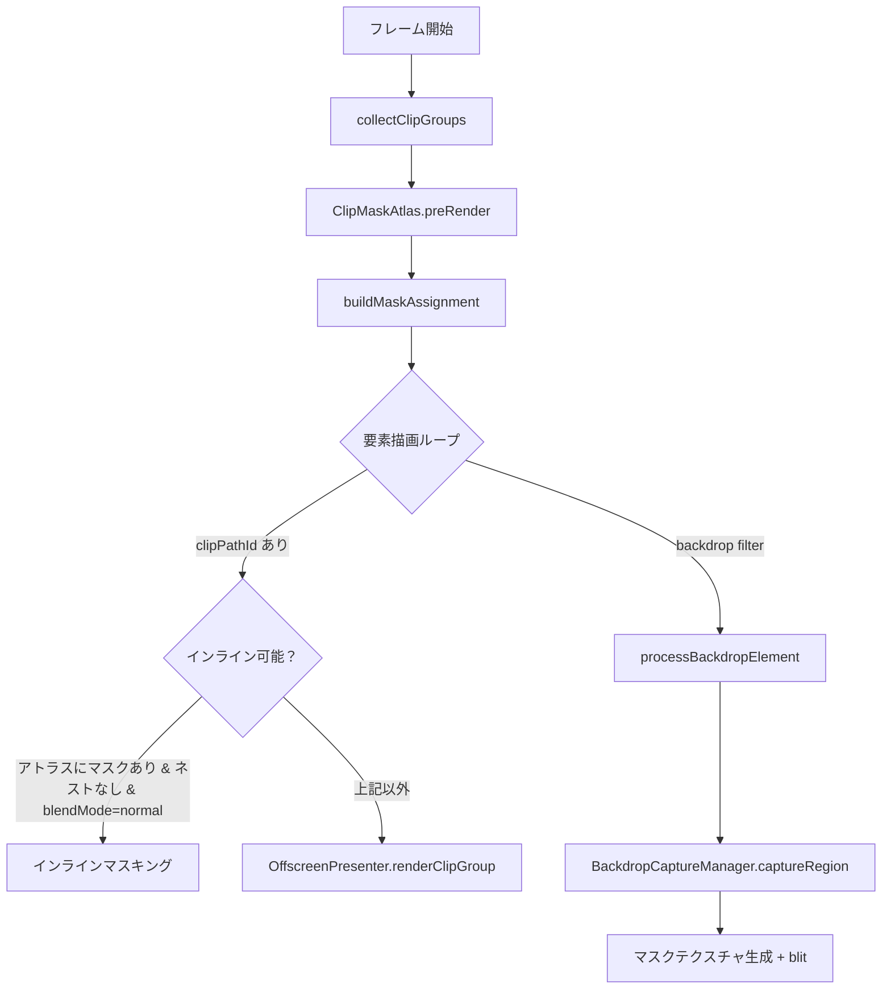
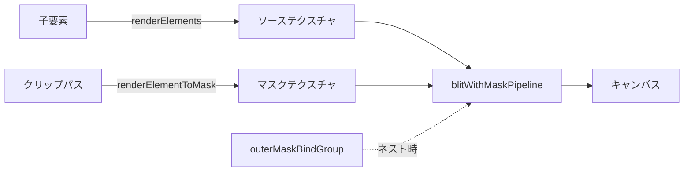

# クリッピング方式

> [!TIP]
> **前提ページ:** [エレメントレンダリング](/devdocs/renderer/elements)

クリッピング（clip masking）とは、あるパスの形状を使って他の描画要素を切り抜く機能である。たとえばキャラクターの体のシルエットで影レイヤーを切り抜けば、影が体の外にはみ出さない。お絵描きソフトにおいてクリッピングは、レイヤー間の表現を制御する基本機能の一つであり、ほぼすべての作品制作で使われる。

Paplicoでは、パフォーマンスと表現力のバランスを取るために3つの手法を使い分けている。単純なケースはGPU負荷の低いインラインマスキング（メイン描画パス内でマスクテクスチャを参照する方式で、追加のレンダーパスが不要）で処理し、ネストや特殊ブレンドモードが絡むケースではオフスクリーンフォールバック（メインパスでは対応できないケースで一時テクスチャに迂回する方式）に切り替え、バックドロップフィルター（要素の背後にあるキャンバス内容にフィルター効果を適用する機能、CSSの`backdrop-filter`に類似）には専用のキャプチャパイプラインを用意している。1つの手法では足りない理由は、単純なマスク参照だけでは複数マスクの交差やブレンドモード合成を表現できず、かといって全てをオフスクリーンで処理すると不要なGPUコストが発生するためである。

このページでは、被覆率によるパス塗りつぶしの基礎から、3つのクリッピング手法それぞれの仕組みと使い分けの条件までを解説する。

### 設計意図

クリッピングを3つの手法（インラインマスキング・オフスクリーンフォールバック・バックドロップキャプチャ）に分ける理由は、パフォーマンスと表現力のトレードオフを段階的に解決するためである。大多数のクリップグループ（`clipPathId` を持つGroup要素で、子要素をクリップパスの形で切り抜く）はインラインマスキング（追加のレンダーパス不要）で処理でき、ネストや特殊ブレンドモードなど少数の複雑ケースだけがコストの高いオフスクリーンパスに切り替わる。

## 概要

クリッピングに関与するコンポーネントと、描画パス内での判定フローを以下に示す。



**インライン可能の条件**（`CanvasLayer.renderElements` 内）:

- `ClipMaskAtlas` にマスクが存在する
- 別のクリップグループの子要素でない（`nestedClipGroupIds` に含まれない）
- `blendMode` が `"normal"` または未指定

条件を満たさない場合は `OffscreenPresenter.renderClipGroup` によるオフスクリーンフォールバックが使用される。

## 被覆率による塗りつぶし

クリッピングの前提として、パスの塗りつぶし（fill）がどのように実装されているかを理解する必要がある。

単純な凸形状であれば三角形分割（triangulation）で塗りつぶせるが、自己交差パスやコンパウンドパスの穴（フォントグリフの「O」の内側の空洞など）を安定して処理するのは難しい。Paplicoでは CPU が各ピクセルの**被覆率**を非ゼロ巻き数の面積積分で求め、GPU はそれを alpha として掛けるだけにしている。三角形分割を前提にせず、複合パスや自己交差を含むケースでも塗りつぶし判定が厳密で、輪郭の AA も被覆率そのものになる。仕組みの詳細は[パス描画フロー](/devdocs/renderer/path-rendering)を参照。

マスクの生成も同じ経路を使う。マスク用のパスは白い塗りとして、マスクテクスチャのテクセル空間で strip にラスタライズされる。ステンシルバッファは使わないので、マスクパスにも要素パスにも深度・ステンシルアタッチメントは無い。

以降のセクションでは、この塗りつぶしを使ってクリップマスクを生成・適用する3つの手法を順に解説する。

## インラインマスキング

ここまで見てきた3つの手法のうち、最も頻繁に使われるのがインラインマスキングである。クリップグループの最も効率的なパスであり、メインレンダーパス内でフラグメントシェーダー（GPU上でピクセルごとの色計算を行うプログラム）がマスクテクスチャを直接サンプリングする。

> [!TIP]
> インラインマスキングは追加のレンダーパスやテクスチャ確保が不要で、最もGPU負荷が低い手法である。単純なクリップグループ（ネストなし・blendMode が normal）はすべてこのパスで処理される。

### ClipMaskAtlas

インラインマスキングを成立させるには、クリップパスの形状をあらかじめテクスチャに焼き込んでおく必要がある。`ClipMaskAtlas` がこの事前レンダリングを担当する。

メイン描画ループの中でオフスクリーンパスを都度生成すると、レンダーパスの中断・再開が発生しGPU効率が低下する。`ClipMaskAtlas` はフレーム開始時にドキュメント内の全クリップグループを一括で走査し、各クリップパスを個別の `texture_2d` に白マスクとして事前レンダリングすることで、メインループ中はマスク参照の切り替えだけで処理できるようにしている。

#### 処理フロー

以下の3ステップがフレーム描画の冒頭で実行される。

1. **`collectClipGroups`**: ドキュメント内の `clipPathId` を持つ全 Group を収集し、ワールド座標のバウンディングボックスを算出する。これにより、どのクリップグループが存在し、それぞれがどの領域をカバーするかが確定する。
2. **`preRender`**: `clipPathId` で重複排除し、各マスクのカバレッジ領域を計算してレンダリングする。同じクリップパスを複数のグループが参照していても、レンダリングは一度だけ行われる。
3. **`buildMaskAssignment`**: 各クリップグループの子要素にマスクエントリを割り当てる。これにより、メイン描画ループで各要素がどのマスクテクスチャを参照すべきかが決まる。

#### マスクテクスチャの生成

各マスクは `renderMask` メソッドで生成される。

- テクスチャサイズはグループバウンズ `*` ビューポートズームで決定する。GPU の `maxTextureDimension2D` を超える場合はビューポートクリッピングでカバレッジを制限する。
- クリップパス形状を白い塗りとして、マスクテクスチャのテクセル空間で strip にラスタライズしてレンダリングする。
- 結果は BG3（Bind Group 3）として格納され、`maskBoundsMin/Max` がワールド座標からテクスチャ UV `[0,1]` へのマッピングを定義する。

#### キャッシュ

マスクはフィンガープリント（`clipPathId`, テクスチャサイズ, ズーム, カバレッジバウンズ）でキャッシュされる。フレーム間でフィンガープリントが変化しない限り再レンダリングされない。ドキュメント変更時は `invalidateAll` で全キャッシュが破棄される。

マスクをフレーム開始時に一括事前レンダリングする理由は、メイン描画ループ中にオフスクリーンパスの生成・切り替えを避けるためである。事前レンダリングされたマスクテクスチャは BG3 にバインドして参照できるため、レンダーパスの中断を避けやすい。

#### GPU リソースレイアウト

`ElementTransform` ストレージバッファ内の各要素に以下のマスク情報が格納される:

| フィールド | 型 | 説明 |
|---|---|---|
| `maskIndex` | `u32` | マスクインデックス（`0xFFFFFFFF` = マスクなし） |
| `maskBoundsMin` | `vec2f` | マスクテクスチャがカバーするワールド空間最小座標 |
| `maskBoundsMax` | `vec2f` | マスクテクスチャがカバーするワールド空間最大座標 |

### シェーダー内の処理

各シェーダー（`unified.wgsl.ts`, `brushDab.wgsl.ts`）は `applyClipMask` 関数を持つ。この関数は、描画対象のピクセルのワールド座標をマスクテクスチャのUV座標に変換し、マスク値を乗算することで、マスク外のピクセルを透明にする。

```wgsl
fn applyClipMask(
    premultiplied: vec4f,
    maskIdx: u32,
    boundsMin: vec2f,
    boundsMax: vec2f,
    worldPos: vec2f
) -> vec4f {
    if (maskIdx == 0xFFFFFFFFu) {
        return premultiplied;  // マスクなし
    }
    let rawUV = (worldPos - boundsMin) / (boundsMax - boundsMin);
    let maskUV = vec2f(rawUV.x, 1.0 - rawUV.y);  // Y軸反転
    let clampedUV = clamp(maskUV, vec2f(0.0), vec2f(1.0));
    let maskValue = textureSampleLevel(
        maskAtlas, maskSampler, clampedUV, 0.0
    ).r;
    let inBounds = step(0.0, maskUV.x) * step(maskUV.x, 1.0)
                 * step(0.0, maskUV.y) * step(maskUV.y, 1.0);
    return premultiplied * maskValue * inBounds;
}
```

**動作**:
- `maskIndex` が `0xFFFFFFFF`（u32の最大値、「マスクなし」を表すセンチネル値）ならマスクなしとして元の色をそのまま返す
- ワールド座標を `maskBoundsMin/Max` で正規化してテクスチャ UV を算出
- UV 範囲外のフラグメントは `inBounds` によってゼロに落とされる
- マスクテクスチャの R チャンネル値を乗算してクリッピング

### バインドグループの切り替え

`CanvasLayer.renderElements` は要素ごとに `elementMaskEntries` から `MaskEntry.bindGroup` を取得し、BG3 にセットする。マスクが割り当てられていない要素には `dummyMaskBindGroup`（1x1 白テクスチャ）が使われる。

インラインマスキングをデフォルト手法にする理由は、追加のレンダーパスやテクスチャ確保が不要で最もGPU負荷が低いためである。マスクテクスチャのサンプリングはフラグメントシェーダー内で完結し、レンダーパスの中断・再開が発生しない。ただし1要素あたり1つのマスクインデックスしか参照できない制約があるため、ネストされたクリップグループでは複数マスクの交差を表現できず、オフスクリーンフォールバックが必要になる。

### マスクシェーダー（`mask.wgsl.ts`）

クリップパス形状をマスクテクスチャにレンダリングする専用シェーダー。フラグメントシェーダーは常に `vec4f(1.0, 1.0, 1.0, 1.0)` を出力し、形状内部を白で塗りつぶす。

## オフスクリーンフォールバック

インラインマスキングは高効率だが、1要素あたり1つのマスクインデックスしか持てないという構造的な制約がある。具体的には、以下のケースでインラインマスキングでは対応できない。

- **ネストされたクリップグループ**: たとえばキャラクターの体で切り抜いたグループの中に、さらに顔の形で切り抜いたグループがある場合、親クリップと子クリップの交差（intersection）を計算する必要がある。1つのマスクインデックスでは2つのマスクの積を表現できない。
- **非 normal ブレンドモード**: `multiply` や `screen` などのブレンドモードは、要素をまずオフスクリーンテクスチャに描画してから合成する必要がある。メインパス内のインラインサンプリングではブレンドモード合成を挟む余地がない。

これらのケースでは `OffscreenPresenter` を経由したオフスクリーンレンダリングに切り替わる。

### `renderClipGroup` の3パス処理

1. **子要素のオフスクリーンレンダリング**: `renderElementsToOffscreenTexture` で全子要素をオフスクリーンテクスチャに描画する。
2. **クリップパスのマスク生成**: `createOffscreenPass` + `renderElementToMask` でクリップパス形状を別のオフスクリーンテクスチャにマスクとして描画する。
3. **マスク付き blit**: `blitWithMaskPipeline` でソーステクスチャ `*` マスクテクスチャをキャンバスに合成する。ネストされた場合は `outerMaskBindGroup` で親マスクも乗算される。



### `renderClipGroupToTexture`

`blendMode` が normal でないクリップグループでは、キャンバスへの直接 blit ではなく、最終結果を3つ目のオフスクリーンテクスチャに書き出す。呼び出し元がブレンドモード合成を行う。

### オフスクリーンパスの共通処理

`createOffscreenPass` は以下を行う:

- ビューポートカリング（完全に画面外の要素はスキップ）
- `TexturePool` からカラーテクスチャを取得
- カバレッジ領域中心にビューポートを設定（`UniformScope.acquire`）
- テクスチャプールの量子化マージンを `blitUvRect` で補正

> [!NOTE]
> オフスクリーンフォールバックはインラインマスキングに比べてテクスチャ確保・レンダーパス切り替えのコストが発生する。そのため `CanvasLayer.renderElements` はまずインライン条件を判定し、条件を満たさない場合にのみオフスクリーンへ切り替える。

## BackdropCaptureManager

ここまでの2つの手法はいずれも「要素の上にマスクを適用する」方向の処理だが、バックドロップフィルターは方向が逆である。要素の**背後**にあるキャンバス内容に対してフィルター効果を適用し、その結果を要素形状で切り抜いて描画する。

たとえば FrostGlass（すりガラス）フィルターでは、ボタンやパネルの背景をぼかして半透明に表示する。これは CSS の `backdrop-filter: blur()` と同等の表現であり、UIオーバーレイの視認性向上やデザイン表現に活用される。

### 処理フロー（`processBackdropElement`）

1. **キャプチャ**: `BackdropCaptureManager.captureRegion` がキャンバステクスチャからワールド座標領域をスクリーン空間で切り出し、コピーする。
   - 回転対応: ワールド座標の4隅をスクリーン空間に変換し、AABB（Axis-Aligned Bounding Box: 軸に平行な矩形境界）を算出する。
   - キャンバス外にはみ出す部分は透明のままになる。
   - `filters` が指定されていれば `FilterRenderer.applyFilters` をその場で適用する。
2. **マスク生成**: キャンバスサイズのマスクテクスチャを生成し、`renderElementToMask` で要素形状を白マスクとして描画する。
3. **マスク付き blit**: `blitBackdropWithMaskPipeline` でフィルター済みテクスチャ `*` マスクをキャンバスに合成する。

`captureRegion` が返す `screenUV` は、回転ビューポートでも正しい UV マッピングを維持するためにスクリーン空間の正規化座標として格納される。

バックドロップキャプチャをスクリーン空間で行う理由は、ビューポート回転に対応するためである。ワールド座標の矩形領域をキャプチャしようとすると、回転時にキャンバス上の対応領域が軸に沿わないため、正確な矩形コピーができない。スクリーン空間（GPU出力テクスチャの座標系）で AABB を算出してコピーすることで、任意の回転角度でも正しいキャプチャを保ちやすい。

### バックドロップマスクシェーダー（`backdropMask.wgsl.ts`）

`FilterRenderer` がバックドロップフィルターの出力を要素形状で切り抜くためのシェーダー。
`filteredTexture` と `maskTexture` をサンプリングし、`mask.a >= 0.01` のピクセルのみフィルター結果を出力する。

> [!TIP]
> **次に読むページ:** [エレメントレンダリング](/devdocs/renderer/elements)
