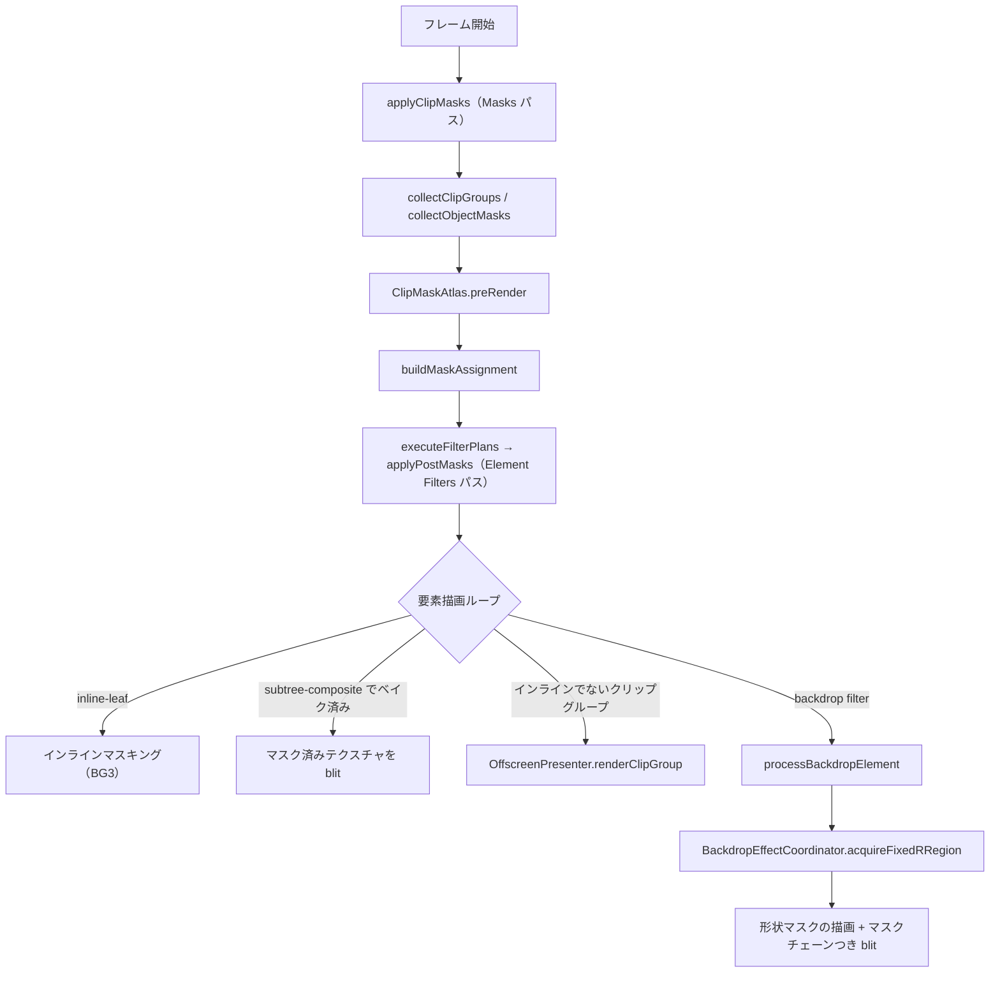
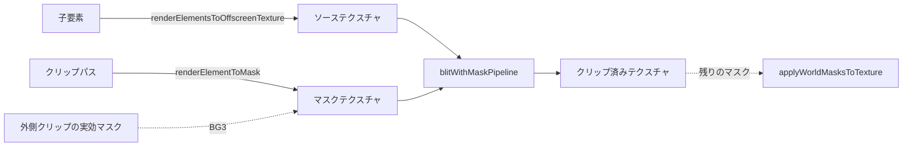

# クリッピング方式

> [!TIP]
> **前提ページ:** [パイプライン](/devdocs/renderer/pipeline)、[キャッシュと無効化](/devdocs/renderer/caches)

クリッピング（clip masking）とは、あるパスの形状を使って他の描画要素を切り抜く機能である。たとえばキャラクターの体のシルエットで影レイヤーを切り抜けば、影が体の外にはみ出さない。お絵描きソフトにおいてクリッピングは、レイヤー間の表現を制御する基本機能の一つであり、ほぼすべての作品制作で使われる。

Paplicoがマスクとして扱うものは2種類ある。1つはクリップグループ（`clipPathId` を持つGroup要素で、子要素をクリップパスの形で切り抜く）である。もう1つはオブジェクトマスク（任意の要素の `ArtObject.mask` に指定した要素群の、輝度と不透明度で切り抜く）である。どちらも同じマスクテクスチャの仕組みに乗る。

マスクの掛け方は、パフォーマンスと表現力のバランスを取るために3つの手法を使い分けている。単純なケースはGPU負荷の低いインラインマスキング（メイン描画パス内でマスクテクスチャを参照する方式で、追加のレンダーパスが不要）で処理する。要素をテクスチャにベイクしてから合成するケースは、ベイク結果にマスクを後掛けする。バックドロップフィルター（要素の背後にあるキャンバス内容にフィルター効果を適用する機能、CSSの`backdrop-filter`に類似）には専用のキャプチャパイプラインを用意している。1つの手法では足りない理由は、フラグメント単位のマスク参照では複数の描画をまとめて1回だけ切り抜くことができず、かといって全てをオフスクリーンで処理すると不要なGPUコストが発生するためである。

このページでは、被覆率によるパス塗りつぶしの基礎から、マスクテクスチャの作り方、3つの手法それぞれの仕組みと使い分けの条件までを解説する。

### 設計意図

マスクの掛け方を決めるのは、要素ごとの2つの計画である。グループの合成計画（`GroupCompositionPlan`）は、グループを1枚のレイヤーとしてまとめる必要があるかを表す。マスクの適用計画（`MaskApplicationPlan`）は、マスクを描画時にインラインで掛けるか、ベイクした結果に掛けるかを表す。どちらも `pipeline/MaskApplicationPlan.ts` の純粋関数が、要素の事実（マスクの枚数、ポストフィルターの有無、テクスチャ経由で描かれるか、など）だけから決める。描画ループはこの計画に従って経路を選ぶ。

## 概要

クリッピングに関与するコンポーネントと、フレーム内での流れを以下に示す。



## 被覆率による塗りつぶし

クリッピングの前提として、パスの塗りつぶし（fill）がどのように実装されているかを理解する必要がある。

単純な凸形状であれば三角形分割（triangulation）で塗りつぶせるが、自己交差パスやコンパウンドパスの穴（フォントグリフの「O」の内側の空洞など）を安定して処理するのは難しい。Paplicoでは CPU が各ピクセルの**被覆率**を非ゼロ巻き数の面積積分で求め、GPU はそれを alpha として掛けるだけにしている。三角形分割を前提にせず、複合パスや自己交差を含むケースでも塗りつぶし判定が厳密で、輪郭の AA も被覆率そのものになる。仕組みの詳細は[パス描画フロー](/devdocs/renderer/path-rendering)を参照。

マスクの生成も同じ経路を使う。クリップパスは白い塗りとして、マスクテクスチャのテクセル空間で strip にラスタライズされる。ステンシルバッファは使わないので、マスクパスにも要素パスにも深度・ステンシルアタッチメントは無い。

## マスクの事前パス（`applyClipMasks`）

メイン描画ループの中でマスク用のオフスクリーンパスを都度生成すると、レンダーパスの中断・再開が発生しGPU効率が低下する。そこで `CanvasLayer.applyClipMasks` が、フレームの描画に先立って必要なマスクをすべて用意し、どの要素にどう掛けるかを決める。このメソッドは `FrameGraph` の "Masks" パスとして走る。パターンとブラシの def のラスタライズより後、要素フィルターのベイクより前である。オブジェクトマスクは中身を実際の見た目で描くので、パターンのテクスチャが先に要る。フィルターのベイクはマスクの割り当てを読むので、マスクが先に要る。

処理は次の順で進む。

1. **グループの合成計画**: 全グループについて `planGroupComposition` を求める。自前のマスク、クリップ、不透明度、フィルターのいずれかを持つグループは `isolated` になる。バックドロップに依存するグループは `backdrop-dependent` になる。どれも持たないグループは `passthrough` になる。
2. **`collectClipGroups`**: `clipPathId` を持つ全 Group を収集し、ワールド座標のバウンディングボックスを算出する。カリングの基準はビューポートではなく、フレームの描画領域である。ビューポート駆動のフレームは余白つきの prebuf 全体を描くので、余白にある要素のマスクも要る。カリングには、グループフィルターの拡張マージンと 3D solid の投影範囲を足した範囲を使う。
3. **`collectObjectMasks`**: 有効な `ArtObject.mask` を持ち、ソース要素が1つ以上解決できる要素を収集する。ソースが1つも解決できないマスクは収集しない。その要素はマスクなしで描かれる。
4. **メッシュワープ内のクリップグループ**: ワープした一時要素はドキュメントの要素ではなく、トランスフォームのスロットを持たない。`reserveAuxiliaryMaskSlots` でスロットを確保し、ワープ済みのクリップパスからマスクを作る。
5. **マスクの中身のフィルター**: オブジェクトマスクの中身はレイヤーに属さないので、フレームのフィルター計画に入らない。`buildFilterPlansForElements` で計画を作り、先にベイクする。
6. **`ClipMaskAtlas.preRender`**: マスクテクスチャを描く。詳細は次節を参照。
7. **`buildMaskAssignment`**: 各要素のマスクの適用計画を決め、インラインで掛ける要素とマスクの対応（`inlineMaskEntries`）を作る。
8. **`writeMaskInfoOnly`**: トランスフォームバッファのマスクのフィールドだけを書き換える。

エクスポートや選択要素のコピーでは、対象のサブツリーが所有するマスクだけを残す。対象がグループの中にある場合、祖先グループとそのクリップパス・マスクのソースは描画対象に残る。祖先の他の子は描画時に飛ばす。

## マスクテクスチャ（`ClipMaskAtlas`）

`ClipMaskAtlas.preRender(encoder, requests, elementsMap, drawRegion, sourceFilteredTextures)` が、要求されたマスクをテクスチャに描く。要求（`MaskRenderRequest`）は、キャッシュキー、ソース要素、覆うべきワールド範囲、描画モード、親マスクのキーを持つ。

### 2つの描画モード

| モード | 用途 | 描き方 |
|---|---|---|
| `silhouette` | クリップパス | `ElementRenderer.renderElementToMask()` が、要素に白のソリッド Fill を与えて描く。形の内外だけが要るためである |
| `appearance` | オブジェクトマスク | ソース要素を実際の見た目で描く。グラデーションや部分的な不透明度が、マスクの輝度として残る |

マスクテクスチャはプリマルチプライドの色を保持する。読む側は輝度をマスク値にする。白シルエットではプリマルチプライドの RGB が alpha に等しいので、輝度は alpha に一致する。1つの読み方で両方のモードを扱える。

`appearance` モードはブレンドの背景を渡さずに描く。マスクの中身どうしのブレンドモードは無視される。マスクに要るのは形の被覆であり、下のドキュメントとどう混ざるかではないためである。

### ネストしたクリップの実効マスク

クリップグループのマスクキーは `clipMaskKey(clipPathId, parentKey)` で作る。外側にクリップグループがあれば、その実効マスクのキーを `|` で連結する。オブジェクトマスクのキーは `objectMaskKey(ownerId)` である。クリップパスとマスクの所有者がたまたま同じ要素 ID でも、テクスチャは分かれる。

ネストしたクリップグループのマスクは、親の実効マスクをサンプリングしながら描く。ソース要素のトランスフォームスロットに親マスクを書き込み、通常のインラインマスキングの経路で親マスクを掛ける。結果のテクスチャは、外側の全クリップとの交差を保持する。このため、ネストの内側の要素が参照するマスクは1枚で済む。親を先に描く必要があるので、`preRender` はキーの `|` の数でネストの深さを数え、浅い順に処理する。

### サイズの決定

`computeMaskCoverage()` がマスクごとにテクスチャの範囲とサイズを決める。

- カバレッジは、要求された範囲とフレームの描画領域（`drawRegion`）の交差である。交差が空のマスクは作らない。
- 解像度はビューポートの zoom である。マスクは画面に見える大きさでサンプリングされるためである。
- GPU の `maxTextureDimension2D` を超える場合は、収まるところまで実効ズームを下げる。

### 共有アトラスと単独テクスチャ

一辺が256px以下のマスクは、共有アトラス（4096×4096 の `texture_2d`）の矩形に入る。矩形の割り当ては `MaskAtlasAllocator` が行い、矩形の位置とサイズはアトラス記述子の storage buffer に入る。それより大きいマスクと、アトラスに空きが無いときのマスクは、専用のテクスチャになる。

アトラスに入るマスクの描き方は2通りある。

- ネストを持たず、他のマスクの親でもない `silhouette` は、`renderSilhouetteAtlasBatch` が1つのレンダーパスでまとめてアトラスへ直接描く。マスクごとに viewport と scissor を矩形に合わせる。
- それ以外は、`TexturePool.acquireExact()` で確保したステージングテクスチャに描いてから、アトラスの矩形へコピーする。親マスクをサンプリングしながら同じアトラスへ描くことはできないためである。

マスクのエントリ（`MaskEntry`）は、BG3 の bind group、マスクが覆うワールド範囲、アトラス内の矩形、フィンガープリントを持つ。BG3 は次の3つをバインドする。

| binding | 内容 |
|---|---|
| 0 | マスクテクスチャ（共有アトラスまたは専用テクスチャ） |
| 1 | サンプラー |
| 2 | アトラス記述子の storage buffer（`maskRects`） |

### キャッシュと無効化

マスクはフィンガープリントでキャッシュされる。フィンガープリントは、マスクキー、ソース要素、テクスチャサイズ、実効ズーム、カバレッジバウンズからなる。`appearance` モードではソースごとのペイントハッシュも入る。親マスクがある場合は親のフィンガープリントが付く。フレーム間でフィンガープリントが変化しない限り再レンダリングされない。

無効化の経路は3つある。

- **`invalidateChanged(changedIds)`**: 変更要素 ID が追跡できているフレームで呼ばれる。エントリの `dependencyIds` に変更要素を含むマスクだけを破棄する。`dependencyIds` は、ソース要素の描画クロージャと親マスクの依存である。白シルエットのマスクはソースのジオメトリが変わってもフィンガープリントが変わらないので、この経路が要る。変更の無いマスクは bind group の同一性を保つ。マスクつきベイクのキャッシュはこの同一性をハッシュに含むので、無関係な編集でベイクをやり直さずに済む。
- **`invalidateAll()`**: 変更要素 ID が追跡できない `full` / `fullTransformOnly` のフレームで、全マスクを破棄する。
- **`releaseStaleEntries()`**: そのフレームで要求されなかったマスクを遅延破棄する。

マスクをフレーム開始時に一括事前レンダリングする理由は、メイン描画ループ中にオフスクリーンパスの生成・切り替えを避けるためである。事前レンダリングされたマスクテクスチャは BG3 にバインドして参照できるため、レンダーパスの中断を避けやすい。

## マスクの適用計画（`buildMaskAssignment`）

`buildMaskAssignment` は、マスクを受ける要素ごとにマスクのスタックを組み立て、`planMaskApplication` で適用計画を決める。

### クリップグループをインラインで描く条件

クリップグループの子にインラインでマスクを渡すのは、次の条件をすべて満たすグループだけである。

- グループの合成計画が `isolated` で、その理由がクリップだけである。マスク、不透明度、フィルター、バックドロップ依存を持たない。
- 編集中スコープのグループではない。編集中は子をクリップなしで見せる。
- `blendMode` と `compositionMode` がどちらも `normal` である。
- グループアピアランスを持たず、クリップパス以外の子が1つだけである。その子は、画像か、描画するアピアランスが1つ以下のパスである。

最後の条件は、描画が1回で済むことを保証する。フラグメントシェーダーは描画ごとにマスクを掛ける。マスクの縁の部分被覆のピクセルで2つの描画が重なると、上の描画ごしに下の描画が透ける。描画が1回なら重なりは起きない。

条件を満たすグループは `inlineClipGroupIds` に入る。その子と、子の下のクリップを持たない子孫に、グループの実効マスクが渡る。実効マスクは外側の全クリップを含むので、渡すマスクは1枚である。ネストの内側にあること自体は、インラインを妨げない。

クリップだけが理由で `isolated` になり、上の条件を満たさないグループは、子にマスクを渡さない。子はマスクなしでオフスクリーンに描かれ、グループ全体が1回だけ切り抜かれる。クリップ以外の理由（マスク、不透明度、フィルター）も持つクリップグループでは、`buildMaskAssignment` は子にグループの実効マスクのスタックを割り当てる。

### 適用計画の種類

| 計画 | 意味 |
|---|---|
| `none` | マスクが無い。または、子が自分でマスクを持つインラインのコンテナである |
| `inline-leaf` | 要素の描画時に、フラグメントシェーダーがマスクを1枚掛ける |
| `subtree-composite` | 要素またはサブツリーをテクスチャにまとめ、そのテクスチャにマスクのスタックを掛ける |

`inline-leaf` になるのは、次の条件をすべて満たす要素である。

- グループではない。
- マスクが1枚だけである。
- ポストフィルターを持たない。
- テクスチャ経由で描かれない。

テクスチャ経由で描かれる要素とは、画像、フィルター計画を持つ要素、バックドロップ要素、ガラスの押し出しである。これらは blit で描かれる。blit は自前のパイプラインで走り、BG3 のマスクを読まない。判定は `CanvasLayer.drawsViaTexture` に集約してある。

`inline-leaf` の要素だけが `inlineMaskEntries` に入り、トランスフォームバッファにマスク情報が書かれる。それ以外のマスクつき要素は `subtree-composite` になる。

## インラインマスキング

インラインマスキングは最も効率的なパスである。メインレンダーパス内でフラグメントシェーダー（GPU上でピクセルごとの色計算を行うプログラム）がマスクテクスチャを直接サンプリングする。

> [!TIP]
> インラインマスキングは追加のレンダーパスやテクスチャ確保が不要で、最もGPU負荷が低い手法である。

### GPU リソースレイアウト

`ElementTransform` ストレージバッファ内の各要素に以下のマスク情報が格納される:

| フィールド | 型 | 説明 |
|---|---|---|
| `maskIndex` | `u32` | `0xFFFFFFFF` はマスクなし。bit 31（`0x80000000`）は反転マスク。bit 30（`0x40000000`）は共有アトラス上のマスクで、下位30ビットがアトラス記述子のインデックスになる |
| `maskBoundsMin` | `vec2f` | マスクがカバーするワールド空間最小座標 |
| `maskBoundsMax` | `vec2f` | マスクがカバーするワールド空間最大座標 |

### シェーダー内の処理

マスクのサンプリングは `shaders/maskCommon.wgsl.ts` の `applyClipMask` に集約してある。`unified.wgsl.ts`、`strip.wgsl.ts`、`brushDab.wgsl.ts`、`ribbonStroke.wgsl.ts` がこれを取り込む。この関数は、描画対象のピクセルのワールド座標をマスクテクスチャのUV座標に変換し、マスク値を乗算する。

```wgsl
@group(3) @binding(2) var<storage, read> maskRects: array<vec4u>;

const MASK_LUMA = vec3f(0.2126, 0.7152, 0.0722);
const MASK_ATLAS_BIT = 0x40000000u;

fn applyClipMask(premultiplied: vec4f, maskIdx: u32, boundsMin: vec2f, boundsMax: vec2f, worldPos: vec2f) -> vec4f {
	if (maskIdx == 0xFFFFFFFFu) {
		return premultiplied;
	}
	let rawUV = (worldPos - boundsMin) / (boundsMax - boundsMin);
	// Flip Y: world coords are Y-up but texture UV is Y-down.
	let maskUV = vec2f(rawUV.x, 1.0 - rawUV.y);
	var clampedUV = clamp(maskUV, vec2f(0.0), vec2f(1.0));
	if ((maskIdx & MASK_ATLAS_BIT) != 0u) {
		let rect = maskRects[maskIdx & 0x3FFFFFFFu];
		let origin = vec2f(rect.xy);
		let size = vec2f(rect.zw);
		let atlasSize = vec2f(textureDimensions(maskAtlas));
		clampedUV = (origin + vec2f(0.5) + clampedUV * max(size - vec2f(1.0), vec2f(0.0))) / atlasSize;
	}
	let sampled = textureSampleLevel(maskAtlas, maskSampler, clampedUV, 0.0);
	let inBounds = step(0.0, maskUV.x) * step(maskUV.x, 1.0)
	             * step(0.0, maskUV.y) * step(maskUV.y, 1.0);
	let covered = dot(sampled.rgb, MASK_LUMA) * inBounds;
	let inverted = f32((maskIdx & 0x80000000u) != 0u);
	let maskValue = mix(covered, 1.0 - covered, inverted);
	return premultiplied * maskValue;
}
```

**動作**:
- `maskIndex` が `0xFFFFFFFF`（u32の最大値、「マスクなし」を表すセンチネル値）ならマスクなしとして元の色をそのまま返す
- ワールド座標を `maskBoundsMin/Max` で正規化してテクスチャ UV を算出する
- アトラスのビットが立っていれば、`maskRects` の矩形を引いて UV をアトラス内の矩形へ写す。矩形の縁のテクセル中心でクランプするので、隣の矩形の内容は混ざらない
- マスクテクスチャのプリマルチプライド RGB の輝度をマスク値にする
- マスクの範囲外は被覆 0 として扱う。反転マスクではこれが 1 になるので、範囲外は全面表示になる
- `textureSampleLevel` を使うのは、`textureSample` の uniform control flow の制約を避けるためである

### バインドグループの切り替え

`CanvasLayer.renderElements` は要素ごとに `inlineMaskEntries` から `MaskEntry.bindGroup` を取得し、BG3 にセットする。マスクが割り当てられていない要素には `dummyMaskBindGroup`（1x1 白テクスチャ）が使われる。共有アトラス上のマスクはすべて同じ bind group を指すので、アトラスのマスクが続く間は BG3 の内容が変わらない。

インラインで描くクリップグループは、子をターゲットへ直接描く。子自身のブレンドモードは、クリップの外にあるときと同じように下のドキュメントを背景として見る。

## ベイク結果へのマスク適用（`applyPostMasks`）

`subtree-composite` の要素は、テクスチャにまとめてからマスクを掛ける。`CanvasLayer.applyPostMasks` が "Element Filters" パスの中で、`executeFilterPlans` の直後に走る。マスクをフィルターの後に掛けることで、要素をぼかしてもマスクの縁は外へにじまない。

`subtree-composite` になった子のフィルター計画は、`executeFilterPlans` がトップレベルの計画と一緒にベイクする。先にフィルターなしのベイクが `filteredTextures` に入ると、描画時のフィルターのベイクが走らなくなるためである。

要素ごとの処理は次のとおりである。

- **フィルター済みのテクスチャがある要素**: その出力にマスクのスタックを掛ける。
- **自己サイズのレイヤーを持つ要素**（押し出しの solid など）: レイヤーごとにマスクを掛ける。四辺形に配置されたレイヤーは、先に `bakeQuadToTexture` で軸に平行なテクスチャへ焼く。
- **テクスチャがまだ無い要素**: `bakeElementWithWorldMasks` で要素をベイクしてマスクを掛ける。このベイクは要素のバウンズ全体を覆い、ビューポートに依存しない。キャッシュを使えるフレームでは `FilteredElementCache` に入り、パンのフレームが再利用する。
- **クリップグループ**: ここではベイクしない。描画時に `renderClipGroup` が、下のドキュメントが描かれた後で子をベイクし、そこにスタックを掛ける。先にベイクすると、子のブレンドモードが見る背景が存在しない。
- **バックドロップ要素**: ここでは扱わない。`processBackdropElement` が合成時にマスクを掛ける。

マスクの掛け方は3通りある。

| 経路 | 条件 | 処理 |
|---|---|---|
| 描画時のアトラスマスク | スタックの全マスクが共有アトラス上にあり、16枚以下で、出力が軸に平行な矩形である | テクスチャをマスクなしで持ち、`postMasks` を添える。描画ループが `drawSurfaceWithAtlasMasks` で blit と同時にマスクを掛ける |
| マスクチェーン | 上以外 | `applyWorldMasksToTexture` が、マスクを掛けた新しいテクスチャを作る。`blitWithMaskChainPipeline` は1パスで4枚までのマスクをワールド座標でサンプリングする |
| コンピュート | アトラスマスクの条件を満たし、要素が非normalの blendMode または compositionMode を持つ | `applyAtlasMasksComputeBatch` が、ブレンド合成に渡す前にマスクをテクスチャへ焼く |

描画時のアトラスマスクの経路はバッチ化されている。テクスチャがまだ無いパス要素は、`reserveColorAtlasBake` でカラーアトラス（2048×2048）の矩形を予約し、`renderColorAtlasBatch` がまとめてベイクする。フィルター済みの出力は `copyColorSurfacesToAtlas` がカラーアトラスへコピーする。要素ごとにテクスチャとパスを持たずに済む。

テクスチャがまだ無い要素のベイク密度は、表示ズームを2のべき乗に切り上げたバケットに従う。エクスポートのフレームは、ドキュメントのラスタライズ密度を使う。

## クリップグループのオフスクリーン描画

インラインで描けないクリップグループは `OffscreenPresenter` を経由する。

### `renderClipGroupToTexture` の3パス処理

1. **子要素のオフスクリーンレンダリング**: `renderElementsToOffscreenTexture` で全子要素をオフスクリーンテクスチャに描画する。呼び出し側が親の合成コンテキストを渡した場合、子のブレンドモードは親ターゲットの内容を背景として見る。クリップだけではグループは isolate されない。
2. **クリップパスのマスク生成**: `createOffscreenPass` + `renderElementToMask` でクリップパス形状を別のオフスクリーンテクスチャにマスクとして描画する。外側にクリップグループがあれば、その実効マスクを BG3 に付けて描く。できあがるマスクは、外側の全クリップとの交差になる。
3. **マスク付き blit**: `blitWithMaskPipeline` でソーステクスチャ `*` マスクテクスチャを、3枚目のオフスクリーンテクスチャへ書き出す。

外側のクリップはステップ2でマスクに入っている。スタックに残るマスク（オブジェクトマスク）は、最後に `applyWorldMasksToTexture` で掛ける。



### 呼び出し側

- **`renderClipGroup`**: `blendMode` が normal のグループで使う。アクティブなパスを終了し、`renderClipGroupToTexture` の結果を `blitTextureToCanvas` でターゲットへ blit し、パスを再開する。
- **ブレンド経路**: `blendMode` または `compositionMode` が normal でないグループは、`CanvasLayer.renderElements` が親の合成コンテキストなしで `renderClipGroupToTexture` を呼ぶ。子どうしだけが互いを背景として見る。結果は `CompositeRenderer.compositeSurfaceToCanvas` がブレンドモード合成する。

### オフスクリーンパスの共通処理

`createOffscreenPass` は以下を行う:

- 現在のレンダーターゲットの範囲（`viewportState.bounds`）と交差しないパスを作らない。ネストしたパスでは、親オフスクリーンの範囲が基準になる
- ベイク範囲を描画領域へクランプし、ベイク密度を決める。手順は[パイプライン](/devdocs/renderer/pipeline)の OffscreenPresenter の節を参照
- `TexturePool` からカラーテクスチャを取得する
- カバレッジ領域中心にビューポートを設定する（`UniformScope.acquire`）
- テクスチャプールの量子化マージンを `blitUvRect` で補正する

クリップグループのマスクとクリップ済みテクスチャのパスは、範囲をターゲットのピクセルグリッドへスナップする。ベイクのテクセルがターゲットのピクセルに 1:1 で乗るので、blit のバイリニア補間が隣のテクセルを混ぜない。端数のオフセットが残ると、ネストしたクリップグループでぼけが積み重なる。このスナップは、ベイク密度がビューポートの zoom と等しく、ビューポートが回転していないときに働く。

> [!NOTE]
> オフスクリーン描画はインラインマスキングに比べてテクスチャ確保・レンダーパス切り替えのコストが発生する。インラインの条件は `buildMaskAssignment` が事前パスで判定し、描画ループは `inlineClipGroupIds` を見て経路を選ぶ。

## バックドロップフィルター

ここまでの手法はいずれも「要素の上にマスクを適用する」方向の処理だが、バックドロップフィルターは方向が逆である。要素の**背後**にあるキャンバス内容に対してフィルター効果を適用し、その結果を要素形状で切り抜いて描画する。

たとえば FrostGlass（すりガラス）フィルターでは、ボタンやパネルの背景をぼかして半透明に表示する。これは CSS の `backdrop-filter: blur()` と同等の表現であり、UIオーバーレイの視認性向上やデザイン表現に活用される。

### 処理フロー（`processBackdropElement`）

1. **キャプチャ**: `BackdropEffectCoordinator.acquireFixedRRegion` から、要素の領域のテクスチャを受け取る。
   - コーディネーターは、まだ処理していない可視の要求の和集合を1回でキャプチャする。要求ごとの領域は、その共有キャプチャから切り出す。
   - キャプチャは、固定のラスタライズ密度（R = rasterizationDpi / 72）のワールド空間グリッドへリサンプリングされる。フィルターの結果はビューポートのズームとパンに依存しない。
   - 共有キャプチャからは Gaussian ピラミッドも作られる。ぼかし系のフィルターは `sampleBlur` でその段を受け取る。
   - 要求の領域に後から描画が入ると、共有キャプチャは捨てられて撮り直される。要素の z 順より下の内容だけが背景に入る。
   - 領域が完全に画面外なら、何も描かない。
2. **フィルター**: `FilterRenderer.applyFilters` を、受け取ったテクスチャにその場で適用する。バックドロップフィルターが先で、通常のポストフィルターが後である。
3. **形状マスク生成**: prebuf サイズのマスクテクスチャ（`DocumentCache.ensureBackdropMaskTextures`）に、`renderElementToMask` で要素形状を白マスクとして描画する。
4. **マスク付き blit**: 2回の描画で置換合成する。`blitBackdropPunchPipeline` がターゲットを `(1 − 被覆率)` でくり抜き、`blitBackdropWithMaskPipeline` がフィルター済みのバックドロップを加算する。通常の source-over では、ぼかしで alpha の縁が柔らかくなった場所に、ぼかす前の背景が透ける。

被覆率は、形状マスクの値、要素のマスクスタック、不透明度の積である。マスクスタック（クリップの実効マスクとオブジェクトマスク）は、マスクチェーンの bind group として group(2) に渡る。マスクチェーンはワールド座標でサンプリングするので、ビューポートが回転しても位置がずれない。

### キャプチャと回転

ドキュメントは回転なしの prebuf に描かれる。ビューポートの回転は、prebuf をキャンバスへ転写する最終 blit でだけ掛かる。キャプチャ元は prebuf なので、`BackdropCaptureManager` は回転を扱わない。ワールド座標の矩形は prebuf 上でも軸に平行な矩形であり、矩形コピーで正確に切り出せる。prebuf からはみ出す部分はクランプされる。キャプチャ結果が返す `sourceUV` は、prebuf 空間での正規化 UV 矩形である。

### バックドロップマスクシェーダー

`shaders/blit.wgsl.ts` の `BLIT_BACKDROP_WITH_MASK_SHADER` が担う。ソースの UV は、要素バウンズ内の位置からキャプチャテクスチャの使用領域へ写す。形状マスクの UV は、prebuf 上の位置そのものである。`fragmentMain` はフィルター済みの色に被覆率を掛けて出力する。`fragmentPunch` は被覆率だけを alpha に出力し、ブレンド設定でターゲットをくり抜く。

> [!TIP]
> **次に読むページ:** [エレメントレンダリング](/devdocs/renderer/elements)
