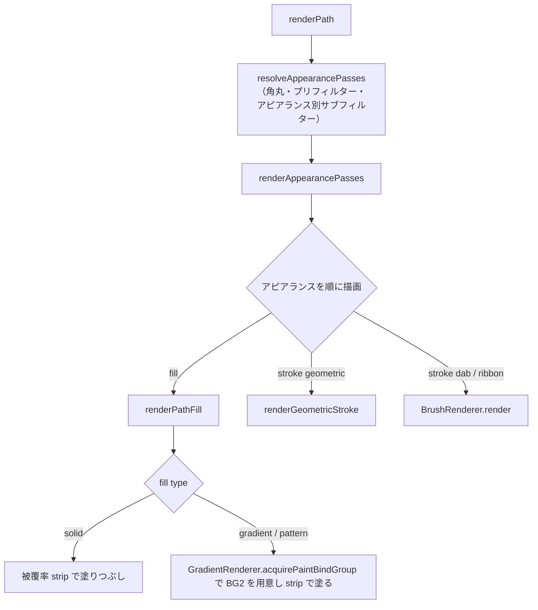
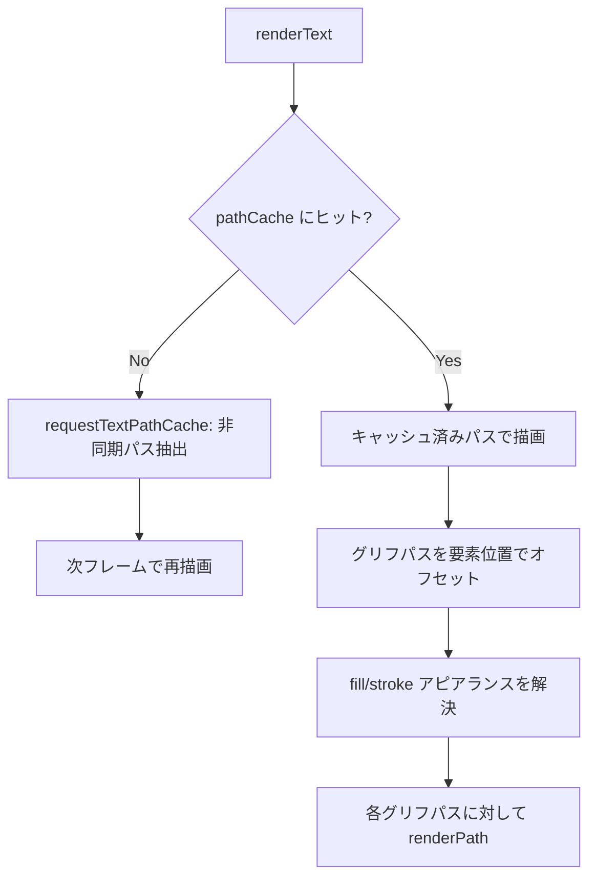

# エレメントレンダリング

> [!TIP]
> **前提ページ:** [パイプライン](/devdocs/renderer/pipeline)

Paplicoのドキュメントは、パス・画像・テキスト・グループといった**要素（Element）**（ドキュメントを構成する描画オブジェクト）の集合で構成される。これらの要素はそれぞれ描画に必要な処理が根本的に異なる。パスは曲線を平坦化してピクセルごとの被覆率を求める必要があり、画像はGPUへのテクスチャ転送、テキストはフォントからのグリフパス抽出が前提となる。このページでは、`core/renderer/canvas/elements/` と `core/renderer/canvas/pipeline/brush/` に実装された各要素の描画パイプラインを、ディスパッチの仕組みから個別の描画戦略まで順に解説する。

> [!NOTE]
> 本ページは [パイプライン](/devdocs/renderer/pipeline) の内容を前提とする。各要素の描画は `CanvasLayer` から呼び出され、必要に応じて `CompositeRenderer` や `OffscreenPresenter` に委譲される。

### 設計意図

要素レンダリングを種別ごとの**ディスパッチテーブル**（要素の型に応じて処理関数を振り分けるルックアップテーブル）で実装する理由は、各要素型の描画ロジックを独立させ、新しい要素型の追加が既存コードに影響しないためである。`group` 型はテーブルに登録しない。グループの描画には、クリップ、マスク、不透明度による isolate、グループアピアランス、子へ継承するプリフィルターの判断が要る。これらは `CanvasLayer.renderElements` が持ち、グループを再帰的にたどりながら子要素を個別にディスパッチする。

## モジュール概観

| ディレクトリ | モジュール | 役割 |
|---|---|---|
| canvas/elements/ | `ElementRenderer` | 要素種別ディスパッチと、要素をマスクへ描く `renderElementToMask` |
| canvas/elements/ | `PathElementRenderer` | パス・複合パス・ブレンドの描画。塗りと geometric ストロークを被覆率 strip で描く |
| canvas/elements/ | `appearancePasses` | パスの `filters` 配列を、アピアランスごとの描画ジオメトリ（`ResolvedAppearancePass`）に解決する唯一の場所 |
| canvas/elements/ | `GradientRenderer` | グラデーションとパターンのペイント bind group の組み立て。フィンガープリントベースのキャッシュ対応 |
| canvas/elements/ | `TextElementRenderer` | テキスト要素→パスへの変換とキャッシュ。グリフパスを `renderPath` に委譲して描画 |
| canvas/elements/ | `ImageElementRenderer` | 画像要素の `GPUTexture` ロードと blit 描画。祖先グループのトランスフォーム合成 |
| canvas/elements/ | `MeshElementRenderer` | メッシュワープのコンテナ。子をワープ済みの一時要素に解決し、通常の要素レンダラーへディスパッチする |
| canvas/elements/ | `Reference3DElementRenderer` | 3D参照要素。three.js 側が描いたテクスチャを blit する |
| canvas/pipeline/brush/ | `BrushRenderer` | dab / ribbonブラシ描画の入口。`DabRenderer` と `RibbonRenderer` へ振り分ける |
| canvas/pipeline/brush/ | `BrushTextureManager` | ブラシテクスチャの読み込み・プログラム生成・キャッシュ管理 |
| canvas/pipeline/brush/ | `DabEvaluator` | ベジェ曲線に沿ったDab位置の計算。カーブ行列で筆圧・チルト・速度をDabごとに反映 |

以降のセクションでは、まず全要素型の入口となる `ElementRenderer` のディスパッチ構造とパス描画フローを説明し、次にグラデーション・テキスト・画像の各専門レンダラー、最後にブラシストロークの描画パイプラインを解説する。

## ElementRenderer

`ElementRenderer` はエレメント種別に応じた描画処理のエントリポイントである。内部に `elementDispatchTable` を持ち、`dispatchElementDirect` メソッドで要素の `type` フィールドに基づいて処理を振り分ける。このテーブルは要素型の文字列をキーとし、対応する描画関数を値とする単純なマッピングであり、新しい要素型を追加する際も対応エントリを足す形で拡張できる。

### ディスパッチテーブル

| 要素型 | ハンドラー |
|---|---|
| `path` | `PathElementRenderer.renderPath()` |
| `image` | `ImageElementRenderer.renderImage()` |
| `compound-path` | `PathElementRenderer.renderCompoundPath()` |
| `text` | `TextElementRenderer.renderText()` |
| `mesh` | `MeshElementRenderer.render()` |
| `blend` | `PathElementRenderer.renderBlend()` |
| `reference3d` | `Reference3DElementRenderer.renderReference3D()` |

`reference3d` は画像エクスポート中、要素の `includeInExport` が `true` のときだけ描く。

`group` 型はディスパッチテーブルに登録されていない。`CanvasLayer.renderElements` がグループを再帰的にたどり、子要素・親トランスフォーム・継承するプリフィルターを渡しながら個別にディスパッチする。

### パス描画フロー

パスはPaplicoで最も頻繁に使われる要素型であり、描画フローも最も複雑である。`renderPath` は以下の順序で処理を行う:

1. **アピアランスの解決**: `resolveAppearancePasses`（`appearancePasses.ts`）が要素の `filters` 配列（**アピアランス**、すなわちフィル（塗り）やストローク（線）など見た目を定義する設定の列）を、アピアランスごとの描画ジオメトリに解決する。角丸のフィレット化、要素のプリフィルター（ジグザグ等のジオメトリ変形）、アピアランス自身のジオメトリサブフィルターは、この中で `PreFilterRenderer` が適用する。プリフィルターがジオメトリを複数のコピーに分けた場合は、コピーごとに1つの `ResolvedAppearancePass` になる
2. **描画しないアピアランスの除外**: 要素の描画を置き換えるアピアランス（extrude3d など）が有効な要素は、平面のジオメトリを何も描かない。後ろにある完全に不透明なソリッド fill に隠れる fill も描かない。重ね塗りすると、部分被覆の縁で下の fill の色が漏れるためである
3. **アピアランス走査**: `renderAppearancePasses` が解決済みの `ResolvedAppearancePass` を順に処理し、`fill` と `stroke` の各アピアランスを描画する。1つの要素に複数のフィルやストロークを重ねることで、影付き文字や多重輪郭などの表現が可能になる。パターンを塗るアピアランスには、タイルの原点（変形前のアウトラインの左上）が付く。ジオメトリフィルターが配置したコピーには、コピーごとのサンプリング変換も付く
4. **フィル描画**: 非ゼロ巻き数の被覆率を CPU で求め、strip としてインスタンス描画する。グラデーションとパターンの場合はペイント用の bind group を `GradientRenderer` から受け取る
5. **ストローク描画**: ブラシ種別に応じて分岐
   - **ジオメトリックブラシ** (`engine === "geometric"`): `renderGeometricStroke` でテッセレーション済みストロークを描画。ダッシュパターン・可変幅に対応
   - **dab / ribbonブラシ**: `BrushRenderer.render` へ即時描画を委譲する。ribbonだけが使うCanvasLayer側のバッチ経路を含む詳細は[ブラシレンダリング](/devdocs/renderer/brush)を参照

### strip のフレームバッファ

塗りと geometric ストロークの strip は、`StripFrame` がフレーム単位で集める。`PathElementRenderer` は `StripCache` の strip を `StripFrame.append()` でフレームのバッファへ詰め、返ってきた範囲ごとに **draw call**（GPUに描画命令を1回発行すること。回数が多いほどオーバーヘッドが増加する）を記録する。strip 1本が1インスタンスになる。

インスタンスは固定容量のチャンク（16,384 インスタンス）に、被覆率の alpha は固定サイズのページ（r8 テクスチャ）に詰める。どちらも埋まると次のチャンク・ページを開く。1回の draw は1つのチャンクと1つのページに収まる範囲で、アウトラインがそれをまたぐと draw が分かれる。

チャンクとページはフレームをまたいで保持される。`finishFrame()` が、フレーム内で使った分だけを **writeBuffer**（CPU側のデータをGPUバッファにコピーするAPI呼び出し） / `writeTexture` でアップロードする。この呼び出しは全パスのエンコードが終わった後、submit の前に1回だけ走る。WebGPUはバッファの内容を submit 時点で読むので、先に記録した draw もこのデータを参照できる。

要素ごとに個別のアップロードを発行すると、数百要素で数百回のCPU→GPUコピーが発生する。フレーム単位でまとめることで、コピーの回数をチャンク数とページ数に抑えている。

## GradientRenderer

パスのフィルには単色だけでなくグラデーション（色が連続的に変化する塗り）を指定できる。`GradientRenderer` はこのグラデーションとパターンのペイント bind group（BG2）を組み立てるモジュールである。`acquirePaintBindGroup` が唯一の公開メソッドで、strip 描画がそのまま BG2 に束ねて塗る。

### 対応するペイント型

| 型 | `gradientType` 値 | `GradientCache` | テクスチャ / バッファ |
|---|---|---|---|
| `linear` | 1 | 対応（フィンガープリントベース） | なし |
| `radial` | 2 | 対応（フィンガープリントベース） | なし |
| `free` | 3 | 非対応 | `GradientTextureGenerator` が生成する 256×256 のテクスチャ |
| `mesh` | 4 | 非対応 | `MeshGradientTextureGenerator` が用意する頂点・面・エッジ曲線の storage buffer |
| `pattern` | 5 | 非対応 | パターン def をラスタライズしたタイルテクスチャ |

ソリッド色は `gradientType` 0 で、`GradientRenderer` を通らない。

### キャッシュ戦略

`linear` / `radial` グラデーションでは `hashGradientDraw` で**フィンガープリント**（データの同一性を高速に判定するためのハッシュ値）を算出し、`GradientCache` に専用のGPUバッファ（uniform / stops）と `GPUBindGroup` をキャッシュする。キャッシュヒット時はバッファ書き込みを完全にスキップし、キャッシュ済みの bind group をそのまま返す。

`free`・`mesh`・`pattern` は `GradientCache` の対象外で、uniform / stops バッファをフレーム内のバッファプールから確保する。`free` のテクスチャは `GradientTextureGenerator.generateMeshTexture` がコンピュートシェーダーで生成し、グラデーション定義のハッシュをキーにジェネレーター内でキャッシュする。`mesh` のバッファも `MeshGradientTextureGenerator` が内部でキャッシュする。`pattern` のテクスチャは呼び出し側が解決して渡す。未解決のパターンは何も描かない。

`linear`/`radial` グラデーションをフィンガープリントベースでキャッシュする理由は、グラデーション描画に必要なGPUリソース（uniformバッファ、ストップバッファ、バインドグループ）の生成コストが高いためである。同一グラデーションが繰り返し描画される場合（選択移動中、ビューポート操作中等）、バッファ書き込みを完全にスキップできる。

### Uniform構造

グラデーション uniform は以下のフィールドを持つ:

- `gradientType`, `stopCount`
- `meshFaceCount` (mesh用)
- `strokeGradientMode` (geometric ストロークのグラデーション用。0 = within、1 = along、2 = across)
- `linearStart`, `linearEnd` (linear用)
- `radialCenter`, `radialRadiusX`, `radialRadiusY`, `radialRotation` (radial用)
- `boundsMin`, `boundsMax` (アウトラインのローカルバウンディングボックス)
- `patternMatrixCol0`〜`patternMatrixCol2`, `patternTileWidth`, `patternTileHeight` (pattern用。ローカル座標からタイル空間へのアフィン変換と、タイルのワールドサイズ)

カラーストップは最大16個まで対応し、**storage buffer**（GPUが読み書きできる大容量バッファ）に `offset`, `r`, `g`, `b`, `a`, `midpoint` の6フィールドで格納される。

## TextElementRenderer

テキストの描画は、他の要素型と比較して特殊な前処理を要する。文字列をそのまま描画する仕組みはWebGPUに存在しないため、フォントファイルから各グリフ（文字）のアウトラインをベクターパスとして抽出し、それをパス描画パイプラインに流す必要がある。`TextElementRenderer` はこの変換とキャッシュを担当し、抽出済みのグリフパスを `ElementRenderer.renderPath` に委譲して描画する。

### レンダリングフロー

1. **キャッシュキー**: `TextRenderer.computeTextCacheKey` でテキスト内容・スタイル・レイアウトからキーを生成（要素のワールド位置は含まない）
2. **非同期パス抽出**: キャッシュミス時は `textElementToPaths` を非同期で実行し、完了後に再レンダリングを要求。フォントファイルのパースとグリフ抽出は数十ミリ秒を要しうるため、レンダリングフレームをブロックしないよう非同期で処理される
3. **アピアランス解決**: 要素の `filters` 配列から `fill` / `stroke` アピアランスを抽出し、`defaultStyle` とマージ。ストローク幅はデフォルトで `fontSize` の3%
4. **座標オフセット**: グリフパスのローカル座標に `element.x`, `element.y` を加算してワールド座標に変換
5. **バウンズ同期**: `syncTextBoundsIfNeeded` でレンダリング結果のバウンディングボックスをキャッシュに反映（ヒットテスト用）

## ImageElementRenderer

画像要素の描画は、パスやテキストのようなジオメトリ変換を必要としない。画像データは既にラスタ（ピクセル）形式であるため、GPUテクスチャとしてロードした後は、適切な位置とサイズに転送（blit）するだけで描画が完了する。`ImageElementRenderer` はこのテクスチャロードと blit 描画を担当する。

### レンダリングフロー

1. **ファイル検索**: `EmbeddedFile` 配列から `image.fileUid` に一致するファイルを検索
2. **テクスチャ取得**: `AssetState.imageTextureCache` からキャッシュ済みテクスチャを同期的に取得。未ロードの場合は非同期ロードを開始し、次フレームで描画
3. **祖先トランスフォーム合成**: `composeAncestorTransform` が `parentGroupMap` を辿って祖先グループのトランスフォームを合成する
4. **blit描画**: 算出したワールド空間バウンズとテクスチャを `blitTextureToCanvas` に渡して描画。画像が変形した4隅（`corners`）を持つ場合と、ジオメトリフィルターが四辺形を変形した場合は、`blitQuadToCanvas` で四辺形へ射影 blit する

メッシュワープの中の画像は `renderImageWarped` が描く。呼び出し側がワープ済みの三角形リストを渡し、`blitMeshToCanvas` がテクスチャをケージに沿って曲げる。

### テクスチャロード

`ensureImageTexture` は `EmbeddedFile` のバイナリデータから以下の手順でテクスチャを生成する:

1. `Blob` → `createImageBitmap` でデコード
2. `copyExternalImageToTexture` でGPUにアップロード（premultiplied alpha）
3. Node.js環境フォールバック: `pngjs` でデコード → 手動premultiply → `writeTexture`
4. `imageTextureCache` に格納し、再レンダリングを要求

## ブラシレンダリング

ここまでの要素レンダラーはジオメトリやテクスチャの直接描画を扱ってきたが、ブラシストロークの描画は根本的に異なるアプローチを採用する。ペンや鉛筆のような自然なストロークを再現するために、**スタンプベースレンダリング**（ブラシの形状画像（スタンプ）をパスに沿って等間隔に並べる描画方式）が用いられる。

### ブラシ描画の入口

`PathElementRenderer` はdab / ribbonブラシのストロークを `BrushRenderer.render(pass, input, bindings)` へ即時描画として渡す。`input` はstroke appearanceから取り出した色とブラシ設定を `StrokeDrawInput` に詰めたもの、`bindings` は今エンコード中のパスのviewport uniformと現在要素のtransforms / mask bind groupである。CanvasLayer側のribbonバッチ経路、Dabインスタンスのレイアウト、bind group構成の詳細は[ブラシレンダリング](/devdocs/renderer/brush)に集約している。

### BrushTextureManager

ブラシテクスチャの読み込みとキャッシュを管理する。以下の5種のビルトインブラシを初期化時にロードする:

| ブラシID | 生成方法 | 特徴 |
|---|---|---|
| `pencil` | Base64 PNG → `createImageBitmap` → `copyExternalImageToTexture` | アセット画像からロード |
| `airbrush` | Base64 PNG → 同上 | アセット画像からロード |
| `bacon` | Base64 PNG → 同上 | アセット画像からロード |
| `hardCircle` | プログラム生成（128x128） | ハードエッジの円形。半径内は完全不透明 |
| `softCircle` | プログラム生成（128x128） | ガウシアン風フォールオフ（sigma=0.4）の円形グラデーション |

テクスチャはRGB輝度ベースでアルファを表現する（A=255固定、シェーダーが `(R+G+B)/3` で不透明度を算出）。

`loadFromEmbeddedFile` でユーザー定義ブラシテクスチャを追加読み込みでき、`normalizeBrushTextureMaskInPlace` でテクスチャマスクの正規化が適用される。

### DabEvaluator

`evaluateDabs` はベジェ曲線セグメント配列と `BrushSettings` からDabインスタンス列を生成する。配置間隔・筆圧やチルトの反映・決定論の仕組みは[ブラシレンダリング](/devdocs/renderer/brush)の「DabEvaluator」節を参照。

> [!TIP]
> **次に読むページ:** [パス描画フロー](/devdocs/renderer/path-rendering)
