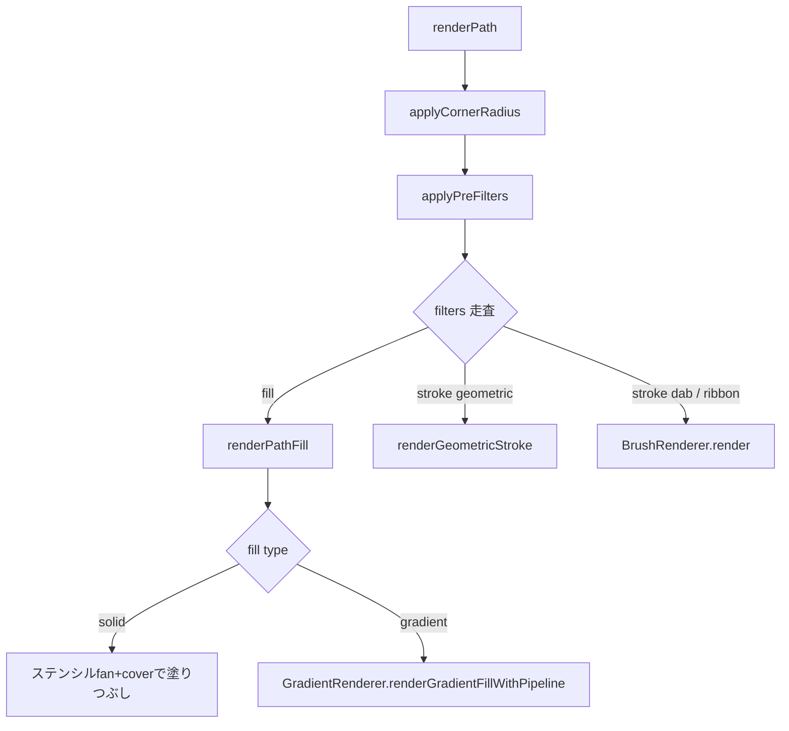
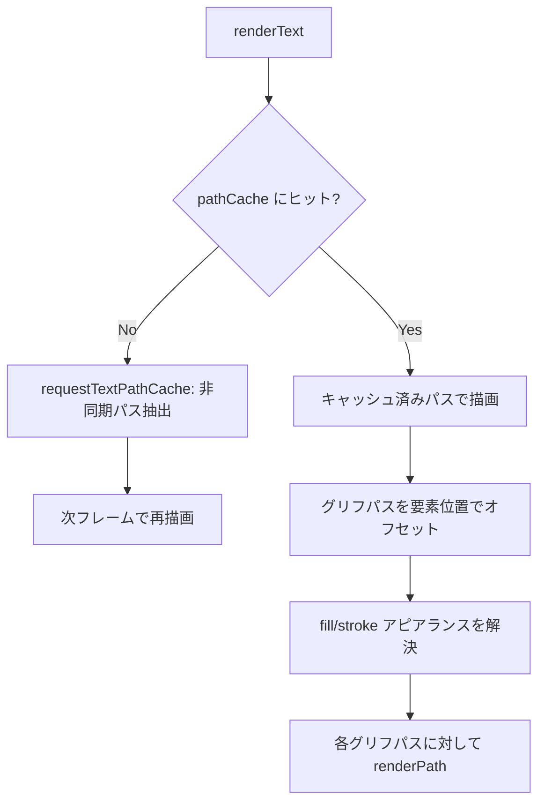

# エレメントレンダリング

> [!TIP]
> **前提ページ:** [パイプライン](/devdocs/renderer/pipeline)

Paplicoのドキュメントは、パス・画像・テキスト・グループといった**要素（Element）**（ドキュメントを構成する描画オブジェクト）の集合で構成される。これらの要素はそれぞれ描画に必要な処理が根本的に異なる。パスは曲線を三角形メッシュに変換するテッセレーション（曲線パスを描画可能なジオメトリに変換する処理）を経る必要があり、画像はGPUへのテクスチャ転送、テキストはフォントからのグリフパス抽出が前提となる。このページでは、`core/renderer/elements/` と `core/renderer/brush/` に実装された各要素の描画パイプラインを、ディスパッチの仕組みから個別の描画戦略まで順に解説する。

> [!NOTE]
> 本ページは [パイプライン](/devdocs/renderer/pipeline) の内容を前提とする。各要素の描画は `CanvasLayer` から呼び出され、必要に応じて `CompositeRenderer` や `OffscreenPresenter` に委譲される。

### 設計意図

要素レンダリングを種別ごとの**ディスパッチテーブル**（要素の型に応じて処理関数を振り分けるルックアップテーブル）で実装する理由は、各要素型の描画ロジックを独立させ、新しい要素型の追加が既存コードに影響しないためである。`group` 型をテーブルから除外する設計は、グループの子要素がCanvasLayer側でフラット化されて個別にディスパッチされるため、再帰的なグループ描画よりもバッチ効率が高い。

## モジュール概観

| ディレクトリ | モジュール | 役割 |
|---|---|---|
| elements/ | `ElementRenderer` | 要素種別ディスパッチ、パスのストローク/フィル描画、ステンシルベースフィル、バッチ頂点バッファ管理 |
| elements/ | `GradientRenderer` | グラデーションフィル描画（linear / radial / free）。フィンガープリントベースのキャッシュ対応 |
| elements/ | `TextElementRenderer` | テキスト要素→パスへの変換とキャッシュ。グリフパスを `renderPath` に委譲して描画 |
| elements/ | `ImageElementRenderer` | 画像要素の `GPUTexture` ロードと blit 描画。祖先グループのトランスフォーム合成 |
| brush/ | `BrushRenderer` | dab / ribbonブラシ描画の入口。`DabRenderer` と `RibbonRenderer` へ振り分ける |
| brush/ | `BrushTextureManager` | ブラシテクスチャの読み込み・プログラム生成・キャッシュ管理 |
| brush/ | `DabEvaluator` | ベジェ曲線に沿ったDab位置の計算。カーブ行列で筆圧・チルト・速度をDabごとに反映 |

以降のセクションでは、まず全要素型の入口となる `ElementRenderer` のディスパッチ構造とパス描画フローを説明し、次にグラデーション・テキスト・画像の各専門レンダラー、最後にブラシストロークの描画パイプラインを解説する。

## ElementRenderer

`ElementRenderer` はエレメント種別に応じた描画処理のエントリポイントである。内部に `elementDispatchTable` を持ち、`dispatchElementDirect` メソッドで要素の `type` フィールドに基づいて処理を振り分ける。このテーブルは要素型の文字列をキーとし、対応する描画関数を値とする単純なマッピングであり、新しい要素型を追加する際も対応エントリを足す形で拡張できる。

### ディスパッチテーブル

| 要素型 | ハンドラー |
|---|---|
| `path` | `ElementRenderer.renderPath()` |
| `image` | `ImageElementRenderer.renderImage()` |
| `compound-path` | `ElementRenderer.renderCompoundPath()` |
| `text` | `TextElementRenderer.renderText()` |

`group` 型はディスパッチテーブルに登録されていない。グループの子要素は `CanvasLayer` 側でフラット化されて個別にディスパッチされる。

### パス描画フロー

パスはPaplicoで最も頻繁に使われる要素型であり、描画フローも最も複雑である。`renderPath` は以下の順序で処理を行う:

1. **角丸処理**: `applyCornerRadius` でフィレットを適用
2. **プリフィルター**: `applyPreFilters` でジグザグ等のジオメトリ変形を適用
3. **アピアランス走査**: 要素の `filters` 配列（**アピアランス**、すなわちフィル（塗り）やストローク（線）など見た目を定義する設定の列）を順に処理し、`fill` と `stroke` の各アピアランスを描画する。1つの要素に複数のフィルやストロークを重ねることで、影付き文字や多重輪郭などの表現が可能になる
4. **フィル描画**: **ステンシルベースフィル**（ステンシルバッファを使って任意形状を正確に塗りつぶす手法）の fan/cover アルゴリズムでパスを塗りつぶす。グラデーションの場合は `GradientRenderer` に委譲
5. **ストローク描画**: ブラシ種別に応じて分岐
   - **ジオメトリックブラシ** (`isGeometricBrush`): `renderGeometricStroke` でテッセレーション済みストロークを描画。ダッシュパターン・可変幅に対応
   - **dab / ribbonブラシ**: `BrushRenderer.render` へ即時描画を委譲する。ribbonだけが使うCanvasLayer側のバッチ経路を含む詳細は[ブラシレンダリング](/devdocs/renderer/brush)を参照

### バッチ頂点バッファ

フィル描画の頂点データはフレーム全体で1つのCPUバッファに蓄積され、`flushFillBatch()` で1回の **writeBuffer**（CPU側のデータをGPUバッファにコピーするAPI呼び出し）でGPUにアップロードされる。各要素の **draw call**（GPUに描画命令を1回発行すること。回数が多いほどオーバーヘッドが増加する）はこの共有GPUバッファのオフセットを参照する。初回フレームではフォールバックとしてプール管理されたper-element バッファを使用し、2フレーム目以降はピーク使用量に基づいてバッチバッファを確保する。

フィル頂点データを1つのバッチバッファに集約する理由は、`device.queue.writeBuffer()` の呼び出し回数を削減するためである。要素ごとに個別のwriteBufferを発行すると、数百要素で数百回のCPU→GPUコピーが発生する。バッチ化により1回のwriteBufferで全要素のデータを転送でき、CPU-GPUバス帯域の効率が大幅に向上する。

初回フレームでper-elementバッファにフォールバックする理由は、バッチバッファのサイズ決定にピーク使用量の観測が必要なためである。ドキュメントの複雑さは事前に予測できないため、初回フレームで実際の使用量を計測し、2フレーム目以降は `2 × peakBytes` の余裕を持たせたバッファを確保する。この「計測→事前確保」パターンにより、通常フレームではアロケーションが完全に不要になる。

## GradientRenderer

パスのフィルには単色だけでなくグラデーション（色が連続的に変化する塗り）を指定できる。`GradientRenderer` はこのグラデーションフィルの描画を担当するモジュールである。`renderGradientFillWithPipeline` が唯一の公開メソッドで、ステンシル cover パスのパイプラインを受け取ってグラデーション付きフィルを描画する。

### 対応グラデーション型

| 型 | `gradientType` 値 | キャッシュ |
|---|---|---|
| `linear` | 1 | 対応（フィンガープリントベース） |
| `radial` | 2 | 対応（フィンガープリントベース） |
| `free` (メッシュ) | 3 | 非対応（毎フレームテクスチャ再生成） |

### キャッシュ戦略

`linear` / `radial` グラデーションでは `hashGradientDraw` で**フィンガープリント**（データの同一性を高速に判定するためのハッシュ値）を算出し、`GradientCache` に専用のGPUバッファ（uniform / stops / vertex）と `GPUBindGroup` をキャッシュする。キャッシュヒット時はバッファ書き込みを完全にスキップし、キャッシュ済みリソースでそのまま draw call を発行する。

`free` グラデーション（メッシュ）は `GradientTextureGenerator.generateMeshTexture` でCPU側にテクスチャを毎フレーム生成するため、キャッシュ非対応。バッファプール方式で一時リソースを確保する。

`linear`/`radial` グラデーションをフィンガープリントベースでキャッシュする理由は、グラデーション描画に必要なGPUリソース（uniformバッファ、ストップバッファ、頂点バッファ、バインドグループ）の生成コストが高いためである。同一グラデーションが繰り返し描画される場合（選択移動中、ビューポート操作中等）、バッファ書き込みを完全にスキップできる。`free`（メッシュ）グラデーションがキャッシュ非対応なのは、フリーグラデーションの仕様がまだ未確定であり、キャッシュ戦略の設計が確定していないためである。

### Uniform構造

グラデーション uniform は以下のフィールドを持つ:

- `gradientType`, `stopCount`
- `linearStart`, `linearEnd` (linear用)
- `radialCenter`, `radialRadiusX`, `radialRadiusY`, `radialRotation` (radial用)
- `boundsMin`, `boundsMax` (要素バウンディングボックス)

カラーストップは最大16個まで対応し、**storage buffer**（GPUが読み書きできる大容量バッファ）に `offset`, `r`, `g`, `b`, `a` の5フィールドで格納される。

## TextElementRenderer

テキストの描画は、他の要素型と比較して特殊な前処理を要する。文字列をそのまま描画する仕組みはWebGPUに存在しないため、フォントファイルから各グリフ（文字）のアウトラインをベクターパスとして抽出し、それをパス描画パイプラインに流す必要がある。`TextElementRenderer` はこの変換とキャッシュを担当し、抽出済みのグリフパスを `ElementRenderer.renderPath` に委譲して描画する。

### レンダリングフロー

1. **キャッシュキー**: `TextRenderer.computeTextCacheKey` でテキスト内容・スタイル・レイアウトからキーを生成（要素のワールド位置は含まない）
2. **非同期パス抽出**: キャッシュミス時は `textElementToPaths` を非同期で実行し、完了後に再レンダリングを要求。フォントファイルのパースとグリフ抽出は数十ミリ秒を要しうるため、レンダリングフレームをブロックしないよう非同期で処理される
3. **アピアランス解決**: 要素の `filters` 配列から `fill` / `stroke` アピアランスを抽出し、`defaultStyle` とマージ。ストローク幅はデフォルトで `fontSize` の3%
4. **座標オフセット**: グリフパスのローカル座標に `element.x`, `element.y` を加算してワールド座標に変換
5. **バウンズ同期**: `syncTextBoundsIfNeeded` でレンダリング結果のバウンディングボックスをキャッシュに反映（ヒットテスト用）

## ImageElementRenderer

画像要素の描画は、パスやテキストのようなジオメトリ変換を必要としない。画像データは既にラスタ（ピクセル）形式であるため、GPUテクスチャとしてロードした後は、適切な位置とサイズに転送（blit）するだけで描画が完了する。`ImageElementRenderer` はこのテクスチャロードと blit 描画を担当する。

### レンダリングフロー

1. **ファイル検索**: `EmbeddedFile` 配列から `image.fileUid` に一致するファイルを検索
2. **テクスチャ取得**: `AssetState.imageTextureCache` からキャッシュ済みテクスチャを同期的に取得。未ロードの場合は非同期ロードを開始し、次フレームで描画
3. **祖先トランスフォーム合成**: `parentGroupMap` を辿って祖先グループのトランスフォームを合成。`composeTransforms` で累積行列を計算
4. **blit描画**: 算出したワールド空間バウンズとテクスチャを `blitTextureToCanvas` に渡して描画

### テクスチャロード

`loadImageTexture` は `EmbeddedFile` のバイナリデータから以下の手順でテクスチャを生成する:

1. `Blob` → `createImageBitmap` でデコード
2. `copyExternalImageToTexture` でGPUにアップロード（premultiplied alpha）
3. Node.js環境フォールバック: `pngjs` でデコード → 手動premultiply → `writeTexture`
4. `imageTextureCache` に格納し、再レンダリングを要求

## ブラシレンダリング

ここまでの要素レンダラーはジオメトリやテクスチャの直接描画を扱ってきたが、ブラシストロークの描画は根本的に異なるアプローチを採用する。ペンや鉛筆のような自然なストロークを再現するために、**スタンプベースレンダリング**（ブラシの形状画像（スタンプ）をパスに沿って等間隔に並べる描画方式）が用いられる。

### ブラシ描画の入口

`PathElementRenderer` はdab / ribbonブラシのストロークを `BrushRenderer.render(pass, input, bindings)` へ即時描画として渡す。`input` はstroke appearanceから取り出した色とブラシ設定を `StrokeDrawInput` に詰めたもの、`bindings` は今エンコード中のパスのviewport uniformと現在要素のtransforms / mask bind groupである。CanvasLayer側のribbonバッチ経路、Dabインスタンスのレイアウト、bind group構成の詳細は[ブラシレンダリング](/devdocs/renderer/brush)に集約している。

### BrushTextureManager

ブラシテクスチャの読み込みとキャッシュを管理する。以下の4種のビルトインブラシを初期化時にロードする:

| ブラシID | 生成方法 | 特徴 |
|---|---|---|
| `pencil` | Base64 PNG → `createImageBitmap` → `copyExternalImageToTexture` | アセット画像からロード |
| `airbrush` | Base64 PNG → 同上 | アセット画像からロード |
| `hardCircle` | プログラム生成（128x128） | ハードエッジの円形。半径内は完全不透明 |
| `softCircle` | プログラム生成（128x128） | ガウシアン風フォールオフ（sigma=0.4）の円形グラデーション |

テクスチャはRGB輝度ベースでアルファを表現する（A=255固定、シェーダーが `(R+G+B)/3` で不透明度を算出）。

`loadFromEmbeddedFile` でユーザー定義ブラシテクスチャを追加読み込みでき、`normalizeBrushTextureMaskInPlace` でテクスチャマスクの正規化が適用される。

### DabEvaluator

`evaluateDabs` はベジェ曲線セグメント配列と `BrushSettings` からDabインスタンス列を生成する。配置間隔・筆圧やチルトの反映・決定論の仕組みは[ブラシレンダリング](/devdocs/renderer/brush)の「DabEvaluator」節を参照。

> [!TIP]
> **次に読むページ:** [パス描画フロー](/devdocs/renderer/path-rendering)
