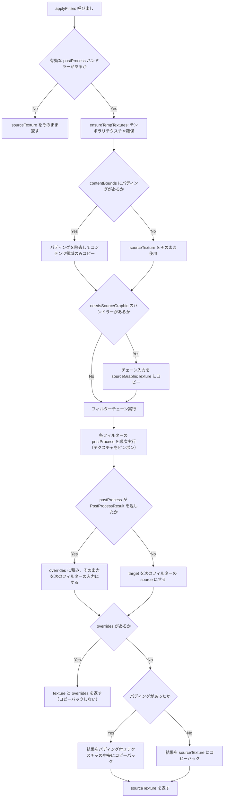

# フィルターシステム

> [!TIP]
> **前提ページ:** [クリッピング方式](/devdocs/renderer/clipping)

フィルター（要素に適用する視覚効果処理。ぼかし、影、すりガラスなど）は、お絵描きソフトにおいてイラストの仕上げや演出に欠かせない機能である。Paplicoでは、パスにジグザグ変形を加えるような「描画前の形状変形」と、描画済みの画像にぼかしをかけるような「描画後のピクセル処理」という性質の異なる2種類のフィルターを統一的に扱う仕組みを備えている。

このページでは、フィルターシステムのアーキテクチャ、各モジュールの役割、実行フロー、そしてビルトインフィルターの一覧を解説する。バックドロップフィルターでは `BackdropEffectCoordinator` と `BackdropCaptureManager` を通じてキャンバス内容を取得するため、その接点も含めて述べる。

> [!NOTE]
> このページの内容は、WebGPUのレンダーパス（GPUが1回の描画操作で実行する命令セット）やWGSLシェーダー（WebGPU Shading Language。GPUで実行されるプログラム）の基本的な概念に馴染みがあることを前提としている。

### 設計意図

フィルターシステムを `FilterHandler` インターフェースとハンドラーレジストリ（フィルターの型名（processor ID）と処理実装の対応表）で実装する理由は、フィルターの追加・削除がレンダラー本体のコード変更を要しないプラグイン方式を実現するためである。新しいフィルターは `FilterHandler` を実装してレジストリに登録するだけでよく、`FilterRenderer` や `RenderPlanner` のコードを変更する必要がない。

プリフィルター（ラスタライズ前にパスの形状を変形するフィルター。CPU処理）とポストフィルター（ラスタライズ後のピクセルデータに画像処理を適用するフィルター。GPU処理）を同一インターフェースにまとめる理由は、ユーザー視点では両者とも「要素に適用するフィルター」であり、`filters` 配列に混在して格納されるためである。内部的な実行タイミング（ラスタライズ（ベクターデータ（パスの数学的定義）をピクセル画像に変換する処理）の前か後か）の違いは、ハンドラーが持つメソッドから `classifyFilterHandler` が判定する。`preProcess` か `preProcessAppearance` を持てば `"geometry"`、`postProcess` を持てば `"raster"` に分類される。

## モジュール概観

| モジュール | パス | 役割 |
|---|---|---|
| `FilterRenderer` | `renderer/canvas/pipeline/FilterRenderer.ts` | ハンドラーレジストリの管理、ポストフィルターの実行（テンポラリテクスチャのピンポン） |
| `applyPreFilters` ほか | `renderer/canvas/pipeline/PreFilterRenderer.ts` | プリフィルター（`preProcess` / `preProcessAppearance`）の実行。ラスタライズ前にジオメトリセグメントを変形する |
| `BackdropEffectCoordinator` | `renderer/canvas/pipeline/BackdropEffectCoordinator.ts` | バックドロップを使う効果どうしで、1回のキャプチャとブラーピラミッドを共有する |
| `BackdropCaptureManager` | `renderer/canvas/pipeline/BackdropCaptureManager.ts` | 要素背後のキャンバス内容をスクリーン空間で切り出す |
| `FILTER_CATALOG` | `renderer/filters/filterCatalog.ts` | フィルターのカテゴリと、サブフィルターにできるかどうかの定義 |

## `FilterHandler` インターフェース

フィルターシステムの中核となるのがこのインターフェースである。すべてのフィルターは種別を問わず `FilterHandler` を実装することで、レジストリへの登録とレンダラーからの呼び出しが可能になる。プリフィルターは `preProcess` か `preProcessAppearance` を、ポストフィルターは `postProcess` を実装する。プリフィルターのメソッドと `postProcess` の両方を持つハンドラーは、`registerHandler` の引数型 `RegisterableFilterHandler` に当てはまらずコンパイルエラーになる。2つは別の段で実行され、利用側は最初に見つけた能力でハンドラーを分類するためである。ジオメトリ変形と画像処理の両方が必要なときは、2つのハンドラーに分けて登録する。以下はインターフェースの主要なメンバーである。

```typescript
interface FilterHandler {
  initialize(device: GPUDevice, canvasFormat: GPUTextureFormat): Promise<void>;
  onScaleFilter(params: Filter, scale: [number, number]): Filter;
  getExpansionMargin(
    filter: Filter,
    bounds?: { width: number; height: number },
  ): number;
  destroy?(): void;

  // Rendering requirements (backdrop capture, source reads)
  getRenderConfigure?(filter: Filter): Partial<FilterRenderRequirements>;

  // Pre-filter: geometry transformation before rasterization
  preProcess?(segments: CubicBezierSegment[], filter: Filter): CubicBezierSegment[];

  // Pre-filter that changes the appearance it outputs
  preProcessAppearance?(geometry: AppearanceGeometry, filter: Filter): AppearanceGeometry[];

  // Post-filter: GPU image processing after rasterization
  postProcess?(
    context: FilterProcessorContext,
    filter: Filter,
  ): PostProcessResult | PostProcessResult[] | void;

  // Filter param interpolation
  onInterpolate?(paramsA: unknown, paramsB: unknown, t: number): unknown;

  // Color collection / adjustment over the params
  onAdjustColor?(params: unknown, adjustColor: (color: Color) => Color): unknown;
}

interface FilterRenderRequirements {
  needsBackdrop: boolean;
  needsSourceTexture: boolean;
  needsSourceGraphic: boolean;
}
```

### メソッド概要

| メソッド | 説明 |
|---|---|
| `initialize` | GPUパイプライン・シェーダーモジュールの初期化。プリフィルターはno-op |
| `preProcess` | ラスタライズ前に CubicBezierSegment（3次ベジェ曲線の1セグメントを表すデータ構造）の配列を変形して返す |
| `preProcessAppearance` | アピアランス（塗り・線）付きのジオメトリを受け取り、描画するジオメトリの配列を返す。コピーごとに線幅を書き換えたりパターンの変換を持たせたりできる。`preProcess` とはどちらか一方を実装する |
| `postProcess` | ラスタライズ済みテクスチャに対してGPUレンダーパスを実行。通常は何も返さない。自前のサイズのテクスチャを作るハンドラー（`extrude3d` など）は `PostProcessResult` を返し、レンダラーがそのバウンズにblitする |
| `getExpansionMargin` | Expansion Margin（フィルター効果（ブラーの広がり等）がはみ出す範囲）をワールド単位で返す。オフスクリーンテクスチャ確保時に使用。はみ出す量が内容の大きさに比例するハンドラーは、第2引数の `bounds` を読む |
| `onScaleFilter` | 要素リサイズ時にフィルターパラメータをスケーリング |
| `onInterpolate` | 2組のパラメータの補間 |
| `onAdjustColor` | パラメータに含まれる全ての色を `adjustColor` に通した結果を返す。色の収集と色の調整の両方に使う |
| `getRenderConfigure` | このフィルターの描画要件をフィルターごとに返す。省略すると `needsBackdrop: false`, `needsSourceTexture: true`, `needsSourceGraphic: false` になる |

`FilterRenderRequirements` の各項目の意味は次のとおりである。

| 項目 | 意味 |
|---|---|
| `needsBackdrop` | フィルターの実行前に、レンダラーがバックドロップをキャプチャする必要がある |
| `needsSourceTexture` | `postProcess` が `sourceTexture`（要素のラスタライズ結果）を読む。自前のジオメトリだけで出力を作るハンドラーは `false` を返し、チェーンの先頭にあるとき呼び出し側はラスタライズを省ける |
| `needsSourceGraphic` | `postProcess` がチェーンの入力そのもの（SVG の SourceGraphic）を `sourceGraphicTexture` から読む。レンダラーはチェーンの入力のコピーをチェーンの間保持する |

このほかに、フレーム単位のGPU状態を持つハンドラー向けの `startFrame` / `releaseFrame`、要素自身の描画を置き換えることを宣言する `replacesElementRender`、パラメータが参照する def を列挙する `collectReferencedDefIds`、共有ブラーピラミッドに深さを伝える `getBackdropBlurSigma`、要素の被覆率だけから下敷きを作る `postProcessUnderlay`、キャンバスごとのバックドロップ効果ドライバーを扱う `attachCanvas` / `detachCanvas` / `getBackdropEffectDriver` がある。いずれも任意であり、通常の画像フィルターは実装しない。

## `FilterRenderer`

`FilterRenderer` は、複数のポストフィルターを順次適用する「フィルターチェーン」の実行を担当するクラスである。フィルターチェーンとは、ある要素のラスタライズ結果に対して、ブラー → ドロップシャドウ → 色補正のように複数のフィルターを順番に重ねがけする処理の流れを指す。`RenderOrchestrator` が初期化時にすべてのハンドラーを `registerHandler(filterType, handler)` で登録する。

### 実行フロー



`applyFilters` の戻り値は `{ texture, overrides? }` である。`overrides` は自前のサイズを持つ出力の列で、呼び出し側はそれぞれを自身のバウンズにblitする。チェーンの先頭のハンドラーが `needsSourceTexture: false` を返す場合、`sourceTexture` の中身は読まれないため、パディングの除去と SourceGraphic のコピーは行われない。

### テクスチャピンポン

フィルターチェーンでは、あるフィルターの出力が次のフィルターの入力になる。このとき、テクスチャピンポン（2枚のGPUテクスチャを交互にsource（入力）/target（出力）として使い回す手法）を採用することで、チェーンの長さに関わらずメモリ使用量を一定に保つ。

具体的には、`FilterRenderer` は1回のチェーンで2枚のテンポラリテクスチャ（`tempTexture1`, `tempTexture2`）を使う。フィルター1は `tex1→tex2` に書き込み、フィルター2は `tex2→tex1` に書き込み、フィルター3は再び `tex1→tex2` に…という具合に交互に切り替える。フィルターごとにテクスチャを確保すると、5個のフィルターチェーンで5枚のテクスチャが必要になるが、ピンポンでは常に2枚で済む。

2枚組はサイズとフォーマットをキーにしてプールされ、呼び出しやフレームをまたいで再利用される。1フレームの中でも内容サイズの異なるチェーンが交互に走るため、切り替えのたびに作り直すとテクスチャの確保がGPUプロセスを圧迫する。プールは最大48組（`MAX_TEMP_PAIRS`）で、超えるときは今のフレームで使っていない組のうち最も古いものを外す。60フレーム（`TEMP_PAIR_IDLE_FRAMES`）使われなかった組も外す。外したテクスチャは、in-flightコマンドバッファ（GPUに送信済みだがまだ実行完了していないコマンド）の完了を待って次の `flushPendingDestroy` で遅延破棄する。

### バックドロップフィルター

バックドロップフィルター（要素の背後にあるキャンバス内容を取得してフィルター処理する機能）は、通常のフィルターとは異なり、要素自身のテクスチャだけでなくキャンバス上の既存描画内容にアクセスする必要がある。たとえばすりガラス効果（`frost-glass`）は、要素の背後にある描画内容を取得し、それにぼかしと彩度調整をかけた結果を要素の形状でマスクして合成することで、ガラス越しに背景が透けて見えるような視覚効果を実現する。

バックドロップ経路に乗るかどうかは、`resolveRenderConfigure` が返す `needsBackdrop` で決まる。`needsBackdrop` が真になる条件は2つある。

- ハンドラーの `getRenderConfigure` が `needsBackdrop: true` を返す。`pixelate` と `hk:pixel-sort` はパラメータの「背面に適用」がONのときに返す。3Dソリッド（`extrude3d` / `revolve3d`）はマテリアルがガラスのときに返す。
- アピアランス共通のフラグ `Appearance.applyToBackdrop` が立っている。このフラグは `postProcess` を持ち、かつ要素の描画を置き換えないフィルターに効く。`frost-glass` は `getRenderConfigure` を持たず、このフラグだけで背面に切り替わる。

共通フラグが意味を持つかどうかは `FilterRenderer.canApplyToBackdrop(filter)` で調べられる。

バックドロップ要素は `CanvasLayer.processBackdropElement` が処理する。手順は次のとおりである。

1. `BackdropEffectCoordinator.acquireFixedRRegion` から、要素の領域を切り出したテクスチャを受け取る。キャプチャはバックドロップフィルターを持つ要素どうしで共有される。領域はドキュメントのラスタライズ倍率（`rasterizationDpi / 72`）のグリッドに再サンプリングされるため、結果はビューポートのズームやパンに依存しない。
2. 切り出したテクスチャを `sourceTexture` として `applyFilters` に渡す。バックドロップフィルターの後ろに通常のポストフィルターが続く場合は、同じチェーンで実行する。`sceneInfo.dpiScale` はラスタライズ倍率である。ブラーを使うフィルターは `context.backdropBlur(sigma)` から共有ブラーピラミッドの段を受け取れる。
3. 要素の形状をマスクテクスチャに描く。
4. フィルター結果をマスクで切り抜いてキャンバスに合成する。要素にかかるオブジェクトマスクもこの合成で適用される。

ハンドラーから見ると、バックドロップ経路と通常経路の違いは `sourceTexture` の中身だけである。`frost-glass` の `postProcess` は `sourceTexture` だけを読むため、2つの経路で同じパスチェーンを共有している。

バックドロップの要否を `RenderPlanner` の段階で区別する理由は、バックドロップテクスチャのキャプチャを事前に計画するためである。バックドロップキャプチャは要素描画順序に依存するため、フレームプラン構築時にレイヤーをセグメント分割して正しい描画順を保証する必要がある。

## `applyPreFilters`

フィルターチェーンのもう一方の柱が、ラスタライズ前に実行されるプリフィルターである。`PreFilterRenderer.ts` は、要素のジオメトリがラスタライズ前に通る手順をまとめたモジュールである。その基本になる `applyPreFilters` 関数は、パスのジオメトリ（CubicBezierSegment の配列）を受け取り、プリフィルターによる変形を適用して返す。たとえば `zigzag` フィルターは、パスを弧長パラメータ化し法線方向に三角波でオフセットすることで、直線をジグザグに変形する。

```typescript
function applyPreFilters(
  segments: CubicBezierSegment[],
  filters: Filter[] | undefined,
  filterRenderer: Pick<FilterRenderer, "getHandler">,
): CubicBezierSegment[];
```

### 処理手順

1. フィルター配列から、有効なジオメトリフィルターを `isGeometryFilter` で抽出
2. セグメント配列をディープコピー（Valtio Proxyはプロパティアクセスを透過的にインターセプトするため、そのまま変形するとストアの状態を直接変更してしまう。これを防ぐためにディープコピーを行う）
3. 各プリフィルターを順次適用。ハンドラーが `preProcessAppearance` を持てばそれを、持たなければ `preProcess` を呼ぶ

### 同じモジュールの関数

| 関数 | 役割 |
|---|---|
| `resolveElementGeometry` | 角丸をフィレットのジオメトリに実体化してから `applyPreFilters` を通す。フラットな描画と3Dソリッドの輪郭の両方がここを通るため、要素の形状の解釈がずれない |
| `resolveAppearanceGeometries` | 1つのパスを描く塗り・線アピアランスごとのジオメトリを求める。`preProcessAppearance` を持つフィルターが現れるまでは、変形結果をアピアランス間で共有する。パス描画は `appearancePasses.ts` からこれを呼ぶ |
| `applyPreFiltersToGeometry` | アピアランスを保ったまま1つのジオメトリにプリフィルターをかける。アピアランスのサブフィルターに使う |
| `childPreFilters` / `withInheritedPreFilters` | グループのジオメトリフィルターを子に引き継ぐ。入れ子のグループでは内側のフィルターから先にかかる |
| `resolvePathGeometryVariants` / `subtreeHasPreFilter` | バウンズ計算とヒットテストが、レンダラーの描く形状と同じ形状を見るための補助 |

## プリフィルター vs ポストフィルター

この2種類のフィルターの違いを理解することが、フィルターシステム全体の設計を把握する鍵である。両者は「要素に効果を適用する」という目的は同じだが、処理の性質が根本的に異なる。

| | プリフィルター (`preProcess`) | ポストフィルター (`postProcess`) |
|---|---|---|
| 実行タイミング | ラスタライズ前 | ラスタライズ後 |
| 入出力 | `CubicBezierSegment[]`（`preProcessAppearance` では `AppearanceGeometry`）を受け取り変形して返す | GPUテクスチャに対してレンダーパスを実行 |
| GPUパイプライン | 不要（CPU処理） | 必要（WGSLシェーダー） |
| 対象 | パスジオメトリのみ | 任意の要素テクスチャ |
| 例 | Zigzag, Path Offset, Transform, 3D Rotate | Blur, Drop Shadow, Frost Glass |

プリフィルターはCPU上でベジエセグメントを変形する純粋関数であり、GPUパイプラインを必要としない。ポストフィルターはラスタライズ済みテクスチャに対してGPUレンダーパスを実行する。この分離により、プリフィルターはラスタライズ前（パス描画では `appearancePasses.ts` の `resolveAppearanceGeometries`）で適用され、ポストフィルターはラスタライズ後（`FilterRenderer.applyFilters`）で適用されるという、実行タイミングの違いが自然に表現される。

## ビルトインフィルター

Paplicoには以下のフィルターが組み込まれている。それぞれがどのような視覚効果を実現するかを示す。

| processor ID | クラス | 種別 | 説明 |
|---|---|---|---|
| `blur` | `BlurFilterProcessor` | post | 2パス分離型ガウシアンブラー。水平/垂直の2パスで O(2n) |
| `drop-shadow` | `DropShadowFilterProcessor` | post | 要素の背後に影を落とす効果。オフセット + スプレッド（膨張/収縮）、ブラー、着色して元テクスチャを上に合成、の順に処理する。広い半径は共有ブラーピラミッドで解決する。`postProcessUnderlay` も実装し、被覆率マスクだけから影を作ってキャッシュできる |
| `frost-glass` | `FrostGlassFilterProcessor` | post/backdrop | すりガラスのようにぼかす効果。入力を散布（ランダム変位）＋ぼかしし、彩度調整・ティント適用。既定では要素自身のラスターにかかり、共通フラグ `applyToBackdrop` を立てると要素の背後にかかる |
| `pixelate` | `PixelateFilterProcessor` | post/backdrop | 要素ラスターをブロックグリッドにダウンサンプリングしてモザイク化。「背面に適用」ON時はバックドロップに適用（`getRenderConfigure` の `needsBackdrop` はパラメータ依存） |
| `clip-to-shape` | `ClipToShapeFilterHandler` | post | チェーンの現在の結果を、ジオメトリフィルター適用後の要素形状（SourceAlpha）でクリップする。`svg:composite` の `in` / `out` 演算を固定パラメータで流す薄いハンドラーで、SVG出力では同じパラメータから `feComposite` を出す |
| `3d-rotate` | `Rotate3DFilterProcessor` | pre | パースペクティブ付き3D回転。ベジェの各制御点をサブパスのバウンディングボックス中心まわりに回転し、透視投影する。適応分割とセグメントの再構築は `projectiveBezier.ts` を他の射影系プリフィルターと共有する |
| `extrude3d` | `Extrude3DFilterHandler` | post | 要素の輪郭を押し出した3Dソリッドを描く。要素自身のフラットな描画を置き換え（`replacesElementRender`）、`context.geometry` から自前のサイズの出力を作る。ガラスのマテリアルではバックドロップを屈折させる |
| `revolve3d` | `Revolve3DFilterHandler` | post | 輪郭を左右どちらかの端の垂直軸まわりに回転させた回転体を描く。3Dソリッドの共通部分（`Solid3DFilterHandlerBase`）を `extrude3d` と共有する |
| `zigzag` | `ZigzagFilterHandler` | pre | パスを弧長パラメータ化し、法線方向に三角波でオフセットしてジグザグ変形 |
| `transform` | `TransformFilterHandler` | pre | 拡大縮小・移動・回転・反転を基準点まわりに適用し、累積コピーを配置する。`preProcessAppearance` でコピーごとの線幅スケールとパターン追従を返す |
| `path-offset` | `PathOffsetFilterHandler` | pre | パスを法線方向に指定距離オフセット。適応的分割 + Tiller-Hanson 法。接合は miter / round / bevel から選べる。内向きオフセットで生じる自己交差ループは検出して取り除く |
| `path-union` | `PathUnionFilterHandler` | pre | 重なり合う閉じたサブパスにブーリアン演算（union / intersection / difference / xor）をかける。3次ベジェを直接扱うスイープラインで、曲線を多角形に近似しない |
| `pucker-bloat` | `PuckerBloatFilterHandler` | pre | アンカーとハンドルをサブパスの重心に対して近づけ・遠ざけて、収縮（星形）と膨張（風船形）を作る |

> [!TIP]
> 新しいフィルターをレンダラーに追加するには、`FilterHandler` インターフェースを実装したクラスを作成し、`RenderOrchestrator` の初期化処理で `filterRenderer.registerHandler(processorId, handler)` を呼ぶ。通常は `FilterRenderer` 側に分岐を足す必要はなく、必要なメタデータ（`getRenderConfigure`, `getExpansionMargin` など）をそのハンドラー側で定義する。フィルターパネルから追加できるようにするには、カタログとUIへの登録も要る。手順は[フィルターオーサリングガイド](/devdocs/renderer/filter-authoring)にまとめている。

## SVG フィルター

`renderer/filters/svg/` には、SVG のフィルタープリミティブを1つずつ WebGPU のパスで再現するポストフィルター群がある。すべて `svg:` プレフィックスで登録される。SVG 書き出しでは、これらはラスタライズされず、対応する `<fe*>` 要素として出力される。

| processor ID | ハンドラークラス | 対応する SVG 要素 |
|---|---|---|
| `svg:gaussian-blur` | `SvgGaussianBlurHandler` | `feGaussianBlur` |
| `svg:offset` | `SvgOffsetHandler` | `feOffset` |
| `svg:flood` | `SvgFloodHandler` | `feFlood` |
| `svg:color-matrix` | `SvgColorMatrixHandler` | `feColorMatrix` |
| `svg:component-transfer` | `SvgComponentTransferHandler` | `feComponentTransfer` |
| `svg:morphology` | `SvgMorphologyHandler` | `feMorphology` |
| `svg:convolve-matrix` | `SvgConvolveMatrixHandler` | `feConvolveMatrix` |
| `svg:turbulence` | `SvgTurbulenceHandler` | `feTurbulence` |
| `svg:displacement-map` | `SvgDisplacementMapHandler` | `feDisplacementMap` |
| `svg:composite` | `SvgCompositeHandler` | `feComposite` |
| `svg:blend` | `SvgBlendHandler` | `feBlend` |
| `svg:drop-shadow` | `SvgDropShadowHandler` | `feDropShadow` |
| `svg:saturate` / `svg:hue-rotate` / `svg:grayscale` / `svg:sepia` / `svg:invert` / `svg:brightness` / `svg:contrast` | `SvgColorFunctionHandler` | CSS の色関数。`SVG_COLOR_FUNCTIONS` の各要素につき1インスタンスを登録する |
| `svg:filter` | `SvgFilterGraphHandler` | プリミティブのノード列を1つのアピアランスとして持つグラフ。各ノードは上の表と同じハンドラーインスタンスで実行される |

入力は SVG の `in` / `in2` 属性に倣い、直前の結果（`previous`）、`SourceGraphic`、`SourceAlpha` から選ぶ。`svg:filter` グラフの中では、先行するノードの結果を `ref:<nodeId>` で参照することもできる。`SourceGraphic` か `SourceAlpha` を読むプリミティブは `needsSourceGraphic` を宣言し、レンダラーが保持するチェーン入力のコピー（`sourceGraphicTexture`）を受け取る。中間テクスチャは、全 SVG ハンドラーが共有する1つの `ScratchTexturePool` から借りる。

## カタログ

フィルターパネルに並ぶフィルターは `renderer/filters/filterCatalog.ts` の `FILTER_CATALOG` が定義する。各エントリは processor ID、カテゴリ、サブフィルターにできるかどうか（`canBeSubFilter`）を持つ。カテゴリの表示順は、カタログに最初に現れた順である。

| カテゴリ | 含まれるフィルター |
|---|---|
| Appearance | `fill`, `stroke` |
| 3D | `extrude3d`, `revolve3d`, `3d-rotate` |
| Geometry | `zigzag`, `path-offset`, `path-union`, `pucker-bloat`, `transform` |
| Mask | `clip-to-shape` |
| Blur | `blur`, `frost-glass`, `hk:bloom`, `hk:directional-blur`, `hk:kirakira`, `hk:radial-rot-dir`, `hk:husky` |
| Color | `hk:gradient-map`, `hk:posterization`, `hk:color-replacement`, `hk:selective-correction` |
| Stylize | `drop-shadow`, `hk:chromatic-aberration`, `hk:spraying`, `hk:smear`, `hk:blush-stroke`, `hk:comic-tone`, `hk:halftone`, `hk:inner-glow`, `hk:outline`, `hk:vhs-interlace`, `hk:pixel-sort`, `hk:kaleidoscope` |
| Distortion | `pixelate`, `hk:fluid`, `hk:glitch`, `hk:turbulence`, `hk:wave` |
| Texture | `hk:paper-v2` |
| SVG | `svg:*` の全フィルター |

サブフィルター（塗りや線のアピアランスの下に置くフィルター）にできないのは、`fill`、`stroke`、`extrude3d`、`revolve3d`、そして `svg:*` の全フィルターである。`svg:*` をサブフィルターの位置に置くと SVG 書き出しでラスタライズされてしまうため、トップレベル専用にしている。カタログに載っていない processor は、`canBeSubFilter` 関数では「できる」と扱われる。

## hanakla-kit フィルター

hanakla-kit は、ビルトインフィルターを補完する拡張フィルターパックである。`renderer/filters/hanakla-kit/` に格納されるポストフィルター群で、色調補正・テクスチャ効果・グリッチなど多彩な視覚効果を提供する。すべて `hk:` プレフィックスで登録される。

| processor ID | ハンドラークラス | 説明 |
|---|---|---|
| `hk:bloom` | `HKBloomHandler` | 輝度抽出 + ブラー + 合成によるブルーム |
| `hk:directional-blur` | `HKDirectionalBlurHandler` | 指定方向のモーションブラー |
| `hk:kirakira` | `HKKirakiraHandler` | きらきらエフェクト |
| `hk:radial-rot-dir` | `HKRadialRotDirHandler` | 放射状/回転ブラー |
| `hk:gradient-map` | `HKGradientMapHandler` | 輝度をグラデーションにマッピング |
| `hk:posterization` | `HKPosterizationHandler` | ポスタリゼーション（階調削減） |
| `hk:color-replacement` | `HKColorReplacementHandler` | 色置換 |
| `hk:selective-correction` | `HKSelectiveCorrectionHandler` | 選択的色補正 |
| `hk:fluid` | `HKFluidHandler` | 流体エフェクト |
| `hk:glitch` | `HKGlitchHandler` | グリッチエフェクト |
| `hk:smear` | `HKSmearHandler` | 指定角度の筋に沿って被覆率を削る、かすれ（ドライブラシ）エフェクト |
| `hk:spraying` | `HKSprayingHandler` | スプレーエフェクト |
| `hk:turbulence` | `HKTurbulenceHandler` | タービュランスノイズ |
| `hk:wave` | `HKWaveHandler` | 波形変形 |
| `hk:blush-stroke` | `HKBlushStrokeHandler` | ブラシストロークエフェクト |
| `hk:chromatic-aberration` | `HKChromaticAberrationHandler` | 色収差 |
| `hk:comic-tone` | `HKComicToneHandler` | コミックトーン（スクリーントーン） |
| `hk:halftone` | `HKHalftoneHandler` | ハーフトーン |
| `hk:inner-glow` | `HKInnerGlowHandler` | インナーグロー |
| `hk:outline` | `HKOutlineHandler` | アウトライン |
| `hk:vhs-interlace` | `HKVhsInterlaceHandler` | VHSインターレースエフェクト |
| `hk:paper-v2` | `HKPaperV2Handler` | 紙テクスチャ |
| `hk:husky` | `HKHuskyHandler` | ハスキーエフェクト |
| `hk:kaleidoscope` | `HKKaleidoscopeHandler` | 万華鏡エフェクト |
| `hk:pixel-sort` | `HKPixelSortHandler` | ピクセルソート。輝度しきい値内の連続スパンを任意角度の線に沿って bitonic ソート。「背面に適用」ON時はバックドロップに適用（`needsBackdrop` はパラメータ依存） |

> [!TIP]
> **次に読むページ:** [フィルターオーサリングガイド](/devdocs/renderer/filter-authoring)
