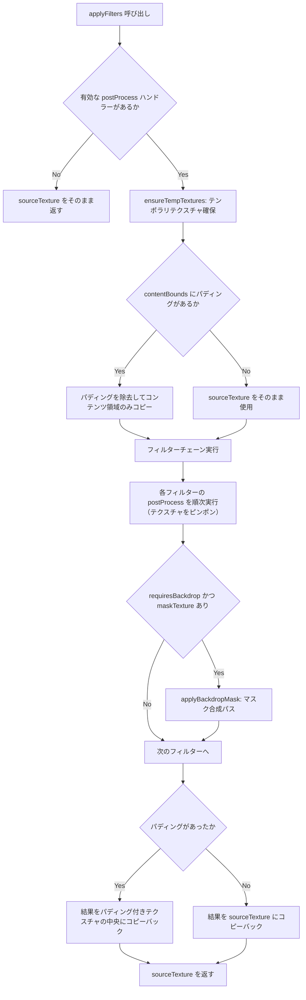

# フィルターシステム

> [!TIP]
> **前提ページ:** [クリッピング方式](/devdocs/renderer/clipping)

フィルター（要素に適用する視覚効果処理。ぼかし、影、すりガラスなど）は、お絵描きソフトにおいてイラストの仕上げや演出に欠かせない機能である。Paplicoでは、パスにジグザグ変形を加えるような「描画前の形状変形」と、描画済みの画像にぼかしをかけるような「描画後のピクセル処理」という性質の異なる2種類のフィルターを統一的に扱う仕組みを備えている。

このページでは、フィルターシステムのアーキテクチャ、各モジュールの役割、実行フロー、そしてビルトインフィルターの一覧を解説する。バックドロップフィルターでは `BackdropCaptureManager` と連携してキャンバス内容を取得するため、その接点も含めて述べる。

> [!NOTE]
> このページの内容は、WebGPUのレンダーパス（GPUが1回の描画操作で実行する命令セット）やWGSLシェーダー（WebGPU Shading Language。GPUで実行されるプログラム）の基本的な概念に馴染みがあることを前提としている。

### 設計意図

フィルターシステムを `FilterHandler` インターフェースとハンドラーレジストリ（フィルターの型名（processor ID）と処理実装の対応表）で実装する理由は、フィルターの追加・削除がレンダラー本体のコード変更を要しないプラグイン方式を実現するためである。新しいフィルターは `FilterHandler` を実装してレジストリに登録するだけでよく、`FilterRenderer` や `RenderPlanner` のコードを変更する必要がない。

プリフィルター（ラスタライズ前にパスの形状を変形するフィルター。CPU処理）とポストフィルター（ラスタライズ後のピクセルデータに画像処理を適用するフィルター。GPU処理）を同一インターフェースにまとめる理由は、ユーザー視点では両者とも「要素に適用するフィルター」であり、`filters` 配列に混在して格納されるためである。内部的な実行タイミング（ラスタライズ（ベクターデータ（パスの数学的定義）をピクセル画像に変換する処理）の前か後か）の違いは `preProcess` / `postProcess` メソッドの有無で自動判定される。

## モジュール概観

| モジュール | パス | 役割 |
|---|---|---|
| `FilterRenderer` | `renderer/pipeline/FilterRenderer.ts` | ハンドラーレジストリの管理、ポストフィルターの実行（テンポラリテクスチャのピンポン、バックドロップマスク合成） |
| `applyPreFilters` | `renderer/pipeline/PreFilterRenderer.ts` | プリフィルター（`preProcess`）の実行。ラスタライズ前にジオメトリセグメントを変形する |
| `BackdropCaptureManager` | `renderer/pipeline/BackdropCaptureManager.ts` | バックドロップフィルター用に、要素背後のキャンバス内容をスクリーン空間で切り出す |

## `FilterHandler` インターフェース

フィルターシステムの中核となるのがこのインターフェースである。すべてのフィルターは種別を問わず `FilterHandler` を実装することで、レジストリへの登録とレンダラーからの呼び出しが可能になる。プリフィルターは `preProcess` を、ポストフィルターは `postProcess` を実装し、両方を実装することも許される。以下がすべてのフィルターが実装するインターフェースである。

```typescript
interface FilterHandler {
  initialize(device: GPUDevice, canvasFormat: GPUTextureFormat): Promise<void>;
  onScaleFilter(params: Filter, scale: [number, number]): Filter;
  getExpansionMargin(filter: Filter): number;
  destroy?(): void;

  readonly requiresBackdrop?: boolean;

  // Pre-filter: geometry transformation before rasterization
  preProcess?(segments: CubicBezierSegment[], filter: Filter): CubicBezierSegment[];

  // Post-filter: GPU image processing after rasterization
  postProcess?(context: FilterProcessorContext, filter: Filter): void;

  // Filter param interpolation
  onInterpolate?(paramsA: unknown, paramsB: unknown, t: number): unknown;
}
```

### メソッド概要

| メソッド | 説明 |
|---|---|
| `initialize` | GPUパイプライン・シェーダーモジュールの初期化。プリフィルターはno-op |
| `preProcess` | ラスタライズ前に CubicBezierSegment（3次ベジェ曲線の1セグメントを表すデータ構造）の配列を変形して返す |
| `postProcess` | ラスタライズ済みテクスチャに対してGPUレンダーパスを実行 |
| `getExpansionMargin` | Expansion Margin（フィルター効果（ブラーの広がり等）がはみ出す範囲）をワールド単位で返す。オフスクリーンテクスチャ確保時に使用 |
| `onScaleFilter` | 要素リサイズ時にフィルターパラメータをスケーリング |
| `onInterpolate` | アニメーションキーフレーム間のパラメータ補間 |
| `requiresBackdrop` | `true` の場合、レンダラーがバックドロップテクスチャをキャプチャしてコンテキストに渡す |

## `FilterRenderer`

`FilterRenderer` は、複数のポストフィルターを順次適用する「フィルターチェーン」の実行を担当するクラスである。フィルターチェーンとは、ある要素のラスタライズ結果に対して、ブラー → ドロップシャドウ → 色補正のように複数のフィルターを順番に重ねがけする処理の流れを指す。`RenderOrchestrator` が初期化時にすべてのハンドラーを `registerHandler(filterType, handler)` で登録する。

### 実行フロー



### テクスチャピンポン

フィルターチェーンでは、あるフィルターの出力が次のフィルターの入力になる。このとき、テクスチャピンポン（2枚のGPUテクスチャを交互にsource（入力）/target（出力）として使い回す手法）を採用することで、チェーンの長さに関わらずメモリ使用量を一定に保つ。

具体的には、`FilterRenderer` は2枚のテンポラリテクスチャ（`tempTexture1`, `tempTexture2`）を保持する。フィルター1は `tex1→tex2` に書き込み、フィルター2は `tex2→tex1` に書き込み、フィルター3は再び `tex1→tex2` に…という具合に交互に切り替える。フィルターごとにテクスチャを確保すると、5個のフィルターチェーンで5枚のテクスチャが必要になるが、ピンポンでは常に2枚で済む。リサイズ時は古いテクスチャをin-flightコマンドバッファ（GPUに送信済みだがまだ実行完了していないコマンド）の完了を待って遅延破棄する。

### バックドロップフィルター

バックドロップフィルター（要素の背後にあるキャンバス内容を取得してフィルター処理する機能）は、通常のフィルターとは異なり、要素自身のテクスチャだけでなくキャンバス上の既存描画内容にアクセスする必要がある。たとえばすりガラス効果（`frost-glass`）は、要素の背後にある描画内容を取得し、それにぼかしと彩度調整をかけた結果を要素の形状でマスクして合成することで、ガラス越しに背景が透けて見えるような視覚効果を実現する。

`requiresBackdrop = true` のフィルター（`frost-glass`, `pixelate`, `hk:pixel-sort`）は、`BackdropFilterProcessorContext` を通じてキャンバス上の既存描画内容（`backdropTexture`）にアクセスする。フィルター処理後、`FilterRenderer` が `backdropMask.wgsl` シェーダーで要素形状マスクを適用する。

このフラグを設ける理由は、通常のフィルターとバックドロップフィルターを `RenderPlanner` の段階で区別し、バックドロップテクスチャのキャプチャを事前に計画するためである。バックドロップキャプチャは要素描画順序に依存するため、フレームプラン構築時にレイヤーをセグメント分割して正しい描画順を保証する必要がある。

## `applyPreFilters`

フィルターチェーンのもう一方の柱が、ラスタライズ前に実行されるプリフィルターである。`PreFilterRenderer.ts` がエクスポートする `applyPreFilters` 関数は、パスのジオメトリ（CubicBezierSegment の配列）を受け取り、プリフィルターによる変形を適用して返す。たとえば `zigzag` フィルターは、パスを弧長パラメータ化し法線方向に三角波でオフセットすることで、直線をジグザグに変形する。

```typescript
function applyPreFilters(
  segments: CubicBezierSegment[],
  filters: Filter[] | undefined,
  filterRenderer: FilterRenderer,
): CubicBezierSegment[];
```

### 処理手順

1. フィルター配列から `preProcess` を持つ有効なハンドラーを抽出
2. セグメント配列をディープコピー（Valtio Proxyはプロパティアクセスを透過的にインターセプトするため、そのまま変形するとストアの状態を直接変更してしまう。これを防ぐためにディープコピーを行う）
3. 各プリフィルターの `preProcess` を順次適用

## プリフィルター vs ポストフィルター

この2種類のフィルターの違いを理解することが、フィルターシステム全体の設計を把握する鍵である。両者は「要素に効果を適用する」という目的は同じだが、処理の性質が根本的に異なる。

| | プリフィルター (`preProcess`) | ポストフィルター (`postProcess`) |
|---|---|---|
| 実行タイミング | ラスタライズ前 | ラスタライズ後 |
| 入出力 | `CubicBezierSegment[]` を受け取り変形して返す | GPUテクスチャに対してレンダーパスを実行 |
| GPUパイプライン | 不要（CPU処理） | 必要（WGSLシェーダー） |
| 対象 | パスジオメトリのみ | 任意の要素テクスチャ |
| 例 | Zigzag, Path Offset | Blur, Drop Shadow, Frost Glass |

プリフィルターはCPU上でベジエセグメントを変形する純粋関数であり、GPUパイプラインを必要としない。ポストフィルターはラスタライズ済みテクスチャに対してGPUレンダーパスを実行する。この分離により、プリフィルターはラスタライズ前（`renderPath` 内）で適用され、ポストフィルターはラスタライズ後（`FilterRenderer.applyFilters`）で適用されるという、実行タイミングの違いが自然に表現される。

## ビルトインフィルター

Paplicoには以下のフィルターが組み込まれている。それぞれがどのような視覚効果を実現するかを示す。

| processor ID | クラス | 種別 | 説明 |
|---|---|---|---|
| `blur` | `BlurFilterProcessor` | post | 2パス分離型ガウシアンブラー。水平/垂直の2パスで O(2n) |
| `drop-shadow` | `DropShadowFilterProcessor` | post | 要素の背後に影を落とす効果。オフセット + スプレッド（膨張/収縮）+ 2パスガウシアンブラー + 元テクスチャ合成の3パス |
| `frost-glass` | `FrostGlassFilterProcessor` | post/backdrop | 要素の背後をすりガラスのようにぼかす効果。バックドロップを散布（ランダム変位）＋ぼかしし、彩度調整・ティント適用。`requiresBackdrop = true` |
| `pixelate` | `PixelateFilterProcessor` | post/backdrop | 要素ラスターをブロックグリッドにダウンサンプリングしてモザイク化。「背面に適用」ON時はバックドロップに適用（`requiresBackdrop` はパラメータ依存） |
| `3d-rotate` | `Rotate3DFilterProcessor` | post | パースペクティブ付き3D回転。ミップマップ生成によるアンチエイリアシングサンプリング |
| `zigzag` | `ZigzagFilterHandler` | pre | パスを弧長パラメータ化し、法線方向に三角波でオフセットしてジグザグ変形 |
| `path-offset` | `PathOffsetFilterHandler` | pre | パスを法線方向に指定距離オフセット。適応的分割 + マイター接合。自己交差パスは `polygon-clipping` で分割 |

> [!TIP]
> 新しいフィルターを追加するには、`FilterHandler` インターフェースを実装したクラスを作成し、`RenderOrchestrator` の初期化処理で `filterRenderer.registerHandler(processorId, handler)` を呼ぶ。通常は `FilterRenderer` 側に分岐を足す必要はなく、必要なメタデータ（`requiresBackdrop`, `getExpansionMargin` など）をそのハンドラー側で定義する。

## hanakla-kit フィルター

hanakla-kit は、ビルトインフィルターを補完する拡張フィルターパックである。`renderer/filters/hanakla-kit/` に格納されるポストフィルター群で、色調補正・テクスチャ効果・グリッチなど多彩な視覚効果を提供する。すべて `hk:` プレフィックスで登録される。

| processor ID | ハンドラークラス | 説明 |
|---|---|---|
| `hk:bloom` | `HKBloomHandler` | 輝度抽出 + ブラー + 合成によるブルーム |
| `hk:directional-blur` | `HKDirectionalBlurHandler` | 指定方向のモーションブラー |
| `hk:kirakira` | `HKKirakiraHandler` | きらきらエフェクト |
| `hk:radial-rot-dir` | `HKRadialRotDirHandler` | 放射状/回転ブラー |
| `hk:gradient-map` | `HKGradientMapHandler` | 輝度をグラデーションにマッピング |
| `hk:posterization` | `HKPosterizationHandler` | ポスタリゼーション（階調削減） |
| `hk:color-replacement` | `HKColorReplacementHandler` | 色置換 |
| `hk:selective-correction` | `HKSelectiveCorrectionHandler` | 選択的色補正 |
| `hk:fluid` | `HKFluidHandler` | 流体エフェクト |
| `hk:glitch` | `HKGlitchHandler` | グリッチエフェクト |
| `hk:spraying` | `HKSprayingHandler` | スプレーエフェクト |
| `hk:turbulence` | `HKTurbulenceHandler` | タービュランスノイズ |
| `hk:wave` | `HKWaveHandler` | 波形変形 |
| `hk:blush-stroke` | `HKBlushStrokeHandler` | ブラシストロークエフェクト |
| `hk:chromatic-aberration` | `HKChromaticAberrationHandler` | 色収差 |
| `hk:comic-tone` | `HKComicToneHandler` | コミックトーン（スクリーントーン） |
| `hk:halftone` | `HKHalftoneHandler` | ハーフトーン |
| `hk:inner-glow` | `HKInnerGlowHandler` | インナーグロー |
| `hk:outline` | `HKOutlineHandler` | アウトライン |
| `hk:vhs-interlace` | `HKVhsInterlaceHandler` | VHSインターレースエフェクト |
| `hk:paper-v2` | `HKPaperV2Handler` | 紙テクスチャ |
| `hk:husky` | `HKHuskyHandler` | ハスキーエフェクト |
| `hk:kaleidoscope` | `HKKaleidoscopeHandler` | 万華鏡エフェクト |
| `hk:pixel-sort` | `HKPixelSortHandler` | ピクセルソート。輝度しきい値内の連続スパンを任意角度の線に沿って bitonic ソート。「背面に適用」ON時はバックドロップに適用（requiresBackdrop はパラメータ依存） |

> [!TIP]
> **次に読むページ:** [フィルターオーサリングガイド](/devdocs/renderer/filter-authoring)
