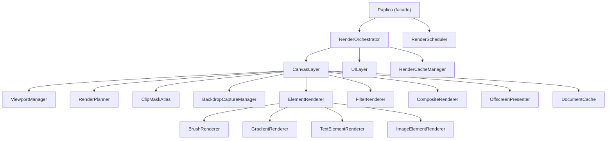
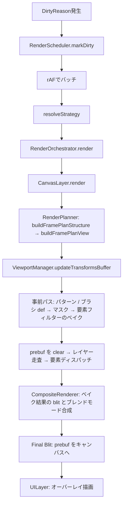

# レンダラーアーキテクチャ

> [!TIP]
> **前提ページ:** なし。このページから読む。

Paplicoはブラウザ上で動作する無限キャンバスのドローイングアプリケーションである。描画エンジンにはWebGPU（ブラウザの次世代グラフィックスAPI）を採用しており、Canvas 2D APIでは実現が難しいGPUアクセラレーションによる高速な描画・合成・フィルター処理を可能にしている。

このページでは、`core/renderer/` に実装されたレンダリングエンジンの全体像を解説する。モジュール構成、1フレームの流れ、キャッシュ戦略、シェーダー一覧を順に辿ることで、レンダラーがどのように設計され、`ClipMaskAtlas`・`BackdropCaptureManager` を含む各部品がどう連携しているかを把握できる。

> [!NOTE]
> このページはWebGPUの基本的な概念（デバイス、コマンドバッファ、レンダーパス等）を既知として扱う。WebGPU自体の入門は [WebGPU Fundamentals](https://webgpufundamentals.org/) 等を参照されたい。

## 全体像

1. `RenderScheduler` が DirtyReason を集約し、そのフレームで使う `RenderStrategy` を決める。
2. `RenderOrchestrator` が各 `CanvasTarget` に描画を配布し、共有GPUリソースとターゲットごとの状態を引き渡す。
3. `RenderPlanner` が可視レイヤー・要素・バックドロップ対象を整理する。`CanvasLayer` はメインパスの前に、`ClipMaskAtlas` によるマスクの事前生成と、`FilterRenderer` による要素フィルターのオフスクリーンベイクを済ませる。
4. `CanvasLayer` はタイルキャッシュを介さず要素を直接描画する。バックドロップフィルターを要する要素はフレーム内で共有キャプチャした背景からGaussianピラミッドを構築し、必要な範囲をクロップして合成する。ガラスの押し出し（glass extrude）の屈折合成は、メインパスを要素の位置で中断して処理する。
5. インラインで処理できないクリップや特殊合成は `OffscreenPresenter` に委譲する。
6. `CompositeRenderer` がベイク済みテクスチャの blit とブレンドモード合成を処理する。
7. `UILayer` が選択枠やカーソルなどのオーバーレイを重ね、最終結果をキャンバスへ出力する。

## 座標系

レンダラーを読むうえで先に押さえるべき前提は、Paplico が `Screen Space`・`World Space`・`NDC` の3つを明確に分けていることだ。入力イベントはスクリーン座標で届くが、ドキュメント内の要素やビューポートは常にワールド座標で保持し、最終的にGPUへ渡す直前にNDCへ正規化する。

| 座標系 | 原点 / 軸方向 | 値域 | 主な用途 |
|---|---|---|---|
| `Screen Space` | キャンバス左上が原点、Y軸は下向き | `0..canvasWidth`, `0..canvasHeight` のCSSピクセル | Pointer Event、DOMオーバーレイ、最終出力先のキャンバス |
| `World Space` | 論理キャンバスの `(0, 0)` を原点、Y軸は上向き | 無限 | 要素座標、ヒットテスト、コラボレーション同期、ビューポート中心 |
| `NDC` | 画面中心が原点、Y軸は上向き | `-1..1` | WebGPU の頂点シェーダー出力、blit / composite パス |

<figure className="my-6 overflow-x-auto rounded-xl border border-zinc-800/10 bg-white/60 p-4 dark:border-zinc-100/10 dark:bg-zinc-950/40">
  <svg
    aria-labelledby="coordinate-spaces-title coordinate-spaces-desc"
    role="img"
    viewBox="0 0 980 360"
    width="100%"
    xmlns="http://www.w3.org/2000/svg"
  >
    <title id="coordinate-spaces-title">Paplico coordinate transform</title>
    <desc id="coordinate-spaces-desc">
      同じ点Pが Screen Space, World Space, NDC でどう表現されるかと、screenToWorld / worldToNDC の変換の流れを示す図
    </desc>
    <defs>
      <marker id="arrow-head" markerHeight="8" markerWidth="8" orient="auto-start-reverse" refX="7" refY="4">
        <path d="M0 0 L8 4 L0 8 Z" fill="#334155" />
      </marker>
      <marker id="red-arrow-head" markerHeight="8" markerWidth="8" orient="auto-start-reverse" refX="7" refY="4">
        <path d="M0 0 L8 4 L0 8 Z" fill="#DC2626" />
      </marker>
    </defs>

    <text fill="#0F172A" fontFamily="ui-sans-serif, system-ui, sans-serif" fontSize="28" fontWeight="700" x="36" y="42">
      Coordinate transform overview
    </text>
    <text fill="#475569" fontFamily="ui-sans-serif, system-ui, sans-serif" fontSize="16" x="36" y="68">
      原点と軸方向の違いによって、同じ位置でも座標値の表し方が変わる。
    </text>

    <rect fill="#F8FAFC" height="208" rx="18" stroke="#CBD5E1" strokeWidth="2" width="256" x="36" y="96" />
    <text fill="#0F172A" fontFamily="ui-sans-serif, system-ui, sans-serif" fontSize="22" fontWeight="700" x="58" y="130">
      1. Screen Space
    </text>
    <rect fill="#FFFFFF" height="124" rx="10" stroke="#CBD5E1" strokeDasharray="4 4" strokeWidth="1.5" width="176" x="78" y="156" />
    <circle cx="78" cy="156" fill="#0F172A" r="4" />
    <line markerEnd="url(#arrow-head)" stroke="#0F172A" strokeWidth="2.5" x1="78" x2="78" y1="156" y2="214" />
    <line markerEnd="url(#arrow-head)" stroke="#0F172A" strokeWidth="2.5" x1="78" x2="136" y1="156" y2="156" />
    <text fill="#334155" fontFamily="ui-sans-serif, system-ui, sans-serif" fontSize="14" x="90" y="150">
      origin (0, 0)
    </text>
    <text fill="#334155" fontFamily="ui-sans-serif, system-ui, sans-serif" fontSize="14" x="142" y="161">
      +X
    </text>
    <text fill="#334155" fontFamily="ui-sans-serif, system-ui, sans-serif" fontSize="14" x="86" y="222">
      +Y
    </text>
    <circle cx="198" cy="214" fill="#DC2626" r="6" />
    <text fill="#DC2626" fontFamily="ui-sans-serif, system-ui, sans-serif" fontSize="14" fontWeight="700" x="164" y="238">
      P = (screenX, screenY)
    </text>

    <rect fill="#F8FAFC" height="208" rx="18" stroke="#CBD5E1" strokeWidth="2" width="256" x="362" y="96" />
    <text fill="#0F172A" fontFamily="ui-sans-serif, system-ui, sans-serif" fontSize="22" fontWeight="700" x="384" y="130">
      2. World Space
    </text>
    <rect fill="#FFFFFF" height="124" rx="10" stroke="#CBD5E1" strokeDasharray="4 4" strokeWidth="1.5" width="176" x="404" y="156" />
    <circle cx="492" cy="218" fill="#0F172A" r="4" />
    <line markerEnd="url(#arrow-head)" stroke="#0F172A" strokeWidth="2.5" x1="492" x2="492" y1="218" y2="160" />
    <line markerEnd="url(#arrow-head)" stroke="#0F172A" strokeWidth="2.5" x1="492" x2="550" y1="218" y2="218" />
    <text fill="#334155" fontFamily="ui-sans-serif, system-ui, sans-serif" fontSize="14" x="504" y="212">
      origin (0, 0)
    </text>
    <text fill="#334155" fontFamily="ui-sans-serif, system-ui, sans-serif" fontSize="14" x="556" y="223">
      +X
    </text>
    <text fill="#334155" fontFamily="ui-sans-serif, system-ui, sans-serif" fontSize="14" x="500" y="164">
      +Y
    </text>
    <circle cx="544" cy="192" fill="#DC2626" r="6" />
    <text fill="#DC2626" fontFamily="ui-sans-serif, system-ui, sans-serif" fontSize="14" fontWeight="700" x="510" y="246">
      P = (worldX, worldY)
    </text>

    <rect fill="#F8FAFC" height="208" rx="18" stroke="#CBD5E1" strokeWidth="2" width="256" x="688" y="96" />
    <text fill="#0F172A" fontFamily="ui-sans-serif, system-ui, sans-serif" fontSize="22" fontWeight="700" x="710" y="130">
      3. NDC
    </text>
    <rect fill="#FFFFFF" height="124" rx="10" stroke="#CBD5E1" strokeDasharray="4 4" strokeWidth="1.5" width="124" x="754" y="156" />
    <line stroke="#94A3B8" strokeWidth="1.5" x1="816" x2="816" y1="156" y2="280" />
    <line stroke="#94A3B8" strokeWidth="1.5" x1="754" x2="878" y1="218" y2="218" />
    <circle cx="816" cy="218" fill="#0F172A" r="4" />
    <line markerEnd="url(#arrow-head)" stroke="#0F172A" strokeWidth="2.5" x1="816" x2="816" y1="218" y2="160" />
    <line markerEnd="url(#arrow-head)" stroke="#0F172A" strokeWidth="2.5" x1="816" x2="874" y1="218" y2="218" />
    <text fill="#334155" fontFamily="ui-sans-serif, system-ui, sans-serif" fontSize="14" x="828" y="212">
      origin (0, 0)
    </text>
    <text fill="#334155" fontFamily="ui-sans-serif, system-ui, sans-serif" fontSize="14" x="846" y="173">
      +Y
    </text>
    <text fill="#334155" fontFamily="ui-sans-serif, system-ui, sans-serif" fontSize="14" x="880" y="223">
      +X
    </text>
    <text fill="#64748B" fontFamily="ui-sans-serif, system-ui, sans-serif" fontSize="12" x="736" y="172">
      (-1, +1)
    </text>
    <text fill="#64748B" fontFamily="ui-sans-serif, system-ui, sans-serif" fontSize="12" x="884" y="172">
      (+1, +1)
    </text>
    <text fill="#64748B" fontFamily="ui-sans-serif, system-ui, sans-serif" fontSize="12" x="736" y="294">
      (-1, -1)
    </text>
    <text fill="#64748B" fontFamily="ui-sans-serif, system-ui, sans-serif" fontSize="12" x="884" y="294">
      (+1, -1)
    </text>
    <circle cx="842" cy="205" fill="#DC2626" r="6" />
    <text fill="#DC2626" fontFamily="ui-sans-serif, system-ui, sans-serif" fontSize="14" fontWeight="700" x="808" y="246">
      P = (ndcX, ndcY)
    </text>

    <line markerEnd="url(#red-arrow-head)" stroke="#DC2626" strokeWidth="3" x1="292" x2="362" y1="200" y2="200" />
    <line markerEnd="url(#red-arrow-head)" stroke="#DC2626" strokeWidth="3" x1="618" x2="688" y1="200" y2="200" />
    <text fill="#0F172A" fontFamily="ui-sans-serif, system-ui, sans-serif" fontSize="17" fontWeight="700" x="298" y="184">
      screenToWorld()
    </text>
    <text fill="#475569" fontFamily="ui-sans-serif, system-ui, sans-serif" fontSize="13" x="298" y="220">
      zoom / rotation を戻す
    </text>
    <text fill="#0F172A" fontFamily="ui-sans-serif, system-ui, sans-serif" fontSize="17" fontWeight="700" x="624" y="184">
      worldToNDC()
    </text>
    <text fill="#475569" fontFamily="ui-sans-serif, system-ui, sans-serif" fontSize="13" x="624" y="220">
      screen へ投影してから正規化
    </text>
  </svg>
  <div className="mt-4 grid gap-3 text-sm md:grid-cols-3">
    <div className="rounded-lg border border-zinc-800/10 bg-white/80 p-3 dark:border-zinc-100/10 dark:bg-zinc-900/70">
      <p className="font-semibold text-zinc-900 dark:text-zinc-100">Screen Space</p>
      <p className="mt-1 text-zinc-700 dark:text-zinc-300">
        Pointer Event と DOM オーバーレイが使う座標系。原点はキャンバス左上で、Y軸は下向き、単位は CSS ピクセル。
      </p>
    </div>
    <div className="rounded-lg border border-zinc-800/10 bg-white/80 p-3 dark:border-zinc-100/10 dark:bg-zinc-900/70">
      <p className="font-semibold text-zinc-900 dark:text-zinc-100">World Space</p>
      <p className="mt-1 text-zinc-700 dark:text-zinc-300">
        ドキュメントの要素・選択状態・同期データを保持する座標系。原点は論理キャンバス中心で、Y軸は上向き。
      </p>
    </div>
    <div className="rounded-lg border border-zinc-800/10 bg-white/80 p-3 dark:border-zinc-100/10 dark:bg-zinc-900/70">
      <p className="font-semibold text-zinc-900 dark:text-zinc-100">NDC</p>
      <p className="mt-1 text-zinc-700 dark:text-zinc-300">
        GPU に渡す最終的な正規化座標系。画面中心が `(0, 0)` で、Y軸は上向き、X/Y ともに値域は `-1..1`。
      </p>
    </div>
  </div>
</figure>

`viewport.x` / `viewport.y` は「画面中心が今どのワールド座標を見ているか」を表し、`viewport.zoom` はワールド単位からスクリーンピクセルへの倍率、`viewport.rotation` は画面中心まわりの回転角を表す。つまり、座標変換は「画面中心を基準に平行移動する」「回転を適用または打ち消す」「ズーム倍率を掛けるまたは戻す」の3段階で考えると追いやすい。

### 変換フロー

1. **入力**: ツールは Pointer Event の `screenX / screenY` を `screenToWorld()` に通し、画面中心基準への移動、逆回転、`zoom` の除算、Y軸反転を行ってワールド座標へ変換する。
2. **保存**: ドキュメント、要素、選択、同期データはワールド座標で保持する。これによりズームやスクロールが変わってもデータそのものは不変になる。
3. **描画**: レンダラーは `worldToScreen()` でズームと回転を適用してスクリーン座標へ戻し、`worldToNDC()` で `[-1, 1]` のNDCへ正規化してGPUに渡す。

代表的な式は次のとおりである。実装は `pkgs/web/src/core/utils/geometry/geometry.ts` にある。

```ts
worldX = viewport.x + unrotX / viewport.zoom;
worldY = viewport.y - unrotY / viewport.zoom;

screenX = canvasWidth / 2 + rotX;
screenY = canvasHeight / 2 + rotY;

ndcX = (screenX / canvasWidth) * 2 - 1;
ndcY = 1 - (screenY / canvasHeight) * 2;
```

`Screen Space` だけがY軸下向きで、`World Space` と `NDC` はY軸上向きで揃っている点が重要である。この差分があるため、`screenToWorld()` と `worldToNDC()` ではY軸反転が入る。ビューポート回転がある場合は、スクリーン↔ワールド変換の途中で画面中心まわりの回転を打ち消す / 適用することで整合性を保っている。

## 設計原則

レンダリングエンジンは毎フレームGPUリソースを確保・使用・解放するサイクルを繰り返す。素朴に実装するとアロケーションの頻発やキャッシュの不整合が性能ボトルネックになるため、以下の原則でこれらを回避している。

- **遅延破棄**: GPUテクスチャ（GPU上に保持される画像データ）やバッファはin-flightのコマンドバッファが参照している可能性があるため、即時破棄せずフレーム開始時に遅延破棄する
- **ピークベースのプールサイジング**: フレーム中の最大使用量を記録し、次フレームでその容量を事前確保する。初回フレームは遅いが、2フレーム目以降はアロケーション不要になる
- **量子化による時間的再利用**: テクスチャサイズを128px単位に切り上げることで、ズーム中の微小なサイズ変動でも同一バケットのテクスチャを再利用できる
- **スタックベースの状態管理**: オフスクリーンパスのネストに対応するため、ビューポートuniform（GPUシェーダーに渡す定数パラメータのバッファ）をグローバル上書きではなくpush/popスタックで管理する
- **自己検証キャッシュ**: 明示的な無効化通知を不要にするため、キャッシュエントリがフィンガープリント（キャッシュの有効性を検証するためのハッシュ値）を保持し、ヒット時に自動検証する
- **インスタンシング + バッチ**: パスの strip とブラシの dab は、1本・1個を1インスタンスとするインスタンスドレンダリング（1つのジオメトリをGPUが複数回複製して描画する手法）で描く。strip のインスタンスと被覆率ページはフレーム内で集め、submit の前に1回でアップロードする。ribbon ストロークはキューに積み、まとめて1回のインスタンス描画で flush する

## モジュール概観

レンダラーは機能ごとにモジュール分割されている。以下は全モジュールの一覧と、それぞれの担当領域である。

| ディレクトリ | 主要モジュール | 役割 |
|---|---|---|
| (root) | RenderOrchestrator | GPUデバイス初期化、パイプライン生成、キャンバスターゲット管理、レンダーディスパッチ |
| (root) | RenderScheduler | DirtyReason の収集と RenderStrategy への解決、rAFによるフレームスケジューリング |
| (root) | CanvasTarget | Canvas要素のラッパー。ResizeObserver、ビューポート（画面に表示されている領域）状態を保持 |
| (root) | PipelineFactory | GPUパイプライン生成の共通ヘルパー |
| canvas/ | CanvasLayer, CanvasLayerTypes | キャンバス単位のパイプライン統括と、パイプライン内の共有型 |
| [canvas/pipeline/](/devdocs/renderer/pipeline) | ViewportManager, RenderPlanner, FrameGraph, CompositeRenderer, OffscreenPresenter, DocumentCache, TexturePool, UniformScope, ClipMaskAtlas, MaskApplicationPlan, BackdropCaptureManager, BackdropEffectCoordinator, BlurPyramid, FilterRenderer, PreFilterRenderer, strips/StripFrame | フレームの組み立て、マスクの事前生成と適用計画、バックドロップキャプチャ、フィルター実行、strip の描画 |
| [canvas/elements/](/devdocs/renderer/elements) | ElementRenderer, PathElementRenderer, GradientRenderer 等 | 要素種別ごとのレンダリングディスパッチ |
| [canvas/pipeline/brush/](/devdocs/renderer/brush) | BrushRenderer, DabRenderer, RibbonRenderer, WetStrokeRenderer, DabEvaluator | Dabベースのインスタンスドブラシ描画とリボン・wet層 |
| [filters/](/devdocs/renderer/filters) | 個別フィルターハンドラー | ラスター・ジオメトリ・3D・hanakla-kit・SVG の各フィルター。一覧は[フィルター](/devdocs/renderer/filters)を参照 |
| [canvas/caches/](/devdocs/renderer/caches) | RenderCacheManager, OutlineCache, StripCache 等 | アウトライン・strip・テクスチャ・BindGroup（GPUリソースをシェーダーにバインドする単位）の再利用キャッシュ |
| [ui/](/devdocs/renderer/ui) | UILayer | 選択オーバーレイ、カーソル、ガイドの描画 |
| [shaders/](#シェーダー) | `*.wgsl.ts` | 共有のWGSLシェーダーソース。フィルター専用のWGSLは filters/、ブラシ専用のWGSLは canvas/pipeline/brush/shaders/ にある |
| generators/ | GradientTextureGenerator, MeshGradientTextureGenerator, CornerRadiusProcessor | グラデーションテクスチャ生成と角丸の適用 |
| geometry/ | strokeTessellator, bezierFlatten, strips/ | ストロークテッセレーション、平坦化、被覆率 strip の生成 |

以下の図は、モジュール間の依存関係を示している。最上位の Paplico ファサードから RenderOrchestrator を経由して各モジュールに処理が流れる構造になっている。RenderScheduler は Paplico ファサードがキャンバスターゲットごとに生成する。



## レンダリングパイプライン概要

1フレームのレンダリングは、「何かが変わった」という通知から始まり、最終的にキャンバスへの描画で終わる。以下のフローチャートはその全体の流れを示している。



### RenderStrategy

描画の起点となるのはDirtyReason（再描画が必要になった理由を表す列挙型）である。ユーザーがビューポートを操作した、要素を移動した、ドキュメントが更新されたなど、さまざまな理由で再描画が必要になる。しかし、すべての変更に対してドキュメント全体をフルレンダリングするのは非効率である。選択カーソルが動いただけなのに全レイヤーを再描画する必要はない。

そこでRenderSchedulerは、蓄積された複数のDirtyReasonを1つのRenderStrategy（DirtyReasonから解決された再描画戦略）に集約する。レンダラーはこのStrategyだけを受け取り、必要最小限の処理を実行する。

| Strategy | 説明 | トリガーとなる DirtyReason |
|---|---|---|
| `full` | ドキュメント全体を再レンダリング | `document`, `editingScope`, `resize`, `collaboration` |
| `fullInteraction` | ビューポート操作中に blit できないフレームの再レンダリング。描画パスは `full` と同じ | `viewport`(操作中) に `preview` / `render` が同乗、または transient 要素・override が存在 |
| `fullTransformOnly` | バウンズキャッシュを保持したまま再レンダリング。移動・ペースト・複製等の形状非変更操作用 | `elementMove` |
| `viewportBlit` | ドキュメント描画をスキップし、キャッシュ済みの合成フレームを現ビューポートへ再投影blit（テクスチャを別のテクスチャにコピー描画する操作）。UIレイヤーだけ再描画 | `viewport`(操作中), `selection` / `cursor` のみ |
| `overlayOnly` | boundsCache などを捨てずにドキュメントを再レンダリング | `preview`, `render`(非同期リソース読込), settle 後の `viewport` |

ビューポート操作中は `viewportBlit` でキャッシュ済みフレームを blit し、操作完了後100ms debounceで `overlayOnly` によりフル品質で再レンダリングする。選択やカーソルの変化もドキュメントの画素を変えないので `viewportBlit` になる。CanvasLayer は有効なキャッシュを持たないときに通常の再レンダリングへフォールバックする。

`viewportBlit` が転写するのは合成フレームキャッシュである。CanvasLayer は回転なしの prebuf にドキュメントを描き、完成した prebuf をこのキャッシュへコピーする。エクスポート、要素を絞った描画、ツールのプレビュー（`elementOverrides` / `transientElements`）を含むフレームはキャッシュに取り込まない。ライブキャンバスの prebuf はビューポートの各辺に `STORE_MARGIN_PX`（256px）の余白を持つ。同じズームでのパンは、可視範囲がベイク済みの領域に収まっている間 blit で済む。領域を出たフレーム、HDR 露出またはソフトプルーフを要するフレームは通常の再レンダリングになる。

`full` と `fullTransformOnly` のフレームは、変更要素 ID が追跡できていれば変更領域だけを描き直し、残りをキャッシュから復元する。編集スコープ・要素の孤立表示・HDR 露出・ソフトプルーフ・ピクセルプレビューのいずれかが有効なフレームと、バックドロップ要素またはガラスの押し出しを含むフレームは全体を描き直す。可否は `CanvasLayer.planPartialRedraw()` が判定し、条件を満たさないフレームは全体の描画にフォールバックする。

この多段階のStrategy設計は、「何が変わったか」（DirtyReason）と「どう再描画するか」（RenderStrategy）を分離するためにある。ツール側は `markDirty("selection")` のように意味的なイベントだけを投げればよく、最適な描画戦略の解決はスケジューラが一元的に担う。これにより、新しいDirtyReasonの追加やStrategy最適化が独立して行える。

### フレームレンダリングの流れ

各ステップの詳細を順に見ていく。

1. **スケジューリング**: RenderScheduler が同一フレーム内の複数 `markDirty` 呼び出しを合体し、rAF（requestAnimationFrame。ブラウザの画面更新タイミングに同期するコールバックAPI）コールバックで `resolveStrategy()` を実行
2. **ディスパッチ**: RenderOrchestrator が各 CanvasTarget に対してレンダリングを実行
3. **フレームプラン**: RenderPlanner がドキュメントを走査し、可視要素・フィルター分類・合成ニーズを分析
4. **トランスフォーム**: ViewportManager が要素のワールド変換行列をStorageBufferに書き込み
5. **事前パス**: CanvasLayer がパターンとブラシの def、マスク、要素フィルターの順にオフスクリーンで用意する。要素フィルターは FilterRenderer がここでベイクし、マスクはそのベイク結果に後から掛かる
6. **描画**: CanvasLayer が prebuf にレイヤーごとに要素を描画。ElementRenderer が要素種別に応じてディスパッチする。フィルター済みの要素は、ベイク済みテクスチャの blit になる
7. **合成**: CompositeRenderer がブレンドモードを持つ要素とレイヤーを合成する
8. **最終 blit**: prebuf をビューポートの回転を掛けてキャンバスへ転写する。HDR 露出またはソフトプルーフが有効なフレームは、中間テクスチャを経由して後処理パスを通す
9. **UI**: UILayer が選択ハイライト・カーソル・ツールオーバーレイを描画

CanvasLayer はこれらを `FrameGraph` のパスとして宣言し、宣言順に実行する。

## コアモジュール

### RenderOrchestrator

レンダリングエンジンのトップレベルオーケストレータ。以下を所有・管理する:

- **GPUデバイス**: `navigator.gpu.requestAdapter()` → `requestDevice()` によるデバイス初期化
- **GPUパイプライン**（シェーダーやレンダリング設定を組み合わせた描画手順の定義）: ジオメトリパイプライン（unified, strip）と gradientFill、blit 系（マスク付き・マスクチェーン・消しゴムマスク・バックドロップ・quad・mesh の各バリアント）、composite、exposure の生成と保持。フィルター専用のパイプラインは各フィルターハンドラーが持つ
- **CanvasTarget**: キャンバスごとの TargetData（GPUコンテキスト、uniform buffer、CanvasLayer、UILayer、BackdropCaptureManager、RenderCacheManager）を管理。ブラシ描画の BrushRenderer は CanvasLayer が持つ
- **フィルターハンドラー**: FilterRenderer に全フィルターハンドラーを登録する。内訳は[フィルター](/devdocs/renderer/filters)を参照
- **render()メソッド**: `FrameRequest`（viewport、document、strategy、changedElements など）と `UIOverlayState` を受け取り、アクティブなターゲットの CanvasLayer と UILayer を同じコマンドエンコーダーで実行して submit する

RenderOrchestratorがGPUデバイスとパイプラインを一元管理する理由は、WebGPUのシェーダーコンパイルとパイプライン生成が高コストであるため。デバイスレベルのリソース（シェーダーモジュール、バインドグループレイアウト、パイプライン）を1回だけ生成し、全キャンバスターゲットで共有することで、GPUメモリとコンパイル時間を削減する。一方、キャンバスごとのリソース（uniformバッファ、キャッシュ、UILayer）はTargetDataとして分離し、将来の複数キャンバス対応と独立したキャッシュライフサイクルを可能にしている。

### RenderScheduler

オンデマンドレンダリングのスケジューラ。Paplico ファサードがキャンバスターゲットごとに生成し、解決した Strategy と変更要素 ID をコールバックで描画側へ渡す。以下の責務を持つ:

- **DirtyReason の収集**: `markDirty(reason)` で汚れた理由を蓄積
- **rAFバッチング**: 同一フレーム内の複数呼び出しを1回のレンダリングに合体
- **RenderStrategy の解決**: `resolveStrategy()` で蓄積された DirtyReason から最適な Strategy を決定
- **インタラクション判定**: ビューポート操作中は `viewportBlit`、100ms settle後に `overlayOnly` でフル品質再レンダリング

## キャッシュシステム

毎フレーム全ての要素をゼロから計算し直すのは非効率である。パスのアウトラインと strip、ブラシのスタンプデータ、グラデーションのGPUリソースなど、要素が変更されない限り再利用できるデータは多い。キャッシュシステムはこれらの中間生成物を保持し、変更があった要素だけを再構築することでレンダリング性能を維持する。

RenderCacheManager が要素単位のキャッシュを統合管理する。RenderOrchestrator がキャンバスターゲットごとに1インスタンスを所有し、CanvasLayer・ElementRenderer・BrushRenderer に渡す。キャッシュ一式はドキュメント ID ごとのスコープに分かれており、`CanvasLayer.render()` の冒頭で描画対象のドキュメントのスコープに切り替わる。

代表的なキャッシュは次のとおりである。全キャッシュの一覧、キー、予算は[キャッシュと無効化](/devdocs/renderer/caches)にまとめている。

| キャッシュ | 内容 |
|---|---|
| OutlineCache | ローカル空間のアウトライン（塗りのポリライン、線の三角形） |
| StripCache | パスのテクセル空間へラスタライズした strip と alpha |
| StampCache | ブラシスタンプデータ |
| GradientCache | グラデーションの uniform / stops バッファと BindGroup |
| FilteredElementCache | ポストフィルターのベイク結果 |

### キャッシュ無効化

各キャッシュはエントリにフィンガープリントを保持し、ヒット時に現在の要素データと照合する（self-validating）。要素が変更された場合にのみ再構築する。

`RenderStrategy.full` と `RenderStrategy.fullTransformOnly` のフレームでは、`RenderCacheManager.onDocumentChange()` がドキュメント内に存在しない要素のキャッシュエントリを削除する。変更要素 ID が追跡できていて削除要素が無いフレームは、この走査を省略する。

変更要素 ID が追跡できているフレームは、どちらの Strategy も変更要素のトランスフォームだけを部分更新する。追跡が失われたフレームでのみ両者に差が出る。`full` はバウンズキャッシュを破棄し、`fullTransformOnly` は保持する。移動・複製等の操作では要素形状が変わらないため、ローカルバウンズを再利用できる。

## シェーダー

シェーダーとは、GPU上で実行される小さなプログラムであり、頂点の座標変換やピクセルの色計算を担う。PaplicoではWGSL（WebGPU Shading Language）でシェーダーを記述し、TypeScriptファイル（`*.wgsl.ts`）としてエクスポートしている。これらは `compileShaderModule()` で WebGPU の `GPUShaderModule` にコンパイルされる。

> [!TIP]
> シェーダーの uniform 構造体は `compileShaderModule()` が自動解析するため、手動でオフセット計算を行う必要はない。利用箇所は [パイプライン](/devdocs/renderer/pipeline) と `pkgs/web/src/core/utils/wgpu-utils.ts` を参照。

| シェーダー | 用途 |
|---|---|
| unified.wgsl | 頂点バッファ入力のジオメトリレンダリング（アートボード背景など） |
| strip.wgsl | 被覆率 strip のインスタンス描画（パスの塗りと線） |
| paintCommon.wgsl | unified と strip が共有するペイント段（ソリッド / グラデーション / パターン） |
| maskCommon.wgsl | クリップマスクとオブジェクトマスクのサンプリング。unified、strip、ブラシの各シェーダーが共有する |
| transformCommon.wgsl | トランスフォーム共通ユーティリティ |
| gradientCommon.wgsl | グラデーション共通ユーティリティ |
| gradientFill.wgsl | グラデーションフィル |
| blit.wgsl | テクスチャ転写。マスク付き、マスクチェーン、消しゴムマスク、バックドロップ、quad、mesh、exposure の各バリアントを含む |
| quadProjection.wgsl | quad blit が共有する射影補正 |
| uvRectBlit.wgsl | テクスチャの一部矩形をフルスクリーンに転写 |
| simpleBlit.wgsl | フォーマット変換つきのフルスクリーン転写。UILayer が使う |
| bezierPath.wgsl | UIオーバーレイ図形の描画。UILayer が使う |
| fillTriangle.wgsl | UIオーバーレイの塗り三角形のインスタンス描画。UILayer が使う |
| composite.wgsl | ブレンドモード合成 |
| blendModes.wgsl | ブレンドモード関数。composite と SVG の feBlend が共有する |
| blurPyramid.wgsl | バックドロップ用 Gaussian ピラミッドの1段を作るダウンサンプル |
| extrudeRefraction.wgsl | 押し出しアピアランスのガラス屈折合成 |
| meshLit.wgsl | 押し出しメッシュのライティング描画 |
| softProofBlit.wgsl | ソフトプルーフの 3D LUT を掛ける最終表示パス |
| dotGrid.wgsl | アートボードが無いドキュメントのドット背景 |
| worldCellHash.wgsl | ワールド空間グリッドのセル乱数。散布系フィルターが共有する |
| coonsPatchCompute.wgsl | フリーグラデーションのテクスチャ生成（コンピュートシェーダー） |
| meshGradientCompute.wgsl | メッシュグラデーションのテクスチャ生成（コンピュートシェーダー） |

上の表は `shaders/` にある共有シェーダーである。ブラシのシェーダー（`brushDab.wgsl` など）は `canvas/pipeline/brush/shaders/` に、フィルターのシェーダー（`blur.wgsl`、`dropShadow.wgsl`、`frostGlass.wgsl`、`pixelate.wgsl` など）は `filters/` にある。クリップマスク専用のシェーダーは無い。マスクは要素に白のソリッド Fill を与えて strip パイプラインで描く。

> [!TIP]
> **次に読むページ:** [パイプライン](/devdocs/renderer/pipeline)
