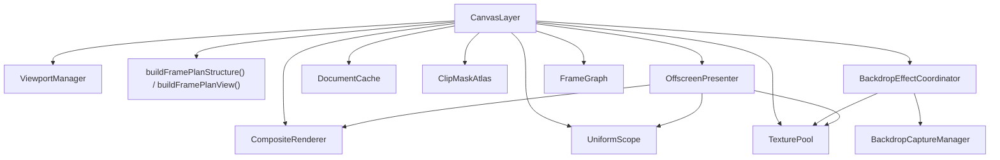

# パイプライン

> [!TIP]
> **前提ページ:** [レンダラーアーキテクチャ](/devdocs/renderer)

レンダリングパイプライン（1枚のフレームが画面に表示されるまでの一連の処理段階）は、描画エンジンの中核をなす仕組みである。Paplicoでは、ビューポート管理・描画計画・合成・オフスクリーン処理・クリップマスク事前生成・バックドロップキャプチャ・テクスチャ管理といった責務をそれぞれ独立したモジュールに分割し、`CanvasLayer` がファサード（複数のサブシステムへの統一的なアクセスポイント）としてこれらを束ねている。

このページでは、`core/renderer/canvas/` の `CanvasLayer` と、`core/renderer/canvas/pipeline/` を構成する各モジュールの役割・設計意図・相互関係を解説する。パイプラインが単一の巨大クラスではなく複数モジュールに分割されているのは、各モジュールが独立した状態（プール、バッファ、キャッシュ）を所有することで変更の影響範囲を限定し、テスタビリティと保守性を確保するためである。

> [!NOTE]
> このページは [レンダラーアーキテクチャ](/devdocs/renderer) の内容を前提とする。`RenderOrchestrator` から `CanvasLayer` がどのように呼び出されるかを先に把握しておくと理解しやすい。

## モジュール概観

以下のテーブルは、パイプラインを構成する全モジュールとその役割の一覧である。`CanvasLayer` を頂点として、各モジュールが特定の責務を担う。

| モジュール | 役割 |
|---|---|
| `CanvasLayer` | パイプライン全体の統括。`render()` がエントリポイント |
| `CanvasLayerTypes` | パイプライン内の共有型定義・定数・コールバック型。循環importを防止 |
| `ViewportManager` | ビューポートuniform buffer（GPUシェーダーに渡す定数パラメータのバッファ）とトランスフォームStorage Buffer（GPUが読み書きできる大容量バッファで、uniform bufferより大きいデータ向け）の管理 |
| `RenderPlanner` | ドキュメントからFramePlan（1フレーム分の描画手順をまとめたデータ構造）を構築する純粋関数群 |
| `FrameGraph` | 1フレームのパスを宣言順に実行し、フレーム内の一時テクスチャを寿命に合わせて確保・返却する |
| `CompositeRenderer` | ブレンドモード合成とテクスチャblit（テクスチャを別のテクスチャにコピー描画する操作） |
| `OffscreenPresenter` | オフスクリーンレンダーパス（メイン画面ではなく一時テクスチャに対する描画パス）の生成とクリップグループ描画 |
| `DocumentCache` | composite・prebuffer・backdrop-mask用テクスチャの遅延生成と再利用 |
| `strips/StripFrame` | フレーム内の strip インスタンスと被覆率ページを集め、submit 前に一括アップロードして描画する |
| `TexturePool` | フレーム間のGPUテクスチャプーリング。available textureの推定メモリ予算に基づくeviction |
| `UniformScope` | パスごとのビューポートuniform buffer / bind group（GPUリソースをシェーダーにバインドする単位）ペアのプール |
| `ClipMaskAtlas` | クリップパスとオブジェクトマスクのマスクテクスチャを事前レンダリングし、フレーム間で再利用 |
| `MaskApplicationPlan` | マスクをインラインで掛けるかベイク後に掛けるか、グループを isolate するかを決める純粋関数群 |
| `BackdropCaptureManager` | バックドロップ用に prebuf の内容を矩形で切り出してキャプチャ |
| `BackdropEffectCoordinator` | バックドロップを読む効果の要求をまとめ、共有キャプチャと Gaussian ピラミッド（`BlurPyramid`）を配る |
| `PipelineFactory` | WebGPUレンダーパイプラインの生成ヘルパー。`core/renderer/` 直下にある |

## CanvasLayer

複数のサブモジュールを内部に持つパイプラインには、呼び出し側が個々のモジュールを意識せずに済む統一的な入口が必要である。`CanvasLayer` がそのファサードとして機能し、`render()` メソッドが単一のエントリポイントとなって1フレームの描画処理を完結させる。

`render()` の処理は以下の段階で進行する。まずフレーム開始時にサブモジュールのプール（`TexturePool`, `UniformScope`, `CompositeRenderer`, `OffscreenPresenter`, `StripFrame` など）をリセットする。`RenderStrategy` が `viewportBlit` で、合成フレームキャッシュが可視範囲を覆っていれば、キャッシュを blit してドキュメントの描画を省く。それ以外のフレームは、`RenderStrategy` に応じてキャッシュの無効化やトランスフォームの再構築を行う。その後 `renderDocument()` が1フレーム分のパスを `FrameGraph` に宣言し、`executeFrame()` がそれを実行する。HDR 露出またはソフトプルーフが有効なフレームは、中間テクスチャへ描いてから後処理パスでキャンバスへ転写する。

`renderDocument()` が宣言するパスは次の順である。

1. パターン def とブラシ def のラスタライズ
2. マスクの事前レンダリングと割り当て（`applyClipMasks`）
3. 要素フィルターのベイク、ベイク結果へのマスク適用、Repeat のベイク（`executeFilterPlans` → `applyPostMasks` → `bakeRepeats`）
4. prebuf のクリアと、レイヤーごとの要素描画・バックドロップ処理・レイヤー合成
5. prebuf をキャンバスへ転写する最終 blit
6. 完成した prebuf の合成フレームキャッシュへのコピー

描画中プレビューは専用のパスを持たない。ツールは `FrameRequest.transientElements` と `elementOverrides` でプレビュー要素を渡し、それらは通常の要素描画に合流する。

主要なプロパティとして `ViewportManager`, `CompositeRenderer`, `OffscreenPresenter`, `DocumentCache`, `TexturePool`, `UniformScope`, `ClipMaskAtlas`, `BackdropEffectCoordinator`, `StripFrame`, `BrushRenderer` を所有する。`BackdropCaptureManager`・`RenderCacheManager`・`FilterRenderer` は RenderOrchestrator が生成して渡す。GPU パイプライン（stroke, fill, blit, composite 等）とバインドグループレイアウトもコンストラクタで受け取り保持する。

ビューポートバインディングのスタック管理（`pushViewportBinding` / `popViewportBinding`）により、オフスクリーンパスで一時的なuniform bufferに切り替え、完了後にメインのバインディングに復帰する仕組みを持つ。

CanvasLayerをCanvasLayerTypes・ViewportManager・RenderPlanner・CompositeRenderer・OffscreenPresenter等に分割している理由は、各モジュールが独立した状態（プール、バッファ、キャッシュ）を所有し、変更の影響範囲を限定するためである。要素描画のロジック変更が合成処理に影響せず、フィルター追加がオフスクリーンパス管理に波及しない。

## CanvasLayerTypes

パイプラインモジュール間で共有される型定義・定数・コールバック型をまとめたファイル。循環importを防止する目的で、全サブモジュールがここからのみ型をimportする。

主要な型として `ViewportState`（現在のビューポートとバウンズキャッシュ）、`CompositeState`（合成用テクスチャ群）、`RenderState`（描画中のトランスフォームインデックスとマスクバインドグループ）、`CompositeRenderContext`（オフスクリーンパスの再開コールバック）がある。

定数として `RENDER_SAMPLE_COUNT`（=1, MSAAなし）、`BLEND_MODE_ORDER`（12種のブレンドモード）、`COMPOSITION_MODE_ORDER`（`normal`, `alpha-lock`）を定義する。

コールバック型（`RenderElementsFn`, `DispatchElementDirectFn`, `BlitTextureToCanvasFn` 等）は、`CanvasLayer` のメソッドをサブモジュールにDI（依存性注入: コンポーネントの依存先を外部から渡すパターン）するために使用される。

型定義とコールバック型を独立ファイルに分離する理由は、循環importの防止である。CanvasLayer・CompositeRenderer・OffscreenPresenter等の相互参照が必要な場面で、共有型のみを1箇所にまとめることでimportグラフのサイクルを断つ。

## ViewportManager

ビューポートuniformバッファとトランスフォームStorage Bufferを一元管理するモジュール。

オフスクリーンパスではメイン画面とは異なるビューポートパラメータ（中心座標、zoom、回転）が必要になる場面がある。たとえば、グループ要素をフィルター付きで一時テクスチャに描画する際、そのテクスチャ固有の座標系にビューポートを合わせなければならない。このとき、メイン画面のビューポート状態を壊さずにGPUバッファだけを一時的に切り替え、処理完了後に元に戻す必要がある。そのため、uniformバッファの更新には用途の異なる3つのメソッドを用意している:

- `setViewportUniforms()` — `viewportState` とGPUバッファを同時に更新する。通常のビューポート変更に使用
- `writeViewportUniformsToGPU()` — GPUバッファのみ更新。オフスクリーンパスでの一時的なビューポートオーバーライドに使用
- `restoreViewportUniformsToGPU()` — `viewportState` の値でGPUバッファを再同期

通常の描画では `setViewportUniforms` でCPU状態とGPUバッファを同時更新するが、オフスクリーンパスではGPUバッファだけを一時的に上書きし（`writeViewportUniformsToGPU`）、パス完了後にCPU状態から復元する（`restoreViewportUniformsToGPU`）。これにより、オフスクリーンパスが正規のビューポート状態を汚さない。

`updateTransformsBuffer()` は全要素のワールド変換行列をGPU Storage Bufferに書き込む。インデックス0は常にidentity（プレビューパスやフォールバック用）。グループの親子関係を走査して合成変換を計算し、事前確保した`Float32Array`に直接書き込むことでオブジェクトアロケーションとGC圧力を削減する。

`markTransformsDirty()` でダーティフラグを設定すると、次の `updateTransformsBuffer()` 呼び出しでバッファが再構築される。変更要素 ID が追跡できているフレームは `markElementTransformsDirty()` を使う。この場合は、変更要素とその祖先グループ、変更されたグループの子孫だけを再合成し、該当するスロット範囲だけをアップロードする。マスクの割り当てだけが変わったときは `writeMaskInfoOnly()` がマスクのフィールドだけを書き換える。ビューポートのみの変更（パン/ズーム）ではダーティにする必要はない。要素の変換行列はワールド空間で保持されるためである。

トランスフォームの事前確保`Float32Array`への直接書き込みは、フレームごとのオブジェクトアロケーションとGC圧力を回避するための設計選択である。要素数が数千に達する場合、中間Arrayオブジェクトの生成は無視できないGC負荷をもたらす。

## RenderPlanner

描画エンジンが1フレームを描画するには、「どのレイヤーのどの要素を、どの順序で、どのブレンドモードで、オフスクリーンパスが必要かどうか」を事前に決定する必要がある。FramePlan（1フレーム分の描画手順をまとめたPaplico独自のデータ構造）がこの決定結果を表現する。たとえば、3つのレイヤーがあり、うち1つにぼかしフィルターを持つ要素がある場合、FramePlanはそのレイヤーの当該要素にオフスクリーンパスが必要であることを示す。

`RenderPlanner` はドキュメントデータからこのFramePlanを構築する純粋関数群である。GPU状態への副作用を持たない。純粋関数として実装されているため、同じドキュメント状態を入力すれば常に同じFramePlanが返る。これにより単体テストが容易になる。

計画は2段で作られる。`buildFramePlanStructure()` はドキュメントだけから決まる部分を作り、CanvasLayer はドキュメントが変わるまでその結果を再利用する。`buildFramePlanView()` は毎フレーム、フィルターとバックドロップの候補をビューポートでカリングし、`FramePlan` を返す。`FramePlan` は以下を含む:
- `layerPlans` — レイヤーごとの描画計画（要素リスト、ブレンドモード、合成の必要性、バックドロップ境界でのセグメント分割）
- `filterPlans` — オフスクリーンフィルターパスが必要な要素の分類（ポストフィルター、サブフィルター、アピアランスごとのプラン）
- `backdropElementIds` / `allBackdropEntries` — バックドロップフィルターを持つ要素

`classifyElementFilters()` は個々の要素のフィルターを分類する。`FilterHandler` のメタデータ（`getRenderConfigure()` の `needsBackdrop`, `postProcess`, `preProcess`, `getExpansionMargin`）を参照してバックドロップフィルターとレギュラーフィルターを分離し、オフスクリーンパスが必要かどうかを判定する。オフスクリーンを要するサブフィルター、アピアランスごとの非normalブレンドモード、wash ストロークのいずれかがある場合は `AppearancePlan` を生成する。

`buildLayerSegments()` はバックドロップ要素の位置でレイヤーの要素リストをセグメントに分割する。各セグメントは連続する通常要素群と、その後に処理するバックドロップ要素のペアで構成される。

`buildPassPlan()` はこのセグメントをさらに細かく切り、メインパスを中断する位置を事前に宣言する。中断の種類は、バックドロップ要素（`backdrop`）、ブレンドモードまたは compositionMode を持つ要素（`compositeElement`）、ガラスの押し出しのインライン合成（`inlineBackdropCompose`）の3つである。

## CompositeRenderer

レイヤーや要素にはブレンドモード（乗算、スクリーン、オーバーレイなど、下のレイヤーとの色の合成方法を指定する属性）が設定されることがある。normalブレンドモード以外の合成は、単純な上書き描画では実現できず、ソースとデスティネーションの2枚のテクスチャをシェーダーで演算する必要がある。`CompositeRenderer` がこのブレンドモード合成とテクスチャblitを担当する。

`blitTextureToCanvas()` はオフスクリーンテクスチャをキャンバスに転写する。ワールド空間のバウンズとUV矩形を指定し、ビューポート変換を適用してNDC（Normalized Device Coordinates: -1〜+1の正規化されたGPU座標系）座標に変換する。`compositeSurfaceToCanvas()` はソース、ブレンドの背景（キャプチャ済みのターゲットとベーステクスチャ）、ブレンドモード、compositionMode を受け取り、シェーダー内でブレンドモード演算を実行する。

四辺形へ転写する `blitQuadToCanvas()` と、三角形メッシュへ転写する `blitMeshToCanvas()` もここにある。前者は4隅が変形した画像に、後者はメッシュワープした画像に使う。

uniform バッファは用途別の `FrameUniformPool`（blit, quad blit, composite, mesh blit）から確保する。`resetFrame()` が各プールの `beginFrame()` を呼んでインデックスを戻し、GPUバッファ自体はフレーム間で再利用する。バインドグループも `BlitBindGroupCache` / `TripleTextureBindGroupCache` でプールインデックスとテクスチャの同一性に基づいてキャッシュされる。

## OffscreenPresenter

フィルター処理やグループ合成、クリップグループのマスク合成では、最終的なキャンバスに直接描画するのではなく、一時的なテクスチャに描画してから結果を合成する必要がある。たとえば、ぼかしフィルターを適用するには、まず要素をオフスクリーンテクスチャに描画し、そのテクスチャにフィルター処理を施してからキャンバスにblitする。`OffscreenPresenter` がこのオフスクリーンレンダーパスの生成とライフサイクル管理を担当する。

`createOffscreenPass()` が中核のプライベートメソッドで、指定されたワールド空間バウンズに対応するオフスクリーンテクスチャとレンダーパスを生成する。サイズは次の順で決まる。

1. バウンズが現在のレンダーターゲットの範囲（`viewportState.bounds`）と交差しなければ、パスを作らない。ネストしたパスでは、親オフスクリーンの範囲がこの基準になる。
2. 呼び出し側がフィルターマージンを渡した場合、ベイク範囲をフレームの描画領域にそのマージンを足した範囲へクランプする。
3. ベイク密度を決める。クランプするパスは `interactiveBakeDensity()` が返す値を使う。これは表示ズームを2のべき乗に切り上げたバケットである。エクスポートでは、呼び出し側が渡したラスタライズ密度を上限にする。クランプしないパスは、呼び出し側が渡したラスタライズ密度を使い、指定が無ければビューポートの zoom を使う。フレームをまたいでキャッシュするベイクは、呼び出し側が渡した密度をそのまま使う。
4. 範囲をグリッドに揃える。ビューポートへクランプしたベイクは、その密度のワールド空間テクセルグリッドへ外側にスナップする。クリップグループとそのマスクのベイクは `alignToTargetGrid` を指定する。この指定があるベイクは、密度がビューポートの zoom と等しく回転が無いとき、ターゲットのピクセルグリッドへスナップする。
5. 範囲に密度を乗じてテクスチャサイズを算出し、GPU最大テクスチャサイズでクランプする。

`TexturePool` から取得したテクスチャは128px単位量子化（SIZE_QUANTUM: サイズを128pxの倍数に切り上げること）されるため、実際のコンテンツ領域をUV矩形（`blitUvRect`）で切り出す。

主要な公開メソッド:
- `renderElementToTexture()` — 単一要素をオフスクリーンテクスチャに描画
- `renderGroupToTexture()` — グループの子要素をフィルター適用付きでオフスクリーンに描画
- `renderClipGroup()` — クリップグループを `renderClipGroupToTexture()` でテクスチャにまとめ、キャンバスへ blit
- `renderClipGroupToTexture()` — クリップグループを3パス（子要素描画→マスク描画→マスク付きblit）でオフスクリーンテクスチャに描画
- `applyWorldMasksToTexture()` — 描画済みテクスチャにワールド空間のマスクを掛けた新しいテクスチャを返す
- `drawSurfaceWithAtlasMasks()` — 共有アトラス上のマスクを、テクスチャをキャンバスへ描く時点で掛ける
- `renderWithEraseMasks()` — 消しゴムマスク付きパスを3パス（パス描画→マスク描画→アルファ減算blit）で処理

テクスチャの解放は `deferDestroy()` で次フレーム開始時まで遅延される。in-flightのコマンドバッファがテクスチャを参照している可能性があるためである。`TexturePool` に属するテクスチャは `release()` でプールに戻し、それ以外は遅延破棄リストに追加する。

テクスチャの遅延破棄は、GPUコマンドバッファの非同期実行中に同じフレーム内で即時破棄することを避けるための設計である。現行実装は次フレーム開始時に遅延破棄リストをflushするが、`queue.onSubmittedWorkDone()` によるGPU完了確認は行わない。そのため、これは明示的な完了fenceではなくフレーム境界を使った解放方針である。

## DocumentCache

composite、prebuffer、backdrop-mask用テクスチャの遅延生成と再利用を管理する。名前に反して描画済みドキュメント内容やタイルを保持するキャッシュではない。`viewportBlit` が使う合成フレームキャッシュのテクスチャは CanvasLayer 自身が持つ。

2つの `ensure*` メソッドを提供する:
- `ensureCompositeTextures()` — 合成パス用の4枚のテクスチャ（capture, layer, prebuf, canvasBase）
- `ensureBackdropMaskTextures()` — バックドロップ要素の形状マスクを描くテクスチャ

いずれも現在のサイズと一致する場合はキャッシュを再利用し、サイズが変わった場合のみ再生成する。古いテクスチャは `deferDestroy()` で安全に解放される。

## TexturePool

GPUテクスチャの生成（`createTexture()`）と破棄（`destroy()`）はGPUメモリアロケータへの負荷が高い操作である。オフスクリーンレンダーパスではフレームごとに複数の一時テクスチャが必要になるが、毎フレーム生成・破棄を繰り返すとパフォーマンスが劣化する。`TexturePool` はこれらの一時テクスチャをフレーム間で再利用するプールである。

`acquire()` はリクエストされたサイズをSIZE_QUANTUM（128px）の倍数に切り上げてバケットキーを生成する。同じバケットに利用可能なテクスチャがあればそれを返し、なければ新規に確保する。`release()` でテクスチャをプールに戻す。`acquireExact()` は量子化せず、要求どおりのサイズで確保する。テクスチャのサイズと内容のサイズが一致している前提でUVを計算する用途（バックドロップの領域キャプチャ、マスクのステージング）が使う。

> [!TIP]
> 128px単位の量子化により、ズーム中にオフスクリーンテクスチャのサイズが300→301→302pxと微小に変化しても、すべて384pxバケットにマッピングされるため同一テクスチャが再利用される。

予算は `texturePoolBudgetBytes()` が prebuf のサイズから決め、CanvasLayer が毎フレーム `setBudgetBytes()` で設定する。値は prebuf のバイト数の16倍で、下限は `MAX_POOL_BYTES`（384 MiB）、上限は 1 GiB である。available / idle状態のテクスチャについて推定したメモリ量がこの予算を超えた場合、`resetFrame()` 時にbucketの挿入順とbucket内の古い順でtextureをevictする。全bucket横断の厳密なLRUではなく、GPU完了を待つ明示的なfenceもない。この予算はプールへ返却済みのテクスチャを刈り込むための推定値であり、使用中のテクスチャ等を含む総GPUメモリ上限ではない。

## FrameGraph

1フレームの処理を、仮想テクスチャハンドルを読み書きするパスの列として宣言し、まとめて実行する仕組み。`CanvasLayer.render()` がフレームごとに新しいインスタンスを作る。ここでの「パス」は単一の `GPURenderPassEncoder` ではなく、エンコードの区間である。1つのパスの `execute` は複数のGPUパスを開閉してよい。

- `importTexture()` — 外部が所有するテクスチャ（prebuf、キャンバス）をハンドルにする
- `createTexture()` — フレーム内だけで使うテクスチャを宣言する。実体は、生き残った最初のパスの直前に `TexturePool` から確保され、最後のパスの直後に返却される
- `addPass()` — 読み書きするハンドルと `execute` を宣言する

`execute()` は宣言順にパスを実行する。書き込みがどの import 済みテクスチャにも届かないパスは実行しない。グラフから見えない副作用を持つパスは `neverCull` で保護する。パスの中では、宣言していないハンドルを解決できない。

## UniformScope

パスごとのビューポートuniform buffer / bind groupペアのプール。

各オフスクリーンパスは独自のビューポートパラメータ（中心座標、zoom、回転）を必要とする。共有バッファを上書きすると次のパス開始前に `queue.submit()` が必要になるが、`UniformScope` はパスごとに独立したバッファを割り当てることで、複数パスを単一の `GPUCommandEncoder`（GPUコマンドを記録するオブジェクト）で発行可能にする。

`acquire()` はビューポートパラメータを受け取り、uniform bufferに書き込み済みの `UniformEntry`（`{buffer, bindGroup}`）を返す。`resetFrame()` でプールインデックスをリセットし、GPUバッファ自体はフレーム間で再利用する。

> [!IMPORTANT]
> WebGPUはuniformバッファの内容を `queue.submit()` 時点で読み取る。単一の共有バッファを使うと、パスAの描画コマンドを記録 → バッファ上書き → パスBの描画コマンドを記録 → submitした場合、パスAもパスBのuniform値で描画されてしまう。`UniformScope` がパスごとに独立バッファを持つことで、複数パスを単一の`GPUCommandEncoder`にまとめて発行でき、submit回数を削減できる。

## PipelineFactory

WebGPUレンダーパイプラインの生成を簡略化するファクトリ関数群。`RenderOrchestrator` でのパイプライン初期化コードの重複を排除する。

2つの関数を提供する:
- `createGeometryPipeline()` — 頂点バッファを持つパイプライン（unified, strip, UI系）。`GPUVertexBufferLayout` の単一/複数指定、トポロジ、ブレンド、マルチサンプル等をオプションで受け取る
- `createFullscreenPipeline()` — 頂点バッファなしのパイプライン（blit, composite系）。頂点シェーダーがNDC三角形を生成するためバッファ不要

> [!TIP]
> **次に読むページ:** [RenderPlanner](/devdocs/renderer/planner)
