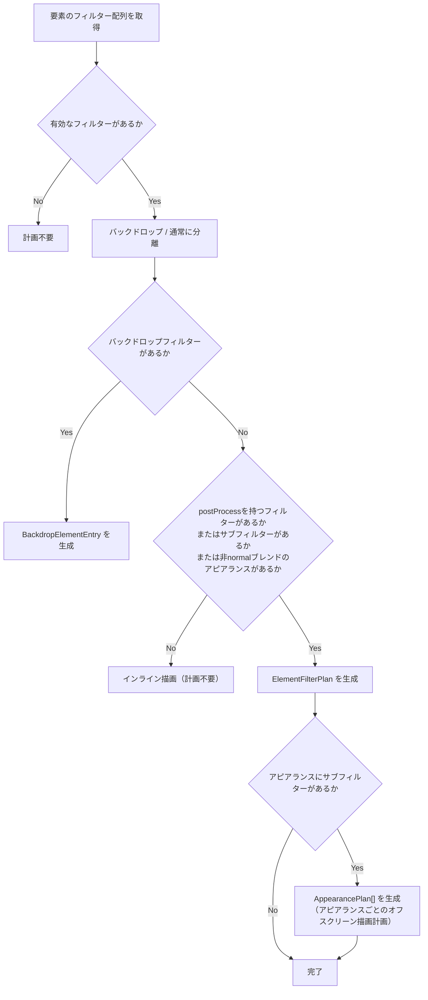

# RenderPlanner

RenderPlannerは、ドキュメントデータから1フレーム分の描画計画（FramePlan）を構築する純粋関数群である。GPUリソースへの参照や副作用を一切持たず、ドキュメント構造とフィルターハンドラーのメタデータだけを入力として、「何をどの順序でどう描画するか」を決定する。

レンダリングパイプラインにおけるRenderPlannerの位置づけは、RenderSchedulerが「いつ描画するか」を決め、RenderPlannerが「何を描画するか」を決め、CanvasLayerが「実際にGPUで描画する」という分業の中間層である。

> [!NOTE]
> このページは[パイプライン概要](/devdocs/renderer/pipeline)の内容を前提とする。`CanvasLayer` が `buildFramePlan()` を呼び出す流れを先に把握しておくと理解しやすい。

## なぜ計画と実行を分離するか

素朴に実装すると、レイヤーを走査しながら逐次的にGPU描画コマンドを発行することになる。しかしこの方式にはいくつかの問題がある:

- **バックドロップフィルター**（すりガラス効果など、背景を読み取って加工するフィルター）は、対象要素より前の描画結果が必要であるため、要素の描画順を事前に把握しなければ正しく処理できない
- **オフスクリーン合成**が必要かどうかはレイヤーや要素のblendModeに依存するが、これは描画前に一括判定した方が効率的である
- **テクスチャサイズの事前計算**には、フィルターのExpansion Margin（フィルター適用による描画領域の拡大量）を考慮した要素バウンズが必要である

RenderPlannerはこれらの情報を事前に収集・分類し、FramePlanという単一のデータ構造にまとめる。CanvasLayerはFramePlanを受け取り、計画に従ってGPUコマンドを発行するだけでよい。

## FramePlanの構造

以下の図は、FramePlanを頂点とするデータ構造の入れ子関係を示している。FramePlanがレイヤーごとのLayerPlanを保持し、LayerPlanがバックドロップ境界で分割されたセグメントを保持する。フィルター計画とバックドロップエントリはFramePlanから要素IDで参照される。

<svg viewBox="0 0 780 340" xmlns="http://www.w3.org/2000/svg" style={{fontSize: "11px", fontFamily: "system-ui, sans-serif"}}>
  {/* FramePlan container */}
  <rect x="10" y="10" width="760" height="320" rx="8" fill="#1e1e2e" stroke="#89b4fa" strokeWidth="2"/>
  <text x="30" y="35" fill="#89b4fa" fontWeight="bold" fontSize="14">FramePlan</text>

  {/* LayerPlan 0 */}
  <rect x="30" y="50" width="340" height="130" rx="6" fill="#181825" stroke="#a6e3a1" strokeWidth="1.5"/>
  <text x="45" y="70" fill="#a6e3a1" fontWeight="bold" fontSize="12">LayerPlan[0]</text>
  <text x="45" y="88" fill="#cdd6f4" fontSize="10">blendMode: "normal" | opacity: 1.0</text>

  {/* Segment 0 */}
  <rect x="45" y="96" width="145" height="70" rx="4" fill="#1e1e2e" stroke="#f9e2af" strokeWidth="1"/>
  <text x="55" y="113" fill="#f9e2af" fontSize="10" fontWeight="bold">Segment[0]</text>
  <rect x="55" y="119" width="22" height="16" rx="2" fill="#89b4fa" opacity="0.3"/>
  <text x="66" y="131" fill="#cdd6f4" fontSize="9" textAnchor="middle">E0</text>
  <rect x="81" y="119" width="22" height="16" rx="2" fill="#89b4fa" opacity="0.3"/>
  <text x="92" y="131" fill="#cdd6f4" fontSize="9" textAnchor="middle">E1</text>
  <rect x="107" y="119" width="22" height="16" rx="2" fill="#89b4fa" opacity="0.3"/>
  <text x="118" y="131" fill="#cdd6f4" fontSize="9" textAnchor="middle">E2</text>
  <rect x="55" y="140" width="125" height="18" rx="2" fill="#f38ba8" opacity="0.15" stroke="#f38ba8" strokeWidth="0.5"/>
  <text x="117" y="153" fill="#f38ba8" fontSize="9" textAnchor="middle">backdropAfter: BD₀</text>

  {/* Segment 1 */}
  <rect x="200" y="96" width="155" height="70" rx="4" fill="#1e1e2e" stroke="#f9e2af" strokeWidth="1"/>
  <text x="210" y="113" fill="#f9e2af" fontSize="10" fontWeight="bold">Segment[1]</text>
  <rect x="210" y="119" width="22" height="16" rx="2" fill="#89b4fa" opacity="0.3"/>
  <text x="221" y="131" fill="#cdd6f4" fontSize="9" textAnchor="middle">E3</text>
  <rect x="236" y="119" width="22" height="16" rx="2" fill="#89b4fa" opacity="0.3"/>
  <text x="247" y="131" fill="#cdd6f4" fontSize="9" textAnchor="middle">E4</text>
  <rect x="210" y="140" width="135" height="18" rx="2" fill="#313244" stroke="#585b70" strokeWidth="0.5"/>
  <text x="277" y="153" fill="#a6adc8" fontSize="9" textAnchor="middle">backdropAfter: null</text>

  {/* LayerPlan 1 */}
  <rect x="30" y="195" width="340" height="65" rx="6" fill="#181825" stroke="#a6e3a1" strokeWidth="1.5"/>
  <text x="45" y="215" fill="#a6e3a1" fontWeight="bold" fontSize="12">LayerPlan[1]</text>
  <text x="45" y="233" fill="#cdd6f4" fontSize="10">blendMode: "multiply" | needsLayerCompositing: true</text>
  <rect x="45" y="239" width="310" height="14" rx="2" fill="#1e1e2e" stroke="#f9e2af" strokeWidth="0.5"/>
  <text x="200" y="250" fill="#f9e2af" fontSize="9" textAnchor="middle">Segment[0]: [E0, E1, E2] → null</text>

  {/* filterPlans */}
  <rect x="400" y="50" width="350" height="90" rx="6" fill="#181825" stroke="#cba6f7" strokeWidth="1.5"/>
  <text x="415" y="70" fill="#cba6f7" fontWeight="bold" fontSize="12">filterPlans</text>
  <text x="415" y="88" fill="#a6adc8" fontSize="10">Map&lt;elementId, ElementFilterPlan&gt;</text>
  <rect x="415" y="96" width="155" height="32" rx="3" fill="#1e1e2e" stroke="#cba6f7" strokeWidth="0.5"/>
  <text x="425" y="110" fill="#cdd6f4" fontSize="9">"el-7" → postFilters: [blur]</text>
  <text x="425" y="122" fill="#a6adc8" fontSize="9">textureBounds: expanded +16px</text>
  <rect x="580" y="96" width="155" height="32" rx="3" fill="#1e1e2e" stroke="#cba6f7" strokeWidth="0.5"/>
  <text x="590" y="110" fill="#cdd6f4" fontSize="9">"el-12" → postFilters: [shadow]</text>
  <text x="590" y="122" fill="#a6adc8" fontSize="9">allAppearancePlans: [fill, stroke]</text>

  {/* backdropEntries */}
  <rect x="400" y="155" width="350" height="55" rx="6" fill="#181825" stroke="#f38ba8" strokeWidth="1.5"/>
  <text x="415" y="175" fill="#f38ba8" fontWeight="bold" fontSize="12">allBackdropEntries</text>
  <rect x="415" y="183" width="320" height="18" rx="3" fill="#1e1e2e" stroke="#f38ba8" strokeWidth="0.5"/>
  <text x="425" y="196" fill="#cdd6f4" fontSize="9">BD₀: element="el-3" | backdropFilters: [frost-glass] | layerIndex: 0</text>

  {/* Global flags */}
  <rect x="400" y="225" width="350" height="55" rx="6" fill="#181825" stroke="#585b70" strokeWidth="1"/>
  <text x="415" y="245" fill="#585b70" fontWeight="bold" fontSize="12">Global flags</text>
  <text x="415" y="263" fill="#cdd6f4" fontSize="10">needsCompositing: true | hasArtboards: false</text>
  <text x="415" y="278" fill="#a6adc8" fontSize="10">clearColor: {"{"} r:1, g:1, b:1, a:1 {"}"}</text>

  {/* Connection arrows */}
  <line x1="370" y1="115" x2="400" y2="95" stroke="#cba6f7" strokeWidth="1" strokeDasharray="4,2" opacity="0.5"/>
  <line x1="175" y1="155" x2="400" y2="175" stroke="#f38ba8" strokeWidth="1" strokeDasharray="4,2" opacity="0.5"/>
</svg>

`buildFramePlan()` が返すFramePlanは、1フレームの描画に必要な全情報を含む:

| フィールド | 型 | 役割 |
|---|---|---|
| `layerPlans` | `LayerPlan[]` | レイヤーごとの描画計画。要素リスト、合成要否、セグメント分割を含む |
| `filterPlans` | `Map<string, ElementFilterPlan>` | オフスクリーンフィルターパスが必要な要素の計画。要素IDをキーとする |
| `allBackdropEntries` | `BackdropElementEntry[]` | バックドロップフィルターを持つ要素の一覧 |
| `backdropElementIds` | `Set<string>` | バックドロップ要素のIDセット。描画時の高速判定用 |
| `layerElementsCache` | `Map<string, AnyArtObject[]>` | レイヤーIDから可視要素配列へのキャッシュ。後続処理でのMap参照を削減 |
| `elementsMap` | `Map<string, AnyArtObject>` | 要素IDから要素オブジェクトへのマップ |
| `needsCompositing` | `boolean` | いずれかのレイヤーまたは要素が非normalブレンドモードを持つか |
| `anyLayerNeedsCompositing` | `boolean` | レイヤー単位での合成が必要か |
| `hasArtboards` | `boolean` | ドキュメントにアートボードがあるか（クリアカラーに影響） |
| `clearColor` | `GPUColorDict` | 最初のレンダーパスのクリアカラー |
| `localBoundsCache` | `LocalBoundsCache` | ViewportManagerから渡されるバウンズキャッシュ。O(N)再計算の回避用 |

## 構築の流れ

`buildFramePlan()` は以下の4段階で計画を構築する:

### 1. レイヤー要素キャッシュの構築

`buildLayerElementsCache()` がドキュメントの全レイヤーを走査し、可視レイヤーごとに要素配列を解決する。`layer.elementIds`（ID配列）から `document.objects`（オブジェクトマップ）を引いて実体を取得し、Mapにキャッシュする。後続の処理で同じ参照を繰り返し行うため、ここで一度だけ解決する。

### 2. 合成要否の判定

`checkCompositingNeeded()` がドキュメント全体を走査し、非normalブレンドモードまたは非normal compositionMode（alpha-lock等）を持つレイヤー・要素の有無を判定する。この結果は `CanvasLayer` がオフスクリーン合成パスを用意するかどうかの判断に使われる。

グループ要素の子も再帰的に検査する。compositionModeが非normalの要素が存在する場合、その要素のアルファ値を正しく読み取るために透明背景のレンダーターゲットが必要となり、レイヤー単位の合成が強制される。

### 3. フィルター分類

`collectFilterPlans()` が各レイヤーの要素を走査し、要素ごとのフィルターを分類する。これがRenderPlannerの中核処理である。

各要素に対して `classifyElementFilters()` が呼ばれ、以下の判定を行う:

#### バックドロップフィルターの分離

フィルターハンドラーの `requiresBackdrop` フラグでバックドロップフィルター（frost-glass等）と通常フィルターを分離する。バックドロップフィルターを持つ要素は `BackdropElementEntry` として記録され、通常の要素描画フローから外れる。

#### Expansion Marginの計算

オフスクリーン描画が必要な要素について、フィルターハンドラーの `getExpansionMargin()` から必要な拡張量を取得し、要素バウンズを拡張してテクスチャサイズ（`textureBounds`）を決定する。ぼかしフィルターなど、要素の境界を超えて描画効果が及ぶフィルターに対応するためである。

#### AppearancePlanの生成

要素のアピアランス（fill/stroke）にサブフィルター（zigzag変形等）が設定されている場合、または非normalブレンドモードが指定されている場合、アピアランスごとに個別のオフスクリーン描画が必要になる。`AppearancePlan` はアピアランス単位の描画計画であり、プリサブフィルター（ジオメトリ変形）とポストサブフィルター（画像処理）を分離して保持する。

### 4. レイヤーセグメントの構築

`buildLayerSegments()` が各レイヤーの要素列をバックドロップ要素の位置で分割し、`LayerSegment` の配列を生成する。

バックドロップフィルターは「自分より前に描画された内容」を入力とするため、要素列を区切って「通常要素の描画 → バックドロップ要素の処理」というサイクルを作る必要がある。

以下の図は、5つの要素を持つレイヤーにおいて、E2がバックドロップフィルター（frost-glass）を持つ場合のセグメント分割を示している:

<svg viewBox="0 0 780 210" xmlns="http://www.w3.org/2000/svg" style={{fontSize: "11px", fontFamily: "system-ui, sans-serif"}}>
  {/* Background */}
  <rect x="0" y="0" width="780" height="210" rx="8" fill="#1e1e2e"/>

  {/* Title */}
  <text x="390" y="22" textAnchor="middle" fill="#cdd6f4" fontWeight="bold" fontSize="13">Layer elements → Segments</text>

  {/* Original element array */}
  <text x="15" y="55" fill="#a6adc8" fontSize="10">元の要素列:</text>
  <rect x="100" y="40" width="80" height="28" rx="4" fill="#89b4fa" opacity="0.2" stroke="#89b4fa" strokeWidth="1"/>
  <text x="140" y="59" textAnchor="middle" fill="#cdd6f4" fontSize="11">E0 (rect)</text>
  <rect x="190" y="40" width="80" height="28" rx="4" fill="#89b4fa" opacity="0.2" stroke="#89b4fa" strokeWidth="1"/>
  <text x="230" y="59" textAnchor="middle" fill="#cdd6f4" fontSize="11">E1 (path)</text>
  <rect x="280" y="40" width="120" height="28" rx="4" fill="#f38ba8" opacity="0.2" stroke="#f38ba8" strokeWidth="1.5"/>
  <text x="340" y="59" textAnchor="middle" fill="#f38ba8" fontSize="11">E2 (frost-glass)</text>
  <rect x="410" y="40" width="80" height="28" rx="4" fill="#89b4fa" opacity="0.2" stroke="#89b4fa" strokeWidth="1"/>
  <text x="450" y="59" textAnchor="middle" fill="#cdd6f4" fontSize="11">E3 (text)</text>
  <rect x="500" y="40" width="80" height="28" rx="4" fill="#89b4fa" opacity="0.2" stroke="#89b4fa" strokeWidth="1"/>
  <text x="540" y="59" textAnchor="middle" fill="#cdd6f4" fontSize="11">E4 (image)</text>

  {/* Split arrow */}
  <text x="390" y="92" textAnchor="middle" fill="#f9e2af" fontSize="20">↓</text>
  <text x="390" y="86" textAnchor="middle" fill="#f9e2af" fontSize="10">buildLayerSegments()</text>

  {/* Segment 0 */}
  <rect x="40" y="105" width="300" height="90" rx="6" fill="#181825" stroke="#f9e2af" strokeWidth="1.5"/>
  <text x="55" y="125" fill="#f9e2af" fontWeight="bold" fontSize="12">Segment[0]</text>

  <text x="55" y="145" fill="#a6adc8" fontSize="10">elements:</text>
  <rect x="120" y="132" width="60" height="22" rx="3" fill="#89b4fa" opacity="0.2" stroke="#89b4fa" strokeWidth="0.8"/>
  <text x="150" y="147" textAnchor="middle" fill="#cdd6f4" fontSize="10">E0</text>
  <rect x="186" y="132" width="60" height="22" rx="3" fill="#89b4fa" opacity="0.2" stroke="#89b4fa" strokeWidth="0.8"/>
  <text x="216" y="147" textAnchor="middle" fill="#cdd6f4" fontSize="10">E1</text>

  <text x="55" y="170" fill="#a6adc8" fontSize="10">backdropAfter:</text>
  <rect x="155" y="158" width="170" height="22" rx="3" fill="#f38ba8" opacity="0.15" stroke="#f38ba8" strokeWidth="0.8"/>
  <text x="240" y="173" textAnchor="middle" fill="#f38ba8" fontSize="10">E2 (frost-glass)</text>

  {/* Arrow between segments */}
  <text x="365" y="155" fill="#a6adc8" fontSize="16">→</text>

  {/* Segment 1 */}
  <rect x="395" y="105" width="350" height="90" rx="6" fill="#181825" stroke="#f9e2af" strokeWidth="1.5"/>
  <text x="410" y="125" fill="#f9e2af" fontWeight="bold" fontSize="12">Segment[1]</text>

  <text x="410" y="145" fill="#a6adc8" fontSize="10">elements:</text>
  <rect x="475" y="132" width="60" height="22" rx="3" fill="#89b4fa" opacity="0.2" stroke="#89b4fa" strokeWidth="0.8"/>
  <text x="505" y="147" textAnchor="middle" fill="#cdd6f4" fontSize="10">E3</text>
  <rect x="541" y="132" width="60" height="22" rx="3" fill="#89b4fa" opacity="0.2" stroke="#89b4fa" strokeWidth="0.8"/>
  <text x="571" y="147" textAnchor="middle" fill="#cdd6f4" fontSize="10">E4</text>

  <text x="410" y="170" fill="#a6adc8" fontSize="10">backdropAfter:</text>
  <rect x="510" y="158" width="60" height="22" rx="3" fill="#313244" stroke="#585b70" strokeWidth="0.8"/>
  <text x="540" y="173" textAnchor="middle" fill="#a6adc8" fontSize="10">null</text>
</svg>

CanvasLayerはセグメント順に処理する: Segment[0]のE0, E1を描画 → E2のバックドロップフィルターを適用（描画済み内容をキャプチャして加工） → Segment[1]のE3, E4を描画。

各セグメントは:

- `elements`: バックドロップ境界までの通常要素列
- `backdropAfter`: セグメント後に処理するバックドロップ要素（最後のセグメントはnull）

## LayerPlan

各レイヤーの描画計画をまとめたデータ構造:

| フィールド | 説明 |
|---|---|
| `elements` | レイヤー内の可視要素配列 |
| `opacity` | レイヤー不透明度 |
| `blendMode` | レイヤーのブレンドモード |
| `needsLayerCompositing` | 非normalブレンドモードまたは非normal compositionModeの子要素があり、オフスクリーン合成が必要か |
| `segments` | バックドロップ境界で分割されたセグメント配列 |

## ElementFilterPlan

オフスクリーンフィルターパスが必要な要素の計画:

| フィールド | 説明 |
|---|---|
| `enabledFilters` | 有効な全フィルター |
| `postFilters` | ポストフィルター（blur, drop-shadow等。オフスクリーン描画が必要） |
| `textureBounds` | フィルターマージンで拡張済みのバウンズ。オフスクリーンテクスチャサイズの決定に使用 |
| `allAppearancePlans` | アピアランスごとの個別描画計画（サブフィルターまたは非normalブレンド時のみ） |

## 設計上の判断

### 純粋関数としての実装

RenderPlannerはクラスではなく、`buildFramePlan()` を頂点とする純粋関数群として実装されている。GPUリソースへの参照を持たず、フィルターハンドラーのメタデータ（`requiresBackdrop`, `getExpansionMargin()`, `preProcess`/`postProcess` の有無）だけを参照する。

この設計により:
- ユニットテストでGPUデバイスのモックが不要になる
- 計画の構築と実行が完全に分離され、計画ロジックの変更がGPU描画コードに影響しない
- フィルター分類ロジックの正しさをデータ入出力だけで検証できる

### ビューポートカリング

`collectFilterPlans()` はフィルター分類の前に `boundsIntersectViewport()` でビューポート外の要素をスキップする。画面外の要素にフィルター計画を生成してもオフスクリーンテクスチャの無駄な確保につながるため、この段階で除外する。

> [!TIP]
> FramePlanは毎フレーム再構築されるが、構築コスト自体は小さい。全処理がCPU上の配列走査とMap操作であり、GPUコマンドの発行やバッファ書き込みは一切行わない。実際のGPUリソース確保は `CanvasLayer` がFramePlanを消費する段階で行われる。

> [!TIP]
> **次に読むページ:** [キャッシュと無効化](/devdocs/renderer/caches)
