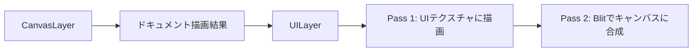
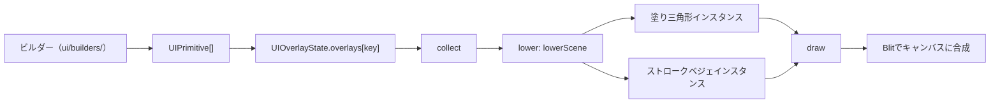

# UILayer

> [!TIP]
> **前提ページ:** [レンダラーアーキテクチャ](/devdocs/renderer)

お絵描きソフトでは、選択枠、リサイズハンドル、ブラシカーソル、スナップガイドといったインターフェース要素が、描いた絵の上に重なって表示される。これらはドキュメントの一部ではなく、ユーザーの操作を補助するための一時的な視覚フィードバックである。`UILayer` は、こうしたUIオーバーレイ（ドキュメントの描画結果の上に重ねて表示されるインターフェース要素）を専門に描画するレンダリングモジュールである。

UIオーバーレイをドキュメント描画と分離する最大の理由は、両者の更新頻度が根本的に異なることにある。カーソルを動かすだけでUIは毎フレーム更新されるが、ドキュメントの描画結果は変わらない。この分離により、UIの更新時にドキュメント全体を再描画する必要がなくなる。

このページでは、UILayerのレンダリングアーキテクチャ、UI要素をプリミティブの列として宣言する仕組み、プリミティブをGPUインスタンスへ変換する手順、そして状態管理・ヒットテスト・テーマの設計を解説する。

> [!NOTE]
> このページは [レンダラーアーキテクチャ](/devdocs/renderer) の内容を前提とする。WebGPUの基本概念（レンダーパス、パイプライン、インスタンスドレンダリング等）は既知として扱う。

## 概要

UILayerはレンダリングパイプラインの最終段に位置する。CanvasLayerがドキュメントの要素（パス・画像・テキスト等）を描画した後、UILayerがオーバーレイとして合成される。



UILayerは `RenderOrchestrator` から呼び出される。描画すべきUIデータがない場合は即座にreturnし、GPUリソースを消費しない。描画すべきUIデータがない場合とは、`overlays` が空で、かつアートボード編集モードのアートボード枠も無い場合である。

### 設計意図

UILayerをドキュメント描画と完全に分離し2パス構成にする理由は、UIのライフサイクルがドキュメントと独立しているためである。たとえばカーソル移動やホバーなどのUI更新は、`viewportBlit` 戦略で処理される。この戦略ではドキュメントの再レンダリングをスキップしてキャッシュ済みの合成フレームを blit し、UIテクスチャだけを描き直す。2パス構成がこれを可能にしている。1パス目でUI要素を専用テクスチャに描画し、2パス目でそのテクスチャをキャンバスにblit（テクスチャを別のテクスチャにコピー描画する操作）する。blit時には `loadOp: "load"`（レンダーパス開始時に既存の描画内容を保持するオプション）を指定するため、ドキュメントの描画結果はそのまま残る。

描画は2パス構成で行われる:

1. **UIテクスチャパス**: 専用のオフスクリーンテクスチャにUI要素を描画（`clearValue` で透明にクリア）
2. **Blitパス**: 描画済みテクスチャをキャンバス上にアルファブレンド合成（`loadOp: "load"` でドキュメント描画結果を保持）

## 3段構成: collect → lower → draw

`UILayer.render()` は1フレームのUI描画を3段で処理する。

1. **collect** — 描画するプリミティブの列を集める。入力は `UIOverlayState.overlays` の各エントリである。アートボード編集モードでは、ドキュメントのアートボード枠を `buildArtboardOverlay` で作って加える。
2. **lower** — `lowering.ts` の `lowerScene` がプリミティブを重なり順に並べ、塗り三角形とストロークベジェの2本のインスタンス列へ変換する。
3. **draw** — 2本のインスタンス列をGPUバッファへ書き込み、順序付きの run を再生してUIテクスチャに描く。最後にUIテクスチャをキャンバスへblitする。



ツールやエンジンは「何を表示するか」をプリミティブで宣言する。UILayerは「どう描画するか」だけを担当する。UILayer自身は選択枠やハンドルといったUI要素の種類を知らない。

## UIPrimitive

UIオーバーレイの描画単位は `UIPrimitive` である。型定義は `core/renderer/ui/primitives.ts` にある。

### プリミティブの種類

| `kind` | 型 | 内容 |
|---|---|---|
| `circle` | `CirclePrimitive` | 中心と半径。塗りと線を持てる |
| `rect` | `RectPrimitive` | 中心・幅・高さ。`cornerRadius` で角丸にできる。塗りと線を持てる |
| `diamond` | `DiamondPrimitive` | 中心と、中心から各頂点までの距離 `halfSize`。塗りと線を持てる |
| `line` | `LinePrimitive` | 2点を結ぶ線分。`fill` を指定すると、正確な幅を持つ棒として塗る |
| `polyline` | `PolylinePrimitive` | 点列。`closed` で閉じる。塗りと線を持てる |
| `bezierPath` | `BezierPathPrimitive` | 3次ベジェセグメントの連なり。`start` の無いセグメントは直前の終点から続く。塗りと線を持てる |
| `arc` | `ArcPrimitive` | 楕円弧。半径・回転・開始角・終了角を持つ。線のみ |
| `arrow` | `ArrowPrimitive` | 軸の線と三角形の矢じり |

線のスタイル `StrokeStyle` は色と幅を持つ。`dash` を指定すると破線になる。破線が効くのは、角丸でない `rect` の線だけである。

全プリミティブに共通するフィールドは次のとおりである。

| フィールド | 内容 |
|---|---|
| `zIndex` | オーバーレイの基準zに足すオフセット |
| `screenOffset` | スクリーンピクセルで指定する位置のずらし量。`offset / zoom` でワールド単位に解決される |
| `hitId` | 指定するとヒットテストの対象になる |
| `hitPadding` | ヒットテストの許容距離の上書き |
| `hitOnly` | `true` のとき、ヒットテストの対象にはなるが描画されない |

### スクリーンピクセル固定サイズ

ハンドルやストローク幅は画面上で一定サイズを保つ必要がある。ワールド座標で固定サイズにすると、ズームアウト時にハンドルが巨大に、ズームイン時に微小になってしまう。プリミティブの寸法は `Dim` 型で座標空間を指定し、lowering がビューポートの `zoom` を使ってワールド単位へ解決する。

```typescript
type Dim = number | { world?: number; screen?: number };
```

`Dim` の解釈はフィールドの種類で決まる。

| フィールド | 数値だけを書いた場合 | 解決する関数 |
|---|---|---|
| 大きさ（半径、幅、高さ、`halfSize`、矢じりの寸法、`line` の塗り幅） | ワールド単位 | `resolveSizeDim` |
| 線幅（`StrokeStyle.width`、`arrow` の `width`） | スクリーンピクセル | `resolveStrokeHalfWidth` |

`resolveSizeDim` は `world + screen / zoom` を返す。`resolveStrokeHalfWidth` は半幅を返し、`screen` 成分は `px / 2 / zoom`、`world` 成分は `w / 2` になる。どちらの成分も正確な半分であり、アンチエイリアシング用の上乗せは無い。ストロークのシェーダーが真の半幅の位置に被覆率の境界を置くためである。

オブジェクト形式では2つの空間を足し合わせられる。たとえば `{ world: r, screen: 0.5 }` は「ワールド半径 r に 0.5px を足した大きさ」を表す。

## ビルダー

ビルダーは、ツールやエンジンが持つUIデータを `UIPrimitive[]` に変換する関数である。`core/renderer/ui/builders/` に置かれ、UIデータと `UI_THEME` を受け取ってプリミティブの配列を返す。GPUには触れない。

| ファイル | 関数 | 対象 |
|---|---|---|
| `selection.ts` | `buildSelectionOverlay` | 要素選択（アウトライン、バウンディングボックス、ハンドル） |
| `pathEdit.ts` | `buildPathEditOverlay` | パス編集（アンカー、制御点、角丸ハンドル、superellipse ハンドル、接続線） |
| `toolCursor.ts` | `buildToolCursorOverlay` | ブラシカーソル |
| `eraser.ts` | `buildEraserOverlay` | 消しゴムカーソル |
| `marquee.ts` | `buildMarqueeOverlay` | 矩形選択 |
| `hover.ts` | `buildHoverOverlay` | ホバーハイライト |
| `snapLine.ts` | `buildSnapLineOverlay` | スナップガイド |
| `artboard.ts` | `buildArtboardOverlay` | アートボード枠と選択アートボードのハンドル |
| `gradient.ts` | `buildGradientOverlay` | グラデーション編集 |
| `meshDeform.ts` | `buildMeshDeformOverlay` | メッシュ変形 |
| `strokeWidthEdit.ts` | `buildStrokeWidthEditOverlay` | ストローク幅編集 |
| `patternEdit.ts` | `buildPatternEditOverlay` | パターン編集のタイル |
| `textEdit.ts` | `buildTextEditOverlay` | テキスト編集（選択範囲、カーソル、変換中の下線） |
| `text.ts` | `buildTextFlowHandles` ほか | テキストフローのハンドルとリンク、あふれバッジ、フォント未解決の枠、リージョンのプレビュー |
| `charTouch.ts` | `buildTextCharTouchOverlay` | 文字単位の変形ハンドル |
| `bucketFill.ts` | `buildBucketFillOverlay` | バケツ塗りのプレビュー |
| `skewBars.ts` | `buildSkewBarsOverlay` | スキューのバー |
| `perspectiveWarp.ts` | `buildPerspectiveWarpOverlay` | パース変形のハンドル |
| `perspectiveGuides.ts` | `buildPerspectiveGuideOverlay` | パース定規のガイド |

## lowering

`lowering.ts` は、プリミティブの列を2本のインスタンス列へ変換する純粋関数群である。入口は `lowerScene(groups, zoom, scratch)` である。

### 重なり順

`lowerScene` は全プリミティブを「オーバーレイの基準z + プリミティブの `zIndex`」で並べる。同じ値なら挿入順を保つ。`hitOnly` のプリミティブはここで除かれる。

オーバーレイの基準zは `theme.ts` の `OVERLAY_Z` が定める。値が小さいほど下に描かれる。

| キー | 値 | キー | 値 |
|---|---|---|---|
| `artboard` | 0 | `patternEdit` | 100 |
| `selection` | 10 | `strokeWidthEdit` | 110 |
| `pathEdit` | 20 | `textEdit` | 120 |
| `toolCursor` | 30 | `textFlow` | 122 |
| `eraser` | 40 | `textCharTouch` | 123 |
| `marquee` | 50 | `textCharTouchMarquee` | 124 |
| `hover` | 60 | `textOverflow` | 125 |
| `perspectiveGuide` | 65 | `bucketFill` | 130 |
| `snapLine` | 70 | `default` | 140 |
| `gradient` | 80 | | |
| `meshDeform` | 90 | | |

`zIndex` を指定しないオーバーレイは `OVERLAY_Z.default` に置かれる。

### 図形の表現

各プリミティブは、塗り三角形インスタンスとストロークベジェインスタンスの組み合わせに変換される。

| プリミティブ | 塗り | 線 |
|---|---|---|
| `rect`（角丸なし） | 4頂点の輪郭を三角形分割 | 4辺を4つの直線インスタンスで表現。`dash` があれば破線1本ごとに1インスタンス |
| `rect`（角丸あり） | `bezierPath` と同じ | `bezierPath` と同じ |
| `circle` | `bezierPath` と同じ | `bezierPath` と同じ |
| `diamond` | 4頂点の輪郭を三角形分割 | 4辺を4つの直線インスタンスで表現 |
| `line` | 半幅を `width / 2` にした直線インスタンス1つ | 直線インスタンス1つ |
| `polyline` | 輪郭を三角形分割 | マイター付きの直線インスタンス列 |
| `bezierPath` | 平坦化した輪郭を三角形分割 | 平坦化した折れ線のマイター付き直線インスタンス列 |
| `arc` | — | 90度以下ごとに分けた最大4つの3次ベジェインスタンス |
| `arrow` | 矢じりの三角形 | 軸の直線インスタンス1つ |

直線は退化ベジェ曲線（制御点を端点に一致させて直線にした特殊なベジェ曲線）として書き込まれる。`cp1 = p0`、`cp2 = p1` と設定すると曲線の「膨らみ」がなくなり、結果は `p0` から `p1` への直線になる。これにより、直線も楕円弧も同じストロークパイプラインで描ける。

円は4つの四分円弧をベジェ曲線で近似したセグメント列として作られる。制御点の距離は `k = 4/3 * (sqrt(2) - 1)`（`CIRCLE_BEZIER_K = 0.5522847498`）で計算される。角丸矩形は4本の直線と4つの四分円弧のセグメント列として作られる。どちらも `bezierPath` として処理される。

### 曲線の平坦化

`bezierPath` はCPU上で折れ線に平坦化される。許容誤差は `DEVICE_CURVE_TOLERANCE_PX / zoom` である。これはCanvasLayerがドキュメントのパスを平坦化するときと同じデバイス空間の許容誤差であり、どのズームでもオーバーレイの輪郭がドキュメントのパスに一致する。長い曲線や拡大した曲線でも折れ線の粗さが見えない。

折れ線の線は、隣り合う直線インスタンスが継ぎ目で同じマイターベクトルを共有する形で書き込まれる。これにより、継ぎ目の外側に隙間が残らない。マイターの長さには上限（`MITER_LIMIT = 4`）がある。

### 塗りの三角形分割

閉じた輪郭の塗りは、`fillTessellation.ts` の `triangulateFillContour` が earcut で三角形に分割する。各三角形は、どの辺が元の輪郭の辺であるかを示す `boundaryMask` を持つ。フラグメントシェーダーは輪郭の辺だけにアンチエイリアシングをかける。三角形どうしが接する内側の辺には継ぎ目が出ない。

## 描画パイプライン

UILayerは2本のパイプラインを持つ。どちらもUILayerだけが使う。

### ストローク: Instanced Cubic Bezier Quad Strip

線は、インスタンスド3次ベジェ（4つの制御点で定義される滑らかな曲線）quad-strip パイプライン（`strokeBezierPipeline`）で描かれる。

quad strip（四角形を帯状に繋げたジオメトリ）は、曲線に沿って帯状のポリゴンを展開する構造である。ベジェ曲線の各点で法線方向に幅を持たせることで、曲線に沿った帯状のジオメトリを形成する。GPUは静的な parametric vertex buffer（`unitBezierBuffer`）を使用し、`BEZIER_STEPS`（20ステップ）の quad strip をインスタンスドレンダリング（同じジオメトリをGPUが異なるパラメータで複数回描画する手法）で展開する。

各インスタンスのバッファレイアウト（18 floats、`BEZIER_INSTANCE_FLOATS`）:

| オフセット | フィールド | 説明 |
|---|---|---|
| 0-1 | `p0` | 始点 (x, y) |
| 2-3 | `cp1` | 制御点1 (x, y) |
| 4-5 | `cp2` | 制御点2 (x, y) |
| 6-7 | `p1` | 終点 (x, y) |
| 8-11 | `color` | RGBA（赤・緑・青・不透明度の4チャンネルカラー表現） (r, g, b, a) |
| 12 | `halfWidth0` | 始点側の半幅 |
| 13 | `halfWidth1` | 終点側の半幅 |
| 14-15 | `miter0` | 始点側のオフセット方向。ゼロベクトルなら曲線の法線を使う |
| 16-17 | `miter1` | 終点側のオフセット方向。ゼロベクトルなら曲線の法線を使う |

頂点シェーダーは、見える縁より1ピクセル外側まで quad を広げる。フラグメントシェーダーは、真の縁までのピクセル距離から被覆率を求める。被覆率は縁を中心とした幅1pxの線形な傾斜であり、縁の内側と外側で対称になる。

### 塗り: インスタンスド三角形

塗りは `fillTrianglePipeline` で描かれる。1インスタンスが1つの三角形である。頂点ごとのバッファは持たず、インスタンスバッファの3点から3頂点を描く。

各インスタンスのバッファレイアウト（11 floats、`FILL_TRIANGLE_INSTANCE_FLOATS`）:

| オフセット | フィールド | 説明 |
|---|---|---|
| 0-1 | `p0` | 頂点0 (x, y) |
| 2-3 | `p1` | 頂点1 (x, y) |
| 4-5 | `p2` | 頂点2 (x, y) |
| 6-9 | `color` | RGBA (r, g, b, a) |
| 10 | `boundaryMask` | ビット0/1/2が、`p0`/`p1`/`p2` の対辺が輪郭の辺であることを示す |

### run の再生

塗りと線は別のインスタンス列に書き込まれるが、重なり順は保たなければならない。lowering は、同じ種類のインスタンスが連続する区間を1つの run（`LoweredRun`）にまとめる。run は種類（`fill` / `stroke`）、先頭インスタンス、インスタンス数を持つ。

draw 段は run を順に再生する。run ごとにパイプラインと頂点バッファを切り替え、`firstInstance` と `instanceCount` を指定して1回の draw call を発行する。塗りと線が交互に現れなければ、draw call の数は少数で済む。

CPU側のインスタンス配列（`LoweringScratch`）とGPU側のインスタンスバッファは、フレームをまたいで使い回される。容量が足りなくなったときだけ1.5倍に拡張され、縮むことはない。

## UIOverlayState

UILayerの描画内容は `UIOverlayState` 構造体によって駆動される。型定義は `core/renderer/types.ts` にある。

```typescript
interface UIOverlayState {
  isArtboardEditMode?: boolean;
  overlays?: Partial<Record<OverlayKey, UIOverlay>>;
}

interface UIOverlay {
  zIndex?: number;
  primitives: readonly UIPrimitive[];
}
```

`overlays` は、キーごとに1つの `UIOverlay` を持つ汎用のチャンネルである。エントリは不変のスナップショットとして扱う。更新するときはオブジェクトごと差し替え、中身を書き換えない。エントリは valtio の `ref()` で格納される。開発ビルドでは格納時に再帰的に凍結され、書き換えると例外になる。

`isArtboardEditMode` が真のとき、UILayerはドキュメントのアートボード枠を自分で組み立てて描く。選択アートボードのハンドルは `overlays` 経由で届く。

ビルダーへ渡す各 UIData の型定義は `core/renderer/ui/types.ts` にある。

### オーバーレイキー

`overlays` のキーは `core/renderer/ui/overlayKeys.ts` の `OVERLAY_KEYS` に登録されたものだけが使える。キーは `<producer>/<role>` の形式で命名する。新しいキーはこのレジストリに追加する。登録されていないキーや誤字はコンパイルエラーになる。

| 種別 | 例 |
|---|---|
| ツールが所有するキー | `select/marquee`, `path-edit/handles`, `gradient/handles`, `text/flow-handles`, `mesh-deform/handles` |
| エンジンが所有するキー | `sys/cursor`, `sys/eraser`, `sys/selection`, `sys/hover`, `sys/artboard-selection`, `sys/text-edit` |

### 書き込み口

ツールは `ToolContext.uiSetOverlay(key, overlay)` でエントリを設定する。`null` を渡すとエントリが消える。ツールはビルダーでプリミティブを作り、結果を `uiSetOverlay` に渡す。

エンジン側の書き込みは `core/renderer/ui/overlaySink.ts` の関数群に集約されている。`Paplico`、`PaplicoSelection`、`PaplicoCommands` など複数のクラスがこの関数群を共有する。

| 関数 | キー | 内容 |
|---|---|---|
| `setOverlayEntry` | 任意 | エントリの設定と削除。ほかの関数はすべてこれを通る |
| `setSelectionOverlay` | `sys/selection` | 要素選択のオーバーレイ |
| `setHoverOverlay` | `sys/hover` | ホバーハイライト |
| `setArtboardSelectionOverlay` | `sys/artboard-selection` | 選択アートボードのバウンズとリサイズハンドル |
| `setTextOverflowOverlay` | `sys/text-overflow` | テキストがあふれたリージョンのバッジ |
| `setFontMissingOverlay` | `sys/font-missing` | フォントを解決できなかったテキストの枠 |

### ホバーハイライト

キャンバスの外から要素を指し示すとき、たとえばレイヤーパネルの行にホバーしたときは、`Paplico.setHoveredElement(elementId)` を呼ぶ。`Paplico` は要素のアウトラインを集め、`setHoverOverlay` で `sys/hover` エントリを組み立てる。画像・テキスト・複合パスのように自前のアウトラインを持たない要素は、バウンディングボックスの矩形で示される。

行がアンマウントされるときは `clearHoveredElement(elementId)` を呼ぶ。この関数は、ハイライトがまだその要素のものである場合にだけ消す。別の行が先にホバーを引き継いでいた場合、新しいハイライトは消えない。

ホバーの線幅は `UI_THEME.strokeWidth.hover` である。ひと目で読み取れるよう、選択アウトラインより太い。

## ヒットテスト

オーバーレイのヒットテストは `core/renderer/ui/hitTest.ts` の `hitTestOverlays` が行う。`hitId` を持つプリミティブだけが対象になる。ツールは `ToolContext.uiHitTest(point)` にスクリーン座標を渡し、最前面のヒット（`{ overlayKey, hitId }`）か `null` を受け取る。

判定の順序は描画と同じ規則に従う。プリミティブを「基準z + `zIndex`、同値なら挿入順」で並べ、後ろから走査するため、最前面のプリミティブが勝つ。`Dim` と `screenOffset` の解決は lowering と同じ関数を使うため、当たり判定の範囲は描画される範囲と一致する。

許容距離の既定値は `UI_THEME.hitTolerancePx / zoom` である。プリミティブごとに `hitPadding` で上書きできる。

## UI_THEME

UIの色と寸法は `core/renderer/ui/theme.ts` の `UI_THEME` に集約されている。一箇所で管理することで、UI全体の見た目を統一し、変更時の影響範囲を限定する。寸法はすべてスクリーンピクセルである。各色はRGBA（赤・緑・青・不透明度の4チャンネルカラー表現）タプル（`[r, g, b, a]`、各値 0.0-1.0）として定義され、`Object.freeze` で不変にされている。

### ストローク幅（`UI_THEME.strokeWidth`）

| キー | 値 | 用途 |
|---|---|---|
| `default` | 1.5 px | UIアウトラインのデフォルト幅 |
| `path` | 2.0 px | 選択のベジェパスアウトライン幅 |
| `hover` | 3.0 px | ホバーハイライトの幅 |
| `meshVertexOutline` | 2.5 px | メッシュ頂点の白い枠 |
| `gradientAxis` | 4 px | 線形グラデーションの軸線 |

### ハンドルの大きさ（`UI_THEME.handleSize`）

| キー | 値 | 用途 |
|---|---|---|
| `selection` | 8 px | 選択バウンディングボックスのハンドルの辺長 |
| `artboard` | 8 px | アートボードのリサイズハンドルの辺長 |
| `pathEdit` | 10 px | パス編集の制御点ハンドル |
| `gradient` | 10 px | グラデーションハンドルの基準サイズ |
| `meshDeformRadius` | 5 px | メッシュ変形ハンドルの半径 |
| `strokeWidthEditRadius` | 4 px | ストローク幅編集ハンドルの半径 |
| `selectionRingOffset` | 2 px | 選択中ハンドルを囲むリングの外側への張り出し |

このほかに、ヒットテストの許容距離 `hitTolerancePx`（8 px）と、破線パターン `dash.selectionBounds`（長さ 4 px、間隔 3 px）がある。

### 色（`UI_THEME.colors`）

以下のテーブル群は、機能カテゴリごとの主な色定義の一覧である。

#### 共通・選択

| キー | 値 | 用途 |
|---|---|---|
| `white` | `[1, 1, 1, 1]` | ハンドル塗り潰し背景 |
| `selectionPath` | `[0.2, 0.5, 1.0, 1.0]` | 選択パスのベジェアウトライン |
| `selectionBounds` | `[0, 0.5, 1, 1]` | バウンディングボックス、ハンドル枠 |
| `selectionKeyPath` | `[1.0, 0.5, 0.0, 1.0]` | 整列の基準になるキーオブジェクトのアウトライン |

#### マーキー・ホバー・スナップ

| キー | 値 | 用途 |
|---|---|---|
| `marqueeFill` | `[0.2, 0.5, 1.0, 0.15]` | 矩形選択の塗り |
| `marqueeOutline` | `[0.2, 0.5, 1.0, 0.8]` | 矩形選択の枠線 |
| `hover` | `[0.2, 0.6, 1.0, 0.6]` | ホバーハイライト |
| `snapLine` | `[1.0, 0.2, 0.5, 0.9]` | スナップガイドライン |

#### アートボード

| キー | 値 | 用途 |
|---|---|---|
| `artboardOutline` | `[0.4, 0.4, 0.4, 0.8]` | アートボード枠線（灰色） |
| `artboardSelected` | `[0.2, 0.6, 1.0, 1.0]` | 選択アートボード（青） |

#### パス編集ハンドル

| キー | 用途 |
|---|---|
| `pathAnchorFill` / `pathAnchorFillSelected` | アンカーポイント塗り |
| `pathAnchorOutline` / `pathAnchorOutlineSelected` | アンカーポイント枠 |
| `pathControlFill` / `pathControlFillSelected` | 制御点塗り |
| `pathControlOutline` / `pathControlOutlineSelected` | 制御点枠 |
| `pathCornerRadiusFill` / `pathCornerRadiusFillSelected` | 角丸ハンドル塗り |
| `pathCornerRadiusOutline` / `pathCornerRadiusOutlineSelected` | 角丸ハンドル枠 |
| `pathSuperellipseFill` / `pathSuperellipseFillSelected` | Superellipse-kハンドル塗り |
| `pathSuperellipseOutline` / `pathSuperellipseOutlineSelected` | Superellipse-kハンドル枠 |
| `pathHandleLine` | ハンドル接続線 |
| `pathLongPressRing` | 長押しインジケータリング |
| `pathEditLassoStroke` / `pathEditLassoFill` | ラッソ選択の線と塗り |

#### グラデーション

| キー | 用途 |
|---|---|
| `gradientOutlineStart` | 始点ハンドル枠（青） |
| `gradientOutlineEnd` | 終点ハンドル枠（赤） |
| `gradientOutlineDefault` | その他ハンドル枠（白） |
| `gradientSelectionRing` | 選択リング |
| `gradientLine` / `gradientStopConnection` | 軸線とストップの接続線 |
| `gradientLinearStartHandle` ほか | GradientTool のハンドル種別ごとの塗り |

#### メッシュ変形

| キー | 用途 |
|---|---|
| `meshBounds` | 元バウンズ矩形 |
| `meshEdge` | メッシュエッジ線 |
| `meshHandleFill` / `meshHandleFillSelected` | ハンドル塗り |
| `meshHandleOutline` | ハンドル枠 |
| `meshHandleRing` | 選択リング |
| `meshLasso` | ラッソ選択パス |
| `meshLongPressRing` | 長押しインジケータリング |

#### 消しゴム・ツールカーソル

| キー | 用途 |
|---|---|
| `eraserCursorOutline` | カーソル外枠 |
| `eraserPreview` | 消去プレビュー |
| `eraserCursor` | カーソル円 |
| `colorPickerPreviewShadow` / `colorPickerPreviewOutline` | ピック色プレビューの影と白枠 |

#### その他

| キー | 用途 |
|---|---|
| `strokeWidthEnvelopeSide1` / `strokeWidthEnvelopeSide2` | ストローク幅プロファイルのエンベロープ |
| `strokeWidthHandleSide1` / `strokeWidthHandleSide2` / `strokeWidthSelectionRing` | ストローク幅編集のハンドルと選択リング |
| `textSelection` / `textCompositionUnderline` | テキストの選択範囲と変換中の下線 |
| `textOverflowBadge` / `textFlowCandidate` / `textFlowChain` | テキストのあふれバッジとフローのリンク |
| `charTouchQuadFill` | 文字単位の変形で選択した文字の面 |
| `bucketFillCutPath` / `bucketFillLeakMarker` | バケツ塗りの切断パスと漏れ位置 |
| `reference3dAxisX` ほか | Reference3D ギズモの軸・面・ボーン |
| `perspectiveHorizon` / `perspectiveVp` / `perspectiveRadial` | パース定規の地平線・消失点・放射線 |

> [!TIP]
> **次に読むページ:** [フィルターシステム](/devdocs/renderer/filters)
