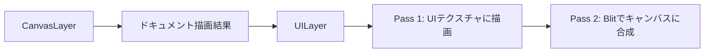

# UILayer

> [!TIP]
> **前提ページ:** [レンダラーアーキテクチャ](/devdocs/renderer)

お絵描きソフトでは、選択枠、リサイズハンドル、ブラシカーソル、スナップガイドといったインターフェース要素が、描いた絵の上に重なって表示される。これらはドキュメントの一部ではなく、ユーザーの操作を補助するための一時的な視覚フィードバックである。`UILayer` は、こうしたUIオーバーレイ（ドキュメントの描画結果の上に重ねて表示されるインターフェース要素）を専門に描画するレンダリングモジュールである。

UIオーバーレイをドキュメント描画と分離する最大の理由は、両者の更新頻度が根本的に異なることにある。カーソルを動かすだけでUIは毎フレーム更新されるが、ドキュメントの描画結果は変わらない。この分離により、UIの更新時にドキュメント全体を再描画する必要がなくなる。

このページでは、UILayerのレンダリングアーキテクチャ、全図形を単一パイプラインで描画する仕組み、各UI要素の描画方法、そして状態管理とカラーパレットの設計を解説する。

> [!NOTE]
> このページは [レンダラーアーキテクチャ](/devdocs/renderer) の内容を前提とする。WebGPUの基本概念（レンダーパス、パイプライン、インスタンスドレンダリング等）は既知として扱う。

## 概要

UILayerはレンダリングパイプラインの最終段に位置する。CanvasLayerがドキュメントの要素（パス・画像・テキスト等）を描画した後、UILayerがオーバーレイとして合成される。



UILayerは `RenderLayer` インターフェースを実装し、`RenderOrchestrator` から呼び出される。描画すべきUIデータがない場合（全フィールドが `null`/`undefined`）は即座にreturnし、GPUリソースを消費しない。

### 設計意図

UILayerをドキュメント描画と完全に分離し2パス構成にする理由は、UIのライフサイクルがドキュメントと独立しているためである。たとえばカーソル移動やホバーなどのUI更新は、`overlayOnly` 戦略で処理される。この戦略ではドキュメントの再レンダリングをスキップし、UIテクスチャだけを差し替える。2パス構成がこれを可能にしている。1パス目でUI要素を専用テクスチャに描画し、2パス目でそのテクスチャをキャンバスにblit（テクスチャを別のテクスチャにコピー描画する操作）する。blit時には `loadOp: "load"`（レンダーパス開始時に既存の描画内容を保持するオプション）を指定するため、ドキュメントの描画結果はそのまま残る。

描画は2パス構成で行われる:

1. **UIテクスチャパス**: 専用のオフスクリーンテクスチャにUI要素を描画（`clearValue` で透明にクリア）
2. **Blitパス**: 描画済みテクスチャをキャンバス上にアルファブレンド合成（`loadOp: "load"` でドキュメント描画結果を保持）

## UILayer

### 統一パイプライン: Instanced Cubic Bezier Quad Strip

UILayerが描画する図形は線・矩形・円・楕円・ダイヤモンドと多岐にわたるが、これらを図形種別ごとに別のパイプラインで描くとパイプライン切り替え（GPU描画パイプラインを変更する操作で、頻繁に行うとオーバーヘッドが発生する）のコストが無視できなくなる。UILayerではこの問題を、全図形を単一のインスタンスド3次ベジェ（4つの制御点で定義される滑らかな曲線）quad-strip パイプライン（`strokeBezierPipeline`）に統一することで解決している。

quad strip（四角形を帯状に繋げたジオメトリ）は、曲線に沿って帯状のポリゴンを展開する構造である。パイプの中を水が流れるように、ベジェ曲線の各点で法線方向に幅を持たせることで、曲線に沿った帯状のジオメトリを形成する。GPUは静的な parametric vertex buffer（`unitBezierBuffer`）を使用し、`BEZIER_STEPS`（20ステップ）の quad strip をインスタンスドレンダリング（同じジオメトリをGPUが異なるパラメータで複数回描画する手法）で展開する。

各インスタンスのバッファレイアウト（14 floats）:

| オフセット | フィールド | 説明 |
|---|---|---|
| 0-1 | `p0` | 始点 (x, y) |
| 2-3 | `cp1` | 制御点1 (x, y) |
| 4-5 | `cp2` | 制御点2 (x, y) |
| 6-7 | `p1` | 終点 (x, y) |
| 8-11 | `color` | RGBA（赤・緑・青・不透明度の4チャンネルカラー表現） (r, g, b, a) |
| 12 | `halfWidth0` | 始点側の半幅 |
| 13 | `halfWidth1` | 終点側の半幅 |

形状の違いはベジェセグメントのパラメータだけで表現される。結果として、UI全体の描画が少数のdraw call（種別ごとのバッチ1回ずつ）で完了する。

### 図形の表現

全ての図形は3次ベジェセグメントとして表現される。直線や矩形のような単純な形状も例外ではない。これらは退化ベジェ曲線（制御点を端点に一致させて直線にした特殊なベジェ曲線）として表現することで、別のレンダリングパスを不要にしている。

> [!TIP]
> 3次ベジェ曲線は始点 `p0`、制御点 `cp1`・`cp2`、終点 `p1` の4点で定義される。`cp1 = p0, cp2 = p1` と設定すると曲線の「膨らみ」がなくなり、結果は `p0` から `p1` への直線になる。これが退化ベジェである。UILayerはこのトリックを活用して、直線も矩形も円も同じシェーダー・頂点バッファレイアウト・パイプラインで描画する。

#### 直線（Line）

`cp1 = p0`, `cp2 = p1` に設定した退化ベジェ。`halfWidth0 = halfWidth1` で均一幅のストロークになる。矩形のアウトライン描画では4辺を4つのラインインスタンスで表現する。

#### 塗り潰し矩形（Filled Rectangle）

「太い退化ベジェ」トリック: 矩形の中心を通る水平線を引き、`halfWidth` を矩形の高さの半分に設定することで矩形全体を塗り潰す。直線の「幅」を極端に太くすることで面を生成するという発想であり、1インスタンスで表現できる。

#### 円（Circle）

円は直線では表現できないため、ここで初めて本来のベジェ曲線を使う。4つの四分円弧をベジェ曲線で近似し、制御点の距離は `k = 4/3 * (sqrt(2) - 1)` (`CIRCLE_BEZIER_K = 0.5522847498`) で計算される。この近似は誤差が0.027%以下であり、UI用途ではほぼ円として扱える。塗り潰し円は `halfWidth = radius / 2` を設定することで曲線を太らせて塗り潰す。

#### 楕円（Ellipse）

円と同様に4つの四分弧で構成するが、`radiusX`/`radiusY` で個別にスケーリングし、回転行列を適用してからグローバル座標に変換する。

#### ダイヤモンド（Diamond）

`halfWidth0` と `halfWidth1` を異なる値に設定したテーパー付き退化ベジェ。上半分（頂点から中心へ、`halfWidth: 0 -> hw`）と下半分（中心から底点へ、`halfWidth: hw -> 0`）の2インスタンスで菱形を構成する。パス編集時の `corner-superellipse-k` ハンドルに使用される。

### 描画対象

ここまでの仕組みを使って、UILayerは実際にどのようなUI要素を描画するのか。UILayerは `UIOverlayState` の各フィールドに応じて以下を描画する。選択ツール、パス編集、ブラシカーソルなど、ツールごとに異なるUI要素が定義されている。

| メソッド | 対象 | 描画内容 |
|---|---|---|
| `renderSelectionUI` | 要素選択 | パスのベジェアウトライン、バウンディングボックス、リサイズハンドル（白塗り＋青枠矩形）、回転ハンドル（白塗り＋青枠円＋接続線） |
| `renderPathEditUI` | パス編集 | ベジェ曲線パス、アンカー（矩形）、制御点（円）、角丸ハンドル（円）、superellipse-kハンドル（ダイヤモンド）、ハンドル接続線、ラッソ選択パス、長押しリング |
| `renderToolCursor` | ブラシカーソル | カーソル円。カラーピック時はピック色のプレビュー円（影＋白枠＋色の3層） |
| `renderEraserTool` | 消しゴム | 外側アウトライン＋消しゴム半径円＋スライスヒットテスト半径円 |
| `renderMarqueeUI` | 矩形選択 | 半透明塗り矩形＋枠線 |
| `renderHoverUI` | ホバー | パスセグメントのベジェ描画、またはバウンディングボックス矩形 |
| `renderSnapLines` | スナップガイド | 水平/垂直のスナップライン |
| `renderArtboardOutlines` | アートボード | 全アートボードのアウトライン（灰色）、選択アートボードのハイライト（青）＋リサイズハンドル |
| `renderGradientEditUI` | グラデーション編集 | 円/楕円（半径表示）、接続線、ハンドル（塗り円＋アウトライン、タイプ別色分け）、選択リング |
| `renderMeshDeformUI` | メッシュ変形 | 元バウンズ（灰色矩形）、メッシュエッジ（線分バッチ）、制御ハンドル（塗り円＋枠円、選択リング）、ラッソ選択パス、長押しリング |
| `renderStrokeWidthEditUI` | ストローク幅編集 | パスアウトライン、幅プロファイルエンベロープ（緑/青交互線）、クロスライン（灰色）、Side別ハンドル（緑/青塗り円＋白枠） |

### バッチ描画

パス編集UIなど複数パスにまたがる描画では、全パスの図形データを種別ごとに集約してから1回のドローコールで描画する。`batchRenderFilledCircles`、`batchRenderRectangles`、`batchRenderDiamonds` 等のメソッドがこれを担当する。

### スクリーンピクセル固定サイズ

ハンドルやストローク幅は画面上で一定サイズを保つ必要がある。ズームレベルに関わらずスクリーン上で同じピクセルサイズに見えるようにするため、ワールド座標系への変換時にビューポートの `zoom` で除算する。ワールド座標で固定サイズにすると、ズームアウト時にハンドルが巨大に、ズームイン時に微小になってしまう。

`screenToWorldHalfWidth` メソッドは `(screenPx + 1) / 2 / zoom` で計算する。+1px のパディングはquad-stripの端でベジエ曲線のアンチエイリアシング（図形の端をぼかして階段状のギザギザを目立たなくする技法）のエッジ減衰が切れるのを防ぐ補正である。

## UIOverlayState

UILayerの描画内容は `UIOverlayState` 構造体によって駆動される。各ツール（選択ツール、ペンツール、消しゴム等）は、自身のポインタイベントハンドラ内でこの構造体のフィールドにデータを設定する。UILayerは毎フレームこの構造体を参照し、`null` でないフィールドに対応するUI要素を描画する。つまり、ツールが「何を表示するか」を宣言的に記述し、UILayerが「どう描画するか」を担当するという責務分離になっている。

```typescript
interface UIOverlayState {
  selectionUI?: SelectionUIData | null;
  pathEditUI?: PathEditUIData | null;
  toolCursorUI?: ToolCursorUIData | null;
  eraserToolUI?: EraserToolUIData | null;
  marqueeUI?: MarqueeSelectionUIData | null;
  artboardSelectionUI?: ArtboardSelectionUIData | null;
  hoverUI?: HoverUIData | null;
  snapLineUI?: SnapLineUIData | null;
  gradientEditUI?: GradientEditUIData | null;
  meshDeformUI?: MeshDeformUIData | null;
  strokeWidthEditUI?: StrokeWidthEditUIData | null;
  isArtboardEditMode?: boolean;
}
```

全フィールドがオプショナルであり、`null` または `undefined` の場合は対応するUI描画がスキップされる。全フィールドが空の場合、UILayerは `render()` 冒頭で早期リターンし、一切のGPUリソースを消費しない。

各 UIData の型定義は `core/renderer/types.ts` に定義されている。

## カラーパレット

UIの色定義は `core/renderer/ui/constants.ts` に集約されている。色を一箇所で管理することで、UI全体の色調を統一し、変更時の影響範囲を限定する。各色はRGBA（赤・緑・青・不透明度の4チャンネルカラー表現）タプル（`[r, g, b, a]`、各値 0.0-1.0）として定義され、全定数は `Object.freeze` で不変にされている。

以下のテーブル群は、機能カテゴリごとの色定義の一覧である。

### 共通

| 定数 | 値 | 用途 |
|---|---|---|
| `UI_COLOR_WHITE` | `[1, 1, 1, 1]` | ハンドル塗り潰し背景 |

### 選択

| 定数 | 値 | 用途 |
|---|---|---|
| `UI_COLOR_SELECTION_PATH` | `[0.2, 0.5, 1.0, 1.0]` | 選択パスのベジェアウトライン |
| `UI_COLOR_SELECTION_BOUNDS` | `[0, 0.5, 1, 1]` | バウンディングボックス、ハンドル枠 |

### マーキー

| 定数 | 値 | 用途 |
|---|---|---|
| `UI_COLOR_MARQUEE_FILL` | `[0.2, 0.5, 1.0, 0.15]` | 矩形選択の塗り |
| `UI_COLOR_MARQUEE_OUTLINE` | `[0.2, 0.5, 1.0, 0.8]` | 矩形選択の枠線 |

### ホバー / スナップ

| 定数 | 値 | 用途 |
|---|---|---|
| `UI_COLOR_HOVER` | `[0.2, 0.6, 1.0, 0.6]` | ホバーハイライト |
| `UI_COLOR_SNAP_LINE` | `[1.0, 0.2, 0.5, 0.9]` | スナップガイドライン |

### アートボード

| 定数 | 値 | 用途 |
|---|---|---|
| `UI_COLOR_ARTBOARD_OUTLINE` | `[0.4, 0.4, 0.4, 0.8]` | アートボード枠線（灰色） |
| `UI_COLOR_ARTBOARD_SELECTED` | `[0.2, 0.6, 1.0, 1.0]` | 選択アートボード（青） |

### パス編集ハンドル

| 定数 | 用途 |
|---|---|
| `UI_COLOR_PATH_ANCHOR_FILL` / `_SELECTED` | アンカーポイント塗り |
| `UI_COLOR_PATH_ANCHOR_OUTLINE` / `_SELECTED` | アンカーポイント枠 |
| `UI_COLOR_PATH_CONTROL_FILL` / `_SELECTED` | 制御点塗り |
| `UI_COLOR_PATH_CONTROL_OUTLINE` / `_SELECTED` | 制御点枠 |
| `UI_COLOR_PATH_CORNER_RADIUS_FILL` / `_SELECTED` | 角丸ハンドル塗り |
| `UI_COLOR_PATH_CORNER_RADIUS_OUTLINE` / `_SELECTED` | 角丸ハンドル枠 |
| `UI_COLOR_PATH_SUPERELLIPSE_FILL` / `_SELECTED` | Superellipse-kハンドル塗り |
| `UI_COLOR_PATH_SUPERELLIPSE_OUTLINE` / `_SELECTED` | Superellipse-kハンドル枠 |
| `UI_COLOR_PATH_HANDLE_LINE` | ハンドル接続線 |
| `UI_COLOR_PATH_LONG_PRESS_RING` | 長押しインジケータリング |

### グラデーション

| 定数 | 用途 |
|---|---|
| `UI_COLOR_GRADIENT_OUTLINE_START` | 始点ハンドル枠（青） |
| `UI_COLOR_GRADIENT_OUTLINE_END` | 終点ハンドル枠（赤） |
| `UI_COLOR_GRADIENT_OUTLINE_DEFAULT` | その他ハンドル枠（白） |
| `UI_COLOR_GRADIENT_SELECTION_RING` | 選択リング |

### メッシュ変形

| 定数 | 用途 |
|---|---|
| `UI_COLOR_MESH_BOUNDS` | 元バウンズ矩形 |
| `UI_COLOR_MESH_EDGE` | メッシュエッジ線 |
| `UI_COLOR_MESH_HANDLE_FILL` / `_SELECTED` | ハンドル塗り |
| `UI_COLOR_MESH_HANDLE_OUTLINE` | ハンドル枠 |
| `UI_COLOR_MESH_HANDLE_RING` | 選択リング |
| `UI_COLOR_MESH_LASSO` | ラッソ選択パス |

### 消しゴム

| 定数 | 用途 |
|---|---|
| `UI_COLOR_ERASER_CURSOR_OUTLINE` | カーソル外枠 |
| `UI_COLOR_ERASER_PREVIEW` | 消去プレビュー |
| `UI_COLOR_ERASER_CURSOR` | カーソル円 |
| `UI_COLOR_ERASER_SLICE` | スライスヒットテスト半径 |

### ストローク幅

| 定数 | 値 | 用途 |
|---|---|---|
| `UI_STROKE_WIDTH_DEFAULT` | 1.5 px | UIアウトラインのデフォルト幅 |
| `UI_STROKE_WIDTH_PATH` | 2.0 px | 選択/ホバーのベジェパスアウトライン幅 |

> [!TIP]
> **次に読むページ:** [フィルターシステム](/devdocs/renderer/filters)
